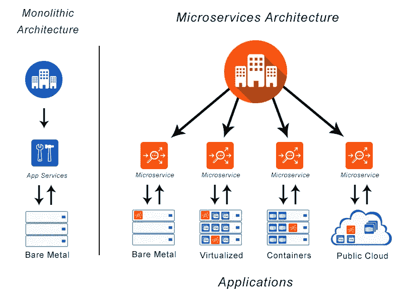
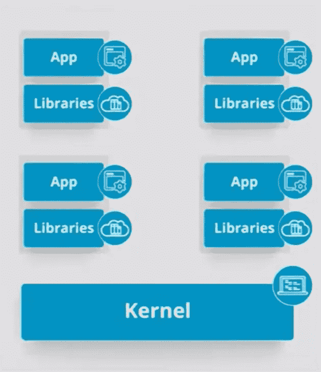
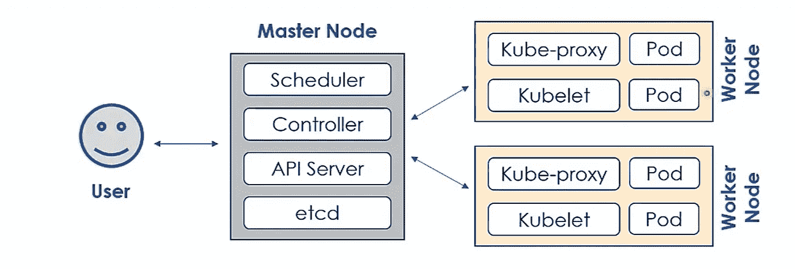
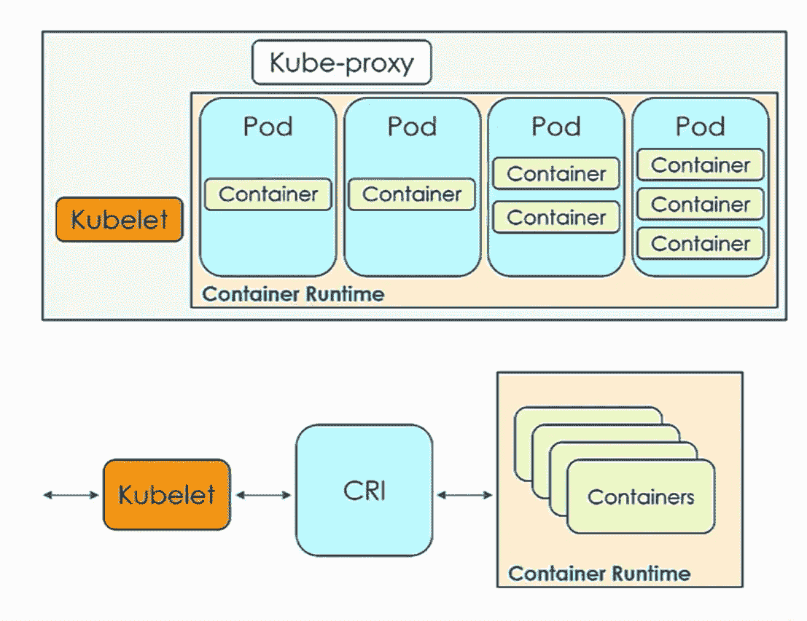

# Kubernetes 概述

> 原文：<https://medium.com/analytics-vidhya/kubernetes-overview-5f86e06750c4?source=collection_archive---------14----------------------->

库伯内特斯

他的名字 Kubernetes 来自一个希腊词，这个词是舵手或船只领航员的意思。Kubernetes 正在为我们的应用指挥一船集装箱。Kubernetes 最初是由谷歌资助的一个名为 Brog 的秘密项目。brog 最终发展成为 Kubernetes，由许多 Borg 支持人员提供支持。2015 年，谷歌将该项目捐赠给了一个名为**云本地计算基金会(CNCF)的社区。** Kubernetes 解决了**应用模块**的问题，应用模块被定义为在专用硬件上运行的软件产品。单片电路价格昂贵，而且很快就会转向传统硬件。虚拟环境和云的升级既昂贵又复杂。微服务和 API 的出现，如 RESt 服务和面向服务的架构(SOA)和云，使得整体式架构变得过时和不必要。

单片架构和微服务

Kubernetes 微服务包括:

1.  **部署** -应用分发
2.  **敏感信息** -证书、密码
3.  **配准和缩放**
4.  **负载平衡**——管理运行应用程序的请求、数据负载、流量和计算处理能力。
5.  **作业调度和管理。**
6.  **DevOps**
7.  **连续性和容错性**

在我们深入讨论之前，讨论一下容器技术是很重要的。Kubernetes 和其他产品托管在容器中运行的应用程序。容器是在不同的计算环境中可靠地部署和运行软件产品的解决方案。容器是标准化的包，由应用程序和执行它所需的项目组成，包括运行时、系统工具、库和设置。

此外，多个容器可以运行在同一个操作系统(OS)上，并共享 OS 内核。应用程序和依赖项打包在它们自己的容器中。区别在于支持基础设施被抽象掉了。底层基础设施只需要运行容器。

## 集装箱管理

Kubernetes 的关键特性之一是容器管理或编排。

容器:

*   并不是库伯内特人独有的。
*   是以应用为中心的平台即服务(PaaS)操作系统(OS)级虚拟化包，包括自己的微服务和其他依赖项。
*   彼此独立运行，不相互影响
*   运行他们自己的一套服务
*   不是完整的虚拟机

所有容器都连接到相同的操作系统内核，并使用相同的操作系统内核运行。

## 容器编排

基于多个集群中的微服务，为应用程序管理或调度单个容器的工作的自动过程。以下是容器编排支持的内容，

*   容错:业务连续性
*   最佳化
*   实时可扩展性
*   自动发现其他容器
*   在线更新、恢复和回滚，无需停机

**Kubernetes 是一个开源的容器编排工具**。然而，Amazon Web services、Azure、Docker 和其他供应商也提供容器编排解决方案。

容器编排器的部署和安装可以在许多类型的基础设施上执行。组织和用户几乎总是可以选择他们最熟悉的环境:“裸机”、虚拟机、私有或公共云。一种非常流行的模式是在基础设施即服务(IaaS)解决方案上安装 Kubernetes，如 Amazon Web Services、Google 等。Kubernetes 可以很容易地安装在这些 laaS 解决方案上，只需要几个命令。

## Kubernetes 功能

Kubernetes 支持容器编排的一些特性:

*   **容错/自我修复**——作为多节点集群解决方案，Kubernetes 可以自动备份和替换故障节点中的容器。
*   **自动装箱**-最大化资源利用率。
*   **水平伸缩**——Kubernetes 可以根据处理利用率规则和标准，根据需要动态添加容器
*   在 Kubernetes 中，**集群运行 Pod**——每个 Pod 接收自己的 IP 地址，但是，所有容器都使用 localhost 进行通信，以支持容器集之间的负载平衡。
*   **自动恢复和回滚** -Kubertnets 保存应用和环境配置版本。需要时，Kubernetes 可以恢复或回滚到应用程序或/和环境配置的稳定版本。
*   **机密和配置管理**——Kubernetes 分别管理应用机密和配置数据，以避免大量的映像重建。机密由传递给应用程序的机密信息组成，不会将敏感内容暴露给堆栈配置。
*   **存储协调**——Kubernetes 自动从本地设备存储或虚拟存储为容器安装存储。
*   **批处理执行**——Kubernetes 支持批处理操作、长时间运行的流程和容器故障转移。

Kubernetes 拥有灵活的模块化架构，支持插件和微服务 API。Kubernetes 是可扩展的，可以通过编写定制软件程序、API 调用、插件等来扩充。Kubernetes 由 2000 多名贡献者组成的社区提供支持。Kubernetes 社区还包括本地团体，如关注规模、网络和其他功能的聚会和兴趣小组。

库伯内特建筑

对于 Kubernetes，CNCF 的产品包括:

*   许可和正确使用。
*   扫描供应商代码
*   营销和会议
*   法律指导
*   认证标准
*   其他项目

Kubernetes 主机，云本地计算基金会(CNCF)是 Linux 基金会的一部分。CNCF 还拥有几个通用(GA)产品和孵化项目。除了 Kubernetes，CNCF 的 GA 产品还包括用于监测的 Prometheus、用于伐木的 Fluentd 以及其他几个产品。

## 库伯内特建筑

库伯内特建筑

一般来说，Kubernetes 架构由三个主要层组成:

1.  用户界面
2.  主节点
3.  工作节点
4.  etcd 或密钥存储

Kubernetes 是基于节点的架构，有两种类型的节点。

## **1。主节点**:

主节点提供到用户界面(UI)的连接，并执行控制平面服务。控制平面服务管理和操作 Kubernetes 集群。每个控制平面服务在群集操作中以不同的角色运行。UI 包括命令行界面(CLI)、web 仪表板和 API。因为 Kubernetes 主节点运行集群，所以不允许停机。为了冗余，主节点使用复制策略。主节点副本以高可用性(HA)模式添加到集群中。集群的状态数据存储在 etcd 中，它是密钥存储的一部分。HA 模式使所有主节点副本保持同步。如果当前活动的主节点脱机，将启动一个副本来继续操作主节点。主节点运行 4 个组件。它们是 API 服务器、调度器、控制器和 etcd 或密钥库。

**API 服务器**管理主节点中的所有管理任务。API 服务器接收用户的 REST 调用。API 服务器从 etcd 中访问状态数据。在完成任何 API 处理之后，集群的新状态被写入 etcd 密钥存储。API 服务器可以配置和定制。

**调度器**将对象分配给节点。节点分配主要基于 Kubernetes 集群的当前状态和对象的运行时需求。正如预期的那样，调度程序从 etcd 查询集群的状态，从对象配置文件查询新的对象需求。调度器也是非常可配置的，并且在多节点集群中运行复杂的操作。

**控制器**组件管理 Kubernetes 集群和当前运行的 pod 的状态。控制器管理称为部署的配置。Pod 是一组一个或多个容器。当 pod 脱机时，控制器会起作用。控制器中配置了最佳集群状态或所需的运行单元数量。

**etcd** 是 Kubernetes 存储集群状态的键值存储库。如前所述，只有控制器可以访问 etcd 密钥库。etcd 可以在 HA 模式下运行，以支持容错。

## **工人节点**

正如主节点一样，工作节点也有四个组件:

*   容器运行时
*   库伯莱
*   Kube 代理
*   用于 DNS、仪表板、集群监控和集群日志的插件。

worker 节点是应用程序的运行时。通过容器化和微服务，应用程序用完了容器。pod 在工作节点上进行管理，它们消耗计算资源，如内存、存储、网络。

Kubelet 是一个与主节点和容器通信的服务。kubelet 使用容器运行时接口(CRI)连接到容器

Kubernetes 是一个容器编排引擎，然而，有趣的是，Kubernetes 并不直接执行容器。Kubernetes 在执行 pod 和容器的节点上需要一个容器运行时。Kubernetes 支持几种容器运行时，包括:

*   Docker:一个非常流行的 Kubernetes 运行时
*   CRI-O:被认为是轻量级容器运行时
*   Containerd:为许多解决方案构建的非常通用的容器运行时
*   rklet : Apod 本地容器运行时。

Kube-proxy 是每个节点的网络代理。插件和附件:

*   DNS -cluster DNS 是将 DNS 记录分配给 Kubernetes 资源所需的 DNS 服务器。
*   仪表板——用于集群管理的基于 web 的通用用户界面
*   监控-收集集群级别的容器指标
*   日志记录—收集集群级容器日志。