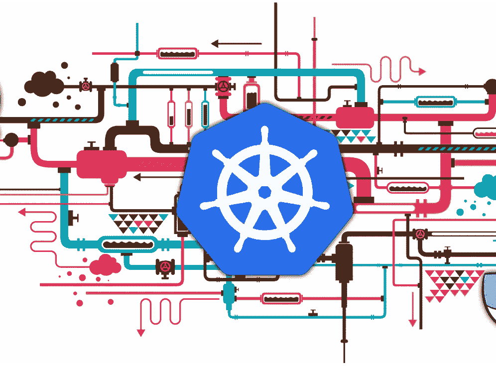

# Kubernetes 教程:规模和易用性的终极平台

> 原文：<https://medium.com/analytics-vidhya/kubernetes-tutorial-the-ultimate-platform-for-scale-and-ease-b972fffd6cdf?source=collection_archive---------16----------------------->

对于许多数据工程任务，Kubernetes(“koo-burr-NET-EEZ”)现在是扩展和部署的首选平台。但是什么是 Kubernetes，它是如何工作的，以及如何开始？

在本教程中，我将带您了解是什么使 Kubernetes 成为终极容器编排系统，以及它如何允许任何应用程序在…