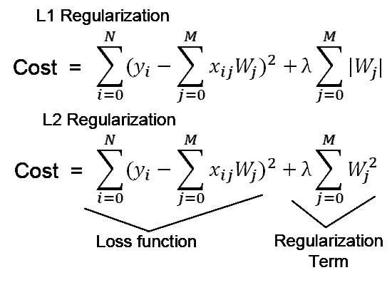

# L1 vs L2 正规化:直观的差异

> 原文：<https://medium.com/analytics-vidhya/l1-vs-l2-regularization-which-is-better-d01068e6658c?source=collection_archive---------1----------------------->

在训练机器学习模型时，许多人通常会弄不清哪种正则化技术更好，以避免过拟合。

来源—[http://layed . delanover . com/difference-between-L1-and-L2-正则化-实现和可视化-in-tensorflow/](http://laid.delanover.com/difference-between-l1-and-l2-regularization-implementation-and-visualization-in-tensorflow/)

我不会详细谈论数学方面的内容。取而代之的是试图解释它们之间的直观差异。

> L1 正则化和 L2 正则化之间的主要直观差异是 L1 正则化试图估计数据的中值，而 L2 正则化试图估计数据的平均值以避免过拟合。

从 L1 和 L2 正则化的公式中可以看出，L1 正则化通过增加权重(Wj)参数的绝对值在代价函数中增加了惩罚项，而 L2 正则化在代价函数中增加了权重(Wj)的平方值。

在对成本函数求导时，在 **L1 正则化**中，它将在数据的中值附近进行估计。让我这样解释吧——假设你从数据中取一个任意值(假设数据沿着一条水平线展开)。如果你随后在一个方向上移动到某个距离**d，假设在向后的方向上，那么在计算损耗时，所选点的一侧(比如左侧)的值将具有较小的损耗值，而另一侧的值将在损耗函数计算中贡献更多。**

因此，为了使损失函数最小化，我们应该尝试估计一个位于数据分布中间的值。该值也将是数学上数据分布的 ***中值*** 。

而在 **L2 正则化中，**在梯度计算步骤中计算损失函数时，损失函数试图通过从数据分布的平均值中减去损失来最小化损失。

这是 L1(套索)和 L2(山脊)正则化技术之间的主要直观差异。

> 它们之间的另一个区别是 L1 正则化通过消除不重要的特征来帮助特征选择。当特征点的数量很大时，这是有帮助的。

这次都是我这边的。希望我能够解释两种正则化技术之间的直观差异。