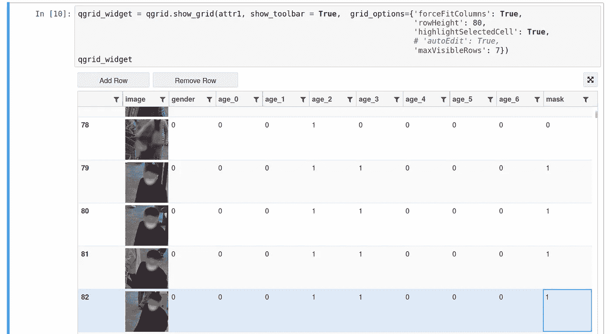

# Jupyter 笔记本中的标签图像数据集

> 原文：<https://medium.com/analytics-vidhya/label-images-dataset-in-jupyter-notebook-1081b185db4a?source=collection_archive---------5----------------------->

如果您正在使用计算机视觉，那么您可能一直在处理图像数据集标注的任务。许多伟大的工具被创建来帮助完成这项任务，例如 [CVAT](https://github.com/opencv/cvat) ，但是如果你需要快速标记几个属性，CVAT 功能可能是多余的。这种情况下，不用离开熟悉的 Jupyter 笔记本就可以处理图像标注。

