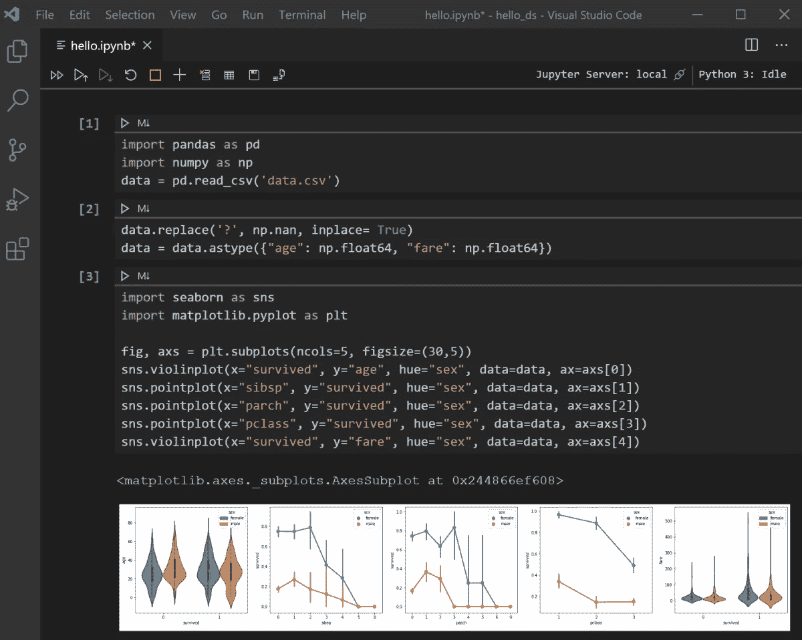

# Lambda 函数和数学在数据科学中的重要性

> 原文：<https://medium.com/analytics-vidhya/lambda-funtions-and-importance-of-math-in-data-science-ea2cbab5958b?source=collection_archive---------19----------------------->



所以在这篇博客中，我将使用 python 和一个问题来演示 lambda 函数和数学在 python 和数据科学中的应用

所以问题是这样的:

```
You have **k** **apple boxes full of apples**. **Each square box of size** **m** **contains** **m × m** apples. You just noticed two interesting properties about the boxes:  
1.The **smallest box is size 1**, **the next one is size 2**,..., **all the way up to size k**.  
2.**Boxes that have an odd size contain only yellow apples**. **Boxes that have an even size contain only red apples**. ‍**Task:**Your task is to **calculate the difference between the number of red apples and the number of yellow apples**.
```

现在试着理解这个问题

例如:

假设有 5 箱苹果，这意味着 k = 5。

现在给盒子编号

1,2,3,4,5

现在盒子的大小是它的编号 m

所以 m=1，m=2，…，m=5

现在盒子里苹果的数量是 m*m

所以 1*1，2*2，…，5*5，如果 m 是奇数，那么它有黄色的苹果

或者如果 m 是偶数，那么它有红苹果。

所以从这个例子中你一定理解了这个问题。

现在有三种方法可以解决这个问题，主要是两种:

首先是最简单的解决方案:

这是在一个列表中存储所有不同大小的盒子。

然后，它将黄色苹果的数量存储在奇数盒中，类似地，将红色苹果的数量存储在偶数盒中

因为盒子里的苹果数量=盒子的大小*盒子的大小

然后按照要求返回两个苹果总数的差

第二种方法使用相同的逻辑，但我将使用 lambda 函数使它更短

这基本上是在做同样的事情

在第一种解决方案中

尺码表是

```
[x for x in range(1,k+1)]
```

对于红苹果，我们从第二个位置开始，直到结束，间隔为两个，因为所有的红苹果都在偶数盒中

黄苹果也是如此

所以我们可以在 lambda 函数中做同样的事情，我相信你一定知道 lambda 函数是如何工作的。

现在是第三个解决方案，也是最难的一个

等等，让我解释一下……我肯定对你们中的许多人来说这没有意义，但是让我们看看:

现在，对于这个解决方案，我使用了纯数学，我将解释我是如何推导公式的

你可以看到这个问题本质上需要的是偶数到 k 的平方和**和奇数到 k 的平方和**之间的差异

现在在高中，我相信你一定学过这些公式:

偶数的平方和 s 到 n = **2n(n+1)(2n+1)/3** 其中 n 是偶数的个数

奇数的平方和 s 直到 n = **n(2n+1)(2n-1)/3** 其中 n 是奇数的个数

因此，要应用这些公式，我们必须找到奇数的数量和偶数的数量

为了找到它们，我们可以简单地做一些事情

对于偶数:**如果总数为 k** ，那么**偶数的数量**将为 **k//2**

对于奇数:**如果总数是 k** 那么**奇数的数量**将是 **k-k//2**

现在我们可以简单地应用这些公式，找出两个公式的不同之处

现在让我向你展示使用这三个公式的区别

现在，我将使用 2000 个不同的输入来测试这一点，这是一个很大的数字。

你可以在这里测试所有三个解决方案，你会发现前两个解决方案可能需要一到两分钟，而使用数学的解决方案几乎是即时的。

顺便说一下，请在数学解中小心使用括号，因为它们会导致错误。

这就是为什么总是建议在数据科学中使用数学模型和公式，因为解析会导致大问题。

因为，举例来说，你会有一个非常大的熊猫数据框架，你必须解析数百万行数据，以便计算一些东西，如果有一种模式，我们可以使用数学而不是循环…

这是针对您的解决方案的 repl.it 测试程序，尝试找出另一个并测试所有三个，您就会明白它会产生什么影响…

谢谢，我会很快发布更多这样的博客，如果你对新博客有任何建议，请在评论中发表。