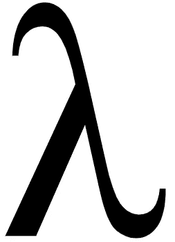

# Python 中的 Lambda

> 原文：<https://medium.com/analytics-vidhya/lambda-in-python-4da85d4c9e64?source=collection_archive---------25----------------------->



我们应该称它为*λ*函数还是*匿名*函数？
实际上，*λ*是一个**关键字**，用来创建一个*匿名*函数。

什么是*功能？* 函数是一个代码块，它有一个通用的功能，可以应用于大量类似的分析。例如，我想创建一个函数来使一个数翻倍。
步骤 1:创建一个名为“ *DoubleTheNumber* ”的函数。第二步:定义函数中要传递的参数。
第三步:定义函数的逻辑。
第四步:返回结果。

什么是*匿名？一个快速的谷歌搜索将*匿名*定义为未知名字*的*。*

什么是*匿名函数？* **一个无名函数。**

现在，您已经知道了(我希望)匿名函数的含义，让我们用 Python 的术语来研究它。
一个关键字——**Lambda**，在 Python 中用来生成一个‘无名函数’。
一般 Python 中的一个函数可以定义为
(*粗体字为 Python 关键字*)，

```
**def** function_name (arguments):
  result = expression_to_evaluate
  **return** result
```

同样的函数，使用*λ*，可以定义为:

```
**lambda** arguments: expression_to_evaluate
```

从语法上来说，匿名函数在以下方面不同于“常规”函数。
一个无名的功能全无， *1。* *功能 _ 名称；
2。返回声明*

此时，你的脑海中应该会弹出一个问题，如果一个 *lambda* 表达式中没有 *return* 语句，那么它实际返回的是什么！
这个已经在本文第二行回答过了。

> lambda 表达式“返回”一个函数。

为了更加清晰，让我们深入一个简单的例子，

```
*#Simple Method to double a Number*
**def** double_the_number(numb):
  result = numb * 2
  **return** resulttest_double_regular = double_the_number(2)
**print**(test_double_regular)
*#This will print 4.**#Simple Method to double a Number using lambda* double_the_number = **lambda** numb: numb * 2test_double_lambda = double_the_number(4)
**print**(test_double_lambda)
*#This will print 8.*
```

我们是否需要一个额外的关键字来完成一些本来可以完成的事情？
简答:**没有！** 但是有些情况下(在你的编程例程中你会遇到),我们需要一个函数作为参数发送给另一个函数，用于下一步的过程，这就是所谓的*函数式编程*。例如，下列函数使用函数作为它们的参数，

```
*# Map - Apply the function to a list of items.* syntax - map(function, list)*# Filter - Apply the function to a list of items to filter out the items.* syntax - filter(function, list)
```

在没有 *lambda 的情况下，*可以创建一个函数，然后在上面的 *map()* 或 *filter()* 中调用它，但是内联函数可以在一行中实现相同的功能，在 *map()* 或 *filter()中也是如此。*
观察上面的例子，你可以体会到 *lambda* 能够创建一个只需要调用一次**的内联函数的能力。当一个人需要一个单一的表达式求值时(不太复杂)，它们就派上了用场。**

> **注意事项**:lambda 表达式会很快变得复杂。
> 例如，创建一个嵌套的 lamda 表达式可能会令人困惑，并且肯定会降低可读性。在这种情况下，恢复到常规的函数创建，以保持代码的整洁和可读性。

网上有无数篇关于 T4 的文章，我只是多加了一篇。要学习和欣赏它，最好的方法是尝试在您的实现中使用它，犯了一个错误后*再试一次！*

要了解更多信息，请阅读这篇关于 DZone 的精彩文章，

[](https://dzone.com/articles/pros-and-cons-lambda) [## Lambda - DZone 网络开发的利与弊

### 有很多关于 Python 的教程[1]。我最近偶然发现的一个，真的觉得很有帮助…

dzone.com](https://dzone.com/articles/pros-and-cons-lambda)