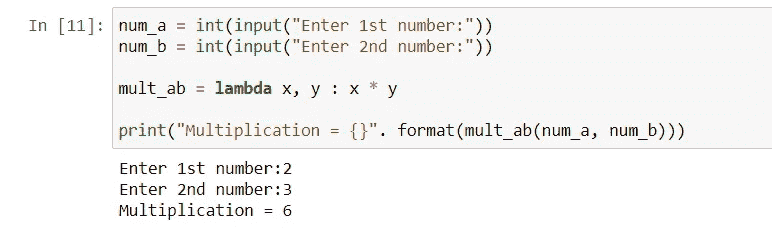

# Python 中的 Lambda()、Map()、Filter()函数

> 原文：<https://medium.com/analytics-vidhya/lambda-map-filter-functions-in-python-4c03679dd747?source=collection_archive---------3----------------------->

函数是只在被调用时才运行的代码块。

我们可以将称为参数的数据传递给函数。

函数可以返回数据作为结果。

## λ()函数-

*   Lambda 函数主要用来创建一个没有名字的函数
*   主要配合**滤镜()**和**贴图()**功能使用。
*   它可以接收任意数量的参数，但只能有一个表达式。

***如何使用 Lambda()-***

***另一个例子——***

****

# **MAP()函数-**

*   **Map()函数将一个**函数**和一个**列表**作为输入。**
*   **Map()对整个列表执行操作，并在新列表中返回结果**
*   **语法映射(函数/lambda，列表)**

*****下面是我们如何使用 map()-*-****

****

*****Map()可与λ-***一起使用**

****

**写一个函数，它接受一个参数并返回它的立方值。**

*****定义一个范围从-10 到 10 的整数列表。*****

*****将该函数应用于整个列表并生成一个新的输出列表。*****

****

# **Filter()函数-**

*   **Filter()用于创建一个元素列表，函数将为其返回**“True”。****
*   **语法过滤器(返回 True 的函数，列表)**

*****下面是我们如何使用 filter()-*-****

****

*****写一个代码，从用户那里取范围(即上下界)，只返回一个正数和偶数的列表-*****

****

**我希望这篇文章有助于理解 python 中的这些函数。**

**谢谢你，祝你愉快！！！**