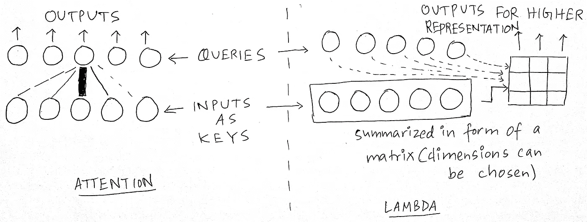
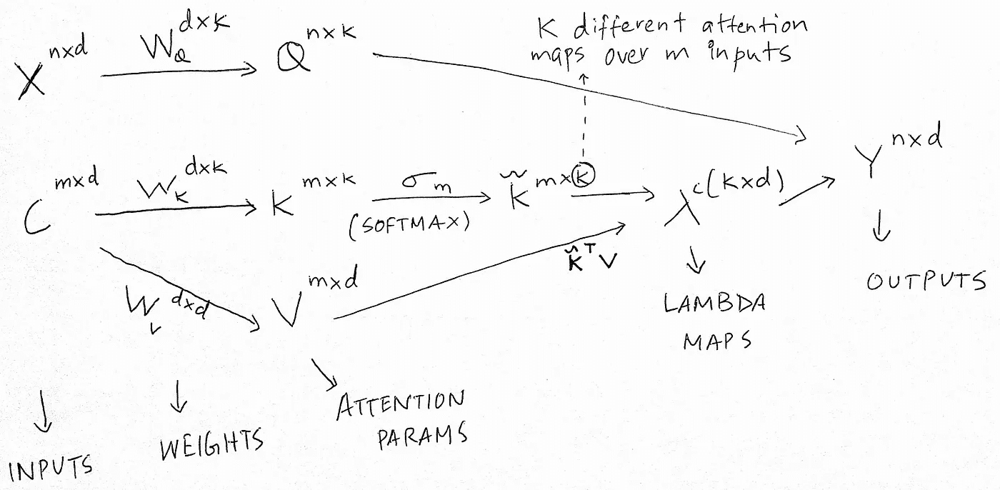
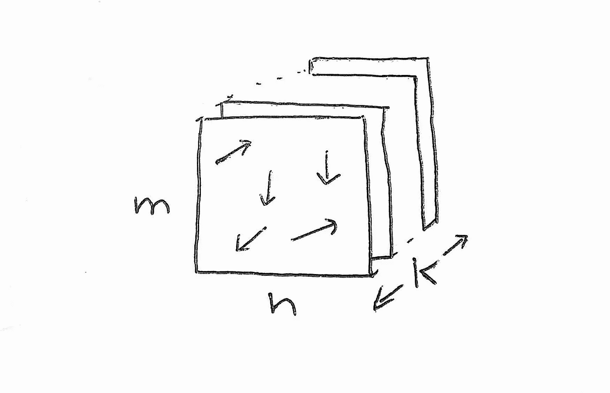
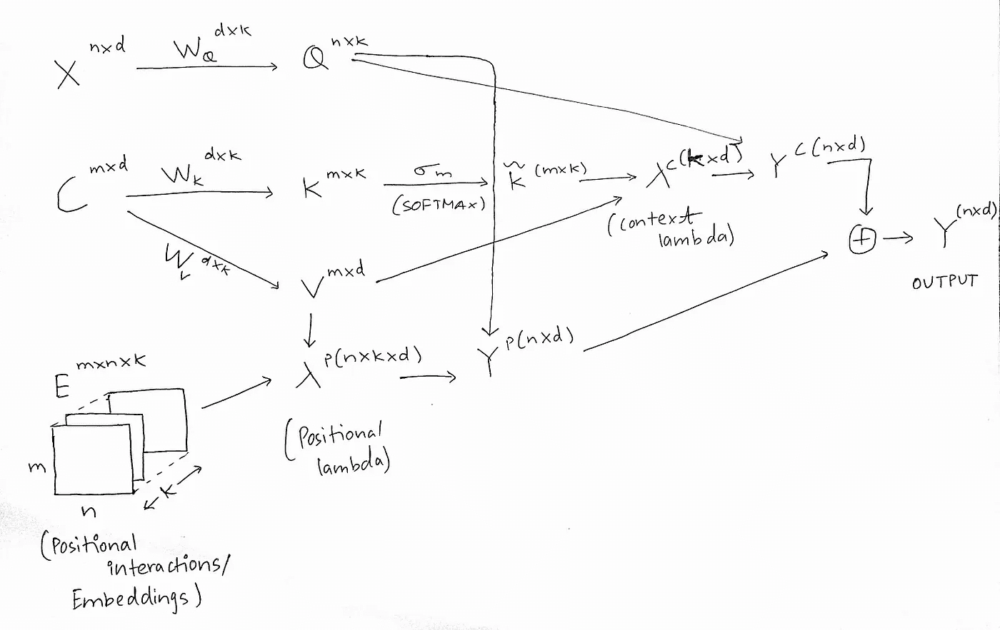
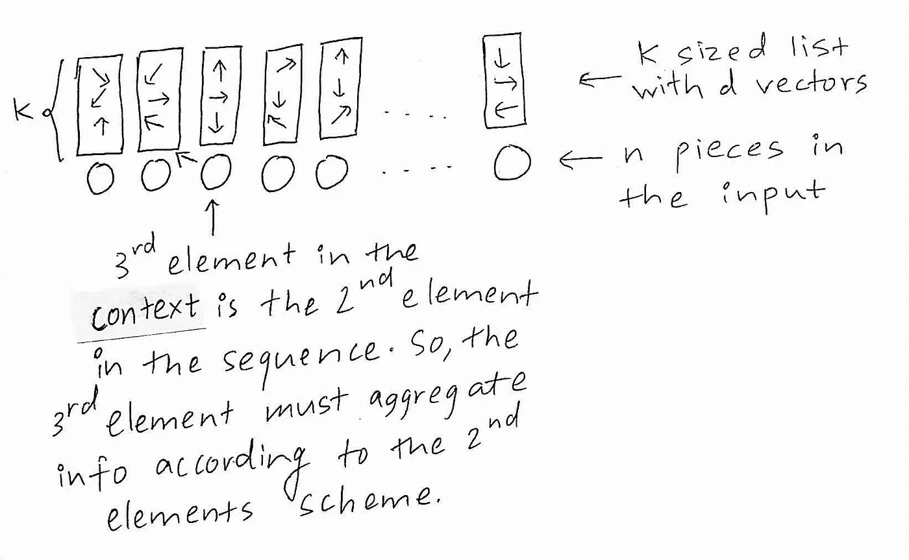

# 论文解释-lambda 网络:无需注意的远程交互作用建模

> 原文：<https://medium.com/analytics-vidhya/lambdanetworks-modeling-long-range-interactions-without-attention-337771f42b6f?source=collection_archive---------3----------------------->

注意层和λ层的比较。(左)3 个查询及其在全局上下文中的本地上下文的示例。(中间)关注操作将每个查询与其上下文上的关注分布相关联。(右)lambda 层将每个上下文转换为应用于相应查询的线性函数 lambda。图片取自[论文](https://openreview.net/pdf?id=xTJEN-ggl1b)

# 简介和概述

最近，我们已经看到变形金刚接管了图像分类(**看看我的中后期-** [**视觉变形金刚**](/@nakshatradsml/vision-transformers-bye-bye-convolutions-e929d022e4ab) ❤️)，但它要么通过将图像下采样到 16×16 块，要么只是通过丢弃大量数据来实现。通过直接调用现代神经网络库中可用的操作，LambdaNetworks 在计算上是高效的并且易于实现。注意力机制是一个非常非常非常通用的计算框架，它就像一个动态的信息路由，作者不适合使用昂贵的注意力地图，因为它在计算上非常昂贵。

# λ层与注意力层

Lambda 层获取全局上下文，并在不查看查询的情况下首先总结/抽象上下文。上下文被概括为矩阵形式的低维线性函数(其维数可以改变)并乘以查询。因此，整个操作将是一个线性函数，与关注操作相反，关注操作查看查询和键之间的交互，您对其应用 softmax，使其成为非线性函数。

注意力层 Vsλ层。

在不查看查询的情况下对上下文进行总结，然后在不查看上下文的单个部分的情况下查看查询，我们简单地获取查询，并简单地将它们通过线性函数，这为我们提供了更高层的表示。因此，我们可以说上下文被总结为一个单独的线性函数，它单独地转换所有的查询。

# Lambda 层是如何工作的？注意机制 Vs 拉姆达机制。

我们从输入 X^(n×d 和上下文 C^(m×d).开始 x 和 C 往往是同一个东西，除非 C 被限制。这里 n 是输入大小。如果 n=m，那么问题就来了，只要有一个 m×n 项(在计算过程中),它的大小将是二次的，这会耗尽计算资源。最值得注意的是，一幅图像的 n=225×225(假设到目前为止没有通道)，因此术语 n×m=(225×225)仅用于一幅图像是不切实际的。让我们使用我制作的图表来理解注意力机制和 Lambda 机制之间的[基本区别:)](https://openreview.net/pdf?id=xTJEN-ggl1b)

**注意力机制**

注意，X 和 C 作为输入。x 通过 Wq 变换成查询(Q)。c 通过 Wk 转换成键(K ),并且还通过 Wv 转换成值(V)。value(V)维度将有一个额外的参数，但由于输出维度将再次是 D，我们将只说 Wv 的维度空间是 D×D。现在，注意力图是通过将键(K)乘以查询(Q)获得的。我们应用 softmax 非线性来标准化地图。最后，我们将取值(V)并将其与地图相乘以获得输出(Y)。

图像的注意机制综述。(不包括变压器的位置嵌入)。**注:上标表示为空间形状。Wq、Wk 和 Wv 是称为权重的可学习参数。**

softmax 激活中存在非线性(收缩超过 m)。非线性决定了如何将上下文(线性转换为值)聚合到输出中。最值得注意的是，n×m 矩阵(softmax 之后的注意力地图)是构造和归一化的，它不能被分解，这就是注意力地图的问题。

**λ机构**

输入 X 和 C 以与注意机制相同的方式被线性转换成查询(Q)、键(K)和值(V)。不同之处在于，非线性(softmax)仅应用于按键(在 m 上收缩),而不应用于注意力图(像在注意力机制中一样),这意味着我们现在在 m 个输入上有 K 个不同的注意力图。每次应用 softmax 时，您都会进行一次分配，这定义了您如何汇总信息。在注意机制中，我们在 M 个输入上有 N 个不同的注意图，而在 Lambda 机制中，我们在 M 个输入上有 K 个不同的注意图。

图像的 Lambda 机制概述。(不包括位置相互作用/嵌入)。**注:上标表示为尺寸形状。Wq、Wk 和 Wv 是称为权重的可学习参数。**

我们只需将值(V)乘以归一化键(K ),即可得到维度为 K×D 的 Lambda( **λ** )。M 在我们有机会让它与 N(查询维度)交互之前就被抽象了，这正是它与注意力机制不同的地方。最后一步是将λ(**λ**)乘以查询(Q)以获得输出 y

这里，Y 表示为输入的下一个图层表示。因此，下一层表示的每个输入只是其查询和 Lambda( **λ** ) )的线性函数。

特殊物体，λ(**λc**)，K×D 维。

这里的技巧是——上下文没有被总结为一个向量，它实际上被总结为一组向量，这些向量存储在一个大小为 k 的列表中。列表中的每个条目都有一个特定的特征，并且每个条目都是一个向量。现在我们知道上下文被归纳为 K 个向量的集合。因此，每个上下文可以有 K 个向量的不同集合，但它仍然是 K，然后查询可以决定列表中的每个特征对它有多重要(参考这里的查询)。重要的是，查询不能做的是，它不能(从列表中)查看特性是什么，然后决定它有多重要，因为上下文已经被总结了。这就是它不同于注意力的地方。注意，查询可以看到每个特性，然后相应地决定其重要性。

# 位置相互作用/嵌入

e 是维度为 N×M×K 的索引张量。它们是一组固定的学习参数，有点像变压器中的位置嵌入。但在变压器中，维数是 M×K，因为嵌入是直接放在输入上的。

位置相互作用/嵌入矩阵。N×M×K 维矩阵。

e 是一个 N×M 和 K 维向量的矩阵，每个 N×M 对都有一个向量与之相关，称为嵌入。这里的优点是，该矩阵是逐层学习的(通常称为学习的注意力权重)，它不是计算的，并且不能从一个例子到另一个例子改变。对于每对像素，在这个矩阵中有一个条目。

此外，动态计算的值不依赖于 N×M，并且 N×M 的值不是动态计算的，如果您有与之关联的批处理大小，这将是一个很大的优势。N×M×K 在内存中是固定的，它不随批处理大小增长。

让我们通过交互嵌入来理解 lambda 机制。

图像的完整 Lambda 机制概述。(包括位置相互作用/嵌入)。

有两条线性分离的路径，一条来自位置编码，一条来自上下文。位置交互/编码乘以值(V)创建一个 **N×K×D 张量**(在上图中称为**位置λ(λp)**)。

举例说明 **λp** 到底是什么。

所以 **positional lambda (λp)** 基本上是为输入中的 N 个片段中的每一个，创建一个 K 大小的 D 向量列表，但它对每个位置的做法不同。因此，位置交互基本上是说，如果上下文中的第 n 个元素是列表序列(位置编码表)中的第 2 个元素(例如)，那么第 n 个元素必须根据第 2 个元素的方案(在该序列中)聚合信息。所以它不能查看这些特定事物的内容，它只能定义一个线性运算。但是，它可以查看查询的内容，因为通常 X 和 C 是相同的。

在这里，我们为输入中的每个元素构造一个单独的表，然后查询根据其位置聚合信息，然后简单地将这两个聚合加在一起。你可以这样看，你有 Y=Wx+b，W 可以代表上图中的表格，因为它们实际上取决于 X 是什么，在这种情况下，X 和 B 的位置是在每个位置之上的。这就是它是如何工作的，我希望你没有完全迷路。作者已经实现了这个架构的许多扩展。通过[读报](https://openreview.net/pdf?id=xTJEN-ggl1b)你肯定能理解他们。

**如果你喜欢这篇文章并获得了真知灼见，请考虑** [**请我喝杯咖啡** ☕️ **点击这里**](https://www.buymeacoffee.com/nakshatrasinghh) **:)**

# 参考

1.  [LambdaNetworks:模拟无注意的远程交互](https://openreview.net/forum?id=xTJEN-ggl1b)，ICLR 2021。
2.  你所需要的只是注意力。

如果你喜欢这个帖子，请一定要鼓掌👏。💬连接？让我们来看看社会:[**http://myurls.co/nakshatrasinghh**](http://myurls.co/nakshatrasinghh)**。**