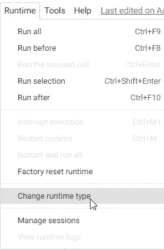

# 板球运动员使用迁移学习的语言模型:演示、代码和博客

> 原文：<https://medium.com/analytics-vidhya/language-model-using-transfer-learning-for-cricketers-3b022a5717f6?source=collection_archive---------20----------------------->

> 开发和部署语言模型的快速而聪明的方法

# 介绍

语言模型是学习预测任何句子的下一个单词的模型。要做到这一点，你需要非常精通英语以及世界知识。

在下面的代码中，我们将使用**迁移学习**开发一个语言模型，其中包含与以下板球运动员相关联的文本文档:

*   *《AB de Villiers》*
*   *《布莱恩·拉拉》*
*   *‘拉胡尔·德拉维德’*
*   *《罗希特·夏尔马》*
*   *‘萨钦·坦杜尔卡尔’*
*   *‘谢恩·沃恩’*

数据来源: [Kaggle](https://www.kaggle.com/anandpuntambekar/cricketer-text-corpus-txt)

代码: [Github 库](https://github.com/anandpuntambekar/Cricket_Language_Model)

演示: [Youtube](https://www.youtube.com/watch?v=utMuDChKDCA)

## 让我们开始吧！！


# 步骤 1:为 Google Colab 设置 Fastai

要将 Google Colab 与 Fastai V1 一起使用，请设置运行时->将运行时类型设置为 GPU



我们将在 Colab 中运行以下代码来安装 PyTorch 和 Fastai 的更新版本:

```
from os.path import existsfrom wheel.pep425tags import get_abbr_impl, get_impl_ver, get_abi_tagplatform = ‘{}{}-{}’.format(get_abbr_impl(), get_impl_ver(), get_abi_tag())cuda_output = !ldconfig -p|grep cudart.so|sed -e ‘s/.*\.\([0–9]*\)\.\([0–9]*\)$/cu\1\2/’accelerator = cuda_output[0] if exists(‘/dev/nvidia0’) else ‘cpu’!pip install torch_nightly -f [https://download.pytorch.org/whl/nightly/{accelerator}/torch_nightly.html](https://download.pytorch.org/whl/nightly/{accelerator}/torch_nightly.html)import torchprint(torch.__version__)print(torch.cuda.is_available())print(torch.backends.cudnn.enabled)!pip install fastai
```

# 步骤 2:清理输入数据

在上传数据之前，我擅自删除了文本文件中的空格、制表符和超链接，以创建一个更有效的语言模型。

## 上传文本数据

```
from google.colab import files
files.upload()
```

# 步骤 3:查看导入的数据


现在我们来看看导入的文件:


```
[“\ufeff an ordinary piece to something truly extraordinary. Who Will Win The World Cup? by Murari Gupta Dasa AT THE HEIGHT OF Sachin Tendulkar’s popularity a giant billboard proclaimed: Cricket is our religion and Sachin is our god. That sums up the mood of \n”, ….
```

# 步骤 4:自然语言处理的迁移学习


对于神经网络，权重矩阵开始是随机的。因此，如果你从一些随机参数开始，并试图训练这些参数来学习，你就会有成千上万个 1 和 0 来预测下一个单词。

我们拥有的文本数据显然不足以学习如何说好英语，不足以预测下一个单词。

有时这可能非常微妙。特别是关于板球的文章，记者们经常会使用讽刺的语言。

所以诀窍，(希望你能猜到:)，是使用**转移学习**。

我们是否需要学习“如何说英语？”我们需要一大套文件，但我们没有。

因此，我们将从一个预先训练好的模型开始，它已经被教会做一些不同的事情，然后针对板球运动员的语言模型对它进行微调。

# Wikitext 103

Wikitext 103 是一个数据集，它是维基百科中最大文章的子集，经过一点预处理，可以下载。

就像预先训练的 ImageNet 模型存在于视觉中一样，也有预先训练的 Wikitext 模型存在于 NLP 中。这个模型对语言和语言描述的东西有相当多的了解。我们将使用该模型并执行迁移学习来为板球运动员创建新的语言模型。

```
#If somebody changes underlying library code while I’m running this, please reload it automatically#If somebody asks to plot something, then please plot it here in this Jupyter Notebook#We starts with the following three lines;%reload_ext autoreload
%autoreload 2
%matplotlib inline
```

# 步骤 5:关于使用 Fastai 进行文本挖掘

fastai 库的文本模块包含所有必要的函数，以定义适用于各种 NLP(自然语言处理)任务的数据集，并快速生成模型。:

*   text.transform 包含预处理数据的所有脚本，从原始文本到令牌 id；
*   text.data 包含 TextDataBunch 的定义，这是 NLP 中需要的主类；和
*   包含帮助函数，可以快速创建语言模型或 RNN 分类器。

一些重要的 **NLP** 术语包括:

1.  **记号化**是一种将一段文本分割成称为记号的更小单元的方法。这里的标记可以是单词、字符或子单词。
2.  **词干化**是将单词中的词尾变化减少到其词根形式的过程，例如将一组单词映射到同一个词干，即使该词干本身在语言中不是有效的单词。

```
from fastai.text import *# Batch Size:# In order to avoid memory error( too many parameter updates for the amount of RAM ) — batch size needs to be fixed.# bs: batch size (i.e. number of words processed at a time)bs=48
path = “/content”
```

我们将从板球运动员的语言模型开始。现在好消息是，我们不必训练 Wikitext 103 语言模型，因为在一个像样的 GPU 上需要两三天。没有很好的理由从随机权重开始，如果可以，我们应该总是尝试使用迁移学习。

所以将开始微调我们板球运动员的语言模型。

# 步骤 6:创建数据簇

为了在 fastai 中创建一个模型，我们需要创建一个 DataBunch 对象——在我们的例子中，就是 *data_lm* 变量。在 Fastai 中，我们将在其上构建模型的每个对象都是一个 DataBunch 对象。DataBunch 对象包含 2 或 3 个数据集，即训练数据；验证数据和可选的测试数据。

上面的每个都包含文本和标签。在定义 DataBunch 时，我们还需要创建验证数据集以避免过度拟合。过拟合是指训练数据的精度很高，但在训练数据之外的较低端。使用“验证集”可以避免过度拟合。

```
data_lm = (TextList.from_folder(path)#Inputs: all the text files in path.filter_by_folder()#We may have other temp folders that contain text files so we only keep what’s in train and test.split_by_rand_pct(0.1)#We randomly split and keep 10% (10,000 reviews) for validation.label_for_lm()#We want to do a language model so we label accordingly.databunch(bs=bs))
```

每个文档都是一个单独的文本文件。对于验证集，我们随机将其除以 0.1。

但是我们如何给它贴上标签呢？

语言模型在某种程度上有自己的标签。文本本身有标签(下一个单词)，所以 label for a language model(*label _ for _ lm*)为我们执行标注。现在，创建一个数据串并保存它，这需要几分钟的时间进行标记化和数值化，这样我们就保存了它。稍后，我们可以加载它，而不需要再次运行它。

**查看数据串:**

```
data_lm.show_batch()
```


*   我们词汇表中的每个单词都需要在神经网络的权重矩阵中有单独的一行。因此，为了避免权重矩阵变得太大，我们将词汇表限制为不超过(默认)60，000 个单词。同样，如果一个单词没有出现两次以上，我们也不会把它放入词汇表中。
*   这样，我们将词汇量保持在一个合理的范围内。当你看到类似“xxunk”的术语时，它们实际上是未知的令牌。这意味着这个词在我们的词汇中并不常见，尽管有一些特殊的标记。
*   例如，“xxfld”——这是一个特殊功能，如果您有标题、摘要、摘要、正文等。(即文档的独立部分)，这些特征中的每一个都将获得一个独立的字段并被编号(例如 xxfld 2)

# 步骤 7:创建学习者


我们将用 *AWD_LSTM 创建一个语言模型学习者。*当我们创建一个与模型相关联的学习者时，您必须传入以下内容:

*   数据；
*   我们要用的预训练模型:Wikitext 103(和 ImageNet 预训练模型一样会从 fastai 下载)；和
*   避免欠拟合的下降量( *drop_mult* 设置)。随意增加 *drop_mult* 以避免过度拟合

现在我们有了一个学习者，我们可以使用 *lr_find* 来寻找最佳学习率。

```
learn = language_model_learner(data_lm, AWD_LSTM, drop_mult=0.1)
```


**学习率:**学习率决定了模型中参数更新的速度。基于学习率查找器，我们将找到一个最佳的学习率。

**不同的学习速率**以相同的速率训练所有的层是没有意义的，因为我们知道较深的层对于原始模型工作得很好。所以现在我们可以将一个学习率范围传递给 *learn.fit_one_cycle* 。


```
learn.fit_one_cycle(1, 1e-1/3, moms=(0.8,0.7))
```


我们发现了一些相当有效的系数和参数。所以如果我们想多玩一会儿再回来，我们应该节省这些重量。请使用 *learn.save* 并给它命名。

```
learn.save(‘fit_head’)
#learn.load(‘fit_head’)
```

# 步骤 8:微调模型

通常，在我们微调了最后几层之后，我们接下来解冻并训练整个模型。

*解冻*功能有助于训练整个模型。调用 unfreeze 后，我们可以再次调用 *fit_one_cycle* 。

```
learn.unfreeze()
learn.fit_one_cycle(10, max_lr=slice(1e-3,0.3e-2), moms=(0.8,0.7))
```


准确度 0.27 意味着我们将正确地猜出 cricket 文章的下一个单词，几乎有 1/3 的几率，这是一个相当高的数字。所以这是我们语言模型表现良好的一个指标。

对于更有限的特定领域文档(如医疗记录和法律记录)，您通常会发现这种准确性会高得多。所以有时候，准确率甚至可以达到 50%以上。

# 步骤 9:测试模型

下面是一个示例文本案例:

```
TEXT = “Brian Lara’s performance “
N_WORDS = 30
N_SENTENCES = 3
```

你现在可以运行 *learn.predict* 并传入一个句子的开头，它会尝试为你结束那个句子。

```
#Lowering temperature will make the texts less randomized.print(“\n”.join(learn.predict(TEXT, N_WORDS, temperature=0.8) for _ in range(N_SENTENCES)))
```


看来布莱恩表现不错

你该出手了！！


**快乐编码！！**