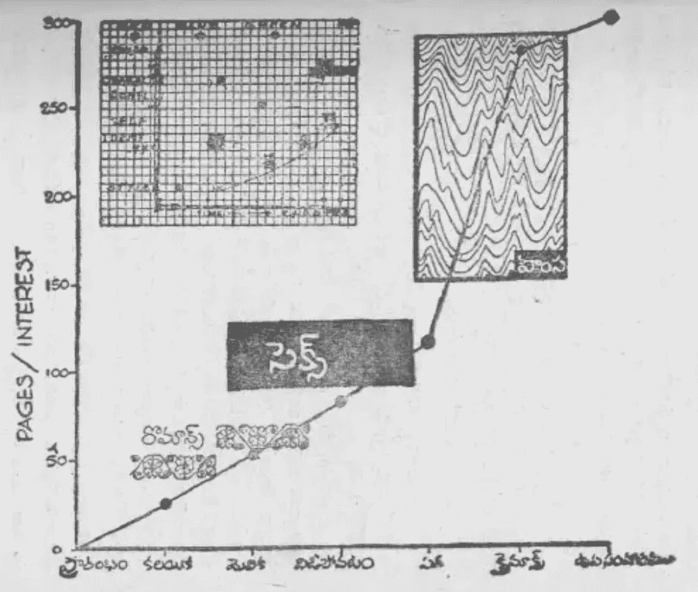
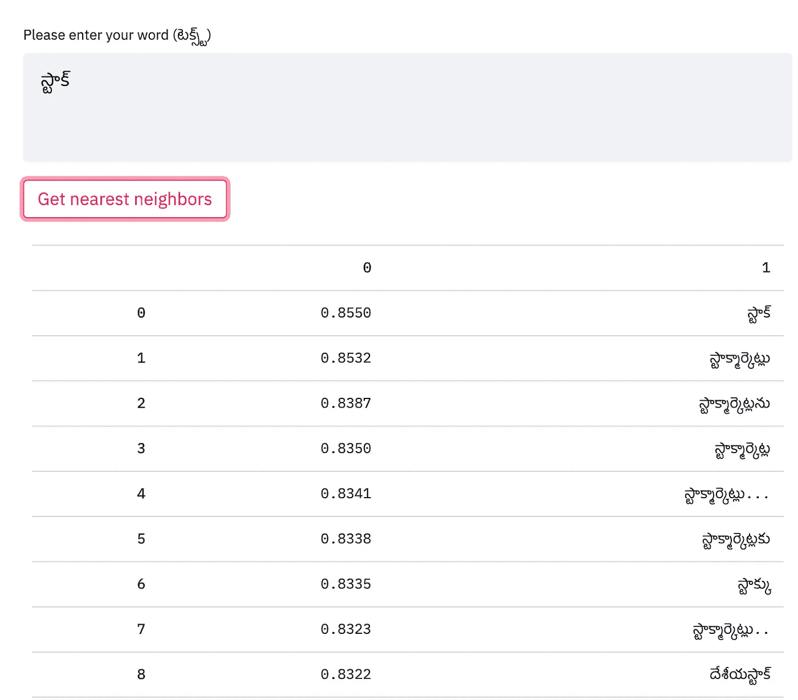

# (తెలుగు)泰卢固语的语言建模

> 原文：<https://medium.com/analytics-vidhya/language-modeling-for-%E0%B0%A4%E0%B1%86%E0%B0%B2%E0%B1%81%E0%B0%97%E0%B1%81-telugu-b590a029a565?source=collection_archive---------10----------------------->

图片来源:[泰卢固语维基百科](https://te.wikipedia.org/wiki/%E0%B0%A6%E0%B1%87%E0%B0%B6_%E0%B0%AD%E0%B0%BE%E0%B0%B7%E0%B0%B2%E0%B0%82%E0%B0%A6%E0%B1%81_%E0%B0%A4%E0%B1%86%E0%B0%B2%E0%B1%81%E0%B0%97%E0%B1%81_%E0%B0%B2%E0%B1%86%E0%B0%B8%E0%B1%8D%E0%B0%B8)

你读过 Yandamoori 的***anando Bram ha(***[**ఆనందోబ్రహ్మ**](https://www.goodreads.com/book/show/23510504-aanando-brahma)**)**？如果没有，你完全应该。这本书(泰卢固语小说)首次出版于 1980 年，远远领先于当时的时代。故事发生在 2054 年，印度的安德拉·德萨姆，是怀旧、幻想、浪漫和未来学的大杂烩。在这篇文章中，作者描述了一台(虚构的)“ ***第 12 代计算机*** ”它读入一部小说，并预测它将被市场接受的程度。此外，电脑会建议在哪里添加更多的浪漫、暴力等内容..让它更吸引人。

图片来源:扬达姆里·韦伦德拉纳斯(阿南朵·布拉姆哈)

今天，我们离这个虚构的现实不远了。OpenAI 的研究人员实现了类似的特技，即教会计算机如何书写。如果你好奇，可以在这里和他们的 demo [互动。](https://talktotransformer.com/)

 [## OpenAI 发布了文本生成人工智能，称其太危险，不能分享

### 研究实验室 OpenAI 宣布，它已经在 2 月份创建了一个名为 GPT-2 的新的文本生成人工智能系统，但拒绝透露…

www.theverge.com](https://www.theverge.com/2019/11/7/20953040/openai-text-generation-ai-gpt-2-full-model-release-1-5b-parameters) 

谷歌的另一个团队创建了可以消化整部小说的模型，这使得生成长期连贯的作品成为可能。

 [## 谷歌的人工智能语言模型重整器可以处理整部小说

### 无论是语言、音乐、语音还是视频，序列数据对于人工智能和机器学习模型来说都不容易…

venturebeat.com](https://venturebeat.com/2020/01/16/googles-ai-language-model-reformer-can-process-the-entirety-of-novels/) 

一种叫做 ***语言建模*** 的技术是所有这些进步的核心。我感兴趣的是了解这些技术进步如何被用于泰卢固语和泰卢固语使用者的利益。在这篇文章中，我将

1.  浅谈泰卢固语
2.  解释语言建模及其应用
3.  为泰卢固语创建 BERT 语言模型
4.  展示一些你可以用训练好的语言模型做的很酷的事情

# 泰卢固语

泰卢固语通常被称为东方的意大利语(因为大多数单词都以元音结尾)，是一种德拉维甸语，全世界有超过 8200 万人使用。在泰卢固，

1.  语言类型学是**主语-宾语-动词** (SOV)
2.  **名词**有**屈折**表示**数**(单数/复数)**类**(阳性、阴性、中性)**格**(主格、宾格、所有格、与格等)..)
3.  书写系统是分段的(Abugida)，其中**辅音-元音**序列作为一个单元书写。

# 什么是语言建模

语言建模是一项在给定单词序列的情况下预测下一个单词是什么的任务。

> 设 ***X(1)，X(2)，X(3)，…。***x(n)是一个单词序列；

语言模型的目标是 ***预测下一个单词 X(n+1)*** 的概率分布

> P(X(n+1)|X(n)，…。，X(1))；其中 X(n+1)可以是词汇表(集合)中的任何单词 **V**

稍有不同的目的是屏蔽给定句子中的某些标记(单词)，并基于左右上下文预测屏蔽的单词(也称为 ***屏蔽语言建模*** )。

# 谁在乎呢。

语言建模是许多任务的子组件，如**预测打字**、**语法纠错**、**机器翻译**、**摘要**、**词性标注**、**命名实体识别**等。**句子嵌入**，语言建模的副产品，可用于下游任务，如**文本分类**和**蕴涵**。

> 在语言建模任务中的完美表现，预测序列中的下一个单词，其猜测次数等于或低于人类参与者所需的猜测次数，这表明了人类水平的智能。

# 代码和型号

对于我下面展示的所有演示，我已经在我的知识库中提供了代码，并且已经通过 [huggingface](https://huggingface.co/) 模型库提供了模型。如果可能，请尽可能以最高分辨率观看 youtube 演示视频。

 [## 库普鲁尔/泰卢固语 _ 实验

### 在这个资源库中，我使用我在……上培训的语言模型演示了泰卢固语语言建模的一些应用程序

github.com](https://github.com/kuppulur/Telugu_Experiments)  [## 库普乌里(卡尔蒂克·乌普乌里)

### 我们正踏上通过自然语言解决人工智能并使其大众化的旅程。

huggingface.co](https://huggingface.co/kuppuluri) 

# 泰卢固语的 BERT

BERT (来自 Transformers 的双向编码器表示)是一个非常流行的语言表示模型，它已经在跨各种语言的不同 NLP(自然语言处理)任务中取得了最先进的结果。其核心是，它使用屏蔽语言建模目标来创建语言表示模型。关于伯特的更多细节，请参考杰伊·阿拉玛的这篇精彩文章。

 [## 有插图的伯特、埃尔莫等人(NLP 如何破解迁移学习)

### 讨论:黑客新闻(98 分，19 条评论)，Reddit r/MachineLearning (164 分，20 条评论)翻译…

jalammar.github.io](http://jalammar.github.io/illustrated-bert/) 

为了在泰卢固语中创建一个**相似的语言表示模型，第一步是精选一些**数据**。我从不同的来源(维基百科、书籍、报纸、博客等)搜集在线泰卢固语内容。).另外，我发现这个数据集非常有用。**

 [## AnushaMotamarri/泰卢固语-报纸-文章-数据集

### 这个项目从泰卢固语报纸网站 Andhra Jyoti 的档案中收集文章。创建一组查询，然后…

github.co](https://github.com/AnushaMotamarri/Telugu-Newspaper-Article-Dataset) 

一旦我整理了数据，我就使用下面两篇文章中的知识，用泰卢固语从头开始创建了一个词汇表大小为 32k 的 ***BERT 模型。***

 [## 如何使用转换器和记号赋予器从零开始训练一个新的语言模型

### 在过去的几个月里，我们对我们的 transformers 和 tokenizers 库做了一些改进，目标是…

huggingface.co](https://huggingface.co/blog/how-to-train)  [## 从零开始训练罗伯塔-失踪的指南

### 经过数小时的研究和尝试，以了解所有必要的部分需要一个训练定制…

zablo.net](https://zablo.net/blog/post/training-roberta-from-scratch-the-missing-guide-polish-language-model/) 

在下面的演示中，我比较了我的 ***定制 BERT 泰卢固语模型*** 与一个 ***预训练 BERT 多语言模型*** 的结果。

# 快速文本模型

我还根据我收集的数据训练了一个快速文本模型。所有的模型下载链接都可以在我的 [Github](https://github.com/kuppulur/Telugu_Experiments) 上找到。

我创建的快速文本模型中的单词
స్టాక్的顶级邻居及其相似性

# 词性标注和命名实体识别

一旦我有了泰卢固语的语言表示模型，我就用它来创建词类标记和命名实体识别模型。

 [## NER 泰卢固语

### 标题为“使用 LSTM-CRF 进行泰卢固语命名实体识别”的论文的代码。数据集可以在…中找到

github.com](https://github.com/anikethjr/NER_Telugu) 

我使用了 [SimpleTransformers](https://github.com/ThilinaRajapakse/simpletransformers) 库来创建 POS 和 NER 模型。你可以在下面观看 POS 和 NER 的演示，如前所述，演示代码可以在我的 Github 上找到。

# 泰卢固语问答

我从 ***Tydiqa 数据集*** 中分离出泰卢固语的训练数据，并使用这些数据来训练泰卢固语的小队式问答系统。可以看下面的演示。

# 泰卢固语摘要

你一直想知道长篇新闻的主旨吗？如果是，下面的演示将告诉你如何从长文章中提取摘要。为此，我使用了一个名为[Bert-extract-summary](https://github.com/dmmiller612/bert-extractive-summarizer)r 的库和我构建的泰卢固语模型。

# 分类问题可以用这个模型吗？

当然可以。下面的脚本展示了如何获取任何给定文本的句子嵌入。一旦有了嵌入，就可以通过简单地添加另一个分类层(或者根据问题添加一个回归层)来训练这些模型。

 [## 库普鲁尔/泰卢固语 _ 实验

### 泰卢固语语言模型实验。通过在…上创建帐户，为 kuppulur/Telugu_Experiments 的开发做出贡献

github.com](https://github.com/kuppulur/Telugu_Experiments/blob/main/bert_sentence_embeddings.py) 

如果您已经读到这里，非常感谢您抽出宝贵的时间来阅读本文。对于更多像**语义搜索**、**聚类**等应用。请查看我的 [Github](https://github.com/kuppulur/Telugu_Experiments) 。

**🙏 ధన్యవాదాలు 🙏**

# 参考

1.  [https://www.censusindia.gov.in/2011Census/Language_MTs.html](https://www.censusindia.gov.in/2011Census/Language_MTs.html)
2.  [https://en.wikipedia.org/wiki/Telugu_language](https://en.wikipedia.org/wiki/Telugu_language)
3.  [https://huggingface.co/blog/how-to-train](https://huggingface.co/blog/how-to-train)
4.  [https://zablo . net/blog/post/training-Roberta-from scratch-the-missing-guide-polish-language-model/](https://zablo.net/blog/post/training-roberta-from-scratch-the-missing-guide-polish-language-model/)
5.  [https://arxiv.org/pdf/1810.04805.pdf](https://arxiv.org/pdf/1810.04805.pdf)