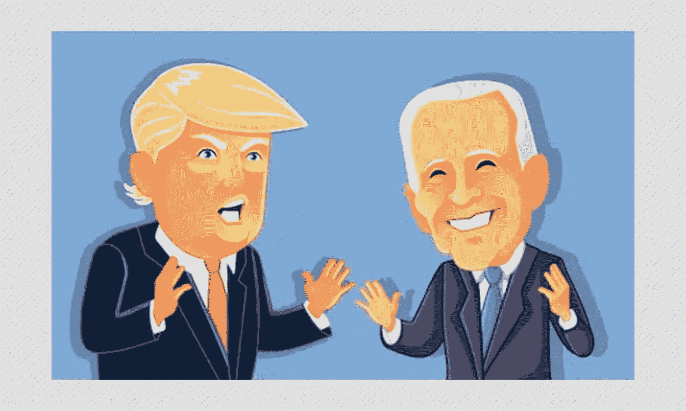
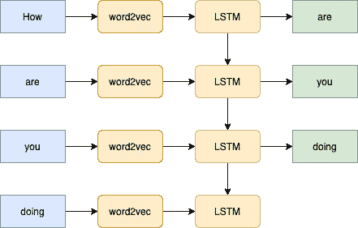
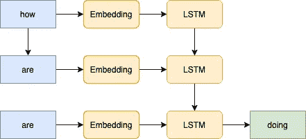
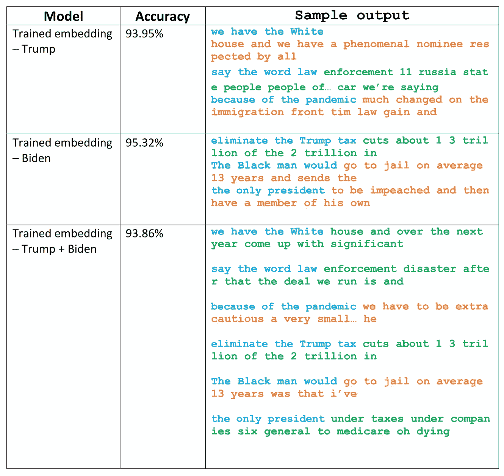

# 语言造型到人物造型？

> 原文：<https://medium.com/analytics-vidhya/language-modelling-to-person-modelling-ca0a1835ab76?source=collection_archive---------14----------------------->

随着疫情肆虐我们的生活，我们努力定义我们的“新正常”的健康生活。受限的社交聚会和与爱人的会面让我们中的一些人渴望同伴来分享我们的想法，发泄或只是活在当下。

鉴于人工智能正在转变为无所不在的力量，解决我们周围的许多问题，这能否被用来给我们一些归属感？

> “在我看来，对我们的大脑来说，最有成效、最自然的锻炼是对话。”——米歇尔·德·蒙田。

带着这个想法，我开始创造一个智能机器人，它能够像人一样对我做出反应。简而言之，贾维斯对我的钢铁侠。

所以，我从这里描述的传统语言[开始](https://www.coursera.org/learn/nlp-sequence-models)。你想知道我正在模仿的人是谁？随着最近结束的美国总统辩论，当然是唐纳德·特朗普，乔·拜登，甚至更好，一个组合的人格！



# 首先，让我们感受一下我们的数据集

在通过删除停用词、标点符号和标记来清理文本之后，让我们来看看两位说话者使用的最常见的五个二元模型。

```
**DONALD TRUMP**
[(('take', 'look'), 19), (('let', 'tell'), 15), **(('new', 'york'),** 14), (('individual', 'mandate'), 13), (('million', 'people'), 12)]--------------------------------------------------------------------**JOE BIDEN**
[(('make', 'sure'), 37), (('united', 'states'), 23), **(('number', 'one'), 23), (('number', 'two'), 17)**, (('one', 'number'), 15)
```

虽然我们确实听到了特朗普在纽约的许多言论，但拜登列举观点的风格也很明显。

到目前为止一切顺利！

# 惨败的模式。

我开始设计我的个人模型，试图教会它在给定一系列单词的情况下预测下一个单词。



语言建模的 LSTM 模型

一些大胆的决定。

**用于单词嵌入的 word 2 vec**

我认为使用[预训练的 Google word2vec](https://code.google.com/archive/p/word2vec/) 进行单词嵌入是明智的，这样模型就可以推断出像`citizens`和`people`、`country`和`nation`是同义词这样的想法。然而，很多常用词如`how`、`and`、`are`等并没有在模型中表现出来。这可能是因为在训练原始模型时删除了停用词。我使用一个随机向量来表示它，因为停用词在我们的总统文本生成问题中也是必要的。

**最大序列长度**

两位演讲者使用的平均句子长度分别为 10.67 和 14.02。然而，我决定把这个限制在 10，因为这个模型的目标是让**合理的句子**不一定长。

**损失余弦相似度**

由于`citizens`和`people`是同义词的同样原因，我认为用一个代替另一个来惩罚模型是不公平的。由于这些单词的向量表示具有很高的相似性，余弦相似性似乎是损失函数的合理选择。

由于航向破坏了它，该模型没有表现良好——无论是在精度方面(约 50%)还是在预测方面。这可能是由于相对于输入数据，模型的词汇集很大(即 Word2vec 预处理模型的词汇集)。只是一个猜测！

# 有点效果的模型。

所以，我决定选择另一种建筑来试图纠正我的错误，同时交叉手指和脚趾。



在使用较小的序列长度 4，并且消除了 word2vec 的情况下，这个模型似乎表现得更好。蓝色的文本是模型的输入(出现在文本中的片段)。的输出以橙色突出显示(如果它存在于文本中)，以绿色突出显示(如果它不存在)。



抽样输出

虽然产量还不是很可观，但它确实了解到了`white`之后通常是`house`、`tax`之后是`cuts`、`law`之后是`enforcement`等等……

这确实是冰山一角。该模型需要在更大的数据集上进行训练和评估，但那是以后的事了。在那之前，在一个平行的世界里快乐的编码！

数据集和代码—[https://www.kaggle.com/wasp12/debate-language-model](https://www.kaggle.com/wasp12/debate-language-model)