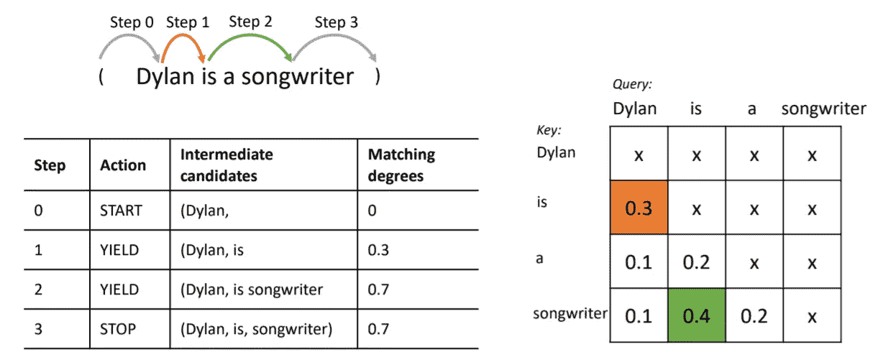

# 论文解释-语言模型是开放的知识图

> 原文：<https://medium.com/analytics-vidhya/language-models-are-open-knowledge-graphs-17a7284ff91a?source=collection_archive---------7----------------------->

提议方法的概述。MAMA 构建了一个开放的知识图(KG ),其中预先训练的语言模型(LM)在语料库上进行一次正向传递(没有微调)。图片取自[纸](https://arxiv.org/pdf/2010.11967.pdf)。

# 简介和概述

本文在高层次上提出构建知识图，这是一种通常由人类专家构建的结构化对象。它提出在没有人工监督的情况下，通过简单地使用预先训练的语言模型和语料库来提取知识图来自动构建知识图。这篇论文很酷的一点是**不涉及任何训练**，所有的知识都是从运行一次语料库中提取出来的。因此，一个前进通过预先训练的语言模型，并构建知识图。

在这篇论文中，作者设计了一种名为 **MAMA** 的无监督方法，它成功地恢复了存储在语言模型中的事实知识，以从头开始构建知识图。 **MAMA** 通过对文本语料库进行预训练的 LM(无微调)的单次前向传递来构建 KG。

# MAMA-语料库到知识图

我们有一个语料库，一个语料库只是一堆文本片段，我们想从中提取一个知识图。知识图由两个不同的事物组成，它有**个实体**(你可以把它想成名词)和**个关系**(职业、签约、获奖等)，在这里，关系连接到实体以形成意义。现在，让我们讨论构建知识图所需的**两个阶段**。

**匹配阶段**通过将文本语料库中的事实与预训练语言模型中的知识进行匹配来生成一组**候选事实**。**候选事实是一组提取的字符串三元组**(即；分别是头、关系和尾)。句子越长，提取三连音字符串就越困难。

**在映射阶段，**候选事实被映射到一个模式，这些模式通常由人来定义。所以这里我们仍然要依靠人类来定义模式。该阶段通过将来自**匹配阶段的**匹配候选事实**映射到固定 KG 模式和开放模式**来产生**开放 KG** 。如果候选事实的模式存在于人注释的 KG 模式(维基数据和 TAC KBP)中，我们将候选事实直接映射到固定的 KG 模式。否则，我们在开放模式中保留未映射的候选事实。这导致了一种新类型的知识图(KG ),称为开放 KG，混合了固定 KG 模式中的映射事实和开放模式中的未映射事实。

# 候选事实发现算法

如何从语料库中得出知识图？作者在 map 阶段使用了三个主要步骤来从语料库构建 KG。

**第一步**:运行 spaCy ( **spaCy** 是一个免费的开源库，用于 Python 中的自然语言处理。它的特点是 NER、词性标注、依存解析、词向量等等)**提取名词短语/组块**。通过语料库运行 spaCy 库将找到提取的候选事实的头部和尾部。但是这种空间性的衰落可能会错过许多不被识别为名词短语的单词(在巨大的句子中),作者还说空间性注释有时容易出错。

**第二步**:这就是他们的系统/方法的用武之地。现在你已经在文本中找到了头和尾，在它们之间的某个地方可能有一个关系，系统需要找出它在哪里。那么这个方法是怎么算出来的呢？该算法将做一些类似于**动态编程和搜索算法(波束搜索)**的事情。该算法从字符串的头部开始(之前可能有文本),我们只需找到头部，然后查看它的注意力矩阵。现在，注意力矩阵基本上是每个标记关注其他标记的程度，即，从其他标记向特定标记发送了多少信息。因为我们正在定位头部和尾部之间的关系，所以我们将忽略查询后面的所有标记，只在句子中向前看。这就是为什么注意力矩阵的上半部分被划掉了。从代币‘迪伦’我们只能看它前面的代币(是，a，和词曲作者)。接下来我们去哪里？

匹配实例|匹配度计算的关注矩阵|图片取自[论文](https://arxiv.org/pdf/2010.11967.pdf)。

我们要取注意力矩阵那一栏的最高分。查看标记“Dylan”的关注列，取最高得分值(0.3)，然后我们转到与最高得分关联的标记(在本例中为“is”)，并将该标记(“is”)附加到候选事实中。将最高分标记放入候选事实后，我们转到下一个标记，再次查看相应的关注度列，取最高分数值(0.4)，然后转到与最高分相关的标记(本例中为“歌曲作者”)，并将该标记(歌曲作者)附加到候选事实中。该算法发现令牌“歌曲作者”实际上是我们的尾部，并且尾部是最后一个单词，因此，该算法停止。我们总是从注意力矩阵中最大的条目前进，直到我们到达尾部，这就是算法！！

❗假设该关系在文本上必须在头部和尾部之间，并且该关系必须被编码为半精确的字符串，这是非常严格的。这个约束问题的最大缺陷是算法的召回率非常非常低(显然，这个任务的所有系统都是如此)。❗

**第三步**:使用实体链接和关系链接系统构建知识图。

# 与预先训练的语言模型混淆

本文的作者建议我们可以使用预先训练的语言模型，如伯特、GPT-2、GPT-3 等。伯特有一个完整的注意力矩阵(一切都照顾到一切)，但作者说，我们也可以使用像 GPT-2 这样的模型。现在，GPT-2 是一个自回归语言模型，这意味着在 GPT-2 **中，你一个接一个地产生一个标记，这意味着每个标记只能关注它前面的事物。**你看到的问题是，这种方法是完全相反的，每个令牌的关注矩阵被删除，只有这样，在它之前的条目在关注矩阵中。我们实际上没有让 GPT-2 给出一个向前看的注意力矩阵，因为它只向后看。因此，可能正在发生的是，查询和键矩阵根据所使用的语言模型进行了交换。所以，我不相信这些语言模型中的知识是这种算法如此有效的原因，我更倾向于认为这种算法真的非常擅长跨语言单词之间的语法和统计关联，这就是为什么这种算法可以很好地提取这些候选事实。

# **更多约束**

约束条件 **#1** -匹配度(在搜索过程中遇到的所有这些注意力矩阵条目的总和，所有我们没有跳过的条目)必须高于某个阈值。

约束**# 2**-*r*的频率高于阈值。关系本身不应该太具体，它实际上应该在语料库中出现很多次。你浏览一次语料库，提取所有的候选事实，然后计算它们，再次浏览候选事实，删除所有低于某个阈值的事实。类似于停用词和生僻字的删除。

约束 **#3** -关系 *r* 在句子中是一个连续的序列。

# 将映射的事实映射到 KG 模式

目标是将候选事实(h，r，t)映射到 KG 模式中的事实(hk，rk，tk)。映射到现有 KG 模式的原因是利用专家设计的高质量模式(以避免从头构建的重复工作),并允许使用人类志愿者提供的 oracle KG 事实来评估候选事实。有两种类型的映射候选事实:

**实体链接到 KG 模式**——出于可伸缩性的考虑，作者利用一个基于提及实体字典的无监督实体链接器来链接实体。此外，上下文信息对于正确链接实体是至关重要的，作者使用上下文的单词嵌入来消除实体的歧义。

**利用 KG 模式的关系映射-** 作者主要遵循关系映射方法来构建候选事实的 KG 关系和关系短语之间的离线关系映射。基本思想是，候选事实和 KG 事实之间共现的链接头尾对(即，实体具有来自实体链接步骤的类型信息)越频繁，对应关系就越有可能相互映射。

# 将未映射的事实映射到开放模式

未映射的候选事实(h，r，t)意味着 h、r 和 t 中至少有一个没有映射到 KG 模式。有两种类型的未映射候选事实:

**部分未映射的事实-** 作者表示 h、r 和 t 中的至少一个被映射到 KG 模式。基于实体链接器，它可以是映射到 hk 或 tk 的 h 或 t。也可以是使用关系映射映射到 rk 的 r。这实际上导致了 KG 模式和 open 模式混合的未映射事实。

**完全未映射的事实-** 作者指出所有的 h、r 和 t 都没有映射到 KG 模式。这意味着实体链接器和关系映射都不能分别将 h、r 和 t 映射到 hk、rk、tk。产生的未映射候选事实保留在打开的模式中。

**如果你喜欢这篇文章并获得了真知灼见，请考虑** [**请我喝杯咖啡** ☕️ **点击这里**](https://www.buymeacoffee.com/nakshatrasinghh) **。** ❤️

# 参考

1.  [语言模型是开放的知识图](https://arxiv.org/pdf/2010.11967.pdf)

如果你喜欢这个帖子，请一定要鼓掌👏。💬连接？让我们来看看社会:[**http://myurls.co/nakshatrasinghh**](http://myurls.co/nakshatrasinghh)**。**