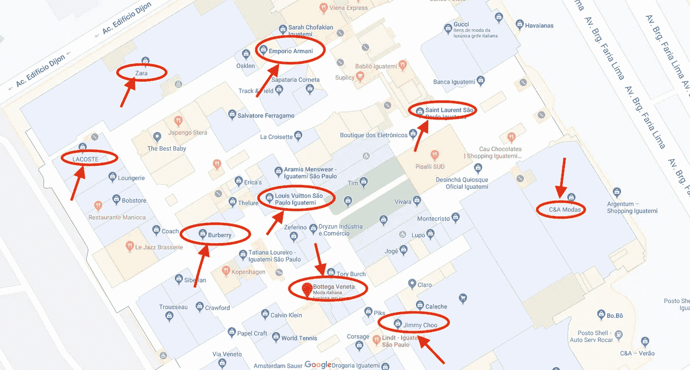
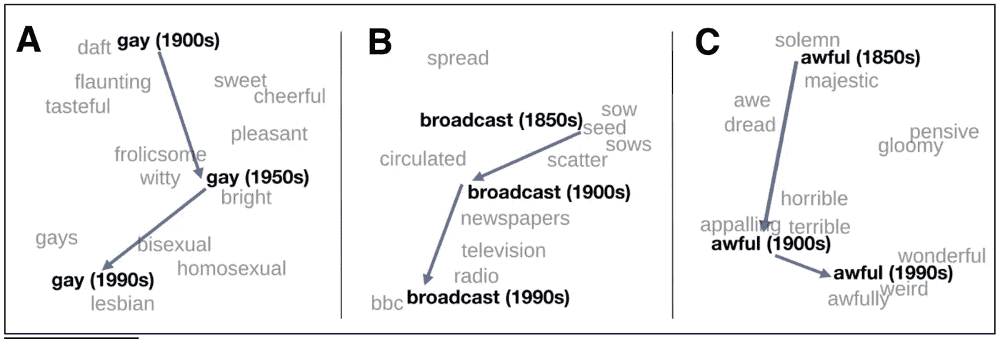

# 语言、词语嵌入和品牌:用自然语言处理刺破时尚泡沫

> 原文：<https://medium.com/analytics-vidhya/language-word-embeddings-and-brands-using-natural-language-processing-to-pierce-fashion-bubbles-f80e6542f17b?source=collection_archive---------11----------------------->


图片来源:[https://pix abay . com/photos/soap-bubble-colorful-ball-824558/](https://pixabay.com/photos/soap-bubble-colorful-ball-824558/)

品牌传播是一门艺术，它能识别出在某种程度上互补或吸引相同客户群的品牌。它根据顾客对品牌 C 和 d 的偏好来衡量购买品牌 A 的可能性。

这个概念假设不同的时尚品牌通过消费者对它们的感知联系在一起。不一定是这些品牌眼中的自己。

时尚品牌花了很多时间试图建立他们的形象，以影响你对他们的看法。最终，有些人希望你认为他们更像 T2 的时尚 T3 或 T4 的廉价 T5。

如果形象是一个商场，有互补形象的品牌将位于同一条小巷，一个挨着一个。这就是事情开始变得有趣的地方。从自然语言处理的角度来看，有可能使用向量语义发现品牌相似性吗？

## 向上下文问好

你怎么知道两个东西相似？作为人类，你是一个非常强大的分类者。我们非常善于发现事物之间的异同。但是，假设你不是人类，你是一台计算机，你需要一个好的方法来定义相似性，你会怎么做？

这里的关键是上下文。如果对话是一顿晚餐，那么单词就是菜肴、食物、杯子和叉子。背景就是桌子。

演讲词的分布方式并非偶然。

如果你仔细看，相似的词一遍又一遍地占据着同一个地方。这就像沙拉碗，通常位于靠近桌子的中心，而盘子和杯子更靠近边缘。

如果你看了足够多的表格，你很快就会发现一个模式。如果一个朋友让你装饰一张桌子，你很有可能会遵循这个模式。

计算机不擅长举办晚宴，但它们能够识别模式。这让我们想到了第一个假设:

如果你看了足够多的文本例子，你就能发现部分模式。

直到这里，没有新的东西。但是图案有一种魔力。模式发生在*上下文*中。这让我们想到另一个假设:

*模式是发生在上下文中的相互关联的事物的气泡。*

## 刺破泡沫

让我们回到表的例子。你桌子上的泡泡可以分为:

*   靠近中心的东西
*   也许是放在桌子边缘的不同物品，被孩子们占据了
*   不同的东西靠近成人和青少年占据的边缘。

*对了，别急，我们一会儿就来说时尚。我保证。*

让我们称坐在桌子上的这几组东西为它们命名。忘了说一句:这是素食桌。

*   泡泡 1:大沙拉碗，蔬菜乳蛋饼，胡椒，盐，更多的蔬菜。
*   泡泡 2:塑料盘子和塑料杯(对环境不好)，小叉子，玩具，小孩用的刀子。
*   泡泡#3:盘子，叉子，桌子保护，杯子，刀子，手机，餐巾。

你是否同意在这些泡泡中找到牙刷或枕头的几率非常低…？

如果你同意我的观点，恭喜你，你现在理解向量了。

## 普拉达，香奈儿…扎拉？！？

向量很棒，因为它们帮助我们将标记(一种指代单个语义单位的奇特方式，也称为单词、标点符号等)置于上下文中。).这是一种数学方式来表示意义、同义词、反义词和内涵。

这也是一种比较事物之间有多接近的奇妙方式……如果这些事物是时尚品牌，答对了，我们可能有办法发现集群(或泡沫品牌)。

但是为什么我需要向量呢？我可以去公司网站，看他们的描述，然后和其他品牌比较，对吗？

嗯…是也不是。

在这篇课文的开头，我们谈到了感知。感知是一个品牌希望如何被感知和真正被感知之间的距离。感知也高度依赖于上下文。

你不相信吗？我会证明的。

让我们以普拉达和香奈儿为例。没有人质疑这些是奢侈品导向的时尚品牌，在世界任何地方。

不过，Zara 是打折品牌吧？

在法国和巴西问这个问题，你会得到不同的答案。

在法国，Zara 被视为一家折扣公司、快速时尚、质量尚可、性价比高的品牌。你几乎找不到一个法国人会告诉你 Zara 是奢侈品。

在巴西，同样的问题可能会让你对[产生相反的看法](http://www.bh1.com.br/administracao-de-marketing/o-imperio-da-revenda-de-roupas-zara/)。Zara 巴西是世界上最贵的，尽管他们的产品质量和欧洲的一样。

向量可以证明这一点。

## 嗨，古驰，让我们成为朋友吧？吻你，扎拉。

在 La Madeleine，我们研究时尚和时尚数据。对于这篇文章，我们隔离了一个包含 4 万个关于时尚的随机句子的语料库，并训练了一个具有 300 个维度和 10 个标记窗口的 word2vec 模型，从语料库中删除了停用词和标点符号。

在分析时尚界的品牌认知时，Zara 引起了我们的兴趣。我们来查一下和这个品牌最相似的词。为了更直观，我将只保留品牌名称:

```
[('h&m', 0.9682981967926025),
 ('balenciaga', 0.9637893438339233),
 ('gucci', 0.9579935073852539),
 ('louis_vuitton', 0.9391179084777832),
 ('dolce_and_gabbana', 0.9348092079162598),
 ('fendi', 0.92620849609375),
 ('lacoste', 0.925973653793335),
 ('adidas', 0.9256582260131836),
 ('inditex', 0.9247792959213257),
 ('bottega_veneta', 0.9240132570266724),
 ('melissa', 0.9238268136978149),
 ('kenzo', 0.9218297004699707)]
```

像 H&M(在巴西不存在)或 Inditex (Zara 的妈妈)这样的品牌出现在 Zara 附近是很正常的。

但是像 Melissa，Lacoste 和 Adidas 这样的品牌价格更高。

当我们看到 Zara 非常接近“奢侈品俱乐部”时，事情变得更奇怪了，它似乎接近巴黎世家、路易威登和芬迪等品牌。

## iguatemi:/尘土飞扬的独木舟河/

Iguatemi 是一种图皮语，是巴西土著图皮人使用的一种已经灭绝的语言。它的意思是“尘土飞扬的独木舟河”，但也意味着“位于圣保罗最繁忙的街道之一的非常别致的购物中心”。

你知道:巴西一个有钱人去买包包和鞋子的地方。

但是……你在伊瓜特米有 C&A。不仅如此:你还可以在那里找到 Zara 和 Havaianas(这个品牌现在是高端品牌，但以前是折扣公司)。

在 Iguatemi，你可以买到 10 美元的 t 恤和 3000 美元的包包。

很巴西。

这是 Iguatemi 的平面图。



在巴西，Zara 被视为奢侈品。向量能够捕捉到这个现实。

只要分析几篇文章，就有可能发现这种独特的现象。这就好比 Zara、H&M 和 Tchibo 决定在巴黎的蒙塔涅大街(Avenue Montagne)开店。

Iguatemi 还有另一个名为 JK Iguatemi 的豪华购物中心。Zara 也在那里，还有香奈儿、古驰、普拉达、宝格丽等。

## 语言是信息

语言建模非常善于捕捉现实，因为语言是纯粹的信息。

对于试图了解自己被如何看待并纠正或刺激这种看法的公司而言，这些信息可能非常有用。

但不仅仅是。

单词嵌入的应用范围从我们刚刚做的这个简单有趣的练习到更复杂的任务，比如自然语言生成和自然语言理解。

从社会的角度来看，嵌入对于捕捉文化差异非常有用。

在 Daniel Jurafsky 和 James H. Martin 的《语音和语言处理:自然语言处理、计算语言学和语音识别导论》一书中，有一个很好的例子。

正如他们解释的那样，向量可以用来发现单词的语义变化。“gay”这个词从 20 世纪的“欢快的”变成了今天的“同性恋”。

“广播”和“糟糕”这样的词也是如此，它们从“种子”变成了“电视”，从“糟糕”变成了“怪异”。



复制图 6.14。《语音和语言处理:自然语言处理、计算语言学和语音识别导论》。

只是提醒一下，这个实验一点也不科学。我们只是玩了一个小语料库，没有使用严肃的方法，只是看看我们能实现什么。

*您想连接吗？能和大家一起探讨机器学习，探讨面向时尚行业的机器学习，将是一件很愉快的事情。短信我上*[](https://www.linkedin.com/in/limavallantin/)**。**