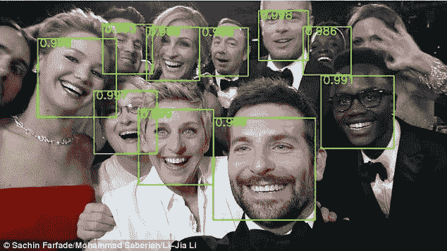
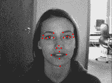
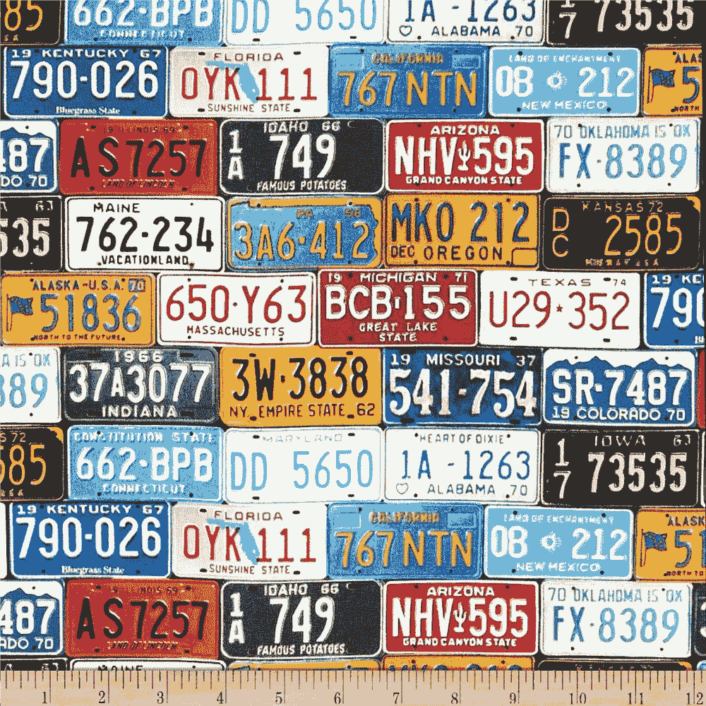
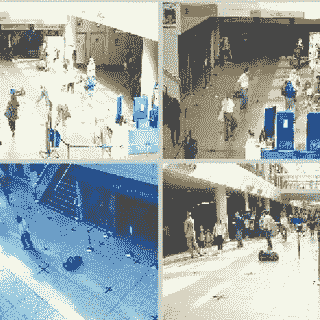
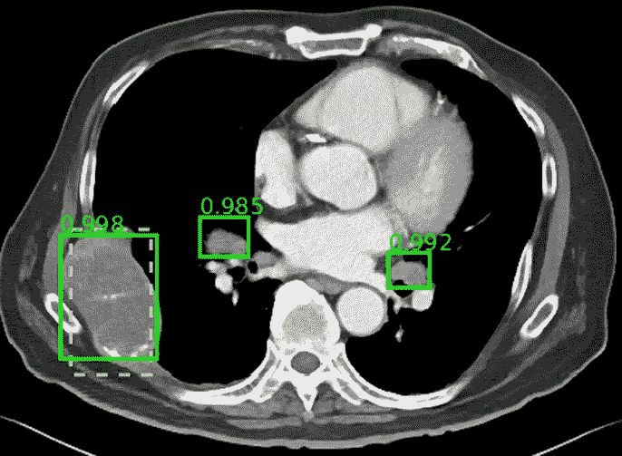
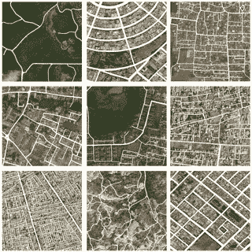
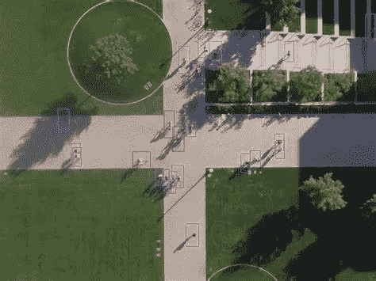
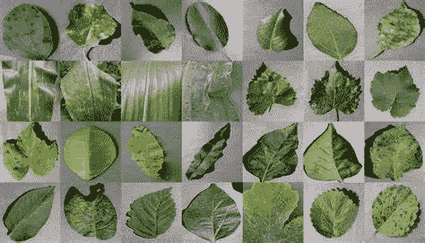
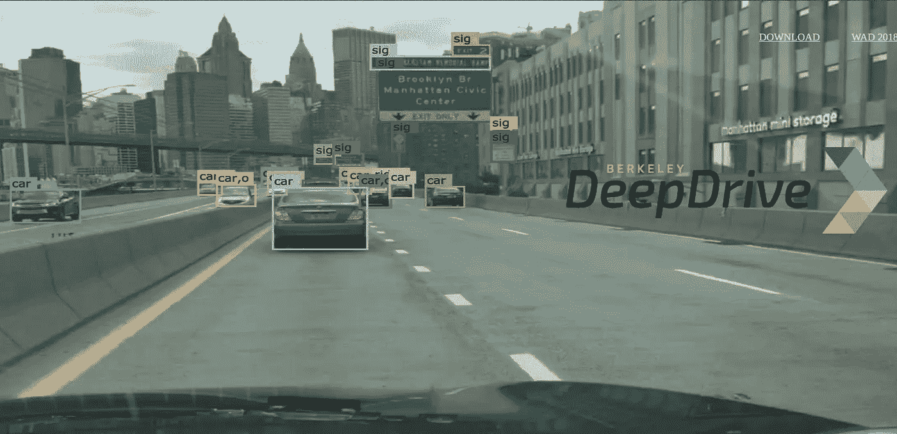

# 用于深度学习的大型和小型数据集

> 原文：<https://medium.com/analytics-vidhya/large-and-small-datasets-for-deep-learning-15f2b4cdc95f?source=collection_archive---------12----------------------->

## 组块学习

来源:谷歌

对于任何与图像或视频相关的深度学习任务，你都需要大量的数据，深度学习项目的成功取决于你的数据集的质量，你将为图像分类、对象检测、对象跟踪、处理 GANs、场景重建等任务训练算法。

因此，下面的几个链接将帮助您为深度学习任务找到正确的数据集。

**如果一些数据集需要引用，请务必帮助他们，因为数据是当今行业的新石油。**

## ***1 —人脸检测数据集*** :

*   野外的面孔—[http://tamaraberg.com/faceDataset/index.html](http://tamaraberg.com/faceDataset/index.html)
*   宽脸:人脸检测基准—[http://shuoyang1213.me/WIDERFACE/](http://shuoyang1213.me/WIDERFACE/)
*   面孔规格(https://sites.google.com/view/sof-dataset SoF)——
*   人脸检测与识别—[https://facedetection.com/datasets/](https://facedetection.com/datasets/)
*   http://vis-www.cs.umass.edu/fddb/:人脸检测数据集和基准—

来源:必应搜索

## *2。* ***车牌和场景文字*** *:*

*   车牌数据集—[https://platerecognizer.com/number-plate-datasets/](https://platerecognizer.com/number-plate-datasets/)
*   加州理工学院—[http://www.vision.caltech.edu/html-files/archive.html](http://www.vision.caltech.edu/html-files/archive.html)
*   http://www.medialab.ntua.gr/research/LPRdatabase.html[LPR 媒体实验室数据库](http://www.medialab.ntua.gr/research/LPRdatabase.html)
*   中国城市停车数据集—[https://github.com/detectRecog/CCPD](https://github.com/detectRecog/CCPD)
*   chars 74k—[http://www.ee.surrey.ac.uk/CVSSP/demos/chars74k/](http://www.ee.surrey.ac.uk/CVSSP/demos/chars74k/)

来源:必应搜索

## *3。* ***人体活动检测*** :

*   视频数据集概述—[https://www.di.ens.fr/~miech/datasetviz/](https://www.di.ens.fr/~miech/datasetviz/)
*   UCF50:真实视频中的动作识别—【https://www.crcv.ucf.edu/data/UCF50.php 

来源:必应搜索

## *4。* ***视频监控数据集*** :

*   鱼子酱—[https://computervisiononline.com/dataset/1105138692](https://computervisiononline.com/dataset/1105138692)
*   城市跟踪者—[https://www.jpjodoin.com/urbantracker/dataset.html](https://www.jpjodoin.com/urbantracker/dataset.html)
*   [https://www.uni-ulm.de/in/mrm/forschung/datensaetze.html](https://www.uni-ulm.de/in/mrm/forschung/datensaetze.html)
*   AAU 雨雪交通监控数据集—[https://www.kaggle.com/aalborguniversity/aau-rainsnow](https://www.kaggle.com/aalborguniversity/aau-rainsnow)
*   VISAL(视频、图像和声音分析实验室)——[http://visal.cs.cityu.edu.hk/downloads/](http://visal.cs.cityu.edu.hk/downloads/)
*   论坛行人追踪—[http://homepages.inf.ed.ac.uk/rbf/FORUMTRACKING/](http://homepages.inf.ed.ac.uk/rbf/FORUMTRACKING/)

来源:必应搜索

## *5。* ***医学影像数据集*** *:*

*   形状(心脏)统计模型的自由数据集—[http://www2.imm.dtu.dk/~aam/](http://www2.imm.dtu.dk/~aam/)
*   乳房造影图像数据库—[http://www.eng.usf.edu/cvprg/Mammography/Database.html](http://www.eng.usf.edu/cvprg/Mammography/Database.html)
*   小鼠胚胎追踪—[http://celltracking.bio.nyu.edu/](http://celltracking.bio.nyu.edu/)
*   放射学(癌症)——[https://www.cancerimagingarchurive.net/](https://www.cancerimagingarchive.net/)

来源:必应搜索

## *6。* ***卫星图像*** :

*   卫星图像中的船只—[https://www.kaggle.com/rhammell/ships-in-satellite-imagery](https://www.kaggle.com/rhammell/ships-in-satellite-imagery)
*   NOAA 的气候数据记录(CDR)计划—[https://www . ncdc . NOAA . gov/Data-access/satellite-Data/satellite-Data-access-datasets](https://www.ncdc.noaa.gov/data-access/satellite-data/satellite-data-access-datasets)
*   仙人掌航拍照片—【https://www.kaggle.com/irvingvasquez/cactus-aerial-photos 
*   星球:从太空了解亚马逊—[https://www . ka ggle . com/c/planet-Understanding-the-Amazon-from-Space/data](https://www.kaggle.com/c/planet-understanding-the-amazon-from-space/data)

来源:必应搜索

## *7。* ***无人机影像数据集*** *:*

*   英特尔捕获—[https://www . Intel . com/content/www/us/en/drones/drones-applications/video-imagery-datasets . html](https://www.intel.com/content/www/us/en/drones/drone-applications/video-imagery-datasets.html)
*   QuestUAV 调查数据集—[https://www.questuav.com/drones/example-datasets/#](https://www.questuav.com/drones/example-datasets/#)
*   https://www.sensefly.com/education/datasets/
*   DOTA:一个用于航空图像中目标检测的大规模数据集—[https://captain-whu.github.io/DOTA/index.uehtml](https://captain-whu.github.io/DOTA/index.html)

来源:必应搜索

## 8。 ***植物鉴定*** :

*   植物图像分析—[https://www.plant-image-analysis.org/dataset](https://www.plant-image-analysis.org/dataset)
*   植物村-数据集—[https://github.com/spMohanty/PlantVillage-Dataset](https://github.com/spMohanty/PlantVillage-Dataset)
*   植物-幼苗-分类—[https://www.kaggle.com/c/plant-seedlings-classification](https://www.kaggle.com/c/plant-seedlings-classification)
*   植物病害—[https://www.kaggle.com/](https://www.kaggle.com/)

来源:必应搜索

## *9。* ***人物追踪数据集* :**

*   戴姆勒行人基准-[http://www . gav rila . net/Datasets/Daimler _ 行人 _ 基准 _ D/Daimler _ 行人 _ 基准 _d.html](http://www.gavrila.net/Datasets/Daimler_Pedestrian_Benchmark_D/daimler_pedestrian_benchmark_d.html)
*   从移动平台进行稳健的多人跟踪-【https://data.vision.ee.ethz.ch/cvl/aess/dataset/ 
*   基于重叠摄像机的 UvA 多人跟踪基准数据集—[http://www . gavrila . net/Datasets/Univ _ _ of _ Amsterdam _ Multi-Cam _ P/Univ _ _ of _ Amsterdam _ Multi-Cam _ P . html](http://www.gavrila.net/Datasets/Univ__of_Amsterdam_Multi-Cam_P/univ__of_amsterdam_multi-cam_p.html)

来源:必应搜索

## 10。 ***自动驾驶数据集*** :

*   伯克利驱动—[https://bdd-data.berkeley.edu/](https://bdd-data.berkeley.edu/)
*   牛津机器人汽车数据集—[https://ori.ox.ac.uk/the-oxford-robotcar-dataset/](https://ori.ox.ac.uk/the-oxford-robotcar-dataset/)
*   百度—[http://apolloscape.auto/index.html](http://apolloscape.auto/index.html)
*   way mo—[https://waymo.com/open](https://waymo.com/open)

来源:必应搜索

如果您需要任何特定类别的数据集，请分享您的意见。一定会更新上面的列表。继续学习！！！

如果喜欢:-)