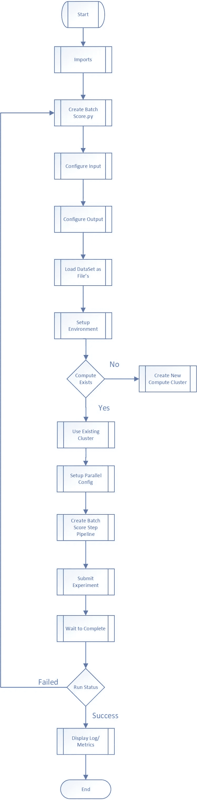

# 使用 Azure ML 进行批量评分的大规模 Scikit Learn ML 处理

> 原文：<https://medium.com/analytics-vidhya/large-scale-scikit-learn-ml-processing-for-batch-scoring-using-azure-ml-f8606c2516b?source=collection_archive---------32----------------------->

# 显示流程的流程图



下面的代码示例。代码运行所需的导入。

```
import os 
import urllib 
import shutil 
import azureml 
import pandas as pd 
from azureml.core import Experiment 
from azureml.core import Workspace, Run 
from azureml.core.compute import ComputeTarget, AmlCompute 
from azureml.core.compute_target import ComputeTargetException
```

让我们配置工作区，以便笔记本知道使用哪个工作区。

```
ws = Workspace.from_config()
```

设置必要的项目文件夹。使用的临时文件夹。

```
project_folder = './test-project' os.makedirs(project_folder, exist_ok=True) experiment = Experiment(workspace=ws, name='test-model')output_folder = './outputs' os.makedirs(output_folder, exist_ok=True)result_folder = './results' os.makedirs(result_folder, exist_ok=True)
```

设置模型将用于评分的分类。创建一个新的集群，或者使用现有的集群。

```
from azureml.core.compute import ComputeTarget, AmlCompute 
from azureml.core.compute_target import ComputeTargetException 
# Choose a name for your CPU cluster 
cpu_cluster_name = "testcluster" 
# Verify that cluster does not exist already 
try: 
    cpu_cluster = ComputeTarget(workspace=ws, name=cpu_cluster_name)
    print('Found existing cluster, use it.') 
except ComputeTargetException: 
    compute_config= AmlCompute.provisioning_configuration(vm_size='STANDARD_D14_V2', max_nodes=4) 
   cpu_cluster = ComputeTarget.create(ws, cpu_cluster_name, compute_config)
   cpu_cluster.wait_for_completion(show_output=True)
```

为上面要操作的集群选择默认映像和依赖关系。

```
from azureml.core.runconfig import RunConfiguration 
from azureml.core.conda_dependencies import CondaDependencies 
from azureml.core.runconfig import DEFAULT_CPU_IMAGE 
# Create a new runconfig object 
run_amlcompute = RunConfiguration() 
# Use the cpu_cluster you created above. 
run_amlcompute.target = cpu_cluster 
# Enable Docker 
run_amlcompute.environment.docker.enabled = True 
# Set Docker base image to the default CPU-based image run_amlcompute.environment.docker.base_image = DEFAULT_CPU_IMAGE 
# Use conda_dependencies.yml to create a conda environment in the Docker image for execution run_amlcompute.environment.python.user_managed_dependencies = False # Specify CondaDependencies obj, add necessary packages run_amlcompute.environment.python.conda_dependencies = CondaDependencies.create(conda_packages=['scikit-learn'])
```

编写批处理评分文件-这是如何使用具有新数据的模型并为预测的输入评分的逻辑所在。

批量评分文件的过程是加载所有必要的库。然后加载我们将要使用的模型。

模型加载后，主运行函数将把每个文件作为参数和分数。每个文件可以与一个节点平行排列，以便水平缩放。run 函数打开每个文件，然后预测并保存输出。

```
%%writefile batch_scoring.py 
import io 
import pickle 
import argparse 
import numpy as np 
import pandas as pd 
import joblib 
import os 
import urllib 
import shutil 
import azureml

from azureml.core.model import Model 
from sklearn.linear_model import LogisticRegression 
from sklearn.ensemble import RandomForestClassifier def init():
    global test_model

    model_path = Model.get_model_path("sklearn_test)

    #model_path = Model.get_model_path(args.model_name)
    with open(model_path, 'rb') as model_file:
        test_model = joblib.load(model_file)

def run(mini_batch):
    # make inference    
    print(f'run method start: {__file__}, run({mini_batch})')
    resultList = []
    for file in mini_batch:
        input_data = pd.read_parquet(file, engine='pyarrow')
        num_rows, num_cols = input_data.shape
        X = input_data[[col for col in input_data.columns if "encoding" in col]]
        y = input_data['test_flag']

        X = X[[col for col in X.columns if col not in ["xxxx_premium_range_encoding", "xyz_encoding"]]]
        pred = test_model.predict(X).reshape((num_rows, 1))

    # cleanup output
    #result = input_data.drop(input_data.columns[4:], axis=1)
    result = X
    result['variety'] = pred

    return result
```

设置用于评分的输入数据源的时间。

```
from azureml.core.datastore import Datastore

batchscore_blob = Datastore.register_azure_blob_container(ws, 
                      datastore_name="inputdatastore", 
                      container_name="containername", 
                      account_name="storageaccoutnname",
                      account_key="xxxxx",
                      overwrite=True)

def_data_store = ws.get_default_datastore()
```

存储输出评分文件的输出数据源。

```
from azureml.core.datastore import Datastore batchscore_blob_out = Datastore.register_azure_blob_container(ws, datastore_name="input_datastore", container_name="containername", account_name="storageaccountname", account_key="xxxxxxx", overwrite=True) def_data_store_out = ws.get_default_datastore()
```

用数据集配置管道。

```
from azureml.core.datastore import Datastore

batchscore_blob_out = Datastore.register_azure_blob_container(ws, 
                      datastore_name="input_datastore", 
                      container_name="containername", 
                      account_name="storageaccountname", 
                      account_key="xxxxxxx",
                      overwrite=True)

def_data_store_out = ws.get_default_datastore()from azureml.core.dataset import Dataset
from azureml.pipeline.core import PipelineData

input_ds = Dataset.File.from_files((batchscore_blob, "/"))
output_dir = PipelineData(name="scores", 
                          datastore=def_data_store_out, 
                          output_path_on_compute="results")#Set Environmentsfrom azureml.core import Environment
from azureml.core.conda_dependencies import CondaDependencies
from azureml.core.runconfig import DEFAULT_CPU_IMAGE

cd = CondaDependencies.create(pip_packages=["scikit-learn", "azureml-defaults","pyarrow"])
env = Environment(name="parallelenv")
env.python.conda_dependencies = cd
env.docker.base_image = DEFAULT_CPU_IMAGE
```

配置管道参数

```
from azureml.pipeline.core import PipelineParameter
from azureml.pipeline.steps import ParallelRunConfig

parallel_run_config = ParallelRunConfig(
    #source_directory=scripts_folder,
    entry_script="batch_scoring.py",
    mini_batch_size='1',
    error_threshold=2,
    output_action='append_row',
    append_row_file_name="test_outputs.txt",
    environment=env,
    compute_target=cpu_cluster, 
    node_count=3,
    run_invocation_timeout=120)
```

配置管道步骤

```
from azureml.pipeline.steps import ParallelRunStep

batch_score_step = ParallelRunStep(
    name="parallel-step-test",
    inputs=[input_ds.as_named_input("input_ds")],
    output=output_dir,
    #models=[model],
    parallel_run_config=parallel_run_config,
    #arguments=['--model_name', 'sklearn_touring'],
    allow_reuse=True
)
```

执行管道。

```
from azureml.core import Experiment
from azureml.pipeline.core import Pipeline

pipeline = Pipeline(workspace=ws, steps=[batch_score_step])
pipeline_run = Experiment(ws, 'batch_scoring').submit(pipeline)
pipeline_run.wait_for_completion(show_output=True)
```

显示实验运行状态

```
from azureml.widgets import RunDetails
RunDetails(pipeline_run).show()
```

管道运行结束。

要获得输出和调试，请单击链接[https://docs . Microsoft . com/en-us/azure/machine-learning/how-to-debug-parallel-run-step](https://docs.microsoft.com/en-us/azure/machine-learning/how-to-debug-parallel-run-step)

*最初发表于*[T5【https://github.com】](https://github.com/balakreshnan/mlops/blob/master/batchscorePRS.md)*。*