# 套索和山脊:正则化的线性回归

> 原文：<https://medium.com/analytics-vidhya/lasso-and-ridge-the-regularized-linear-regression-2d85384badf3?source=collection_archive---------12----------------------->

线性回归是执行回归任务的经典和最简单的线性方法。它让我们能够将原始数据用作工具，并执行预测性和规范性数据分析。但是，简单并不影响它的可用性。线性回归仍然是一种非常强大和广泛使用的算法，因为它提供了各种优势:

*   它可用于相当大的数据集
*   这是非常容易解释的:很容易理解为什么我们的模型对给定的输入给出了特定的输出。
*   在对要素拟合回归线性模型之前，不需要对要素进行缩放
*   不需要担心调整参数，因为没有

然而，正如人们常说的，每一件伟大的事情都有其反面，这次也不例外。

简单的线性模型过于简单，使我们无法控制其复杂性。它只是试图实现一个目标，即使用合适的超平面来降低数据的均方根误差(RMSE)。

简单的线性模型易于欠拟合和过拟合。

数据中太多的随机性或特征与目标之间的复杂关系会导致**欠拟合。**此问题的一个可能解决方案是引入“新的”复杂多项式特征，以帮助模型更好地识别数据中的趋势。你可以在[https://medium . com/analytics-vid hya/polynomial-regression-the-curves-of-a-linear-model-bef 70876 c 998](/analytics-vidhya/polynomial-regression-the-curves-of-a-linear-model-bef70876c998)找到更多关于多项式特性的信息。

要学习的特征太多，样本数量相对较少，往往会导致**过拟合**。对于这个问题，我们有一些优雅的解决方案，如**套索和山脊回归。**使用这些工具，我们有意降低模型的复杂性，因为我们希望它能够更好地概括新数据，而不是学习每个数据点，包括离群值。

在继续之前，我们需要熟悉一些术语。

# **正规化规范**

通常有两组正则化规范被研究和实现。那两个是 **L1 正则化**和 **L2 正则化**。它们都有自己的策略来降低模型的复杂性，使用对具有高量值的权重进行惩罚的概念。

> L1 范数:惩罚的基础是特征权重的绝对值之和。它试图获得一个稀疏解，其中大多数特征的权重为零。它可以有多种解决方案。本质上，L1 范数执行特征选择，并且仅使用少数有用的特征来建立预测模型，并且完全忽略其余的特征。
> 
> L2 规范:处罚的基础是重量的平方和。它会尝试降低与所有要素相关联的权重值，从而降低每个要素对预测值的影响。因为它涉及平方项，所以在处理异常值时，它不是首选。它总是有一个独特的解决方案，处理复杂的数据集比 L1 规范更好。

# **套索回归**

Lasso(最小绝对收缩和选择算子)回归不仅使用线性回归的基本概念，该概念涉及适当调整权重的选择以提高预测的可靠性，而且还有另一个要遵守的约束。它使用 L1 标准。

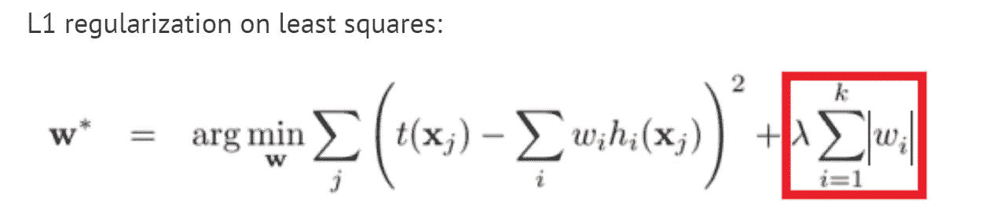

突出显示的术语是在套索回归(L1)中使用的惩罚。

我们看到新参数λ的引入。λ的值控制正则化的程度。λ的高值意味着更高的正则化程度；更简单的模型；更多的权值等于零。在λ=0 的情况下，套索模型变得等同于简单的线性模型。λ的默认值为 1。λ在 sklearn 线性模型中被称为 *alpha* 。

让我们看看拉索回归的行动！

我们使用 sklearn 的 *make_regression* 方法创建了一个具有五个特征的合成数据集。我们还添加了 5 个具有随机值的新特征，它们将作为“无用”特征，我们希望它们具有非常低的系数值。

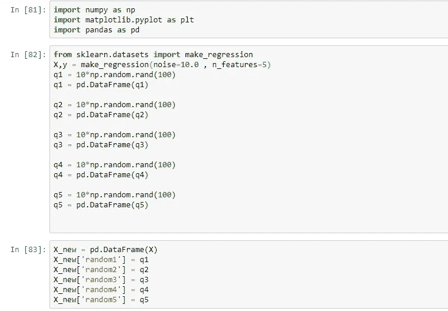

然后，我们使用数据集来训练各种线性模型。

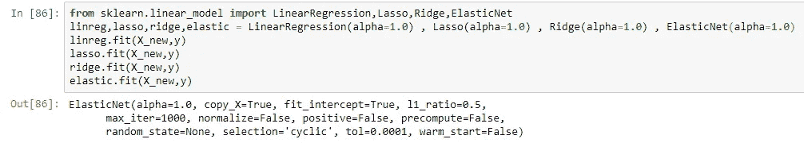

现在，让我们看看系数如何随着*α的值而变化。*

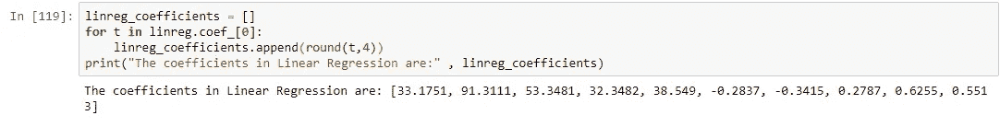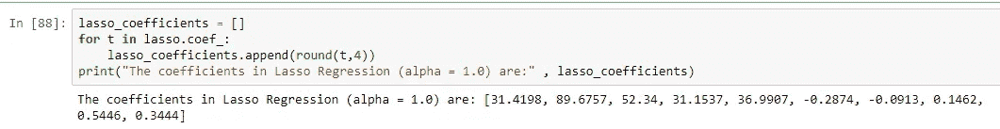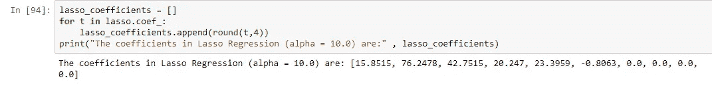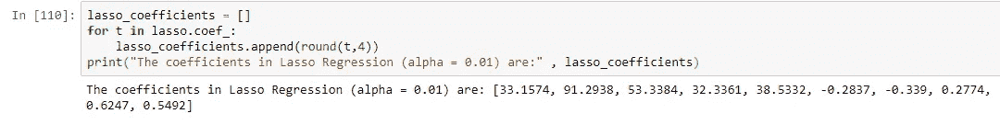

我们看到系数的值随着α而变化。随着阿尔法值的增加，系数的大小越来越接近零。事实上，在 *alpha* =10 时，五个随机特征中的四个恰好为零，正如我们所预期的那样。

# **岭回归**

它还使用简单线性回归损失函数的修改版本。它使用 L2 范数进行正则化

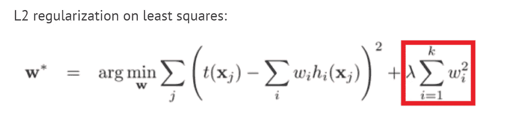

突出显示的术语是岭回归(L2)中使用的惩罚。

与 Lasso 一样，参数λ控制正则化的量。λ的高值意味着更强的正则化；更简单的模型；重量较小。在λ=0 时，岭的表现与简单线性模型相同。λ的默认值为 1。

岭回归在模型简单性和训练集得分之间进行了权衡。

看看*α*对系数值的影响，

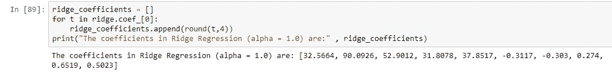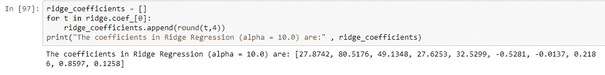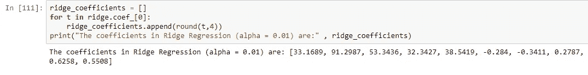

我们在系数和*α的关系中看到类似的趋势。*然而，在岭回归中，系数实际上不会达到零值。

# **弹性网回归**

ElasticNet 回归是一个强大的算法，结合了套索和岭回归的力量。因此，它可以像 Lasso 一样执行特征选择，并像 Ridge 一样将系数推得更接近零，因为它必须遵守 L1 和 L2 惩罚。

像套索和山脊一样，正则化的程度使用 *alpha* 参数进行调整。还有一个混合参数叫做 *l1_ratio* ，它允许我们调整 l1 和 L2 正则化的数量。

*   *l1_ratio* 在于[0，1]
*   其默认值为 0.5
*   *l1_ratio* = 0 对应纯岭回归
*   *l1_ratio* = 1 对应纯套索回归

与 Lasso 和 Ridge 相比，我们看到在这种情况下系数被强烈地推到零。

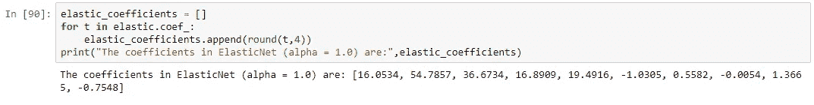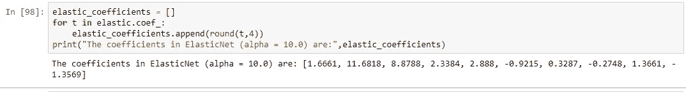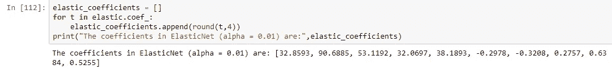

如果你发现它能提供信息，请鼓掌！