# 潜在狄利克雷分配

> 原文：<https://medium.com/analytics-vidhya/latent-dirichelt-allocation-1ec8729589d4?source=collection_archive---------4----------------------->

**潜在狄利克雷分配** (LDA)被用作主题建模技术，可以将文档中的文本分类到特定主题。它使用狄利克雷分布为每个文档模型查找主题，为每个主题模型查找单词。

**约翰·彼得·古斯塔夫·勒热纳·狄利克雷**是 19 世纪的德国数学家，对现代数学领域做出了广泛贡献。有一种以他的名字命名的概率分布**狄利克雷分布**，它是 LDA 的基础。

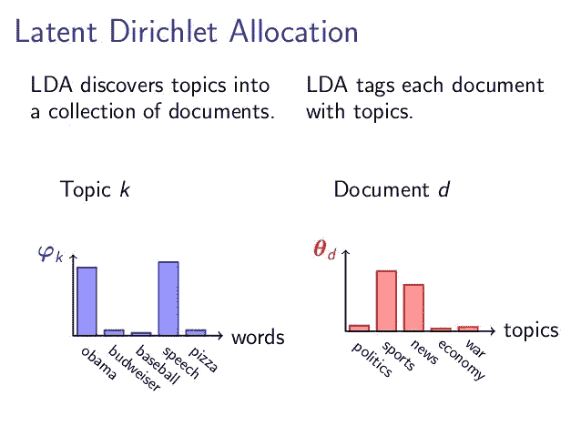

# LDA 是如何工作的？

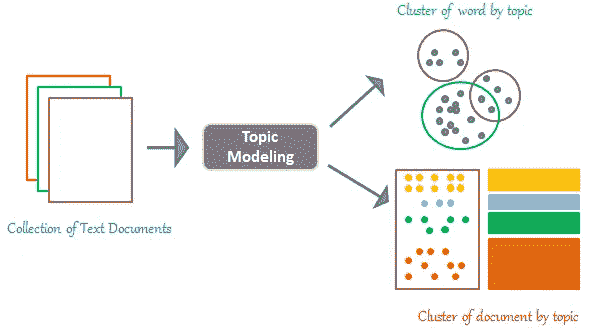

潜在狄利克雷分配是一种将句子映射到主题的技术。LDA 根据我们输入的主题提取特定的主题集。在生成这些主题之前，有许多由 LDA 执行的过程。在应用这个过程之前，我们已经考虑了一定数量的规则和事实。

用于主题建模的 LDA 假设:

*   具有相似主题的文档使用相似的词组
*   然后可以通过搜索在整个语料库的文档中频繁出现的单词组来找到潜在主题
*   文档是潜在主题的概率分布，这意味着某个文档将包含特定主题的更多单词。

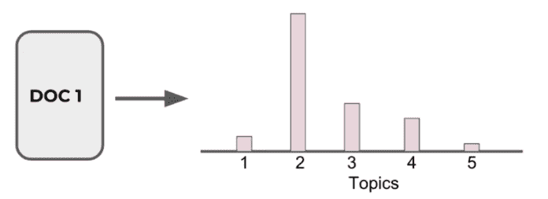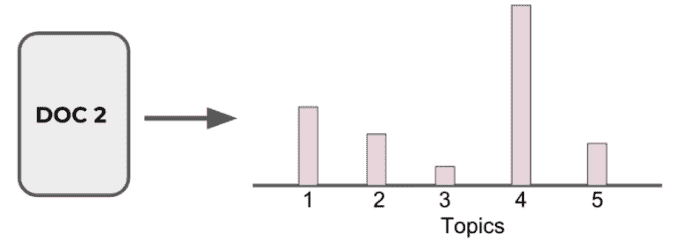

*   主题本身是单词的概率分布

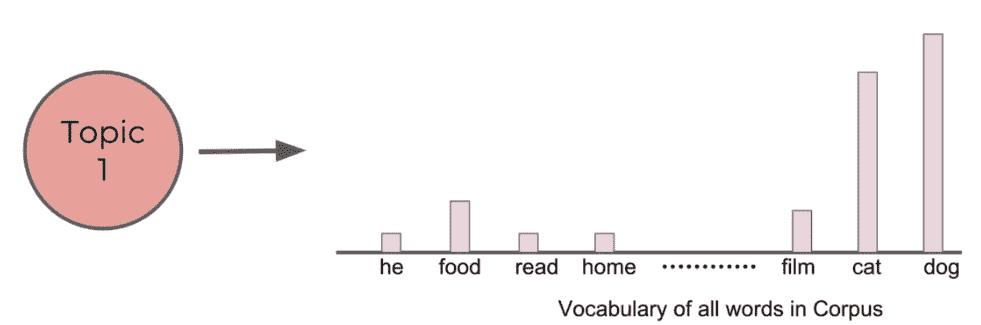

这些是用户在应用 LDA 之前必须了解的假设。

举例说明:

假设我们有以下语句:

*   克里斯蒂亚诺罗纳尔多和莱昂内尔梅西都是伟大的足球运动员
*   人们也钦佩内马尔和拉莫斯的足球技术
*   美国和中国都是强大的国家
*   中国正在建造最大的空气净化器
*   通过在全球范围内推广足球，印度也正在成为最发展中的国家之一

在 LDA 的帮助下，我们可以生成关于句子的主题集。如果我们考虑 2 个主题集，那么:

*   句子 1 和句子 2 都属于话题 1
*   句子 3 和句子 4 都属于话题 2
*   句子 5 描述了 70%的主题 1 和 30%的主题 2

LDA 声明每个文档包含与各种主题相关的各种类型的上下文。因此，文档可以表示为各种类型主题的集合。每一个主题都有大量的单词，并有一定的概率范围。根据 LDA，每个文档都有自己的属性。因此，LDA 在制作文档之前会假定一定的规则和规定。就像应该有字数限制一样，一个文档应该有一定数量的用户设置的字数。文件内容也应该多样化。文档应该参考各种上下文，比如 60%商业，20%政治，10%食物。包含在与主题相关的文档中的每个关键词以及该关系可以使用多项式分布来导出。我们之前讨论过的例子中，与商业领域相关的词的概率为 3/5，与政治相关的词的概率为 1/5。

假设该模型应用于文档集合，LDA 然后尝试从文档回溯以找到与文档上下文相关的主题集。

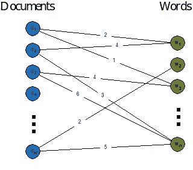

现在我们试图理解它的全部工作原理

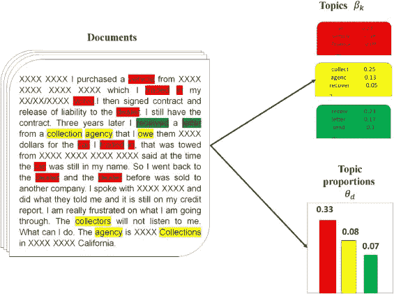

因为我们有来自某个数据集或随机来源的文档集。我们将决定要发现的固定数量的 K 个主题，并将使用 LDA 来学习每个文档的主题表示以及与每个主题相关联的单词。

LDA 算法循环遍历每个文档，并将文档中的每个单词随机分配给 K 个主题中的一个。这种随机分配已经给出了所有文档的主题表示和所有文档的单词分布以及所有主题的单词分布。LDA 将迭代每个文档中的每个单词来改进这些主题。但是这些主题表示并不好。所以我们必须改善这个限制。为此，创建了一个公式，其中提取了主要工作 LDA。

代表 LDA 模型的板符号:

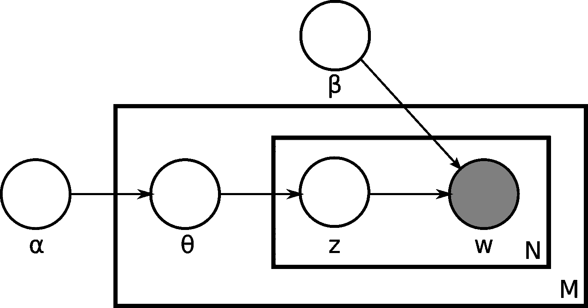

m 表示文档的数量
N 是给定文档中的字数(文档 I 具有{\displaystyle N_{i}}N_{i}个单词)
α是每个文档主题分布的狄利克雷先验参数
β是每个主题单词分布的狄利克雷先验参数
θ是文档 I 的主题分布
varphi 是主题 k 的单词分布
z 是文档 I 中第 j 个单词的主题
w 是特定单词。

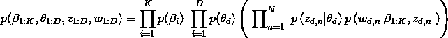

用简单的术语解释:

对于每个文档中的每个单词和每个主题 T，我们计算:
**P(主题 T |文档 D)** =文档 D 中当前分配给主题 T 的单词的比例

**P(单词 W |主题 T)** =主题 T 的赋值在来自单词 W 的所有文档中的比例

将 W 重新分配给一个新主题，我们以概率 **P(主题 T |文档 D) * P(单词 W |主题 T)** 选择主题 T。这实质上是主题测试生成单词 w

在重复前面的步骤很多次之后，我们最终会达到一个大致稳定的状态，在这个状态下，分配是可以接受的。最后，我们将每个文档分配给一个主题。我们可以搜索最有可能被分配到某个主题的单词。

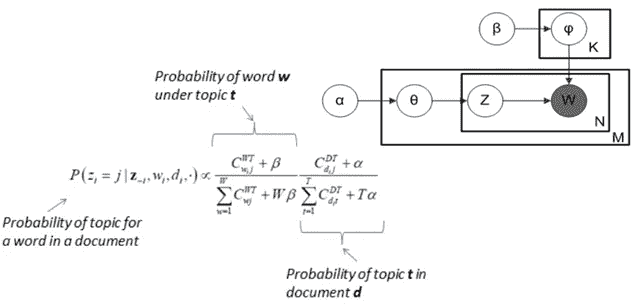

我们最终输出如下内容

*   分配给主题 4 的文档
*   主题 4 最常见的单词(最有可能)(猫、兽医、鸟、狗……)
*   由用户来解释这些主题。

两个重要注意事项:

*   用户必须决定文档中出现的主题数量
*   用户必须解释主题是什么

因此，一般来说，如果我们有一组文档，我们希望为文档的主题表示生成一组主题，我们可以使用 LDA 来执行。因为 LDA 将通过浏览每个文档来训练，并给主题分配单词。但这不是一个循环的过程。在第一个循环中，LDA 随机地将单词分配给主题。这里有一个学习过程。它将检查每个文档中的每个单词，并应用上面讨论的公式。在重复各种迭代后，它会生成一组主题。

# 履行

我们将尝试通过在数据集上应用 LDA 来更简单地理解它。

我们使用的数据集包含来自 www.npr.org 的信息或新闻。数据集包含全球最新的。我们将在新闻栏上实现 LDA，并尝试找出世界上最常见主题，还将为未来的新闻指定一个主题。

# 数据预处理:

```
import pandas as pd
df = pd.read_csv('npr.csv')
df.head()
```

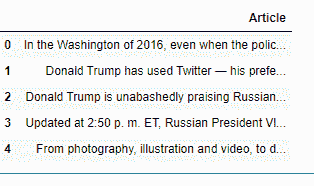

注意我们没有文章的主题！让我们使用 LDA 来尝试找出文章的聚类。

```
from sklearn.feature_extraction.text import CountVectorizer
cv = CountVectorizer(max_df=0.95, min_df=2, stop_words='english')
dtm = cv.fit_transform(df['Article'])
```

**计数向量器**:计数向量器是自然语言处理的另一部分，也被认为是 TFIDF 的 long 部分。因此，我们使用 tfidf 代替 countvectorizer。它计算一个标记在文档中出现的次数，并使用这个值作为它的权重。我们应用计数矢量器将文本数据转换成计算机可读的形式。

*   **max_df** :在[0.0，1.0]或 int 范围内浮动，默认=1.0
    用于去除出现过于频繁的单词。如果 max_df = 0.50 表示“忽略出现在 50%以上文档中的术语”。如果 max_df = 25 表示“忽略出现在超过 25 个文档中的术语”。默认的 max_df 是 1.0，这意味着“忽略出现在超过 100%的文档中的术语”。因此，默认设置不会忽略任何术语。
*   **min_df** :在范围[0.0，1.0]或 int 内浮动，默认=1
    用于去除很少出现的单词。如果 min_df = 0.01 表示“忽略出现在少于 1%的文档中的术语”。如果 min_df = 5 表示“忽略出现在少于 5 个文档中的术语”。默认的 min_df 是 1，这意味着“忽略出现在少于 1 个文档中的术语”。因此，默认设置不会忽略任何术语。

# LDA 模型:

```
from sklearn.decomposition import LatentDirichletAllocation
LDA = LatentDirichletAllocation(n_components=7,random_state=42)
LDA.fit(dtm)
```

# 显示储存的单词:

```
len(cv.get_feature_names())
>>>54777 for i in range(10):
    random_word_id = random.randint(0,54776)
    print(cv.get_feature_names()[random_word_id])>>>cred
fairly
occupational
temer
tamil
closest
condone
breathes
tendrils
pivotfor i in range(10):
    random_word_id = random.randint(0,54776)
    print(cv.get_feature_names()[random_word_id])>>>foremothers
mocoa
ellroy
liron
ally
discouraged
utterance
provo
videgaray
archivist
```

# 显示每个主题的热门词汇

```
len(LDA.components_)
>>>7
len(LDA.components_[0])
>>>54777single_topic = LDA.components_[0]# Returns the indices that would sort this array.
single_topic.argsort()# Word least representative of this topic
single_topic[18302]# Word most representative of this topic
single_topic[42993]# Top 10 words for this topic:
single_topic.argsort()[-10:]
>>>array([33390, 36310, 21228, 10425, 31464,  8149, 36283, 22673, 42561,
       42993], dtype=int64)

top_word_indices = single_topic.argsort()[-10:]
for index in top_word_indices:
    print(cv.get_feature_names()[index])
```

这些看起来可能像商业文章。我们会表演的。在我们的矢量化文章上转换()以附加标签号。但在此之前，我们查看所有找到的主题。

```
for index,topic in enumerate(LDA.components_):
    print(f'THE TOP 15 WORDS FOR TOPIC #{index}')
    print([cv.get_feature_names()[i] for i in topic.argsort()[-15:]])
    print('\n')
```

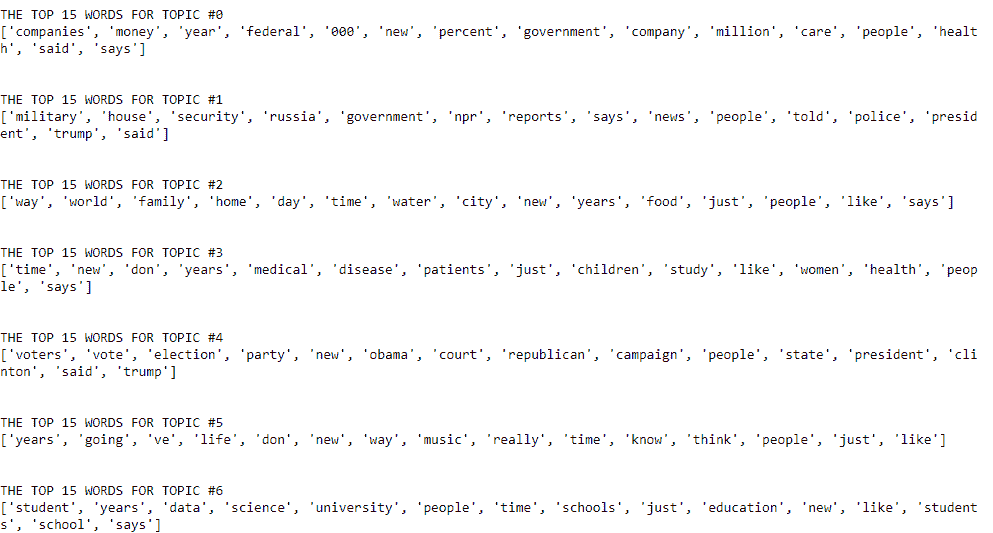

# 将发现的主题标签附加到原始文章

```
topic_results = LDA.transform(dtm)
npr['Topic'] = topic_results.argmax(axis=1)
```

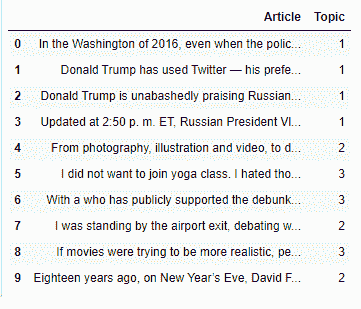

# 限制

*   我们可以生成的主题数量是有限的
*   LDA 无法描述导致不相关主题出现的相关性
*   随着时间的推移，主题没有发展
*   LDA 假设单词是可交换的，句子结构不是模型化的
*   无监督(有时弱监督是可取的，例如在情感分析中)

这样，您就有了潜在狄利克雷分配(LDA)的完整概念。享受吧。