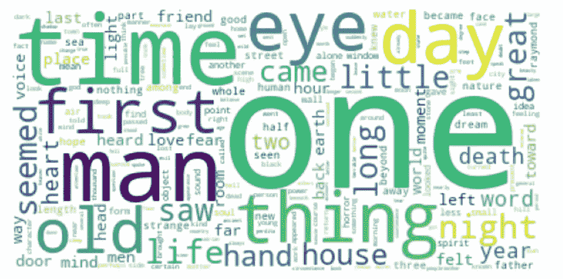
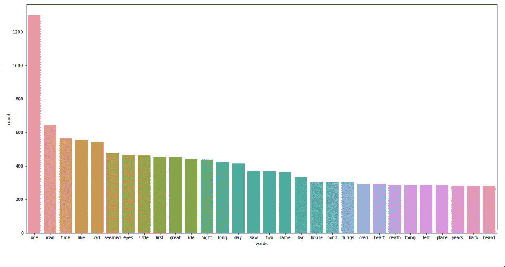

# 潜在狄利克雷分配与主题建模

> 原文：<https://medium.com/analytics-vidhya/latent-dirichlet-allocation-and-topic-modelling-eea49dc3eea6?source=collection_archive---------9----------------------->

本文的目标是理解 LDA 背后的直觉、用例以及实现。


照片由 [Unsplash](https://unsplash.com/?utm_source=unsplash&utm_medium=referral&utm_content=creditCopyText) 上的 [Edgar Castrejon](https://unsplash.com/@edgarraw?utm_source=unsplash&utm_medium=referral&utm_content=creditCopyText) 拍摄

主题模型是一种统计模型，用于发现出现在文档集合中的抽象主题。主题模型提供了一种分析大量未标记文本的简单方法。主题由一组频繁出现的单词组成。


该算法的输入将是一组文档，输出将是指定数量的主题，每个主题将具有相关的术语以及主题在所有文档中的分布。

## 一些算法

> 潜在狄利克雷分配
> 
> 潜在语义分析(LSA)或潜在语义索引(LSI)
> 
> 非负矩阵分解(NMF)

> 我们做的方法之一，是用潜在的狄利克雷分配(LDA)算法，以及如何用它来寻找文本文档中的意义。文档包含一组主题，每个主题是一组单词。LDA 使用一些统计分析来找出每个文档的内容。

## 用例

> 话题发现
> 
> 情感分析
> 
> 自动化文档标记


被视为主题分布的文档。主题被视为词的分布。主题被表示为单词的加权列表。

上图显示了 LDA 如何尝试对文档进行分类。文档被表示为主题的分布。反过来，主题由词汇表中所有标记的分布来表示。但是我们不知道语料库中出现的主题数量以及属于每个主题的文档。换句话说，我们希望将文档到主题的分配视为一个随机变量，它本身是从数据中估计出来的。

> LDA 培训过程大致包括:
> 
> 一个语料库，将文档的集合转换成一袋单词。
> 
> 数据预处理步骤，如删除停用词。应用词干将所有单词归入词根。令牌化。选择主题的数量，比如说 k，就是说我们需要在训练过程中指定主题的数量。
> 
> 给每个单词随机分配主题。按主题统计单词。按文档统计主题。将单词重新分配给主题。迭代 N 次文档中的所有单词。

LDA 模型的 3 个主要参数是主题数量、每个主题的字数和每个文档的主题数量。

> 低 alpha 值表示每个文档只包含几个主要主题
> 
> β值越低，每个主题仅由几个主导词组成的权重就越大

## 用 Kaggle 的幽灵作者数据集实现 Gensim LDA 模型。

数据集链接:

[](https://www.kaggle.com/c/spooky-author-identification/data) [## 怪异的作者识别

### 分享代码和讨论见解，从他们的作品中识别恐怖作者

www.kaggle.com](https://www.kaggle.com/c/spooky-author-identification/data) 

在本笔记本中，我们将应用主题建模并创建三个主题，因为给定的数据集由三位作者及其恐怖故事的摘录组成。这些作者是埃德加·爱伦·坡、玛丽·雪莱和惠普·洛夫克拉夫特。数据集包含来自公共领域的幽灵作者写的小说作品的文本:埃德加·爱伦·坡，惠普·洛夫克拉夫特和玛丽·雪莱。埃德加·爱伦·坡的作品围绕着神秘和恐怖的故事。玛丽·雪莱的作品围绕科幻小说和惠普·洛夫克拉夫特展开，她以怪异小说作家而闻名。


Jr Korpa 在 [Unsplash](https://unsplash.com/s/photos/spooky-season?utm_source=unsplash&utm_medium=referral&utm_content=creditCopyText) 上拍摄的照片

> 管道将会
> 
> 文档=== >预处理=== >向量空间(单词包、字典)=== >模型(lda/nmf) == >评估(度量、可视化)

读取数据集并检查数据集。该数据集包含 19579 个观察值和 3 个特征列 id、文本和作者。


此数据集中没有空列。将删除 id 列。

> #对于主题建模，我们将只关注文本数据
> authors _ data _ df = authors _ data _ df . drop(columns =[' id ']，axis=1)

文章在三个作者中的分布


删除不需要的数字或字符的数据清理和准备步骤。我们删除标点符号，并将文本转换为小写。我们还删除了停用词，这些词通常出现在所有文档中，并且不添加任何值来清楚地标识给定文档集合的三个子集。


一旦文本清理和停用词移除完成，我们就可以使用 wordcloud 进行可视化的探索性数据分析。

整个语料库的词云



我们可以在这个词云中观察到时间、事物、一、来、年、时、眼、日、人、夜、老等词。

语料库中的前 30 个单词是



我们将基于不同的作者将整个语料库分成三个不同的语料库，并显示 wordcloud 以及前 30 个出现的单词。

> hplDatadf = authors _ data _ df[authors _ data _ df . author = = " HPL "]
> 
> MWS tadf = authors _ data _ df[authors _ data _ df . author = = " MWS "]
> 
> eapDatadf = authors _ data _ df[authors _ data _ df . author = = " EAP "]

HP Lovecraft，wordcloud 显示诸如夜晚、死亡、梦、死亡、恐惧、恐怖、奇怪、窗户、古代等词，这些词似乎与作者著名的主题产生共鸣。

我们还调查了 HP Lovercraft 作品中出现的前 30 个单词。


Mary Shelley，wordcloud 显示单词有恐惧、心、raymond、头脑、灵魂、力量、希望、感觉、死亡、精神、朋友、死亡。积极和消极的话

我们还调查了马克·雪莱作品中出现次数最多的 30 个单词。


埃德加·爱伦·坡，wordcloud 显示的单词有生命，结束，朋友，夜晚，远，睁开，眼睛，伟大，一，小，时间，好，方式，时刻等

我们还调查了埃德加·爱伦·坡作品中出现频率最高的 30 个单词。


下一步是为训练模型准备数据。

## 步骤 1 将文本处理成单词或符号


## 构建 N 个图形


## 步骤 3 词条释义是将单词转换成词根的过程


## 建立语料库


上面的步骤 1 到 4 包括将文本转换成单词包。在创建模型之前，我们需要将文本标记化和词条化为一个单词包，这个单词包是一个词汇词典，其中的关键字是单词，值是该单词在整个语料库中出现的次数。
dictionary = gensim . corpora . dictionary(processed _ text)

现在，对于每个预处理过的文档，我们使用刚刚创建的 dictionary 对象将文档转换成单词包。也就是说，我们为每个文档创建一个字典，报告有多少单词以及这些单词出现了多少次。
bow _ corpus =[dictionary . doc 2 bow(doc)for doc in processed _ text]

```
[[(0, 1), (1, 1), (2, 1), (3, 1), (4, 1), (5, 1), (6, 1), (7, 1), (8, 1), (9, 1), (10, 1), (11, 1), (12, 1), (13, 1), (14, 1)]]
```

训练 LDA 模型

保持主题的数量为 3，因为我们知道有三个作者，我们有兴趣看看是否可以使用主题建模将给定的文本分组到作者的作品中。


*统计分析结果如上所示，但我们如何解读这 3 个主题，并将其与 3 位作者对应起来呢？*

主题被表示为单词的加权列表。

并非所有的主题都是语义连贯或可解释的。我们如何衡量模型的可解释性和良好性？连贯性评分，检验主题模型好坏的统计指标。

> 话题连贯性
> 
> 可以测量其高得分单词之间的语义相似度，并且基于此，我们可以量化主题的连贯性。
> 
> 话题连贯性越高，话题就越有人情味可解读。
> 
> 一致性度量可以用于基于人类可解释性来比较不同的主题模型。

当用两个主题训练模型时，一致性分数下降到 0.20，因为逻辑上一个作者的工作将与指定的两个主题重叠。


一个好的模型必须有不重叠的主题，距离显示了主题在语义上的不同。他们离得越远，话题就越好。

用 LDAvis 实现主题的可视化。每个气泡代表一个主题。当我们点击一个主题时，我们会得到与该主题最相关的术语及其分布。当我悬停在一个单词上时，我可以找到这个单词出现的所有主题以及出现的频率。

当我们比较每个主题的前 30 个单词和每个作者作品的前 30 个单词时，基于两个集合之间单词子集的最大重叠，我们得出结论:主题 1 可能是 EAP，主题 2 可能是 HPL，主题 3 可能是 MWS。这些主题 id 分别对应于 0、1 和 2 的 gensim 模型。

*注意# pyLDAvis 主题 id 与 gensim 主题 id*不对应。

话题#1


话题 2


话题#3


github 代码:【https://github.com/rumsinha/NLP】T2/[LDA 和 Topic modeling . ipynb](https://github.com/rumsinha/NLP/blob/main/LDA%20and%20Topic%20Modelling.ipynb)

## 结论

在本文中，我们试图理解什么是主题建模以及它是如何工作的。主题建模在自然语言处理和行业用例中的作用。

用于执行主题建模的各种算法，我们用 LDA 做了一个实现。在以后的文章中，我们也将尝试探索其他算法。

我们详细了解了训练 LDA 模型的各个步骤，从读取文本数据到各种预处理步骤，然后是标记化、词干化等。接下来，我们创建输入到模型中的单词包。输出将是我们指定的主题数量。

我们检查一致性分数，并使用 LDAvis 图进行视觉评估，以确保主题是否可以被人类理解。

将统计分析结果映射到人类可解释的主题可能并不容易。无监督学习的困难部分是评估部分，因为我们没有预定义的标签，因此在这一点上，我们可以与领域专家进行验证，以确保作为统计分析的一部分生成的主题正确地映射到人类可解释的主题。

## 参考

> [http://qp ple . com/topic-coherence-to-evaluate-topic-models/](http://qpleple.com/topic-coherence-to-evaluate-topic-models/)
> 
> [https://www . coursera . org/projects/introduction-to-topic-modeling-for-business](https://www.coursera.org/projects/introduction-to-topic-modeling-for-business)
> 
> [https://www . ka ggle . com/Arthur Tok/ghost-NLP-and-topic-modeling-tutorial](https://www.kaggle.com/arthurtok/spooky-nlp-and-topic-modelling-tutorial)
> 
> [https://www . slide share . net/g33k talk/dataengconf-building-the-next-new-York-times-recommendation-engine](https://www.slideshare.net/g33ktalk/dataengconf-building-the-next-new-york-times-recommendation-engine)