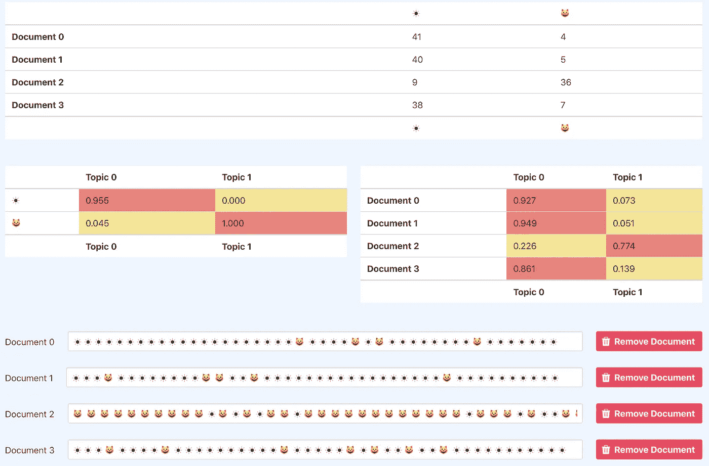

# 潜在狄利克雷分配:寻找主题

> 原文：<https://medium.com/analytics-vidhya/latent-dirichlet-allocation-finding-a-topic-dd21ed4cff44?source=collection_archive---------19----------------------->

我决定写关于使用潜在的狄利克雷分配算法来分析文本以找到相关主题的主题。

在我的最新项目中，我想加入一个机器学习算法来完成一项任务，否则这项任务将需要正常人花费大量的时间来完成。利用机器的力量，潜在地学会比人做得更好。

# 选择数据源

首先，我检查了可以输入到我的机器中的不同数据源。我想要的数据需要深入，并且有明确的目标，我可以应用它来丰富数据。

我了解了开放合同数据标准(OCDS ),这是一系列概述政府合同数据发布的文档。该标准通过定义通用数据模型，为世界各地的政府部门在签约过程的所有阶段披露数据和文件铺平了道路。

全球政府每年通过合同支出约 8 万亿美元。签约信息通常无法供公众审查。导致企业之间缺乏竞争来竞标这些合同，导致纳税人的钱价值降低和公共设施质量下降。

该标准已经提出了 1000 个合同，允许更广泛的用户对合同数据进行更深入的分析。

# 问题是

政府机构提供的数据结构合理且全面，但没有关于每份合同相关类别/主题的信息。最终用户搜索这些信息被证明是一项令人沮丧的任务，这种分类的缺乏限制了用这些数据构建某些工具的潜力。

每份合同都有一个简短的标题和说明，不一定要符合一定的标准。这必然会导致一些合同有大量的细节，而对于一些合同来说，只是包含另一个描述来源的外部 URL 的一小段。在对这些合同进行分类时，不同数量的数据会成为一个问题。

# 引入潜在狄利克雷分配

我研究了分析大量文本和为每个合同提供上下文主题的不同选项。

典型地，有许多方法来完成主题识别。一种方法是分层贝叶斯模型，如潜在狄利克雷分配(LDA)。

对于这项任务，特别是对于 OCD 数据，LDA 有其局限性:

*   当没有太多文本要建模时，它很难处理短文本
*   合同描述通常不会连贯地讨论一个主题(这使得 LDA 很难识别文档的主要主题)
*   描述的实际含义在很大程度上是基于上下文的，所以像 LDA 这样基于单词共现的方法可能会失败。

当文本本身是连贯的时，LDA 通过发现频繁出现的词来有效地识别主题。另一方面，当文本不连贯时(就词语选择或句子意义而言)，需要额外的语境信息来全面表达文本的思想。

考虑到这些限制，我从一个不同的角度着手解决这个问题，用关键词标记合同，而不是按照类似的主题对所有合同进行分组。向用户突出显示关键词将有助于快速识别合同对于特定搜索要求是否有用。

# 如何识别

潜在狄利克雷分配(LDA)是由零件组成的复合物集合的“生成概率模型”。本例中的组合是文档(文本串),部分是文档中的单词。

[https://lettier.com/projects/lda-topic-modeling/](https://lettier.com/projects/lda-topic-modeling/)

LDA 创建的主题模型由两个表组成。

第一个表格描述了在对特定主题(类别)进行抽样时选择特定部分的概率或机会。

第二个表描述了在对特定文档或复合文档进行采样时选择特定主题的机会。

上图显示了输入到 LDA 模型中的四个“文档”,每个文档由不同的表情符号组成。你可以清楚地看到，文档 2 主要由“猫”表情符号组成。而文档 0 主要由“太阳”表情符号构成。

因此，当我们查看输出的主题表(我们可以改变它输出的主题数量)时，我们可以看到主题 0 有 95%的概率是“太阳”表情符号，主题 1 有 100%的概率是“猫”表情符号。这两个主题允许将输入的 4 个文档分成两组。

第二个表描述了每个文档所属的类别。主要由“太阳”表情符号组成的文档 0 有 93%的概率属于主题 0 类别。主题 0 是由第一个表指示的“太阳”表情符号。

显然，这个例子非常简单，但对于更复杂的字符串也同样适用。通过检查所有文档中最常用的单词，然后将它们作为主题呈现，然后根据它们最适合的类别将文档分组到这些主题下。

# 结论

我开发了一个 API，允许不同来源的 OCD 文档使用潜在的 Dirichlet 分配来获取和执行对描述和标题的关键字分析。

被选择的关键字有时并不是真正的单词，所以我添加了验证功能，在将它们呈现给用户之前检查这些单词是否在字典中。然而，这造成了另一个问题，即有用的词，如公司名称和位置，被拒绝，所以我合并了一个白名单/黑名单系统，用于搜索结果中应该/不应该包含的词。

这个改变最终关键字的列表系统很冗长，但是允许对期望的结果进行简单的额外定制。

## 可以通过在此处调用此端点来访问 API:

[https://ocds-keyword-analyzer.herokuapp.com/](https://ocds-keyword-analyzer.herokuapp.com/)

## 如何使用它的文档可以在这里找到:

 [## dbuckley 0126/OCDS-关键字分析器-api

### 一个 API，用于使用潜在狄利克雷分配(LDS)对各种来源的开放合同数据进行关键字分析…

github.com](https://github.com/DBuckley0126/OCDS-keyword-analyzer-api)