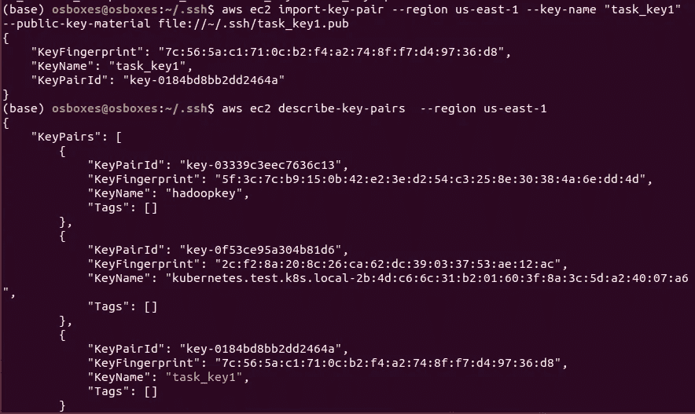

# 使用 CLI 启动 EC2 实例并连接 EBS 卷

> 原文：<https://medium.com/analytics-vidhya/launching-ec2-instance-using-cli-and-attaching-ebs-volume-6ce00456e55d?source=collection_archive---------20----------------------->


# 先决条件:

## AWS-cli 设置

1.  在 AWS 上创建一个帐户。
2.  转到**身份&访问管理** (IAM)，创建一个用户并生成一个访问密钥以在您的机器上配置 AWS。您需要向该 IAM 用户授予 AdministratorAccess 权限。
3.  打开命令行并配置 AWS

```
aws configure
```

4.提供您刚刚生成的**访问密钥**和**秘密**，以及您将要部署集群的区域。AWS 建议用户选择地理上靠近他们的地区，以减少延迟和成本。

对于那些正在使用 **AWS 教育初学者帐户。**进入 AWS 教育- >登录- > AWS 账户- > AWS 教育入门账户- >账户详情


```
gedit ~/.aws/credentials
```

删除凭证文件的内容，并将以下内容粘贴到凭证文件上


# 创建密钥对

由私钥和公钥组成的密钥对是一组安全凭据，用于在连接到实例时证明您的身份。Amazon EC2 存储公钥，您存储私钥。

*   您可以使用以下命令查看所有现有密钥对:

```
aws ec2 describe-key-pairs --region us-east-1
```


*   使用以下命令生成连接到 aws 的密钥:

```
ssh-keygen -t rsa -C "key-name" -f ~/.ssh/key-name
```


该命令将创建一个 SSH 密钥，使用 RSA 加密，注释为“key-name ”,并将它保存在我们主目录的`.ssh`目录中，私钥文件为`key-name`,公钥文件为`key-name.pub`


*   现在我们有了 SSH 密钥对，我们可以导入到 EC2

```
aws ec2 import-key-pair --region us-east-1 --key-name "key-name" --public-key-material file://$HOME/.ssh/key-name.pub
```



*   我们也可以使用这个命令来创建密钥对

```
aws ec2 create-key-pair --key-name **"KEY_Name"**
```

现在我们可以查看 AWS EC2 实例的**密钥对**中存在的所有密钥对


# 创建安全组

安全组充当 EC2 实例的虚拟防火墙，控制传入和传出流量。入站规则控制您的实例的传入流量，出站规则控制您的实例的传出流量。

*   您可以使用以下方式查看所有现有的安全组:


*   要创建安全组，请使用以下命令:

```
aws ec2 create-security-group --region us-east-1 --group-name "task_security_group1" --description "Task given to create a security group using cmd line"
```


在这里，我使用安全组的默认规则，但是您可以使用

```
aws ec2 authorize-security-group-ingress --group-name task_security_group1 --protocol all --cidr 0.0.0.0/0
```


# 使用上面创建的密钥对和安全组启动 ec2 实例

*   我们可以使用以下命令查看所有实例(正在运行、已停止):

```
aws ec2 describe-instances --region us-east-1
```


*   我们将运行 Amazon Linux 2 AMI，每个操作系统都有一个唯一的 id。


```
aws ec2 run-instances  --region us-east-1 --image-id ami-0947d2ba12ee1f --instance-type t2.micro --key-name task_key1 --security-group-ids sg-02738b39bda137727 --count 1
```


现在，您可以看到上面的命令启动了一个具有给定安全性和密钥对的 ec2 实例。


*   我们可以使用获取有关新启动的实例的信息，我们可以看到可用性区域是 us-east-1d:

```
aws ec2 describe-instances --instance-id _______ --region us-east-1
```


# 创建 1 GB 的 EBS 卷

Amazon Elastic Block Store 提供原始的块级存储，可以附加到 Amazon EC2 实例。

*   要创建卷，我们需要键入以下命令。

```
aws ec2 create-volume --availability-zone us-east-1d --region us-east-1 --volume-type "gp2" --size 1 --tag-specifications ResourceType="volume",Tags=[{Key=name,Value=attach_volume}]
```


现在，我们可以看到在 ec2 实例的 volume 部分中创建了新卷


# 将上面创建的 EBS 卷连接到我们在前面步骤中创建的实例

```
aws ec2 attach-volume --instance-id i-0dfbe52ecdc945a8f --volume-id vol-01cddc03c3b067384 --device /dev/xvdh --region us-east-1
```


我们可以看到，在执行该命令后，连接了一个卷


# 删除设置

```
aws ec2 detach-volume --instance-id i-0dfbe52ecdc945a8f --volume-id vol-01cddc03c3b067384aws ec2 delete-volume --volume-id vol-01cddc03c3b067384
aws ec2 terminate-instances --instance-ids i-0dfbe52ecdc945a8f
aws ec2 delete-security-group --group-name task_security_group1
aws ec2 delete-key-pair --key-name task_key1
```

