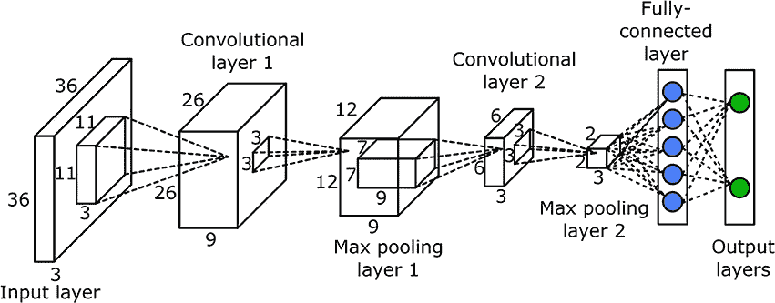
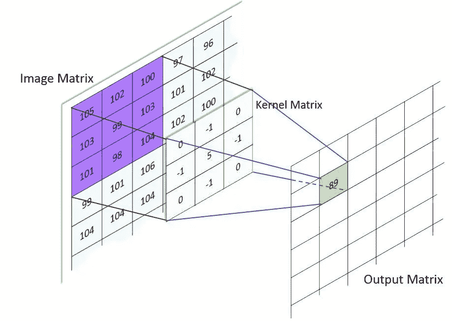
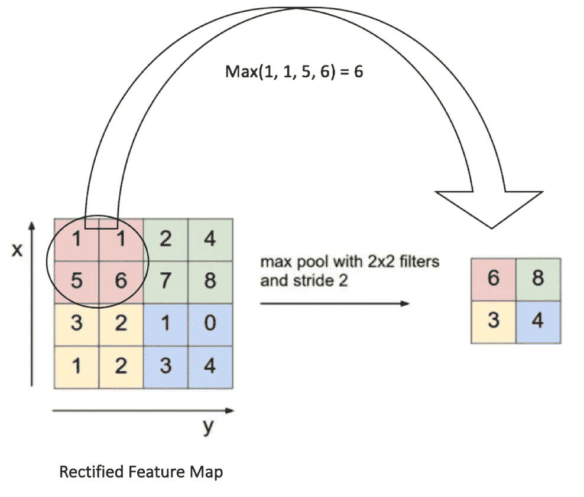

# 卷积神经网络的层

> 原文：<https://medium.com/analytics-vidhya/layers-of-a-convolutional-neural-network-168daddd2dd1?source=collection_archive---------16----------------------->

> 如果我们想让机器思考，我们需要教它们看。
> 
> ——费·李非，斯坦福大学人工智能研究员

在本系列的前一章中，我们简单介绍了卷积神经网络(CNN ),它是大多数计算机视觉算法的基本构建模块。在这一章中，我们将介绍构成我们日常 CNN 的重要层面。

CNN 不同层的轮廓[4]

# **卷积层**

卷积层最重要的功能是使用前一层的一组连接神经元来转换输入数据。它计算输入层中神经元区域和输出层中局部连接权重之间的点积。这提供了图层的最终输出体积。这项技术是通过一种叫做卷积的概念实现的。

卷积层[4]

## **卷积**

这是一种数学运算，它规定了两组信息结合在一起的性质。该操作也称为 CNN 的特征检测器，它对输入应用卷积核，并返回特征图作为输出。这是通过在输入数据上滑动内核并将内核与其边界内的数据段相乘来在特征图中创建单个条目来实现的。最后，沿着深度维度将每个过滤器的激活图堆叠在一起，以构建 3D 输出体积[1]。像任何其他神经网络模型一样，使用梯度下降进行参数优化。卷积层的主要组件如下:

1.  *过滤器:*这些是 CNN 架构参数之一，其学习对空间局部输入模式产生最强的激活，即它们将仅在模式出现在训练数据中时被激活。随着 CNN 深度的增加，观察到滤波器能够识别特征的非线性组合。
2.  *激活图:*在信息通过 CNN 向前传递期间，通过在输入体积的空间维度上滑动每个过滤器来计算激活图。如果神经元决定传递信息，就会得到一个数值。

## **超参数**

这些规定了来自卷积层的输出体积的空间排列和大小。以下是一些最重要的超参数:

1.  *滤镜尺寸:*它通常在空间上很小，并且拥有三个维度——宽度、高度和颜色通道。
2.  *输出深度:*控制卷积层中连接到输入体积中相同区域的神经元数量。
3.  *步幅:*这定义了每个应用的过滤器滑动速度。输出音量的深度与步幅值成反比。
4.  *补零:*它决定了输出体积的空间大小，在输出体积中优先保持输入体积的空间大小时非常有用。

# 汇集层

该图层有助于逐步减小数据表示的空间大小，从而防止过度拟合训练数据。这些通常包含在连续的卷积层之间，并使用最大运算在空间上调整输入数据的大小。池层没有任何可学习的参数，通常有零填充。

池层[4]

# 全连接层

该图层充当网络的输出图层，其输出体积维度为[1 x 1 x N]，其中 N 是要评估的输出类的数量。全连接层具有通用神经网络层参数和超参数。

在本文中，我们讨论了不同类型的层——卷积层、池层和卷积神经网络的全连接层，说明了每一层的重要性和效用。这结束了我们对 CNN 的部分。在本系列的后续章节中，我们将重点介绍不同种类的人工神经网络，如递归神经网络(RNNs)和长短期记忆网络，它们在自然语言处理和翻译领域有着独特的应用。

[1]谭耀辉和陈春生，2019。基于短语的分层 LSTM 网络图像字幕生成器。神经计算，333 页，第 86-100 页。

[2]帕特森，j .，2017。深度学习。第一版。由…编辑 O'Reilly 媒体公司。

[3]博登，m .，2002 年。递归神经网络和反向传播指南。达拉斯项目。

[4]Brilliant.org。(2020).*卷积神经网络|辉煌数学&科学维基*。[在线]可在 https://brilliant.org/wiki/convolutional-neural-network【2020 年 2 月 29 日访问】。