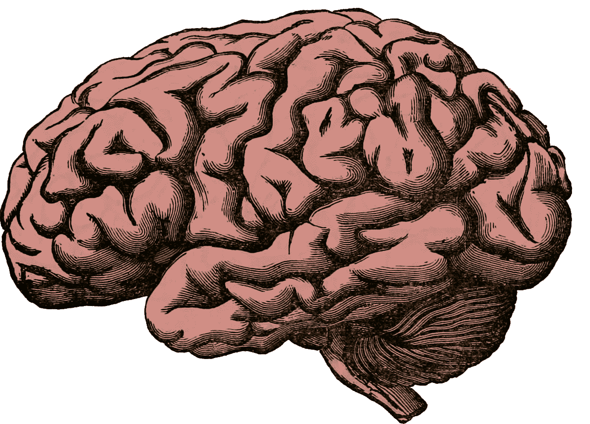
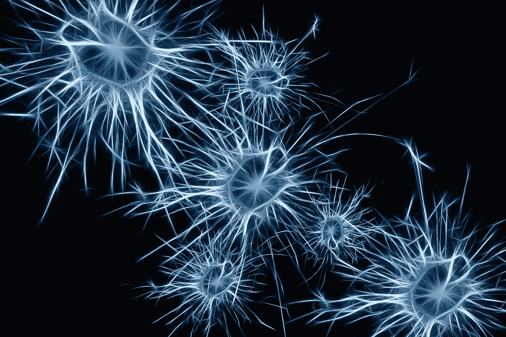
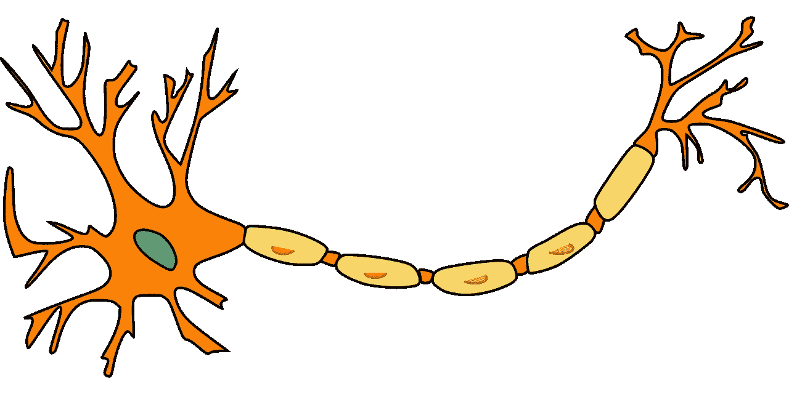
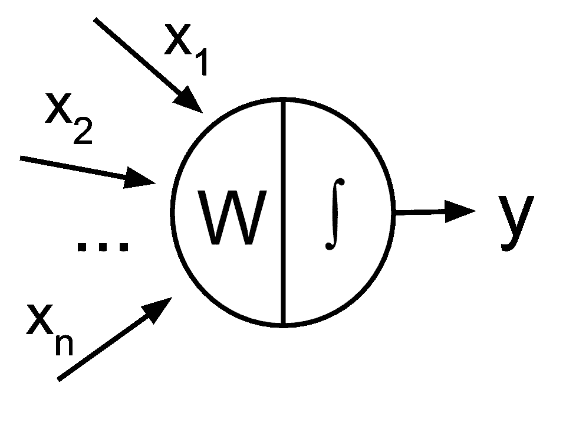
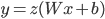
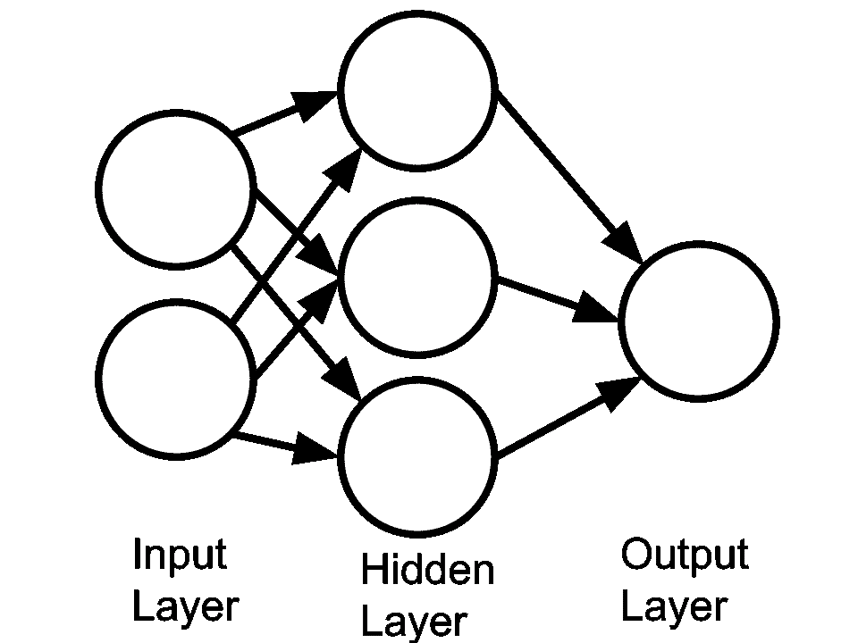

# 人工神经网络的通俗解释

> 原文：<https://medium.com/analytics-vidhya/layman-explanation-of-artificial-neural-networks-ac2b866b1544?source=collection_archive---------19----------------------->

随着人工智能在所有行业的爆炸式增长，深度学习已经成为许多重大突破的原因。但是对于非技术领域的人来说，深度学习到底是什么？

> *深度学习是一系列基于人工神经网络的机器学习模型。*

好了，我们刚刚描述了什么是深度学习。然而，该定义并没有定义人工神经网络(ANN)到底是什么。

# 类比

在研究什么是人工神经网络之前，最好先研究一下人脑是如何运作的。

图片由 [holdentrils](https://pixabay.com/users/holdentrils-297699/?utm_source=link-attribution&utm_medium=referral&utm_campaign=image&utm_content=512758) 来自 [Pixabay](https://pixabay.com/?utm_source=link-attribution&utm_medium=referral&utm_campaign=image&utm_content=512758)

我们的大脑是一台非常强大的机器。它使人能够运动，并处理来自周围环境的信息。此外，我们的大脑允许我们学习新的东西和习惯。

所有这些事情都是可能的，因为大脑由数十亿个神经元组成，相互发送信息。执行任务需要许多神经元。代表由几个神经元形成的网络。

图片来自 [Pixabay](https://pixabay.com/?utm_source=link-attribution&utm_medium=referral&utm_campaign=image&utm_content=1773922) 的 [Gerd Altmann](https://pixabay.com/users/geralt-9301/?utm_source=link-attribution&utm_medium=referral&utm_campaign=image&utm_content=1773922)

现在，信息是如何从一个神经元传递到另一个神经元的呢？

把我们的神经元放在下面。

来自 [Pixabay](https://pixabay.com/?utm_source=link-attribution&utm_medium=referral&utm_campaign=image&utm_content=296581) 的[Clker-Free-Vector-Images](https://pixabay.com/users/Clker-Free-Vector-Images-3736/?utm_source=link-attribution&utm_medium=referral&utm_campaign=image&utm_content=296581)的图像

左边的分支代表树突。树突负责从其他神经元接收化学反应(信息)，并将它们传输到另一端。此时，信息被发送到其他神经元。

当然，并不是所有的神经元在你想做某项特定任务时都会被激活。相反，神经元只有在达到某个阈值时才会激活。这被称为[动作电位](https://en.wikipedia.org/wiki/Action_potential)。

# 代表人工神经元

现在，上述类比如何与人工神经网络联系起来？好问题。

就像生物神经网络一样，人工神经网络由一系列人工神经元组成，以做出决策。

请注意，人工神经元在人工智能领域更广为人知的名称是感知器。那么这个感知器(人工神经元)到底是怎么工作的呢？以下面的图片为例。

人工神经元的基本结构。

与实际的神经元不同，感知器使用数学来计算输出。

在上图中，一系列输入被提供给感知器。然后，感知器将输入与其权重相乘，得到一个中间输出。对于中间输出，我们通过一个函数发送它，该函数将返回一个范围从 0 到 1 的数字(或者其他一些阶跃函数)。这种功能被称为激活功能，相当于生物神经元的动作电位。

翻译上面的图像，我们得到感知器的以下等式:

对于那些熟悉统计学的人来说，这个方程看起来类似于另一种叫做[逻辑回归](https://en.wikipedia.org/wiki/Logistic_regression)的机器学习算法。事实上，感知器的等式与逻辑回归非常相似。

# 组合感知器

从上一节来看，感知器只是逻辑回归。虽然它们可以在一定程度上处理非线性数据集，但它们不能处理复杂的数据集，如图像。那现在怎么办？

在研究人员得出结论认为感知器本身对于复杂数据集来说太弱后不久，就遇到了这个问题。人们发现，一起使用多个感知器可以模拟更复杂的数据集。然后取一系列感知器，就可以形成一层。然后，一个层用来计算一系列输入和输出。您甚至可以将层堆叠在一起，以创建更复杂的模型。结果，你的模型看起来像一个神经网络。

三层神经网络

像生活中的所有事情一样，有几种类型的人工神经元可以用来表示非常复杂的模型。讨论每种类型超出了本文的范围。

# 从这里去哪里

人工神经网络是许多领域中许多深度学习概念和应用的主干。现在，我们该何去何从？

有几种方法可以解决这个问题:

*   如果你对学习更多关于神经网络的知识(以及深度学习的扩展)不感兴趣，希望这篇文章给你一个关于什么是神经网络的想法。
*   如果你对神经网络感兴趣，但只是想把它应用到你的行业中，那就阅读一下关于它们如何在行业中实现的最新消息。如果可能的话，请深度学习方面的专家来帮助解释和实施你的想法。
*   如果您想亲自实现神经网络，但对理论方面不感兴趣，请学习更多关于神经网络的类型以及实现它们的框架。Tensorflow 2.0 最近发布，允许用户轻松创建复杂的神经网络。
*   如果你对推进深度学习和人工智能领域感兴趣，你最好去读研究生或获得人工智能博士学位。

*关于神经网络的更多技术解释，请参考我的一篇* [*旧帖*](https://josephwoolf.com/what-are-neural-networks/) *。*

*原载于 2019 年 10 月 21 日*[*https://josephwoolf.com*](https://josephwoolf.com/layman-explanation-of-artificial-neural-networks/)*。*