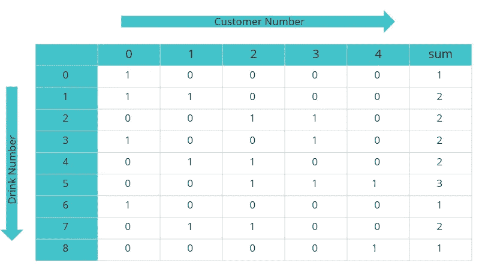

# 如何解决懒惰酒保问题:一个完整的算法与代码

> 原文：<https://medium.com/analytics-vidhya/lazy-bartender-problem-return-the-fewest-number-of-drinks-he-must-learn-in-order-to-satisfy-all-549777e83496?source=collection_archive---------0----------------------->

**问题陈述:**

在一个受欢迎的酒吧，每个顾客都有一套喜欢的饮料，并且会愉快地接受这一套中的任何饮料。例如，在以下情况中，客户 0 将对饮料 0、1、3 或 6 感到满意。

preferences = {
0: [0，1，3，6]，
1: [1，4，7]，
2: [2，4，7，5]，
3: [3，2，5]，
4: [5，8]
}
一个在这家酒吧工作的懒惰的酒保试图通过限制他必须记住的饮料配方来减少他的努力。给定如上的字典输入，返回他为了满足所有顾客而必须学习的最少数量的饮料。

对于上面的输入，答案将是 2，因为饮料 1 和 5 将满足每个人。
**举例:**

**输入类型:
参数 1:**
2D 数组，其中每行数字代表唯一的客户，每行值代表满足相应客户的饮料
**参数 2:**
饮料数量
**参数 3:**
客户数量。
**输出类型**:一个整数值，表示满足所有顾客的最少饮料数量。

**输入:**
{
{0，1，3，6}，
{1，4，7}，
{2，4，7，5}，
{3，2，5}，
{5，8}
}
，9，5
**输出** : 2

**算法:**

**a)** 创建一个名为 ar 的 2D 数组，大小为 m*(n+1)，其中 m 代表饮料的数量，n 代表顾客的数量。
**b)** 每行索引表示饮料的编号/id，每列索引表示顾客的编号/id。
**c)** 只要有饮料和顾客的组合，就用值 1 填充新创建的数组。
**d)** 例如，从输入中可以看出，客户 0 对饮料 0，1，3，6 感到满意，因此我们将 arr[0][0]，arr[1][0]，
arr[3][0]，arr[6][0]的值设置为 1。

填充数组 arr

我们在数组 arr 中创建的名为 sum 的额外列用于存储每种饮料满足的顾客数量。
**f)** 比如 arr[0][n+1]存储的是饮料 0 满足的顾客数，也就是 1。类似地，arr[1][n+1]表示
饮料 1 所满足的顾客数量为 2。
**g)** 遍历数组 arr 的最后一列，找到最大值及其对应的行索引。
**h)** 最大值为 3，其行索引为 5。
**i)** 上一步得到的行索引表示满足最大顾客数的饮料号。
**j)** 我们将计数变量增加到 1，因为我们发现一种编号为 5 的饮料可以满足名为 2、3、4 的总共 3 个客户
。
**k)** 这里是棘手的部分。我们还需要找到其他饮料来满足剩下的两个顾客 0 和 1。

剔除已经计算好的饮料和顾客

因此，我们删除数组 arr 中索引为 5 的行和索引为 2、3、4 的列。因为我们已经把这些饮料和顾客考虑进去了。

**m)** 用上一步剩下的行和列再次计算最后一列的值。我们开始吧，从步骤 g 到步骤 m 重复同样的过程，直到被遗漏的顾客数为零。

**注意:** **从技术上来说，要模拟行和列的移除，请遵循以下程序。**
**a)** 我们遍历索引为 5 的客户最多的行。(这是我们从步骤 g 中找到的)。
**b)** 如果遇到值 1，那么暂停行遍历，开始遍历列。
**c)** 例如，当遍历索引为 5 的行时，arr[5][2]的值为 1。所以暂停行遍历，开始遍历列中的
。即从 arr[0][2]到 arr[m][2]。
**d)** 遍历列时，如果发现值为 1，则使其为零，并将同一行最后一列中的值减 1。例如，arr[2][2]，arr[4][2]，arr[5][2]，arr[7][2]的值都是 1。因此，将它们设为 0，并将值 arr[2][n+1]，arr[4][n+1]，arr[5][n+1]，arr[7][n+1]减 1。
**e)** 最后从步骤 b 开始恢复行遍历，并按照程序进行，直到行结束。

代码(JAVA):

以上问题的完整 Java 代码