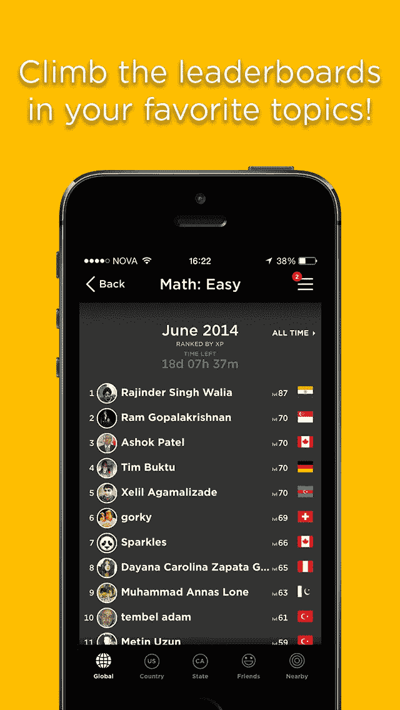

# 排行榜和 SQL 排名

> 原文：<https://medium.com/analytics-vidhya/leaderboards-and-rankings-with-sql-f0c7700d41d3?source=collection_archive---------1----------------------->

## **使用窗口功能**


丹尼尔·冯·阿彭在 [Unsplash](https://unsplash.com?utm_source=medium&utm_medium=referral) 上的照片

相信我，SQL 的窗口函数是我在数据库世界中见过的强大功能之一。当您想要查询分析信息时，它尤其出色。本文提供的语法基于 MySQL，MySQL 从版本 8 开始支持窗口函数。在 MySQL 8 之前，为了从数据库中获取一些分析数据，我必须编写大量的业务逻辑。

让我们通过一个例子来深入了解窗口函数，这样你就能很容易地掌握这个特性的威力。让我们为一个简单的游戏创建带有排名的排行榜。

# 方案

假设你正在开发一款类似 [QuizUp](https://www.quizup.com/en) 的网络游戏，它允许用户注册并玩游戏。注册用户可以参加主题下的测验。用户每次进行测验时都会得分，但排名时只会考虑最高分。用户将在每个主题内进行排名，在特定主题下，用户还将在国家/地区范围内进一步排名。例如，如果你在玩主题为' *Databases* 的游戏，那么你将拥有一个数据库主题排名(所有玩过这个主题的用户的全球排名)，以及一个你所在国家的排名(假设你在美国，你将拥有一个国家排名或洲排名)。

在仪表板(或应用程序)中，至少参加过一次特定主题下的测验的所有用户将显示在主题排行榜中。类似这样的。



图片提供:[https://iphone.qualityindex.com/games/7225323/quizup/](https://iphone.qualityindex.com/games/7225323/quizup/)

这是一个很好的用例，使用窗口函数来实现我们想要在仪表板上显示的内容。

# 我们的模式

让我们保持这个例子的模式简单。我们只有一个表叫做*分数*。它记录了每个用户每次参加测验时的分数，为了方便起见，我们假设根据游戏时登录的国家或预先给出的帐户信息，我们还记录了每个用户的国家。下表显示了我们将在主题 id*101*下排列的一组样本数据。

```
+---------+------------+----------+-------+
| user_id | country_id | topic_id | score |
+---------+------------+----------+-------+
|       4 | US         |      101 |    72 |
|       3 | CAN        |      101 |    30 |
|       6 | US         |      101 |    72 |
|       4 | US         |      101 |    49 |
|       1 | CAN        |      101 |    53 |
|       8 | US         |      101 |    67 |
|       5 | CAN        |      101 |     6 |
|       7 | CAN        |      101 |    87 |
|       2 | US         |      101 |    41 |
|       3 | CAN        |      101 |    76 |
+---------+------------+----------+-------+
```

为了简单起见，我们将只考虑两个国家(美国、加拿大)和八个用户(用户 id，1..8).

# 获取主题内的全局排名

## 第一步:汇总

首先，让我们汇总每个用户和团队的所有分数*。所以，我们将有最高分的每个用户对他/她的国家。*

```
**SELECT**
  user_id,
  country_id,
  MAX(score) AS highScore
**FROM** score
**WHERE** topic_id = 101
**GROUP** **BY** user_id, country_id
```

我们使用 *country_id* 进行分组，因为当我们要进行排名时，我们需要有 country *_id* 字段用于父查询。此外，如果游戏规则已经改变，以总分而不是最高分，简单地说，只有我们必须改变聚合函数从最大值到总和。

## 第二步:排名

现在，我们希望获得每个用户相对于其所属国家的排名。预期的结果应该如下所示。

```
+---------+------------+-------+-------------+
| user_id | country_id | score | **countryRank** |
+---------+------------+-------+-------------+
|       4 | US         |    72 |           **1** |
|       6 | US         |    72 |           **1** |
|       8 | US         |    67 |           **3** |
|       2 | US         |    41 |           **4** |
|       7 | CAN        |    87 |           **1** |
|       3 | CAN        |    76 |           **2** |
|       1 | CAN        |    53 |           **3** |
|       5 | CAN        |     6 |           **4** |
+---------+------------+-------+-------------+
```

现在让我们看看获得上述结果的查询。

```
**SELECT
  t.user_id,
  t.country_id,
  t.highScore,
  RANK() OVER (PARTITION BY t.country_id 
               ORDER BY t.highScore DESC) AS countryRank
FROM (**
  SELECT
    user_id,
    country_id,
    MAX(score) AS highScore
  FROM score
  WHERE topic_id = 101
  GROUP BY user_id, country_id
**) AS t
ORDER BY t.country_id DESC, countryRank**
```

在这里，我们所做的是，将步骤 1 中的查询作为新查询的派生表，将其包含在来自子句的**中。检查新的投影子句。**

```
RANK() OVER 
    (PARTITION BY t.country_id ORDER BY t.highScore DESC) 
    AS countryRank
```

这里我们将"*分区"*记录由 *country_id* 列组成。当数据库遍历每条记录时，它会保留当前记录所属的相应分区。在这种情况下，它是按国家划分的。同时，我们还指示引擎跟踪分区内记录的排序。所以我们说，我们要按计算出的`*highestScore*`降序排序。因此，得分最高的人会名列前茅。

此外，我们需要为分区提供一个聚合函数。因为我们需要 tanking，所以在 MySQL[中有相当多的选择，因为我们可以用几种不同的方式排名，但是有两种值得一提。](https://dev.mysql.com/doc/refman/8.0/en/window-function-descriptions.html)

*   **DENSE_RANK** :等级相同的行将具有相同的等级，并且没有间隔。即，考虑三个用户 U1、U2 和 U3 分别具有高分 80、80、78。使用 DENSE_RANK 将为三个用户提供排名 1、1、2。
*   **等级**:等级相同的行具有相同的等级，但是等级值可以有差距。即，如果两个用户获得相同的排名，比如第四，那么下一个用户将被排名第六，因为两个用户在第四，因此排名第五是不可用的。

我们选择排名，因为它(我相信)是排名的一般方式。

```
**RANK() OVER (PARTITION BY** country_id **ORDER BY** highScore **DESC)** ASteamRank
```

由于我们有两个用户在国家/地区美国具有相同的最高得分，因此他们将被排名为 1，并且由于排名功能，下一个最高得分的用户(即#8)将被排名为 3。如果我们选择了 DENSE_RANK 函数，用户#8 的排名将是 2。

查看分区查询中结果的差异。与 SQL 中的 group by 子句不同，分区仍然返回所有记录。

现在我们已经完成了一半。

# **获得全球排名**

如前所述，假设我们需要在仪表板中显示用户的全球排名以及个人的国家排名。首先，让我们看看对它的查询。

```
SELECT
  t.user_id,
  t.country_id,
  t.highScore,
  **RANK() OVER (ORDER BY** t.highScore **DESC)** AS globalRank
FROM (
  SELECT
    user_id,
    country_id,
    MAX(score) AS highScore
  FROM score
  WHERE topic_id = 101
  GROUP BY user_id, country_id
) AS tORDER BY globalRank
```

这与步骤 2 中的查询非常相似，只是我们删除了 partition 子句。这里发生的情况是，一旦我们删除了 partition 子句，查询将没有任何分区，而只有一个分区。对于该查询来说，唯一且默认的分区是整个表。因此，当应用*等级*时，它计算相对于整个表的等级。因此我们得到了全球排名。这意味着查询将对用户进行排名，而不考虑团队。下面是上述查询的结果。

```
+---------+------------+-------+------------+
| user_id | country_id | score | **globalRank** |
+---------+------------+-------+------------+
|       7 | CAN        |    87 |          **1** |
|       3 | CAN        |    76 |          **2** |
|       4 | US         |    72 |          **3** |
|       6 | US         |    72 |          **3** |
|       8 | US         |    67 |          **5** |
|       1 | CAN        |    53 |          **6** |
|       2 | US         |    41 |          **7** |
|       5 | CAN        |     6 |          **8** |
+---------+------------+-------+------------+
```

# 一石二鸟

在仪表板中，或者从您的业务层，您真的认为您想要调用两次来获得两个排名，然后为每个用户合并吗

答案是 ***不*** ！

你不会真的想写两个查询，一个获取团队排名，一个获取全局排名。事实上，**您可以在一个查询**中获得两个等级。

> 这就是窗口函数的妙处！

每个投影子句上可以有任意多的分区。一个分割子句不影响其他投影子句。他们是完全独立的。

因此，组合查询应该如下所示。

```
SELECT
  t.user_id,
  t.country_id,
  t.highScore,
  RANK() OVER (PARTITION BY t.country_id 
               ORDER BY t.highScore DESC) AS countryRank,
  RANK() OVER (ORDER BY t.highScore DESC) AS globalRank
FROM (
  SELECT
    user_id,
    country_id,
    MAX(score) AS highScore
  FROM score
  WHERE topic_id = 101
  GROUP BY user_id, country_id
) AS t
```

现在我们得到了想要的结果，输出如下，计算了两列中的两个等级。

```
+---------+------------+-------+-------------+------------+
| user_id | country_id | score | **countryRank** | **globalRank** |
+---------+------------+-------+-------------+------------+
|       7 | CAN        |    87 |           1 |          1 |
|       3 | CAN        |    76 |           2 |          2 |
|       4 | US         |    72 |           1 |          3 |
|       6 | US         |    72 |           1 |          3 |
|       8 | US         |    67 |           3 |          5 |
|       1 | CAN        |    53 |           3 |          6 |
|       2 | US         |    41 |           4 |          7 |
|       5 | CAN        |     6 |           4 |          8 |
+---------+------------+-------+-------------+------------+
```

您可能希望在您的应用程序或仪表板的排行榜页面上显示上述结果。但是，如果您必须在特定用户的个人资料页面中显示他/她的两个等级，该怎么办呢？

# 获取单个用户的两个排名

您可能会认为，通过只过滤该用户 id 的记录来获得单个用户的排名是微不足道的。用更简单的术语来说，只需在条件中添加一个 where 子句，`user_id = ?`在外部查询中的 order by 子句之前，对吗？

*错了！*

如果这样做，您将无法计算排名。对于所有用户来说，都会一直显示团队排名为*第 1*而全局排名为*第 1，*这显然是错误的*。*

这种行为的原因很简单。

> **在 SQL 世界中，WHERE 子句在 SELECT 子句之前执行。**

因此，当记录将要被分区时，这在投影内部，只有一个记录，并且它是用于被过滤的用户的记录。但是要计算排名，我们需要`highScores`为*每*用户*用户*。您既不能在派生表中添加用户筛选，也不能在外部查询中添加用户筛选。

那么，我们把过滤放在哪里呢？

*简单！*只需将此查询包含在另一个外部查询中，并从包含的查询中筛选出用户。见下文。

```
**SELECT
    *
FROM (**
  SELECT
    t.user_id,
    t.country_id,
    t.highScore,
    RANK() OVER (PARTITION BY t.country_id 
                 ORDER BY t.highScore DESC) AS countryRank,
    RANK() OVER (ORDER BY t.highScore DESC) AS globalRank
  FROM (
    SELECT
      user_id,
      country_id,
      MAX(score) AS highScore
    FROM score
    WHERE topic_id = 101
    GROUP BY user_id, country_id
  ) AS t
**) AS rt
WHERE
    rt.user_id = ?**
```

该查询将返回正确排序的单个用户记录。例如，制作`rt.user_id = 8`将返回下面的结果。

```
+---------+------------+-------+-------------+------------+
| user_id | country_id | score | countryRank | globalRank |
+---------+------------+-------+-------------+------------+
|       8 | US         |    67 |           3 |          5 |
+---------+------------+-------+-------------+------------+
```

上述查询的三个深度显示了结果转换获得排名的三个阶段。即

1.  ***汇总:*** 先汇总结果，
2.  ***排名:*** 然后应用排名，然后
3.  ***筛选:*** 筛选出需要的输出。

就是这样。

# 时间段内的排名

如果您想要计算某个特定时间段的排名，例如:本周或上周，那么我们唯一要做的事情就是将 where 子句附加到最内层的查询，如`ts BETWEEN <startWeek> AND <endWeek>`(假设您在 score 表的模式中有一个时间戳列)。

与用户过滤不同，在这种情况下，我们应该在计算排名之前只计算给定时间段的高分。这就是为什么我们需要将时间范围过滤放在最里面的查询中。

```
SELECT
  t.user_id,
  t.country_id,
  t.highScore,
  RANK() OVER (PARTITION BY t.country_id 
               ORDER BY t.highScore DESC) AS countryRank,
  RANK() OVER (ORDER BY t.highScore DESC) AS globalRank
FROM (
  SELECT
    user_id,
    country_id,
    MAX(score) AS highScore
  FROM score
  WHERE topic_id = ? **AND ts BETWEEN ? AND ?**
  GROUP BY user_id, country_id
) AS t
```

## 最终注释:

*   由于内部查询的深度，这个查询看起来非常低效，但是实际上，当您使用正确的索引时，*它不是*。由于评分表可以有多个用户、主题和国家的记录，我们应该有三个单独的索引用于*用户标识*、*主题标识*和*国家标识*列。
*   您可以用一个参数化的条件来替换条件`topic_id = 101`，比如`topic_id = ?`，这样查询就可以重用了。
*   上面的大多数查询都可以在任何 RDBMS 上工作，不需要任何改变，但是您需要关心 DB 对窗口查询的支持。比如 MySQL 版以后引入的窗口函数。