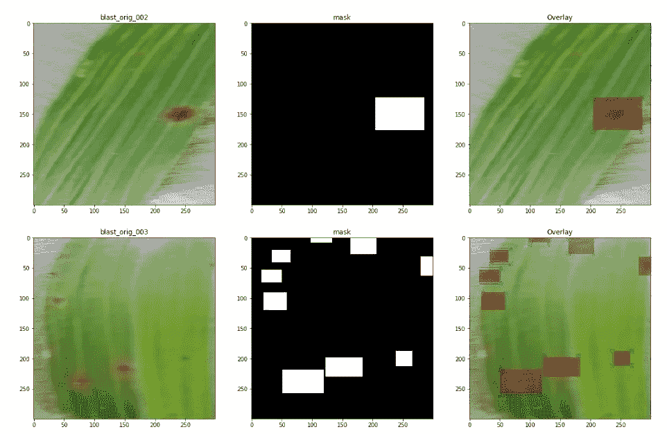

# 叶部疾病检测(使用 FR-CNN 和 UNet)

> 原文：<https://medium.com/analytics-vidhya/leaf-disease-detection-using-frcnn-fff55a537634?source=collection_archive---------3----------------------->

农业生产率是经济高度依赖的东西。这是植物中的疾病检测在农业领域中起重要作用的原因之一，因为植物中有疾病是很自然的。如果在这方面没有采取适当的措施，就会对工厂造成严重的影响，从而影响相应的产品质量、数量或生产率。

通过一些自动技术检测植物疾病是有益的，因为它减少了大农场的大量监测工作，并且在非常早期阶段本身就检测疾病的症状，即当它们出现在植物叶子上时。


来源:谷歌图片

因此，对于这项任务，我们将使用一个数据集，其中包含带有标记疾病类型的各种叶片图像。

# 使用的方法:-

(1)-更快的 RCNN
(2)- UNet

## **数据集描述:**

**所以第一步是克隆存储库。**

```
[https://github.com/aldrin233/RiceDiseases-DataSet](https://github.com/aldrin233/RiceDiseases-DataSet).git
```

现在，让我们首先分析我们正在处理哪种数据。
克隆 git repo 后，我们剩下三个文件夹——白叶枯病、稻瘟病、褐斑病。

目录的结构如下-

```
./Bacterial Leaf Blight
   ./Orig
   ./Rotated
./Blast
   ./Orig
   ./Rotated
./Brownspot
   ./Orig
   ./Rotated
```

因此，每个类别文件夹都有包含原始图像和旋转图像的子文件夹。

我们将疾病分为三类。让我们来看看每个类别中的几个例子，看看这些图片是什么样子的。


这里我们可以观察到:-

(a)-枯萎病类可以很容易地分类，因为它的标记分布在一个大的区域。

(b)-爆炸和褐色斑点可能很难区分，因为斑点很小，而且彼此非常相似。但是让我们深入研究一下。


(c)-与其他两个类别相比，这里的爆炸类别包含较少的图像。

(d)-枯萎类的包围盒总数少于其他两类。所以我们必须在后期进行数据扩充。

但是等等，在 git repo 中，他们也为我们提供了 xml 文件，其中包含每个点的边界框。让我们调查一下。


所以现在我们的目标是对每个点的类和包围盒进行分类。为了做到这一点，我们可能会想到使用 CNN，但是一个典型的 CNN 只能告诉你物体的类别，而不能告诉你它们的位置。所以我们将使用一个特殊的类 RCNN。

R-CNN 家族中有不同的算法(R-CNN、快速 R-CNN 和更快 R-CNN)。最新的是面具 R-CNN。R-CNN 使用选择性搜索从给定图像中提取一系列区域，然后检查这些框中是否包含物体。我们首先提取这些区域，对于每个区域，使用 CNN 提取特定的特征。最后，这些特征然后被用于检测物体。不幸的是，R-CNN 变得相当慢，因为这一过程涉及多个步骤。另一方面，快速 R-CNN 将整个图像传递给生成感兴趣区域的 ConvNet(而不是传递从图像中提取的区域)。此外，它不是使用三个不同的模型，而是使用单个模型，该模型从区域中提取特征，将它们分类到不同的类中，并返回边界框。


更快的 R-CNN

更快的 R-CNN 通过用区域提议网络(RPN)代替它来解决选择性搜索的问题。我们首先使用 ConvNet 从输入图像中提取特征映射，然后将这些映射传递给 RPN，RPN 返回对象建议。最后，对这些图进行分类并预测包围盒。

如果你想全面深入地了解它们，请点击此链接。

快速 R-CNN 算法检测图像中的对象所遵循的步骤:

1.  获取一个输入图像，并将其传递给 ConvNet，后者返回该图像的特征映射
2.  在这些特征地图上应用区域提议网络(RPN)并获得对象提议
3.  应用投资回报池层，将所有提案缩小到相同的大小
4.  最后，将这些建议传递给完全连接的层，以便对图像的任何预测边界框进行分类。

**什么是地区提案网？**

区域提议网络(RPN)的输出是将由分类器和回归器检查的一堆框/提议，以最终检查对象的出现。更准确的说，RPN 预测一个主播是背景还是前景的可能性，对主播进行提炼。换句话说，RPN 接受所有的参考框(锚),并输出一组好的对象建议。它通过为每个锚点提供两个不同的输出来实现这一点。
第一个是锚是物体的概率。如果你愿意，可以称之为“客观分数”。注意，RPN 并不关心它是什么对象的*类*，只关心它实际上看起来像一个对象(而不是背景)。我们将使用这个客观性分数来过滤掉第二阶段的坏预测。第二个输出是边界框回归，用于调整锚点以更好地适应它预测的对象。

## **后处理**

**非最大抑制**因为锚点通常会重叠，所以提议最终也会重叠在同一个对象上。为了解决重复建议的问题，我们使用一种简单的算法方法，称为非最大抑制(NMS)。NMS 采用按分数排序的提案列表，并在排序的列表上迭代，用具有更高分数的提案丢弃那些 IoU 大于某个预定义阈值的提案。

**利息集中地区**

在 RPN 步骤之后，我们有一堆没有指定类的对象提议。我们下一个要解决的问题是如何把这些包围盒分类到我们想要的类别中。

最简单的方法是接受每一个建议，对其进行裁剪，然后通过预先训练好的基础网络进行传递。然后，我们可以使用提取的特征作为普通图像分类器的输入。

## **基于区域的卷积神经网络**

基于区域的卷积神经网络(R-CNN)是更快的 R-CNN 管道中的最后一步。从图像中获得卷积特征图后，使用它来获得具有 RPN 的对象提议，并最终为这些提议中的每一个提取特征(通过 RoI Pooling)，我们最终需要使用这些特征进行分类。R-CNN 试图模仿分类 CNN 的最后阶段，其中全连接层用于输出每个可能的对象类的分数。


[https://tryo labs . com/blog/2018/01/18/faster-r-CNN-down-the-rabbit-hole-of-modern-object-detection/](https://tryolabs.com/blog/2018/01/18/faster-r-cnn-down-the-rabbit-hole-of-modern-object-detection/)

## 设置系统

在我们真正进入模型构建阶段之前，我们需要确保已经安装了正确的库和框架。运行此项目需要以下库:

*   熊猫
*   matplotlib
*   张量流
*   keras — 2.0.3
*   numpy
*   opencv-python
*   sklearn
*   h5py

## 实施:-

所以我们的第一步是克隆骨骼的官方存储库。

```
!git clone [https://github.com/kbardool/keras-frcnn.git](https://github.com/kbardool/keras-frcnn.git)
```

**数据清理:-**

(一)-一些图像文件没有它们对应的。xml 文件。所以它们被移除了。

(b)-一些图像具有一些疾病，但是没有出现分割框。xml 文件(即它们是空的)也被删除。

**数据预处理:-**

框架要求输入数据的格式应该是-

```
filepath,x1,y1,x2,y2,class_name
```

在哪里，

*   *文件路径*是训练图像的路径
*   *x1* 是包围盒的 xmin 坐标
*   *y1* 是包围盒的 ymin 坐标
*   *x2* 是包围盒的 xmax 坐标
*   *y2* 是包围盒的 ymax 坐标
*   *class_name* 是该边界框中的类的名称

因此，让我们准备数据集，并将所有文件拆分到 train_images 和 test_images 文件夹中。


现在我们的输入数据终于准备好了。现在让我们根据需要更改一些参数。

**数据扩充:-**

(a)-没有必要进行垂直翻转，因为已经有每个图像的垂直旋转图像。

(b)-以下扩充在 data_augment.py 中完成

```
-> Horizontal Flips
-> Rotate 90 degree Clockwise 
-> Rotate 90 degree Anti-Clockwise
-> Brightness correction
```

我用基本网络 resnet50 训练我的模型。你可以选择 VGG 或者任何你想要的电视网。
—首先，我在没有预训练权重的情况下训练我的网络 resnet，然后用预训练的权重进行训练。最后，我用预训练的重量得到了更好的结果。

**注意:-如果你没有任何 GPU 支持，请不要培训，因为这可能需要几个月才能完成。我为 GPU 1050 Ti 只跑了 2 天 62/1000 个纪元**

最终我实现了 95.21%的分类器准确率和 0.4356 的总损失。

如果你训练更多的纪元，你可以达到更好的准确度。

现在让我们看看我们的预测:-


爆炸级


类疫病


类褐斑病

所以我们可以看到我们的模型做了很好的下降工作。通过更多的训练，成绩可以进一步提高。

# UNet


[http://lmb . informatik . uni-freiburg . de/Publications/2015/rfb 15 a/](http://lmb.informatik.uni-freiburg.de/Publications/2015/RFB15a/)

U-net 是用于图像分割的编码器-解码器型网络架构。该架构的名称来自其独特的形状，其中来自下采样步骤中卷积部分的特征映射被馈送到上采样步骤中的上卷积部分。U-net 已广泛用于生物医学应用，以检测癌症、肾脏病变和跟踪细胞等。在数据有限的情况下(在某些情况下少于 50 个训练样本)，U-net 已被证明是非常强大的细分工具。使用 U-net 的另一个优点是它没有任何完全连接的层，因此对输入图像的大小没有限制。这个特征允许我们从不同大小的图像中提取特征，这是将深度学习应用于高保真生物医学成像数据的一个有吸引力的属性。U-net 能够处理非常少的数据，并且对输入图像大小没有特殊要求，这使得它成为图像分割任务的强有力候选。

在这里，我们将修改它，以用于叶部疾病检测。

U-net 的输入是调整了大小的 256X256 3 通道 RGB 图像，输出是预测的 256X256 1 通道掩码。

**数据准备:-**

*   这些图像保存在单独的 *train_images* 文件夹中。
*   来自的边界框。xml 文件被转换成掩模图像并存储在 *train_masks* 文件夹中。



**数据扩充:-**

进行了以下扩充:

*   翻转(垂直、水平、双向)
*   锐化图像
*   添加噪声

还根据列车图像的增强来增强遮罩。

**培训:-**


该模型在批量大小为 4 的 GTX 1050 Ti 上进行训练(由于 ResourceExhaustError 而无法走高)。它被训练了 10 个纪元。
我们使用自定义指标作为 ROI。我们在 keras 中定义了一个自定义目标函数来计算网络输出和目标掩码之间的近似交集(IoU)。对于涉及边界框的任务，IoU 是一种流行的度量标准。


[https://chatbotslife . com/small-u-net-for-vehicle-detection-9 EEC 216 F9 FD 6](https://chatbotslife.com/small-u-net-for-vehicle-detection-9eec216f9fd6)

根据测试数据，我们得到了大约 0.916 IOU。

# 结果:-


在这里，我们观察到，我们的模型在分割图像方面比 fast-RCNN 做得更好。

*   注意 UNet 是用于像素到像素的分割，但是在我们的例子中，没有像素方式的输入遮罩，所以我们从提供给我们的边界框中创建遮罩。
*   我们不能相信 IOU，因为我们的模型可能比预期的做得更好。
*   我们创建的遮罩包含不包含疾病部分的图像像素，并且一些遮罩甚至没有覆盖受疾病影响的整个像素。
*   如果我们看看我们的预测，那么我们的模型主要分割了疾病影响的部分，也分割了一些不在地面真相框中的像素。
*   我们的模型做得非常好，因为它已经学会识别受疾病影响的部分。
*   我们可以通过为更多的时代训练它，增加更多的技术，如果可能的话，还可以获得一个更好的标记数据集，来进一步使它准确。

进一步的实施细节请检查我的[库](https://github.com/Abhaya1998)。

# 结束注释

R-CNN 算法已经真正成为物体探测任务的游戏规则改变者。近年来，计算机视觉应用程序的数量突然激增，R-CNN 是其中大多数的核心。

Unet 证明了自己是一个优秀的图像分割架构。

*Keras_frcnn* 被证明是一个优秀的对象检测库。