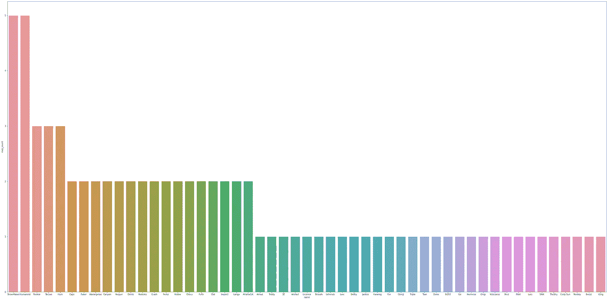

# 英雄联盟 WC 2019:分析

> 原文：<https://medium.com/analytics-vidhya/league-of-legends-wc-2019-analysis-25982b109c63?source=collection_archive---------39----------------------->


# 介绍

2019 年英雄联盟世界锦标赛是英雄联盟的第九个世界锦标赛，这是 Riot Games 开发的电子游戏电子竞技锦标赛。于 2019 年 10 月 2 日至 2019 年 11 月 10 日在柏林、马德里和巴黎举行。根据在中国、欧洲、北美、韩国和台湾/香港/澳门等地区巡回赛中的排名，来自 13 个地区的 24 支队伍获得了锦标赛的参赛资格，其中 12 支队伍必须通过季后赛才能进入主赛事。

让我们看看为什么 **FunPlus** Phoenix 赢得了这场比赛，我们可以得出一些关于比赛中选择脚轮的结论。

我将使用我自己的数据集，更多信息您可以在这里找到。

# 准备

数据集是我做的。你能在这儿得到它。

# 比赛

```
<class 'pandas.core.frame.DataFrame'>
RangeIndex: 81 entries, 0 to 80
Data columns (total 10 columns):
Unnamed: 0      81 non-null int64
team1           81 non-null object
team2           81 non-null object
winner          81 non-null object
date            81 non-null object
pbp_caster      81 non-null object
color_caster    81 non-null object
mvp             81 non-null object
blue            81 non-null object
red             81 non-null object
dtypes: int64(1), object(9)
memory usage: 6.5+ KB
```

让我们删除不必要的列**未命名:0**

让我们检查一下这张表。

```
team1           0
team2           0
winner          0
date            0
pbp_caster      0
color_caster    0
mvp             0
blue            0
red             0
dtype: int64
```

没有 NA 值，太好了！

另外，**日期**列有*对象*类型，让我们将其转换为*日期时间*。

现在，这张桌子的问题已经解决了。

# 演员

```
<class 'pandas.core.frame.DataFrame'>
RangeIndex: 1190 entries, 0 to 1189
Data columns (total 91 columns):
Unnamed: 0                 1190 non-null int64
date                       1190 non-null float64
side                       1190 non-null object
position                   1190 non-null object
player                     1190 non-null object
team                       1190 non-null object
champion                   1190 non-null object
ban1                       1190 non-null object
ban2                       1190 non-null object
ban3                       1190 non-null object
ban4                       1190 non-null object
ban5                       1185 non-null object
gamelength                 1190 non-null float64
result                     1190 non-null int64
k                          1190 non-null int64
d                          1190 non-null int64
a                          1190 non-null int64
teamkills                  1190 non-null int64
teamdeaths                 1190 non-null int64
doubles                    1190 non-null int64
triples                    1190 non-null int64
quadras                    1190 non-null int64
pentas                     1190 non-null int64
fb                         1190 non-null int64
fbassist                   1190 non-null int64
fbvictim                   1190 non-null int64
fbtime                     1190 non-null float64
kpm                        1190 non-null float64
okpm                       1190 non-null float64
ckpm                       1190 non-null float64
fd                         1190 non-null int64
fdtime                     1190 non-null float64
teamdragkills              1190 non-null int64
oppdragkills               1190 non-null int64
elementals                 1190 non-null int64
oppelementals              1190 non-null int64
firedrakes                 1190 non-null int64
waterdrakes                1190 non-null int64
earthdrakes                1190 non-null int64
airdrakes                  1190 non-null int64
elders                     1190 non-null int64
oppelders                  1190 non-null int64
herald                     1190 non-null int64
heraldtime                 0 non-null float64
ft                         1190 non-null int64
fttime                     1190 non-null float64
firstmidouter              1190 non-null int64
firsttothreetowers         1190 non-null int64
teamtowerkills             1190 non-null int64
opptowerkills              1190 non-null int64
fbaron                     1150 non-null float64
fbarontime                 1150 non-null float64
teambaronkills             1190 non-null int64
oppbaronkills              1190 non-null int64
dmgtochamps                1190 non-null int64
dmgtochampsperminute       1190 non-null float64
dmgshare                   1190 non-null float64
earnedgoldshare            1190 non-null float64
wards                      1190 non-null int64
wpm                        1190 non-null float64
wardshare                  1190 non-null float64
wardkills                  1190 non-null int64
wcpm                       1190 non-null float64
visionwards                1190 non-null int64
visionwardbuys             1190 non-null int64
visiblewardclearrate       1190 non-null object
invisiblewardclearrate     1190 non-null object
totalgold                  1190 non-null int64
earnedgpm                  1190 non-null float64
goldspent                  1190 non-null int64
gspd                       1190 non-null float64
minionkills                1190 non-null int64
monsterkills               1190 non-null int64
monsterkillsownjungle      1190 non-null int64
monsterkillsenemyjungle    1190 non-null int64
cspm                       1190 non-null float64
goldat10                   1190 non-null int64
oppgoldat10                1190 non-null int64
gdat10                     1190 non-null int64
goldat15                   1190 non-null int64
oppgoldat15                1190 non-null int64
gdat15                     1190 non-null int64
xpat10                     1190 non-null int64
oppxpat10                  1190 non-null int64
xpdat10                    1190 non-null int64
csat10                     1190 non-null int64
oppcsat10                  1190 non-null int64
csdat10                    1190 non-null int64
csat15                     1190 non-null int64
oppcsat15                  1190 non-null int64
csdat15                    1190 non-null int64
dtypes: float64(20), int64(59), object(12)
memory usage: 846.1+ KB
```

另一个不必要的列**未命名:0** 和 NA 列 **heraldtime**

# 冠军

```
<class 'pandas.core.frame.DataFrame'>
RangeIndex: 98 entries, 0 to 97
Data columns (total 32 columns):
Unnamed: 0               98 non-null int64
champion                 98 non-null object
sum_total                98 non-null int64
win_total                98 non-null int64
lose_total               98 non-null int64
winrate_total            98 non-null object
sum_blue_side            98 non-null int64
win_blue_side            98 non-null int64
lose_blue_side           98 non-null int64
winrate_blue_side        98 non-null object
sum_red_side             98 non-null int64
win_red_side             98 non-null int64
lose_red_side            98 non-null int64
winrate_red_side         98 non-null object
matches_less_25_min      98 non-null int64
win_lose_less_25_min     98 non-null object
winrate_less_25_min      98 non-null object
matches_25_to_30_min     98 non-null int64
win_lose_25_to_30_min    98 non-null object
winrate_25_30_min        98 non-null object
matches_30_35_min        98 non-null int64
win_lose_30_35_min       98 non-null object
winrate_30_35_min        98 non-null object
matches_35_40_min        98 non-null int64
win_lose_35_40_min       98 non-null object
winrate_35_40_min        98 non-null object
matches_40_45_min        98 non-null int64
win_lose_40_45_min       98 non-null object
winrate_40_45_min        98 non-null object
matches_more_45_min      98 non-null int64
win_lose_more_45_min     98 non-null object
winrate_more_45_min      98 non-null object
dtypes: int64(16), object(16)
memory usage: 24.6+ KB
```

```
champion                 0
sum_total                0
win_total                0
lose_total               0
winrate_total            0
sum_blue_side            0
win_blue_side            0
lose_blue_side           0
winrate_blue_side        0
sum_red_side             0
win_red_side             0
lose_red_side            0
winrate_red_side         0
matches_less_25_min      0
win_lose_less_25_min     0
winrate_less_25_min      0
matches_25_to_30_min     0
win_lose_25_to_30_min    0
winrate_25_30_min        0
matches_30_35_min        0
win_lose_30_35_min       0
winrate_30_35_min        0
matches_35_40_min        0
win_lose_35_40_min       0
winrate_35_40_min        0
matches_40_45_min        0
win_lose_40_45_min       0
winrate_40_45_min        0
matches_more_45_min      0
win_lose_more_45_min     0
winrate_more_45_min      0
dtype: int64
```

太好了，这张桌子没问题。

# 快速查找

23 个独特的赢家和 24 个独特的团队？有没有赢过的团队？让我们找出这支队伍。

**ahq 电竞俱乐部**唯一一场比赛没赢的队伍，有意思。

# 比赛



# 演员


# 分析

# 比赛

让我们先检查两边。


在蓝方，你可以更容易地对抗龙，所以也许 FunPlux Phoenix 队可以在 botside 附近对抗龙？

让我们检查一下这个队的损失。


凤凰队在红方输了 2 场比赛！

# 演员

至于以前的玩家视觉分析，我们可以说:

凤凰队也是团队技能的前五名

第一次男爵时间的前五名。

正如我们所看到的，FPX 在冠军的伤害统计上并没有排在前 15 位，

并且仅支持视力病房的前 15 名以及简单病房的相同情况。

如果我们进一步研究，就像我们在其他数据中看到的，除了金谷，我们找不到来自 FPX 的球员。

我可以断定，FPX 赢得了早期的比赛，并踩他们的对手与黄金差异。我们在顶级 cs 或者伤害统计中看不到他们，只能在男爵和团队技能中看到。

# 结论

正如我们所见，我们可以确定 FPX 在 2019 年世界杯上获胜的几个原因:

1.  早点跺脚
2.  早期第一男爵
3.  大量的打斗，导致大量的团杀和黄金。

我们只能祝贺这支球队以这样的数据取得了胜利，绕过了职业英雄联盟的所有“规则”，他们凭借团队合作的能力赢得了胜利。

至于脚轮 Riot Games 更喜欢 **Jatt** 、 **Medic** 、 **Drakos** 至于他们在 WC 2019 的主要脚轮。

# 注意

如果你喜欢这篇文章，请投赞成票。
你也可以查看我的*英雄联盟*数据集。

*   [WC 2019](https://www.kaggle.com/ilyadziamidovich/league-of-legends-world-championship-2019)
*   [LCL 2019](https://www.kaggle.com/ilyadziamidovich/league-of-legends-lcl-2019)

在这里你可以找到这篇文章的完整版本。