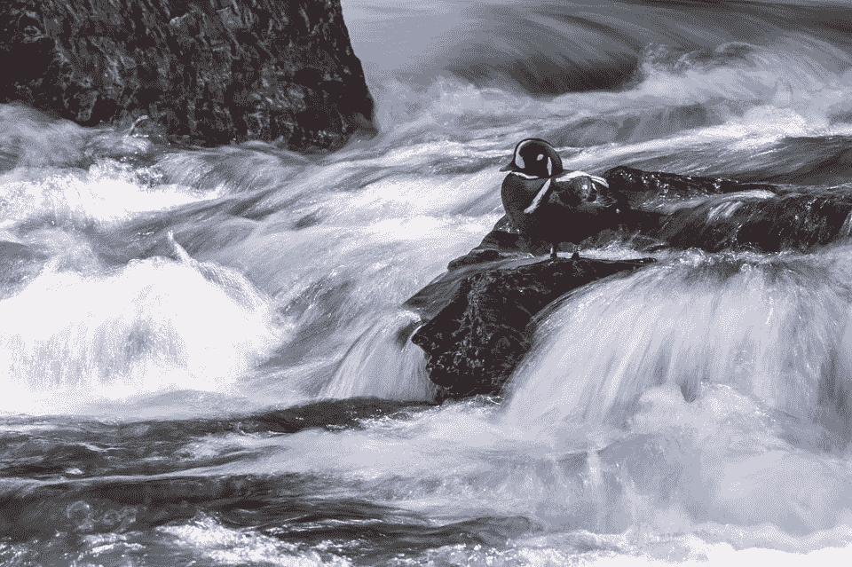
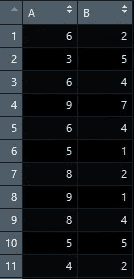
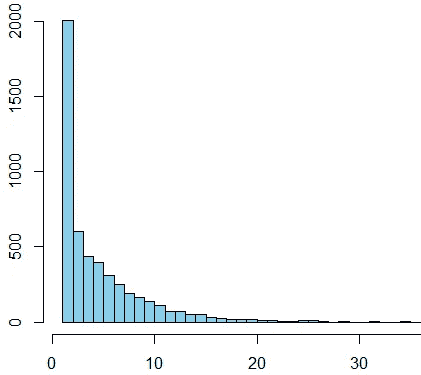

# 通过模拟发狂的鸭子来学习 R 中的循环。

> 原文：<https://medium.com/analytics-vidhya/learn-about-loops-in-r-by-simulating-delirious-ducks-1bc7fafd16ce?source=collection_archive---------21----------------------->

今天下午我在参观 538 时，遇到了这个奇妙的问题，题目是“你能追踪疯狂的鸭子吗？”。



岩石上的鸭子选择下一步行动。

简而言之，在一个池塘里有一个正方形的 3×3 排列的石头。两只鸭子从中间的岩石出发，每分钟独立地游向相邻的岩石，或者向上，或者向下，或者向左，或者向右，但从不斜着游。平均来说，他们要走多长时间才能在同一块岩石上再次相遇？

我开始想象这些岩石，左上角的岩石是#1，右边的是#2，依此类推，直到我到达右下角的岩石#9。鸭子从中间的岩石开始，所以那是岩石#5。从那里他们有四个去哪里的选择。当在边缘时，他们可能只有两个(如果鸭子在角落里)或三个选择(如岩石#8，鸭子可以游到岩石#7、#5 或#9)。

我认为这是一个很好的方法，可以通过编写几个循环在 R 中处理。我仔细考虑了几个选项，最后选择了一个我认为非常清晰简单，甚至可能是 r 中循环(一个长期流行的话题)的一个很好的演示。

**采样**

基本上每次鸭子起飞的时候，就好像是在抛硬币或扔骰子。一枚硬币可能只有两种结果，但对于我们的鸭子，有时有四种，有时三种，有时两种。我们需要根据鸭子的位置生成一个随机数。在 R 中生成随机数有很多种方法。我使用函数 sample()，因为我可以告诉 R 我想要一组数中的一个数。当我在岩石#5 上时，我希望它从岩石#2、#4、#6 或#8 中随机选择下一块岩石。当我在岩石#1 上时，我希望它从岩石#2 和#4 中随机选择一块岩石。因此，对于每个状态，我写:

```
sample(c(2,4), 1)
```

当鸭子在 1 号岩石上时。我将不得不重复这样做，所以我们需要一个循环。

**概述**

我从概述我的想法开始，然后由内向外构建。我将为鸭子可能在的九块石头中的每一块建立一个 if 语句。首先，我决定建立一个向量来绘制鸭子游泳的位置。为了确保循环结束，我创建了一个名为 minute 的变量，我简单地将它初始化为 1，然后每当鸭子改变位置时就加 1。我会让这个循环在 50 分钟以下运行，让鸭子游一会儿。我还初始化了一个名为 duck 的向量，它是鸭子所在位置的向量。因此，我会在每次循环时将鸭子的位置连接到鸭子向量上。我想象分钟=0，位置= 5；接着是分钟=1，位置=2，等等…点击直到我收集了一些数据:

```
minute<-1
Duck<-5while (minute<50){
  if (Duck[minute] == 1) {
    Duck<-c(Duck,sample(c(2,4), 1))
    minute<-minute+1}
  else if (Duck[minute] == 2) {
    Duck<-c(Duck,sample(c(1,3,5), 1))
    minute<-minute+1}
  else if (Duck[minute] == 3) {
    Duck<-c(Duck,sample(c(2,6), 1))
    minute<-minute+1}
  else if (Duck[minute] == 4) {
    Duck<-c(Duck,sample(c(1,5,7), 1))
    minute<-minute+1}
  else if (Duck[minute] == 5) {
    Duck<-c(Duck,sample(c(2,4,6,8), 1))
    minute<-minute+1}
  else if (Duck[minute] == 6) {
    Duck<-c(Duck,sample(c(3,5,9), 1))
    minute<-minute+1}
  else if (Duck[minute] == 7) {
    Duck<-c(Duck,sample(c(4,8), 1))
    minute<-minute+1}
  else if (Duck[minute] == 8) {
    Duck<-c(Duck,sample(c(5,7,9), 1))
    minute<-minute+1}
  else if (Duck[minute] == 9) {
    Duck<-c(Duck,sample(c(6,8), 1))
    minute<-minute+1}
}
```

这最终产生了一个名为 50 个数字的鸭子的向量，从我初始化它的数字 5 开始，看起来像 5，8，5，2，1，4，5，6…从这里你可以保留这个向量，对你的第二只鸭子重复这个过程，然后检查它们的数字匹配的第一个实例。因此，如果我运行鸭子#2 的模拟，它是 5，1，4，2，我会砍掉最初的 5，并看到在第 1 分钟，鸭子 1 在岩石 8 上，鸭子 2 在岩石 1 上，接着是岩石 5 和 4，然后是岩石 2 和 2。三分钟后的比赛。

我所做的只是将第一次鸭子的游程放入一个名为 A 的变量中，然后再执行一次该过程，并将该游程称为 B:

```
A<-Duckminute<-1
Duck<-5while (minute<50)....etc..etc...etc...
B<-Duck
```

我将两列绑定在一起，去掉第一行，然后检查哪一行是第一个匹配的行:

```
bound<-cbind(A,B)
bound<-bound[-1,]
Durations<-c(Durations, min(which(bound[,1]==bound[,2])))
```



你可以在上面的跑步中看到，我在第 10 分钟进行了第一场比赛。

为了得到一个好的平均值，我决定将这个过程运行 5000 次。每次循环的时候，我会把鸭子在同一块石头上相遇的持续时间发送给一个向量，就像上面一样，我会在每次循环的时候连接这个向量。以下是完整的代码:

```
i<-1
Durations<-vector()for (i in 1:5000){
minute<-1
Duck<-5while (minute<50){
  if (Duck[minute] == 1) {
    Duck<-c(Duck,sample(c(2,4), 1))
    minute<-minute+1}
  else if (Duck[minute] == 2) {
    Duck<-c(Duck,sample(c(1,3,5), 1))
    minute<-minute+1}
  else if (Duck[minute] == 3) {
    Duck<-c(Duck,sample(c(2,6), 1))
    minute<-minute+1}
  else if (Duck[minute] == 4) {
    Duck<-c(Duck,sample(c(1,5,7), 1))
    minute<-minute+1}
  else if (Duck[minute] == 5) {
    Duck<-c(Duck,sample(c(2,4,6,8), 1))
    minute<-minute+1}
  else if (Duck[minute] == 6) {
    Duck<-c(Duck,sample(c(3,5,9), 1))
    minute<-minute+1}
  else if (Duck[minute] == 7) {
    Duck<-c(Duck,sample(c(4,8), 1))
    minute<-minute+1}
  else if (Duck[minute] == 8) {
    Duck<-c(Duck,sample(c(5,7,9), 1))
    minute<-minute+1}
  else if (Duck[minute] == 9) {
    Duck<-c(Duck,sample(c(6,8), 1))
    minute<-minute+1}
}A<-Duckminute<-1
Duck<-5while (minute<50){
  if (Duck[minute] == 1) {
    Duck<-c(Duck,sample(c(2,4), 1))
    minute<-minute+1}
  else if (Duck[minute] == 2) {
    Duck<-c(Duck,sample(c(1,3,5), 1))
    minute<-minute+1}
  else if (Duck[minute] == 3) {
    Duck<-c(Duck,sample(c(2,6), 1))
    minute<-minute+1}
  else if (Duck[minute] == 4) {
    Duck<-c(Duck,sample(c(1,5,7), 1))
    minute<-minute+1}
  else if (Duck[minute] == 5) {
    Duck<-c(Duck,sample(c(2,4,6,8), 1))
    minute<-minute+1}
  else if (Duck[minute] == 6) {
    Duck<-c(Duck,sample(c(3,5,9), 1))
    minute<-minute+1}
  else if (Duck[minute] == 7) {
    Duck<-c(Duck,sample(c(4,8), 1))
    minute<-minute+1}
  else if (Duck[minute] == 8) {
    Duck<-c(Duck,sample(c(5,7,9), 1))
    minute<-minute+1}
  else if (Duck[minute] == 9) {
    Duck<-c(Duck,sample(c(6,8), 1))
    minute<-minute+1}
}B<-Duckbound<-cbind(A,B)
bound<-bound[-1,]
Durations<-c(Durations, min(which(bound[,1]==bound[,2])))
i<-i+1
}#DONE!!!!
```

最后，我希望可视化该过程，并获得 5000 次运行的平均值。对于这一轮，我得到的平均值为 4.8，直方图如下:



问题描述告诉你额外的学分是为三只或更多的鸭子建模。我希望通过了解我是如何从内向外构建循环过程的，你将能够轻松地进行自己的修改，并弄清楚三只或四只鸭子的行为。计算五只或更多的鸭子是没有用的，因为从中间的岩石只有四个选项，因此每次长度都是 1。

循环可能很难写。从一个最需要的小流程开始。想想地球在绕着太阳转的同时是如何自转的。如果你愿意的话，可以在年循环中嵌套一个日循环。在进行过程中测试您的循环，以确保组成循环的各个部分正常工作。