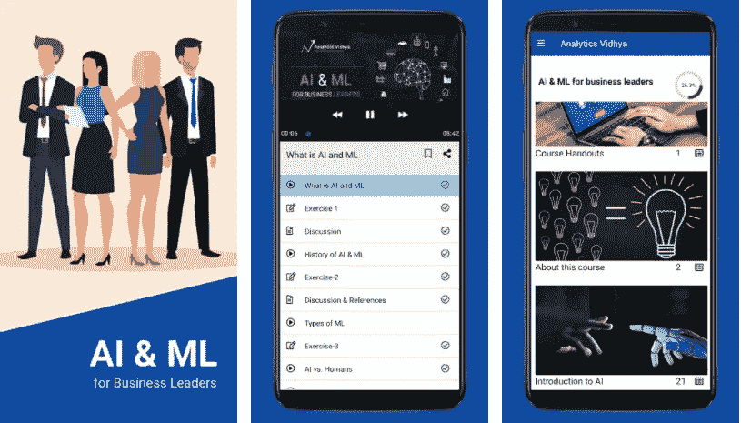

# 在旅途中学习 AI 和 ML！

> 原文：<https://medium.com/analytics-vidhya/learn-ai-and-ml-on-the-go-c4d9ae636671?source=collection_archive---------18----------------------->

# 介绍

> “我还在学习。”—米开朗基罗

正如伟大的米开朗基罗曾经说过的那样——“我仍在学习”。我们不都还在学习并且一直在继续学习吗？在当今世界，一切都是超级连接的，我们可以按需获得任何东西。活在这个世界上是多么激动人心的时刻啊！

人工智能和机器学习领域在过去十年里增长了数倍。如果你继续研究，你会发疯的！几乎时不时会有新的发展出现，使得上一个发展过时。

许多初学者脑海中出现的主要问题是-

*   如何在如此快节奏的环境下管理自己的学习？
*   如何从每天的日程中抽出时间来学习成长中的 AI 和 ML？

阅读完整的文章，了解如何回答问题，掌握人工智能和人工智能的艺术！

# 目录

1.  人工智能革命
2.  移动学习
3.  人工智能和 ML 简介
4.  商业领袖的人工智能和人工智能

# 人工智能革命

我们周围的世界正在飞速变化。个人助理、无人驾驶汽车、自动零售结账店等技术如今已成为现实。如果你用 5 到 10 年的时间考虑这些应用会怎么样。这似乎是一个幻想！但是为什么是现在？人工智能是如何取得如此大的发展的？

这个问题的基本答案包括三个原因-

*   数据生成
*   计算能力
*   保管费用

我们使用智能手机和其他电子设备的时间比与真人相处的时间还多。无论是脸书、Snapchat、Instagram 等社交媒体应用，还是在 YouTube、网飞等网站上观看电影和其他内容。这一趋势导致了数据生成的巨大繁荣。

让我们来看另一个有趣的图表，它显示了一年中硬盘驱动器的成本。

80 年代价值 100 万美元的东西现在只值几美分。这就是硬盘成本下降的水平！

最后，第三个趋势显示了计算成本下降了多少！

如您所见，对数据进行计算的成本已经大幅下降，而且还在继续下降。这开启了历史上不可能的机遇。

因此，从本质上说，我们正在以巨大的规模创建和存储数据，并可以以非常低的成本对其进行计算。

# 移动学习

人工智能应用的影响可能是巨大的，它可以在全球范围内获益。现在我们知道了人工智能和人工智能的重要性，作为初学者，我们如何确保我们的学习符合标准呢？

帮助我实现目标的一件事是在移动中学习。即使在疫情来袭时，我也注意到我用手机比用笔记本电脑或愚蠢的旧台式机舒服多了。用手机学习有一些好处-

1.  **随时随地学习** —无论是汽车座椅还是锅座，手机都是最容易接触到的工具。当你在办公室工作时很难学习，所以在休息时拿出你的手机开始学习。:)
2.  **身体奖励**——你是那种不喜欢坐着不动的人吗？在你的房间周围散散步。站起来，坐到不同的地方。学习要带着轻松的心态去做。
3.  **通用工具**——不是每个人都有能力在一个系统上学习。由于疫情，许多学校转向移动学习，迫使许多家长购买智能手机。让我们通过这个令人敬畏的设备采取一种更有效的方法来学习人工智能。

如果你完全是人工智能领域的新手，并且相信移动学习，我们为你准备了非常棒的免费资源。这些免费课程应用由拥有数十年行业经验的资深讲师策划和讲授！

# [人工智能和人工智能应用简介](https://play.google.com/store/apps/details?id=com.analyticsvidhya.aiandml&hl=en_IN)

人工智能(AI)和机器学习(ML)正在改变我们周围的世界。从功能到行业，AI 和 ML 正在颠覆我们的工作方式和运作方式。

人工智能革命来了-

*   你准备好将它融入你的技能组合了吗？
*   你如何在你目前的职位上利用它？
*   AI 和 ML 有哪些不同的方面？

在这个免费的课程应用程序中获得您所有问题和疑问的答案！

# [面向商业领袖的 AI 和 ML 应用](https://play.google.com/store/apps/details?id=com.analyticsvidhya.courses&hl=en_IN)

人工智能革命已经接管了企业场景，企业正在迅速转变其技术和分析堆栈，以包括机器学习。

你的公司准备好转型了吗？了解所有关于-

*   人工智能，人工智能的应用及其意义。
*   最常用的工具、技术和术语。
*   人工智能和人工智能在现实世界中的应用
*   如何在你的组织中建立人工智能能力？
*   人工智能的承诺和挑战。

“时间就是金钱”对于商业领袖来说再正确不过了。利用您在旅途中的时间，学习所有关于人工智能和人工智能的知识，让您的组织为数据革命做好准备。

***注意:*** *这些 app 在安卓设备上都有。你可以从 Google Play 商店*下载这些应用。

# 结束注释

机器学习领域的持续学习非常关键。我们必须让我们的过程对生活方式友好。

初学者可能很难获得正确的知识和指导，所以明智地选择你的资源。

请告诉我您对我们新推出的应用程序的想法和建议，以及您的体验如何。希望你喜欢。:)