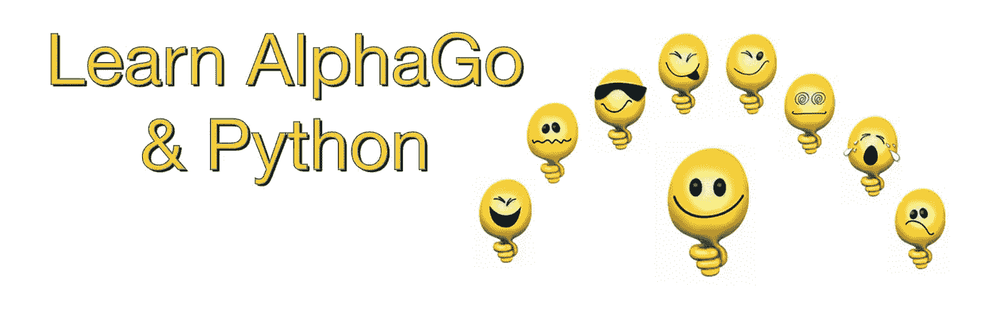
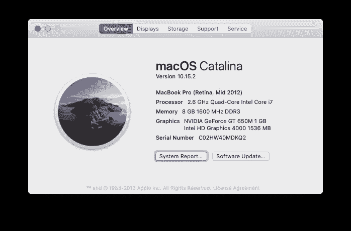
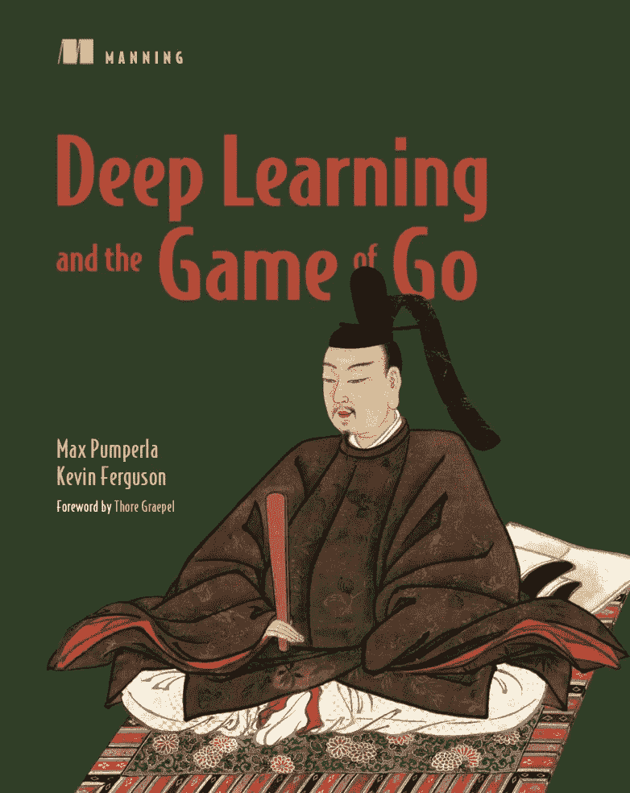

# 学习 AlphaGo 和 Python (06)

> 原文：<https://medium.com/analytics-vidhya/learn-alphago-python-06-1420783eb748?source=collection_archive---------9----------------------->



## 处理捕获和 Ko



在这台 mac 上测试的代码



从这本书中学到的代码

在 dlgo/goboard_slow.py 中创建类`GoString`

```
class GoString():
  def __init__(self, color, stones, liberties):
    self.color = color
    self.stones = set(stones)
    self.liberties = set(liberties) def remove_liberty(self, point):
    self.liberties.remove(point) def add_liberty(self, point):
    self.liberties.add(point) def merged_with(self, go_string):
    assert go_string.color == self.color
    combined_stones = self.stones | go_string.stones
    return GoString(self.color, combined_stones,
      (self.liberties | go_string.liberties) - combined_stones) @property
  def num_liberties(self):
    return len(self.liberties) def __eq__(self, other):
    return isinstance(other, GoString) and \
      self.color == other.color and \
      self.stones == other.stones and \
      self.liberties == other.liberties
```

到目前为止，我们一直在使用`Board`类的字典属性`_grid`来保存`Player`和`Point`的键值对。我们要将值类型更改为`GoString`并保持键类型不变(即仍为`Player`)。

dlgo/goboard_slow.py

```
import copy
from dlgo.gotypes import Playerclass Move():
  def __init__(self, point=None, is_pass=False, is_resign=False):
    assert (point is not None) ^ is_pass ^ is_resign
    self.point = point
    self.is_play = (self.point is not None)
    self.is_pass = is_pass
    self.is_resign = is_resign @classmethod
  def play(cls, point):
    return Move(point=point) @classmethod
  def pass_turn(cls):
    return Move(is_pass=True) @classmethod
  def resign(cls):
    return Move(is_resign=True)class Board():
  def __init__(self, num_rows, num_cols):
    self.num_rows = num_rows
    self.num_cols = num_cols
    self._grid = {} def place_stone(self, player, point):
    assert self.is_on_grid(point)
    assert self._grid.get(point) is None
    adjacent_same_color = []
    adjacent_opposite_color = []
    liberties = []
    for neighbor in point.neighbors():
      if not self.is_on_grid(neighbor):
        continue
      neighbor_string = self._grid.get(neighbor)
      if neighbor_string is None:
        liberties.append(neighbor)
      elif neighbor_string.color == player:
        if neighbor_string not in adjacent_same_color:
          adjacent_same_color.append(neighbor_string)
      else:
        if neighbor_string not in adjacent_opposite_color:
          adjacent_opposite_color.append(neightbor_string)
    new_string = GoString(player, [point], liberties)
    for same_color_string in adjacent_same_color:
      new_string = new_string.merged_with(same_color_string)
    for new_string_point in new_string.stones:
      self._grid[new_string_point] = new_string
    for other_color_string in adjacent_opposite_color:
      other_color_string.remove_liberty(point)
    for other_color_string in adjacent_opposite_color:
      if other_color_string.num_liberties == 0:
        self._remove_string(other_color_string) def _remove_string(self, string):
    for point in string.stones:
      for neighbor in point.neighbors():
        neighbor_string = self._grid.get(neighbor)
        if neighbor_string is None:
          continue
        if neighbor_string is not string:
          neighbor_string.add_liberty(point)
      self._grid[point] = None def is_on_grid(self, point):
    return 1 <= point.row <= self.num_rows and \
           1 <= point.col <= self.num_cols def get(self, point):
    string = self._grid.get(point)
    if string is None:
      return None
    return string.color def get_go_string(self, point):
    string = self._grid.get(point)
    if string is None:
      return None
    return stringclass GameState():
  def __init__(self, board, next_player, previous, move):
    self.board = board
    self.next_player = next_player
    self.previous_state = previous
    self.last_move = move def apply_move(self, move):
    if move.is_play:
      next_board = copy.deepcopy(self.board)
      next_board.place_stone(self.next_player, move.point)
    else:
      next_board = self.board
    return GameState(next_board, self.next_player.other, self, move) @classmethod
  def new_game(cls, board_size):
    if isinstance(board_size, int):
      board_size = (board_size, board_size)
    board = Board(*board_size)
    return GameState(board, Player.black, None, None) def is_over(self):
    if self.last_move is None:
      return False
    if self.last_move.is_resign:
      return True
    second_last_move = self.previous_state.last_move
    if second_last_move is None:
      return False
    return self.last_move.is_pass and second_last_move.is_pass def is_valid_move(self, move):
    if self.is_over():
      return False
    if move.is_pass or move.is_resign:
      return True
    return (
      self.board.get(move.point) is None
      )class GoString():
  def __init__(self, color, stones, liberties):
    self.color = color
    self.stones = set(stones)
    self.liberties = set(liberties) def remove_liberty(self, point):
    self.liberties.remove(point) def add_liberty(self, point):
    self.liberties.add(point) def merged_with(self, go_string):
    assert go_string.color == self.color
    combined_stones = self.stones | go_string.stones
    return GoString(self.color, combined_stones,
      (self.liberties | go_string.liberties) - combined_stones) @property
  def num_liberties(self):
    return len(self.liberties) def __eq__(self, other):
    return isinstance(other, GoString) and \
      self.color == other.color and \
      self.stones == other.stones and \
      self.liberties == other.liberties
```

让我们添加一些代码来测试 bot_v_bot.py 中的捕获。

```
from dlgo.agent import naive
from dlgo import goboard_slow
from dlgo import gotypes
import timeCOLS = 'ABCDEFGHJKLMNOPQRST'
STONE_TO_CHAR = {
  None: '. ',
  gotypes.Player.black: 'x ',
  gotypes.Player.white: 'o ',
}def print_move(player, move):
  if move.is_pass:
    move_str = 'passes'
  elif move.is_resign:
    move_str = 'resigns'
  else:
    move_str = '%s%d' % (COLS[move.point.col - 1], move.point.row)
  print('%s %s' % (player, move_str))def print_board(board):
  for row in range(board.num_rows, 0, -1):
    bump = " " if row <= 9 else ""
    line = []
    for col in range(1, board.num_cols + 1):
      stone = board.get(gotypes.Point(row=row, col=col))
      line.append(STONE_TO_CHAR[stone])
    print('%s%d %s' % (bump, row, ''.join(line)))
  print('   ' + ' '.join(COLS[:board.num_cols]))**def makeMove(game, r, c):
  return game.apply_move(goboard_slow.Move.play(gotypes.Point(r, c)))
def testCapture(game):
  print(chr(27) + "[2J")
  game = makeMove(game, 5, 10)
  game = makeMove(game, 6, 10)
  game = makeMove(game, 5, 11)
  game = makeMove(game, 6, 11)
  game = makeMove(game, 6, 9)
  game = makeMove(game, 1, 1)
  game = makeMove(game, 6, 12)
  game = makeMove(game, 2, 1)
  game = makeMove(game, 7, 10)
  game = makeMove(game, 3, 1)
  print_board(game.board)
  time.sleep(5.0)
  game = makeMove(game, 7, 11)
  print(chr(27) + "[2J")
  print_board(game.board)
  game = makeMove(game, 4, 1)
  return game**def main():
  board_size = 19
  bots = {
    gotypes.Player.black: naive.RandomBot(),
    gotypes.Player.white: naive.RandomBot(),
  }
  game = goboard_slow.GameState.new_game(board_size) **game = testCapture(game)** while not game.is_over():
    time.sleep(2.0) print(chr(27) + "[2J")
    print_board(game.board)
    print()
    bot_move = bots[game.next_player].select_move(game)
    print_move(game.next_player, bot_move)
    game = game.apply_move(bot_move)if __name__ == '__main__':
  main()
```

捕获前:

```
19 . . . . . . . . . . . . . . . . . . . 
18 . . . . . . . . . . . . . . . . . . . 
17 . . . . . . . . . . . . . . . . . . . 
16 . . . . . . . . . . . . . . . . . . . 
15 . . . . . . . . . . . . . . . . . . . 
14 . . . . . . . . . . . . . . . . . . . 
13 . . . . . . . . . . . . . . . . . . . 
12 . . . . . . . . . . . . . . . . . . . 
11 . . . . . . . . . . . . . . . . . . . 
10 . . . . . . . . . . . . . . . . . . . 
 9 . . . . . . . . . . . . . . . . . . . 
 8 . . . . . . . . . . . . . . . . . . . 
 7 . . . . . . . . . x . . . . . . . . . 
 6 . . . . . . . . x o o x . . . . . . . 
 5 . . . . . . . . . x x . . . . . . . . 
 4 . . . . . . . . . . . . . . . . . . . 
 3 o . . . . . . . . . . . . . . . . . . 
 2 o . . . . . . . . . . . . . . . . . . 
 1 o . . . . . . . . . . . . . . . . . . 
   A B C D E F G H J K L M N O P Q R S T
```

捕获后:

```
19 . . . . . . . . . . . . . . . . . . . 
18 . . . . . . . . . . . . . . . . . . . 
17 . . . . . . . . . . . . . . . . . . . 
16 . . . . . . . . . . . . . . . . . . . 
15 . . . . . . . . . . . . . . . . . . . 
14 . . . . . . . . . . . . . . . . . . . 
13 . . . . . . . . . . . . . . . . . . . 
12 . . . . . . . . . . . . . . . . . . . 
11 . . . . . . . . . . . . . . . . . . . 
10 . . . . . . . . . . . . . . . . . . . 
 9 . . . . . . . . . . . . . . . . . . . 
 8 . . . . . . . . . . . . . . . . . . . 
 7 . . . . . . . . . x x . . . . . . . . 
 6 . . . . . . . . x . . x . . . . . . . 
 5 . . . . . . . . . x x . . . . . . . . 
 4 . . . . . . . . . . . . . . . . . . . 
 3 o . . . . . . . . . . . . . . . . . . 
 2 o . . . . . . . . . . . . . . . . . . 
 1 o . . . . . . . . . . . . . . . . . . 
   A B C D E F G H J K L M N O P Q R S T
```

通过在 dlgo/goboard_slow.py 中的`GameState`类中添加函数`is_move_self_capture`来避免自拍。

```
class GameState():
  def __init__(self, board, next_player, previous, move):
    self.board = board
    self.next_player = next_player
    self.previous_state = previous
    self.last_move = move def apply_move(self, move):
    if move.is_play:
      next_board = copy.deepcopy(self.board)
      next_board.place_stone(self.next_player, move.point)
    else:
      next_board = self.board
    return GameState(next_board, self.next_player.other, self, move) @classmethod
  def new_game(cls, board_size):
    if isinstance(board_size, int):
      board_size = (board_size, board_size)
    board = Board(*board_size)
    return GameState(board, Player.black, None, None) def is_over(self):
    if self.last_move is None:
      return False
    if self.last_move.is_resign:
      return True
    second_last_move = self.previous_state.last_move
    if second_last_move is None:
      return False
    return self.last_move.is_pass and second_last_move.is_pass **def is_move_self_capture(self, player, move):
    if not move.is_play:
      return False
    next_board = copy.deepcopy(self.board)
    next_board.place_stone(player, move.point)
    new_string = next_board.get_go_string(move.point)
    return new_string.num_liberties == 0** def is_valid_move(self, move):
    if self.is_over():
      return False
    if move.is_pass or move.is_resign:
      return True
    return (
      self.board.get(move.point) is None **and
      not self.is_move_self_capture(self.next_player, move)**
      )
```

不要违反 Ko。在 dlgo/goboard_slow.py 中的`GameState`类中添加函数`does_move_violate_ko`。

```
class GameState():
  def __init__(self, board, next_player, previous, move):
    self.board = board
    self.next_player = next_player
    self.previous_state = previous
    self.last_move = movedef apply_move(self, move):
    if move.is_play:
      next_board = copy.deepcopy(self.board)
      next_board.place_stone(self.next_player, move.point)
    else:
      next_board = self.board
    return GameState(next_board, self.next_player.other, self, move)@classmethod
  def new_game(cls, board_size):
    if isinstance(board_size, int):
      board_size = (board_size, board_size)
    board = Board(*board_size)
    return GameState(board, Player.black, None, None)def is_over(self):
    if self.last_move is None:
      return False
    if self.last_move.is_resign:
      return True
    second_last_move = self.previous_state.last_move
    if second_last_move is None:
      return False
    return self.last_move.is_pass and second_last_move.is_passdef is_move_self_capture(self, player, move):
    if not move.is_play:
      return False
    next_board = copy.deepcopy(self.board)
    next_board.place_stone(player, move.point)
    new_string = next_board.get_go_string(move.point)
    return new_string.num_liberties == 0 **@property
  def situation(self):
    return (self.next_player, self.board)** **def does_move_violate_ko(self, player, move):
    if not move.is_play:
      return False
    next_board = copy.deepcopy(self.board)
    next_board.place_stone(player, move.point)
    next_situation = (player.other, next_board)
    past_state = self.previous_state
    while past_state is not None:
      if past_state.situation == next_situation:
        return True
      past_state = past_state.previous_state
    return False**def is_valid_move(self, move):
    if self.is_over():
      return False
    if move.is_pass or move.is_resign:
      return True
    return (
      self.board.get(move.point) is None and
      not self.is_move_self_capture(self.next_player, move) **and
      not self.does_move_violate_ko(self.next_player, move)**)
```

将 board_size 从 19 更改为 9，以测试游戏在白人玩家通过后自然结束。

```
🐍 python3 bot_v_bot.py

 9 x . x x x x x x x 
 8 x x x . x . x o o 
 7 o o x x x x x x o 
 6 o o o x . x x o o 
 5 . o . o x x o o o 
 4 o o o o o x x o . 
 3 o . o . o o o o o 
 2 . o o o o o o o o 
 1 o o o o o . o . o 
   A B C D E F G H JPlayer.white passes
🐍
```

[源代码](https://github.com/zhijunsheng/go-py/commits/develop)

[学习 AlphaGo & Python (01)](/@zhijunsheng/learn-alphago-python-01-96d360468042?source=friends_link&sk=3a5637ebac3916b285124eaa59407bd6)

[学习 AlphaGo & Python (02)](/@zhijunsheng/learn-alphago-python-02-8fd82d311f4d?source=friends_link&sk=e8e31cd2ca3fe97a29fe1d9129b0b54e)

[学习 AlphaGo & Python (03)](/@zhijunsheng/learn-alphago-python-03-c5a602fe584d?source=friends_link&sk=d96741134456aceb7b4745f70f92d4e3)

[学习 AlphaGo & Python (04)](/@zhijunsheng/learn-alphago-python-04-ed9d6713bcd6?sk=a9a0572ef5c2bf7b1bd36d92cabfd20c)

[学习 AlphaGo & Python (05)](/@zhijunsheng/learn-alphago-python-05-55b1f6979cc8?sk=3774fca42b4bddfd7128a57999086dcd)

[学习 AlphaGo & Python (06)](/@zhijunsheng/learn-alphago-python-06-1420783eb748?sk=6dc7c6e825b56b9d23e26b557e7514e9)

[学习 AlphaGo & Python(07)](/@zhijunsheng/learn-alphago-python-07-95635d5f278a?sk=1357b105fab52b220246c832fb72602f)