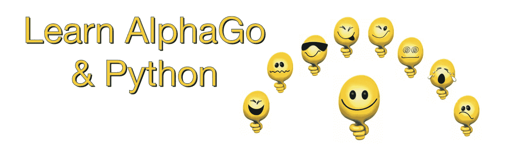
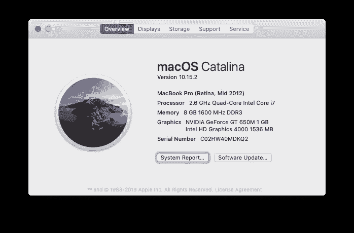
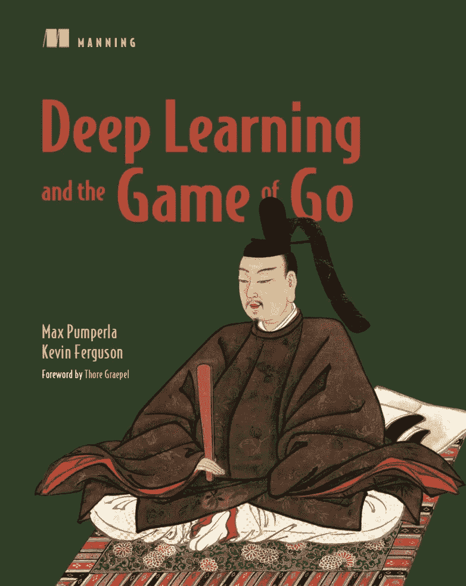

# 学习 AlphaGo 和 Python (07)

> 原文：<https://medium.com/analytics-vidhya/learn-alphago-python-07-95635d5f278a?source=collection_archive---------7----------------------->



## 人类对机器人，用 Zobrist 哈希加速游戏



在这台 mac 上测试的代码



从这本书中学到的代码

创建 dlgo/utils.py，这样我们就可以移出电路板印刷代码等。来自 bot_v_bot.py。

bot_v_bot.py:

```
from dlgo.agent import naive
from dlgo import goboard_slow
from dlgo import gotypes
from dlgo.utils import print_board, print_move
import timedef main():
  board_size = 9
  bots = {
    gotypes.Player.black: naive.RandomBot(),
    gotypes.Player.white: naive.RandomBot(),
  }
  game = goboard_slow.GameState.new_game(board_size)while not game.is_over():
    time.sleep(1.0)print(chr(27) + "[2J")
    print_board(game.board)
    print()
    bot_move = bots[game.next_player].select_move(game)
    print_move(game.next_player, bot_move)
    game = game.apply_move(bot_move)if __name__ == '__main__':
  main()
```

创建 dlgo/utils.py:

```
🐍 vim dlgo/utils.py
```

dlgo/utils.py

```
from dlgo import gotypes

COLS = 'ABCDEFGHJKLMNOPQRST'
STONE_TO_CHAR = {
  None: '. ',
  gotypes.Player.black: 'x ',
  gotypes.Player.white: 'o ',
}def print_move(player, move):
  if move.is_pass:
    move_str = 'passes'
  elif move.is_resign:
    move_str = 'resigns'
  else:
    move_str = '%s%d' % (COLS[move.point.col - 1], move.point.row)
  print('%s %s' % (player, move_str))def print_board(board):
  for row in range(board.num_rows, 0, -1):
    bump = " " if row <= 9 else ""
    line = []
    for col in range(1, board.num_cols + 1):
      stone = board.get(gotypes.Point(row=row, col=col))
      line.append(STONE_TO_CHAR[stone])
    print('%s%d %s' % (bump, row, ''.join(line)))
  print('   ' + ' '.join(COLS[:board.num_cols]))
```

创建 human_v_bot.py，这样人类就可以玩 bot 了。我们需要先在 dlgo/utils.py 中添加一个函数`point_from_coords(coords)`。

dlgo/utils.py

```
from dlgo import gotypes

COLS = 'ABCDEFGHJKLMNOPQRST'
STONE_TO_CHAR = {
  None: '. ',
  gotypes.Player.black: 'x ',
  gotypes.Player.white: 'o ',
}def print_move(player, move):
  if move.is_pass:
    move_str = 'passes'
  elif move.is_resign:
    move_str = 'resigns'
  else:
    move_str = '%s%d' % (COLS[move.point.col - 1], move.point.row)
  print('%s %s' % (player, move_str))def print_board(board):
  for row in range(board.num_rows, 0, -1):
    bump = " " if row <= 9 else ""
    line = []
    for col in range(1, board.num_cols + 1):
      stone = board.get(gotypes.Point(row=row, col=col))
      line.append(STONE_TO_CHAR[stone])
    print('%s%d %s' % (bump, row, ''.join(line)))
  print('   ' + ' '.join(COLS[:board.num_cols]))**def point_from_coords(coords):
  col = COLS.index(coords[0]) + 1
  row = int(coords[1:])
  return gotypes.Point(row=row, col=col)**🐍 vim human_v_bot.py
```

human_v_bot.py

```
from dlgo.agent import naive
from dlgo import goboard_slow
from dlgo import gotypes
from dlgo.utils import print_board, print_move, point_from_coordsdef main():
  board_size = 9
  game = goboard_slow.GameState.new_game(board_size)
  bot = naive.RandomBot()while not game.is_over():
    print(chr(27) + "[2J")
    print_board(game.board)
    if game.next_player == gotypes.Player.black:
      human_move = input('-- ')
      point = point_from_coords(human_move.strip())
      move = goboard_slow.Move.play(point)
    else:
      move = bot.select_move(game)
    print_move(game.next_player, move)
    game = game.apply_move(move)if __name__ == '__main__':
  main()
```

现在我们可以和我们的机器人比赛了。

```
🐍 python3 human_v_bot.py 9 . . . . . . . o . 
 8 . . . . . . . . . 
 7 . . . . . . . . . 
 6 . . . . . . . . . 
 5 . . . x . . . . . 
 4 . . . . . . . . . 
 3 . . . . . . . . . 
 2 . . . . . . . . . 
 1 . . . . . . . . . 
   A B C D E F G H J
-- G4
```

创建 zobrist 散列来提高性能。将 dlgo/goboard_slow.py 重命名为 dlgo/goboard.py

```
🐍 mv dlgo/goboard_slow.py dlgo/goboard.py
```

创建 generate_zobrist_hashes.py 生成 zobrist hash，保存在文件 dlgo/zobrist.py 中，有 19 * 19 * 2 = 722 个 hash 条目。

```
🐍 vim generate_zobrist_hashes.py
🐍 python3 generate_zobrist_hashes.py > dlgo/zobrist.py
🐍 wc -l dlgo/zobrist.py 
     730 dlgo/zobrist.py
```

generate_zobrist_hashes.py

```
import random

from dlgo.gotypes import Player, Pointdef to_python(player_state):
  if player_state is None:
    return 'None'
  if player_state == Player.black:
    return Player.black
  return Player.whiteMAX63 = 0x7ffffffffffffffftable = {}
empty_board = 0
for row in range(1, 20):
  for col in range(1, 20):
    for state in (Player.black, Player.white):
      code = random.randint(0, MAX63)
      table[Point(row, col), state] = codeprint('from .gotypes import Player, Point')
print('')
print("__all__ = ['HASH_CODE', 'EMPTY_BOARD']")
print('')
print('HASH_CODE = {')
for (pt, state), hash_code in table.items():
  print(' (%r, %s): %r,' % (pt, to_python(state), hash_code))
print('}')
print('')
print('EMPTY_BOARD = %d' % (empty_board,))
```

显示 dlgo/zobrist.py 的前 20 行:

```
🐍 head -n 20 dlgo/zobrist.py
```

dlgo/zobrist.py 的前 20 行:

```
from .gotypes import Player, Point__all__ = ['HASH_CODE', 'EMPTY_BOARD']HASH_CODE = {
 (Point(row=1, col=1), Player.black): 1743318457860286132,
 (Point(row=1, col=1), Player.white): 6077592620268640577,
 (Point(row=1, col=2), Player.black): 5247304070065423072,
 (Point(row=1, col=2), Player.white): 3396283731204976049,
 (Point(row=1, col=3), Player.black): 8022707334311970093,
 (Point(row=1, col=3), Player.white): 2105848293139671387,
 (Point(row=1, col=4), Player.black): 1699706885907749284,
 (Point(row=1, col=4), Player.white): 3230500686802259798,
 (Point(row=1, col=5), Player.black): 7389518629523105701,
 (Point(row=1, col=5), Player.white): 7464805636137369601,
 (Point(row=1, col=6), Player.black): 959081238933504817,
 (Point(row=1, col=6), Player.white): 6047429569262711179,
 (Point(row=1, col=7), Player.black): 6961206778848968522,
 (Point(row=1, col=7), Player.white): 4609973287293947835,
 (Point(row=1, col=8), Player.black): 7590471621530264626,
```

显示 dlgo/zobrist.py 的最后 20 行:

```
🐍 tail -n 20 dlgo/zobrist.py
```

dlgo/zobrist.py 的最后 20 行:

```
 (Point(row=19, col=11), Player.white): 7731002159384008752,
 (Point(row=19, col=12), Player.black): 8926271898120833506,
 (Point(row=19, col=12), Player.white): 3737940356998393611,
 (Point(row=19, col=13), Player.black): 6855143523350797896,
 (Point(row=19, col=13), Player.white): 3998144684427552885,
 (Point(row=19, col=14), Player.black): 1583619279007959424,
 (Point(row=19, col=14), Player.white): 8656479320519039671,
 (Point(row=19, col=15), Player.black): 7450373251714384625,
 (Point(row=19, col=15), Player.white): 1431220503631063432,
 (Point(row=19, col=16), Player.black): 3445681469884545256,
 (Point(row=19, col=16), Player.white): 1266150490074752899,
 (Point(row=19, col=17), Player.black): 2266936888251877784,
 (Point(row=19, col=17), Player.white): 2683496064820486440,
 (Point(row=19, col=18), Player.black): 8082726413353721878,
 (Point(row=19, col=18), Player.white): 6349636703857523885,
 (Point(row=19, col=19), Player.black): 8589908489541376170,
 (Point(row=19, col=19), Player.white): 6874551449332124093,
}EMPTY_BOARD = 0
```

将 dlgo/agent/naive.py 中的“dlgo.goboard_slow”改为“dlgo.goboard”。

```
🐍 git diff dlgo/agent/naive.py 
diff --git a/dlgo/agent/naive.py b/dlgo/agent/naive.py
index 642957f..bfcc81a 100644
--- a/dlgo/agent/naive.py
+++ b/dlgo/agent/naive.py
@@ -2,7 +2,7 @@ import random
 from dlgo.agent.base import Agent
 from dlgo.agent.helpers import is_point_an_eye
 from dlgo import gotypes
-from dlgo.goboard_slow import Move
+from dlgo.goboard import Move

 class RandomBot(Agent):
   def select_move(self, game_state):
🐍
```

在 dlgo/goboard.py 中使用 zobrist.py 哈希。

```
import copy
from dlgo.gotypes import Player
from dlgo import zobristclass Move():
  def __init__(self, point=None, is_pass=False, is_resign=False):
    assert (point is not None) ^ is_pass ^ is_resign
    self.point = point
    self.is_play = (self.point is not None)
    self.is_pass = is_pass
    self.is_resign = is_resign @classmethod
  def play(cls, point):
    return Move(point=point) @classmethod
  def pass_turn(cls):
    return Move(is_pass=True) @classmethod
  def resign(cls):
    return Move(is_resign=True)class Board():
  def __init__(self, num_rows, num_cols):
    self.num_rows = num_rows
    self.num_cols = num_cols
    self._grid = {}
    **self._hash = zobrist.EMPTY_BOARD** def place_stone(self, player, point):
    assert self.is_on_grid(point)
    assert self._grid.get(point) is None
    adjacent_same_color = []
    adjacent_opposite_color = []
    liberties = []
    for neighbor in point.neighbors():
      if not self.is_on_grid(neighbor):
        continue
      neighbor_string = self._grid.get(neighbor)
      if neighbor_string is None:
        liberties.append(neighbor)
      elif neighbor_string.color == player:
        if neighbor_string not in adjacent_same_color:
          adjacent_same_color.append(neighbor_string)
      else:
        if neighbor_string not in adjacent_opposite_color:
          adjacent_opposite_color.append(neighbor_string)
    new_string = GoString(player, [point], liberties) for same_color_string in adjacent_same_color:
      new_string = new_string.merged_with(same_color_string)
    for new_string_point in new_string.stones:
      self._grid[new_string_point] = new_string **self._hash ^= zobrist.HASH_CODE[point, player]** for other_color_string in adjacent_opposite_color:
      **replacement = other_color_string.without_liberty(point)
      if replacement.num_liberties:
        self._replace_string(replacement)
      else:
        self._remove_string(other_color_string)** **def _replace_string(self, new_string):
    for point in new_string.stones:
      self._grid[point] = new_string** def _remove_string(self, string):
    for point in string.stones:
      for neighbor in point.neighbors():
        neighbor_string = self._grid.get(neighbor)
        if neighbor_string is None:
          continue
        **if neighbor_string is not string:
          self._replace_string(neighbor_string.with_liberty(point))
      self._grid[point] = None** **self._hash ^= zobrist.HASH_CODE[point, string.color]** def is_on_grid(self, point):
    return 1 <= point.row <= self.num_rows and \
           1 <= point.col <= self.num_cols def get(self, point):
    string = self._grid.get(point)
    if string is None:
      return None
    return string.color def get_go_string(self, point):
    string = self._grid.get(point)
    if string is None:
      return None
    return string **def zobrist_hash(self):
    return self._hash**class GameState():
  def __init__(self, board, next_player, previous, move):
    self.board = board
    self.next_player = next_player
    self.previous_state = previous
    if self.previous_state is None:
      self.previous_states = frozenset()
    else:
      self.previous_states = frozenset(previous.previous_states |
        {(previous.next_player, previous.board.zobrist_hash())})
    self.last_move = move def apply_move(self, move):
    if move.is_play:
      next_board = copy.deepcopy(self.board)
      next_board.place_stone(self.next_player, move.point)
    else:
      next_board = self.board
    return GameState(next_board, self.next_player.other, self, move) @classmethod
  def new_game(cls, board_size):
    if isinstance(board_size, int):
      board_size = (board_size, board_size)
    board = Board(*board_size)
    return GameState(board, Player.black, None, None) def is_over(self):
    if self.last_move is None:
      return False
    if self.last_move.is_resign:
      return True
    second_last_move = self.previous_state.last_move
    if second_last_move is None:
      return False
    return self.last_move.is_pass and second_last_move.is_pass def is_move_self_capture(self, player, move):
    if not move.is_play:
      return False
    next_board = copy.deepcopy(self.board)
    next_board.place_stone(player, move.point)
    new_string = next_board.get_go_string(move.point)
    return new_string.num_liberties == 0 def does_move_violate_ko(self, player, move):
    if not move.is_play:
      return False
    next_board = copy.deepcopy(self.board)
    next_board.place_stone(player, move.point)
    **next_situation = (player.other, next_board.zobrist_hash())
    return next_situation in self.previous_states** def is_valid_move(self, move):
    if self.is_over():
      return False
    if move.is_pass or move.is_resign:
      return True
    return (
      self.board.get(move.point) is None and
      not self.is_move_self_capture(self.next_player, move) and
      not self.does_move_violate_ko(self.next_player, move))class GoString():
  def __init__(self, color, stones, liberties):
    self.color = color
    self.stones = frozenset(stones)
    self.liberties = frozenset(liberties) def without_liberty(self, point):
    new_liberties = self.liberties - set([point])
    return GoString(self.color, self.stones, new_liberties) def with_liberty(self, point):
    new_liberties = self.liberties | set([point])
    return GoString(self.color, self.stones, new_liberties) def merged_with(self, go_string):
    assert go_string.color == self.color
    combined_stones = self.stones | go_string.stones
    return GoString(self.color, combined_stones,
      (self.liberties | go_string.liberties) - combined_stones) @property
  def num_liberties(self):
    return len(self.liberties) def __eq__(self, other):
    return isinstance(other, GoString) and \
      self.color == other.color and \
      self.stones == other.stones and \
      self.liberties == other.liberties
```

玩机器人大战机器人看看性能提高。

```
🐍 python3 bot_v_bot.py 9 . x x o o o o o o 
 8 x x x o o . o . o 
 7 x x . x o o x o o 
 6 . x x x x x x o o 
 5 x x x o o o o o . 
 4 x . x x o x o o o 
 3 . x x x x x o . o 
 2 x x x x x o o o o 
 1 x . x . x o o o . 
   A B C D E F G H JPlayer.white passes
🐍
```

[源代码](https://github.com/zhijunsheng/go-py/commits/develop)

[学习 AlphaGo & Python (01)](/@zhijunsheng/learn-alphago-python-01-96d360468042?source=friends_link&sk=3a5637ebac3916b285124eaa59407bd6)

[学习 AlphaGo & Python (02)](/@zhijunsheng/learn-alphago-python-02-8fd82d311f4d?source=friends_link&sk=e8e31cd2ca3fe97a29fe1d9129b0b54e)

[学习 AlphaGo & Python (03)](/@zhijunsheng/learn-alphago-python-03-c5a602fe584d?source=friends_link&sk=d96741134456aceb7b4745f70f92d4e3)

[学习 AlphaGo & Python (04)](/@zhijunsheng/learn-alphago-python-04-ed9d6713bcd6?sk=a9a0572ef5c2bf7b1bd36d92cabfd20c)

[学习 AlphaGo & Python (05)](/@zhijunsheng/learn-alphago-python-05-55b1f6979cc8?sk=3774fca42b4bddfd7128a57999086dcd)

[学习 AlphaGo & Python (06)](/@zhijunsheng/learn-alphago-python-06-1420783eb748?sk=6dc7c6e825b56b9d23e26b557e7514e9)

[学习 AlphaGo & Python(07)](/@zhijunsheng/learn-alphago-python-07-95635d5f278a?sk=1357b105fab52b220246c832fb72602f)