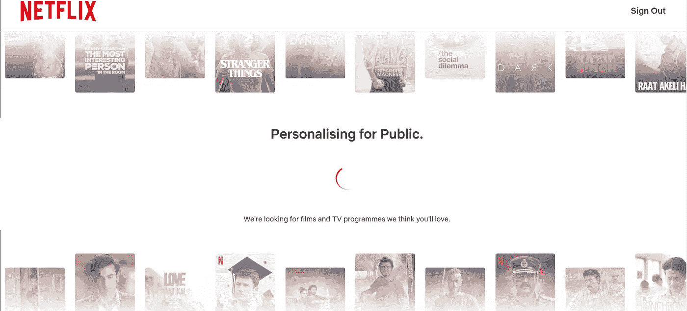
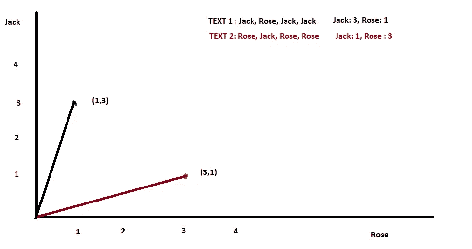
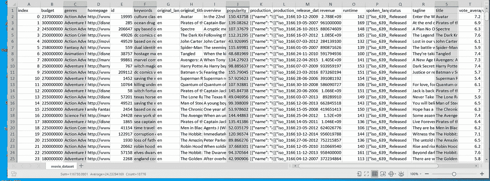

# 使用机器学习学习并构建一个电影推荐系统

> 原文：<https://medium.com/analytics-vidhya/learn-and-build-a-movie-recommendation-system-using-machine-learning-32dad9221e03?source=collection_archive---------0----------------------->


推荐系统| ML

如今，推荐系统相当普遍。网飞、Prime Video、YouTube 和其他流媒体平台使用这些推荐系统，根据你以前的观看历史，推荐一部你可能喜欢看的电影。

第一次听到这个，让我很兴奋。我开始研究和构建一个简单的电影推荐算法原型。我会走你认为我从我的研究和建立一个工作引擎中学到了什么。

我们还将使用 scikit-learn python 包在 python 中构建一个系统。你必须有一些关于 python 编程和机器学习术语的基础知识，如数据集、模型、训练和建立模型。

# 基本上什么是推荐系统？

让我们以网飞为例，当你第一次注册或创建一个新的个人资料时，要求你选择几个你喜欢的标题来个性化你的体验。


选择你喜欢的一切|网飞

在我们选择了之前可能已经在电视或网飞上看过的几个标题之后。

网飞开始使用自己的推荐算法来预测或建议你可能喜欢看的电影或节目。



个性化…|网飞

在算法根据你之前提供的数据预测出符合你兴趣的电影之后。它在其主页上显示类似的标题，以改善用户体验。这样你就不需要去找一部你觉得有趣的电影了。


主页|网飞

不仅是网飞，就连 YouTube 也使用一些推荐系统在你的主页上向你展示相关视频。

现在的推荐系统更加复杂和智能。他们不仅处理你过去的活动，还处理不同类型的数据，比如向你推荐你附近的人喜欢的电影，或者如果是 Instagram 这样的社交媒体平台，它可能也会考虑你的朋友喜欢什么。

现在你已经了解了推荐系统的基本工作原理。让我们使用一些简单的免费工具自己构建一个。

# **建立一个简单的推荐系统**

有很多种推荐系统，比如

*   基于流行度的推荐系统

比如 YouTube 或网飞的趋势页面，它会根据过去几天视频或电影的浏览量、喜欢度或观看时间向你提供建议。

*   基于内容的推荐系统

一旦你的兴趣或过去的活动被收集。简单来说，在你看完一个视频或电影后，推荐系统会找到与你已经看过的视频相似的其他视频，并向你推荐一个相似的视频。

这是我们将要建立的系统。

我们将接受一个输入(一个电影标题)并推荐相似的电影作为输出(返回给用户)。

*   协同过滤系统

这就是网飞流行的推荐系统。基本上是点对点的推荐。如果人 1 观看了电影，并且人 2 也观看了该电影，则人 1 稍后观看的电影将被建议给人 2，反之亦然。

这样把志趣相投的人匹配起来，互相推荐。

**我们系统背后的概念:**

由于我们要构建一个基于内容的推荐系统，我们的主要目标是找到两个对象或字符串之间的相似性得分。所以，我们使用一个叫做余弦相似度的概念。

**理解余弦相似度:**

例如:

**正文一:**杰克罗斯杰克杰克

**正文二:**玫瑰杰克罗斯玫瑰

我们如何在这两个文本的转换之间获得相似性分数？这就是余弦相似性发挥作用的地方。

它基本上是从数学上给出了这两部电影的演员阵容之间的相似之处。

**余弦相似性背后的数学原理:**



向量表示|余弦相似度

在图中，我只是在示例文本中绘制了单词 occurrence。

我们如何找到这两个向量之间的距离？对，正如我们在高中所学的，有两种简单的方法。

角距离:θ，这些向量之间的角距离，

欧几里德距离:连接向量的端点，长度就是欧几里德距离。

我们将使用科斯塔公式，你们大多数人在高中可能会遇到。


角距离公式|余弦相似度

好了，足够的理论…让我们得到我们的代码。打开你最喜欢的文本编辑器(我更喜欢 VS 代码)。

首先，您需要安装几个 python 包:

scikit-learn — Doc

从导入一些包开始

```
from sklearn.feature_extraction.text import CountVectorizer
from sklearn.metrics.pairwise import cosine_similarity
```

了解关于[计数矢量器](https://scikit-learn.org/stable/modules/generated/sklearn.feature_extraction.text.CountVectorizer.html)的更多信息

用我们的两个文本创建一个变量:

```
text =["Jack Rose Jack  Jack", "Rose Jack Rose Rose"]
```

我们使用计数矢量器方法将字符串转换成(3，1)和(1，3)这样的矢量。

为了对矩阵进行计数，我们将使用 fit_transform 从我们的向量中创建一个矩阵。

```
cv = CountVectorizer()
count_matrix = cv.fit_transform(text)
```

您可以使用 print count_matrix.toarray()来查看输出矩阵。这将显示一个 NumPy 数组，类似于

```
[[3,1]
[1,3]]
```

因此，我们得到了我们的向量矩阵，现在我们将使用一个内置的方法称为余弦相似性，以找到这些向量之间的相似性(距离)。

```
smilarity_scores = cosine_similarity(count_matrix)
print(similarity_scores)
```

当您运行该程序时，它会显示一个带有相似性得分的数组。所以，这基本上是我们推荐系统背后的概念。

现在你知道了我们系统背后的概念和基本数学，让我们开始建造我们的引擎。

**我们开始:**

首先创建一个新的 python 文件，并将其命名为 recommender.py。

让我们从导入所需的包开始:

```
import pandas as pd
import numpy as np
from sklearn.feature_extraction.text import CountVectorizer
from sklearn.metrics.pairwise import cosine_similarity
```

在前面的例子中，我们额外导入了 pandas 和 NumPy 来处理和读取我们的数据集。

对于这个系统，我使用了我在 kaggle.com 上找到的 IMDB 数据集，并对它进行了一些清理，以便我们可以在我们的系统中使用它。

您可以从我的存储库中下载数据集:

[https://github . com/kamaravichow/movie re commendations/blob/master/movie _ dataset . CSV](https://github.com/kamaravichow/MovieRecommendations/blob/master/movie_dataset.csv)

如果您在 excel 或办公软件中打开它，它应该是这样的:



IMDB 已清理数据集| movies_dataset.csv

它有像演员，关键字，流行度等功能的列…我们将使用余弦相似性来找到电影之间的相似性。

下载数据集，并将其放在包含 python 脚本的文件夹中。

```
df = pd.read_csv("movie_dataset.csv")
```

我们使用 pandas 读取 CSV 数据集，并将其加载到 df (DataFrame)变量中。

```
def get_title_from_index(index): 
    return df[df.index == index]["title"].values[0] def get_index_from_title(title): 
    return df[df.title == title]["index"].values[0]
```

这是两个辅助函数，我们稍后会用到。

现在我们需要得到我们需要用来寻找相似性分数的特征。现在，我将使用关键字、演员、类型和导演。

```
features = ['keywords','cast','genres','director']
```

您也可以根据需要使用其他功能。

现在，让我们将所有功能组合到数据帧中:

```
for feature in features: 
    df[feature] = df[feature].fillna('')
```

以及将它们合并成一个的函数:

```
def combine_features(row):
 try:
    return row['keywords'] +" "+row['cast']+" "+row["genres"]+"   "+row["director"] except:  print "Error:", row df["combined_features"] = df.apply(combine_features,axis=1)
```

您可以使用打印方法查看组合特征:

```
print "Combined Features:", df["combined_features"].head()
```

现在让我们初始化计数矢量器，将它们转换成我们可以使用的矢量:

```
cv = CountVectorizer() 
count_matrix = cv.fit_transform(df["combined_features"])
```

基于计数矩阵的相似性获取

```
cosine_sim = cosine_similarity(count_matrix)
```

现在我们接受用户的输入。这是用户喜欢的电影。

```
movie_user_likes = "Spectre"
```

使用 helper 函数从电影名称中获取电影的索引。

```
movie_index = get_index_from_title(movie_user_likes)
```

获取相似电影列表(相似电影索引):

```
similar_movies =  list(enumerate(cosine_sim[movie_index]))
```

该列表将按升序排列，但是，我们需要最相似的电影放在顶部，所以我们根据相似性得分按降序排列。

```
sorted_similar_movies = sorted(similar_movies,key=lambda x:x[1],reverse=True)
```

现在来看看结果，我们将把最匹配的 25 部电影打印到控制台(输出)

```
i=0
for element in sorted_similar_movies:
  print get_title_from_index(element[0])
  i=i+1
  if i>25:
   break
```

这将显示与控制台最相似的 25 部电影。

这就是我们如何使用 sci-kit-learn 和 python 构建一个基于内容的推荐系统。

这篇文章花了很多时间来写，如果你学到了新的东西或发现它有帮助，鼓掌将是惊人的。如果你发现有什么难以理解的地方，请随意评论。

我的 GitHub repo 中的所有代码和数据集:

https://github.com/kamaravichow/MovieRecommendations