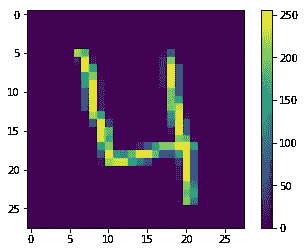
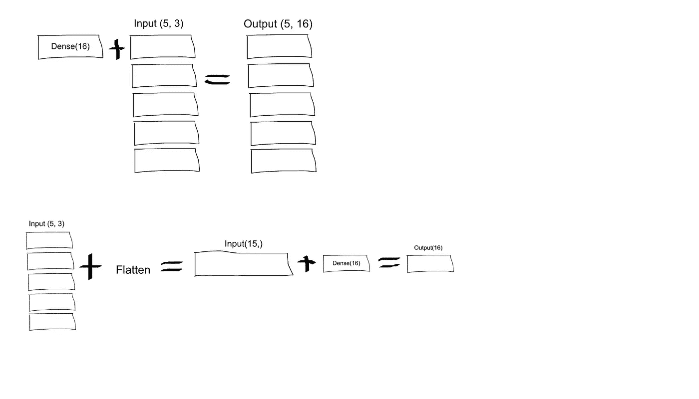
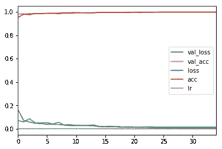
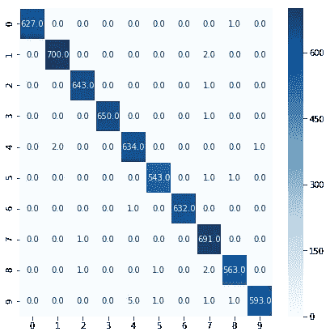

# 用著名的 MNIST 数据学习计算机视觉基础

> 原文：<https://medium.com/analytics-vidhya/learn-computer-vision-fundamentals-with-the-famous-mnist-data-2bb63ec8e3f0?source=collection_archive---------10----------------------->

本教程向您介绍 Python 中的深度学习:学习预处理您的数据，在著名的“MNIST”数据上建模、评估和优化神经网络。

MNIST(“改进的国家标准和技术研究所”)自 1999 年发布以来，这个经典的手写图像数据集一直是基准分类算法的基础。随着新的机器学习技术的出现，MNIST 仍然是研究人员和学习者的可靠资源。

在本教程中，您将从成千上万的手写图像数据集中正确识别数字。我鼓励你尝试不同的算法，以直接了解什么效果好，技术如何比较。

关于该数据集的更多细节，包括已经在其上尝试的算法及其成功程度，可以在 http://yann.lecun.com/exdb/mnist/index.html 的[找到。该数据集是在知识共享署名共享 3.0 许可下提供的。](http://yann.lecun.com/exdb/mnist/index.html)

或者，你也可以从 https://www.kaggle.com/c/digit-recognizer 的卡格尔[下载数据集。使用下面的方法，我得到了 0.99628 的公开分数(kaggle 的前 10%)。](https://www.kaggle.com/c/digit-recognizer)

**深度学习**

你可能已经知道机器学习，它是数据科学和人工智能的一种应用，为系统提供自动学习和根据经验改进的能力，而无需显式编程。在本教程中，你将专注于深度学习，这是一种模拟大脑神经元网络的计算机软件。它是机器学习的一个子集，被称为深度学习，因为它利用了深度神经网络。

深度学习算法是用连接的层构造的。

-第一层称为输入层
-最后一层称为输出层
-中间的所有层称为隐藏层

单词 deep 是指网络连接两层以上的神经元。

**数字识别器**

本教程将向您介绍:

*   时尚 MNIST 数据集，包含 10 个类别的 70，000 幅灰度图像。这些图像以低分辨率(28×28 像素)显示了单件衣服
*   如何使用 Python 及其库来理解、探索和可视化您的数据
*   如何预处理您的数据
*   如何使用 Keras 序列模型为分类任务建立多层感知器
*   如何编译数据并使其适合这些模型
*   如何使用您的模型来预测目标值，以及如何验证您已经建立的模型

**加载库**

```
import pandas as pd
import seaborn as sns
import numpy as np
import matplotlib.pyplot as plt
import tensorflow as tf
from keras.models import Sequential
from keras.layers import Dense, Dropout, Activation, Flatten
from keras.optimizers import Adam,RMSprop
from keras.layers.normalization import BatchNormalization
from keras.utils import np_utils,plot_model
from keras.preprocessing.image import ImageDataGenerator
from IPython.display import Image
from keras.layers import Conv2D, MaxPooling2D
from keras.callbacks import ReduceLROnPlateau,ModelCheckpoint,EarlyStopping
from sklearn.model_selection import train_test_split
from sklearn.metrics import confusion_matrix,accuracy_score
from keras.datasets import mnist
```

这里，42，000 幅图像用于训练网络，28，000 幅图像用于最终测试，您将预测这 28，000 幅图像的类别。为了评估网络对这些图像进行分类的准确性，您还需要一个验证集。您可以直接从 TensorFlow 访问时尚 MNIST。按照以下方式导入和加载时尚 MNIST 数据:

```
train_mnist = pd.read_csv(‘../input/digit-recognizer/train.csv’)
test_mnist = pd.read_csv(‘../input/digit-recognizer/test.csv’)
```

查看下面的训练数据的形状，它包含 42000 个图像，每个图像表示为 28 x 28 像素。

```
print(train_mnist.shape)
print(train_mnist.head(1))(42000, 785)
   label  pixel0  pixel1  pixel2  pixel3  pixel4  pixel5  pixel6  pixel7  \
0      1       0       0       0       0       0       0       0       0   

   pixel8    ...     pixel774  pixel775  pixel776  pixel777  pixel778  \
0       0    ...            0         0         0         0         0   

   pixel779  pixel780  pixel781  pixel782  pixel783  
0         0         0         0         0         0  

[1 rows x 785 columns]
```

最后将数据和目标标签赋给变量 X 和 y。

```
X = train_mnist.drop(“label”,axis=1)
y = train_mnist[‘label’]
X.shape
(42000, 784)
```

每个标签都是 0 到 9 之间的整数:

```
np.unique(y)
array([0, 1, 2, 3, 4, 5, 6, 7, 8, 9], dtype=int64)
```

**数据预处理**

在训练网络之前，必须对数据进行预处理:

```
plot_image = X.values.reshape(X.shape[0], 28, 28)plt.figure()
plt.imshow(plot_image[3])
plt.colorbar()
plt.grid(False)
plt.show()
```



如果检查训练集中的图像，您会看到像素值在 0 到 255 的范围内

在将这些值输入神经网络模型之前，将它们调整到 0 到 1 的范围内。为此，将这些值除以 255。训练集和测试集必须以相同的方式进行预处理，这一点很重要:

```
X = X / 255.0
test_mnist = test_mnist / 255.0
```

现在，从上面库部分的 sklearn.model_selection 导入 train_test_split

```
X = pd.DataFrame(X)
y = pd.DataFrame(y)X_train,X_test,y_train,y_test = train_test_split(X,y,test_size=0.15,random_state=0)
```

为了将图像输入卷积神经网络，你应该将数据帧转换成四维。这可以使用 numpy reshape 方法来完成。Keras 希望在最后为渠道增加一个额外的维度。如果这是 RGB 图像，将有 3 个通道，但由于 MNIST 是灰度级，它只使用一个。

```
X_train = X_train.values.reshape(X_train.shape[0],28,28,1)
X_test = X_test.values.reshape(X_test.shape[0],28,28,1)
test_mnist = test_mnist.values.reshape(test_mnist.shape[0],28,28,1)
```

**训练模型**

Keras 提供了两种不同的网络定义方式。在这里，我将定义顺序 API，从输入开始，每次只添加一层。顺序 API 的问题是，它不允许模型有多个输入或输出，而这对于某些问题是需要的。要创建卷积神经网络，您只需创建一个顺序对象，并使用 add 函数添加层。
第一层是 Conv2D 层。这些卷积层将处理我们的输入图像，这些图像被视为二维矩阵。

第一层中的 64 是层中的节点数。根据数据集的大小，这个数字可以调高或调低。在这种情况下，64 工作得很好，所以我现在坚持使用它。

*   核大小是我们卷积的滤波器矩阵的大小。因此，内核大小为 3 意味着您将拥有一个 3×3 的过滤器矩阵
*   激活是层的激活功能。我将用于第一层的激活函数是 ReLU，或整流线性激活。这种激活函数已被证明在神经网络中工作良好
*   第一层也接受一个输入形状。这是每个输入图像的形状，28，28，1，如前所述，1 表示图像是灰度的

将像素添加到图像的边缘称为填充。

在 Keras 中，这是通过 Conv2D 层上的“padding”参数指定的，该参数的默认值为“valid”(无填充)。这意味着过滤器仅应用于输入的有效途径。“相同”的“填充”值计算并添加输入图像(或特征映射)所需的填充，以确保输出与输入具有相同的形状。

Maxpooling:对于过滤器表示的每个区域，我们将获取该区域的最大值，并创建一个新的输出矩阵，其中每个元素都是原始输入中一个区域的最大值。


在中选择 Maxpooling，以便它突出显示图像的边缘。

为了提高神经网络的稳定性，批标准化通过减去批平均值并除以批标准偏差来标准化先前激活层的输出。

您可以在网络中添加更多层来查看模型的执行情况。下面增加了三层。在 Conv2D 层和密集层之间，有一个“展平”层。

展平用作卷积层和致密层之间的连接。
“密集”是我们将在输出图层中使用的图层类型。密集是一种标准图层类型，在许多情况下用于神经网络。输出层应该有 10 个节点，每个节点对应一个可能的结果(0–9)。



术语“丢失”指的是在神经网络中丢失单元(隐藏的和可见的)。—辍学:防止神经网络过度拟合的简单方法。

```
model = Sequential()model.add(Conv2D(64, (3, 3), input_shape=(28,28,1),padding=”SAME”))
model.add(BatchNormalization(axis=-1))
model.add(Activation(‘relu’))
model.add(MaxPooling2D(pool_size=(2,2)))model.add(Conv2D(128,(3, 3),padding=”SAME”))
model.add(BatchNormalization(axis=-1))
model.add(Activation(‘relu’))
model.add(MaxPooling2D(pool_size=(2,2)))model.add(Conv2D(192,(3, 3),padding=”SAME”))
model.add(Activation(‘relu’))
model.add(MaxPooling2D(pool_size=(2,2)))model.add(Flatten())# Fully connected layer
model.add(Dense(256))
model.add(BatchNormalization())
model.add(Activation(‘relu’))
model.add(Dropout(0.3))
model.add(Dense(10))model.add(Activation(‘softmax’))model.summary()
```

查看下面的模型摘要:

```
output_channels * (input_channels * window_size + 1) == number_parameters(param)64 * (1 * (3*3) + 1)  == 640
True
```

形状中的“无”表示它没有预定义的数字。例如，它可以是您在训练期间使用的批次大小，您希望通过不为其分配任何值来使其灵活，以便您可以更改您的批次大小。该模型将从层的上下文中推断形状。

在第一层中，我们有 64 个节点，每个输入层的形状为 28×28。使用“max_pooling”后，形状缩小到 14x14，因为我们使用了 2x2 的 maxpooling。

```
Model: "sequential_1"
_________________________________________________________________
Layer (type)                 Output Shape              Param #   
=================================================================
conv2d_1 (Conv2D)            (None, 28, 28, 64)        640       
_________________________________________________________________
batch_normalization_1 (Batch (None, 28, 28, 64)        256       
_________________________________________________________________
activation_1 (Activation)    (None, 28, 28, 64)        0         
_________________________________________________________________
max_pooling2d_1 (MaxPooling2 (None, 14, 14, 64)        0         
_________________________________________________________________
conv2d_2 (Conv2D)            (None, 14, 14, 128)       73856     
_________________________________________________________________
batch_normalization_2 (Batch (None, 14, 14, 128)       512       
_________________________________________________________________
activation_2 (Activation)    (None, 14, 14, 128)       0         
_________________________________________________________________
max_pooling2d_2 (MaxPooling2 (None, 7, 7, 128)         0         
_________________________________________________________________
conv2d_3 (Conv2D)            (None, 7, 7, 192)         221376    
_________________________________________________________________
activation_3 (Activation)    (None, 7, 7, 192)         0         
_________________________________________________________________
max_pooling2d_3 (MaxPooling2 (None, 3, 3, 192)         0         
_________________________________________________________________
flatten_1 (Flatten)          (None, 1728)              0         
_________________________________________________________________
dense_1 (Dense)              (None, 256)               442624    
_________________________________________________________________
batch_normalization_3 (Batch (None, 256)               1024      
_________________________________________________________________
activation_4 (Activation)    (None, 256)               0         
_________________________________________________________________
dropout_1 (Dropout)          (None, 256)               0         
_________________________________________________________________
dense_2 (Dense)              (None, 10)                2570      
_________________________________________________________________
activation_5 (Activation)    (None, 10)                0         
=================================================================
Total params: 742,858
Trainable params: 741,962
Non-trainable params: 896
```

您还可以使用 learning_rate_reduction、best_model 和 early_stopping 来定义回调参数。在开始我的训练过程之前，我将在下面定义几个超参数。

*   提前停止:用于在监控的数量停止改善时停止训练
*   监控:要监控的数量。在这种情况下，它是 val_loss。如果损失停止改善，训练将自动停止。
*   Min_delta:符合改善条件的监控量的最小变化，即小于 min_delta 的绝对变化将被视为无改善。
*   耐心:产生监控数量但没有改善的时期数，在此之后训练将停止。
*   restore_best_weights:是否从具有被监控量的最佳值的时期恢复模型权重。如果为 False，则使用在最后一步训练中获得的模型权重。

深度学习模型可能需要几个小时、几天甚至几周的时间来训练。如果运行意外停止，您可能会丢失大量工作。这是一种在系统出现故障时拍摄系统状态快照的方法。如果出了问题，也不是全部都没了。检查点可以直接使用，也可以作为新一轮运行的起点，从它停止的地方开始。
训练深度学习模型时，检查点就是模型的权重。这些权重可以用于进行预测，或者用作正在进行的训练的基础。

这里的 model_weights.h5 是一个权重文件。

learning_rate_reduction:一旦学习停滞，模型通常会受益于将学习速率降低 2-10 倍。这种回调监控一个数量，如果在“耐心”次数内没有看到改进，则学习率降低。

*   因子:学习率降低的因子。new_lr = lr *因子
*   min_lr:学习率的下限。

```
early_stopping = EarlyStopping(monitor=’val_loss’, min_delta=1e-10, patience=10,restore_best_weights=True)best_model = ModelCheckpoint(‘model_weights.h5’, monitor=’val_acc’, verbose=2, save_best_only=True, mode=’max’)learning_rate_reduction = ReduceLROnPlateau(monitor=’val_acc’,patience=3, verbose=2,factor=0.5,min_lr=0.00001)
```

**编译模型**

接下来，您需要编译模型。编译模型需要三个参数:优化器、损失和指标。

*   优化器控制学习速率。我们将使用“亚当”作为我们的优化器。在许多情况下，Adam 通常是一个很好的优化器。adam 优化器在整个训练过程中调整学习率
*   学习率决定了计算模型最佳权重的速度。较小的学习率可能导致更精确的权重(直到某一点)，但是计算权重所花费的时间将会更长
*   我将使用‘稀疏分类交叉熵’作为损失函数。这是最常见的分类选择。分数越低，表示模型的性能越好。

当我们有一个单标签、多类分类问题时，标签对于每个数据是互斥的，这意味着每个数据条目只能属于一个类。然后我们可以用一键嵌入来表示 y_true。

例如，y_true 有 3 个样本，分别属于类 2、类 0 和类 2。

y_true = [[0，0，1]，
[1，0，0]，
[0，0，1]]

会变成:

y_true_one_hot = [2，0，2]

```
model.compile(optimizer=’adam’,
loss=’sparse_categorical_crossentropy’,
metrics=[‘accuracy’])
```

**图像数据生成器和数据扩充**

数据扩充用于扩展训练数据集，以提高模型的性能和泛化能力。Keras 深度学习库中通过 ImageDataGenerator 类支持图像数据增强。

Keras ImageDataGenerator 类实际上通过以下方式工作:

*   接受一批用于训练的图像
*   取这一批并对这一批中的每个图像应用一系列随机变换(包括随机旋转、调整大小、剪切等。).
*   用新的随机转换的批次替换原始批次。
*   在这个随机转换的批次上训练 CNN(即，原始数据本身不用于训练)

*ImageDataGenerator* 接受原始数据，对其进行随机转换，并只返回新的转换后的数据。

数据扩充包括一系列技术，用于通过应用随机抖动和扰动(但同时确保数据的类别标签不变)从原始样本生成“新”训练样本。

我们应用数据扩充的目标是提高模型的概化能力。

```
gen = ImageDataGenerator(
 featurewise_center=False, 
 samplewise_center=False, 
 featurewise_std_normalization=False, 
 samplewise_std_normalization=False, 
 rotation_range=10, 
 zoom_range = 0.1,
 width_shift_range=0.1, 
 height_shift_range=0.1, 
 horizontal_flip=False,
 vertical_flip=False)gen.fit(X_train)
```

为了估计模型在给定训练运行中的性能，您应该将训练集进一步拆分为训练和验证数据集。然后，可以绘制每次运行的训练和验证数据集的性能，以提供学习曲线和对模型学习问题的深入了解。

Keras API 通过在训练模型时将“validation_data”参数指定给 model.fit()函数来支持这一点，这将依次返回一个对象，该对象描述每个训练时期上所选损失和度量的模型性能。

```
h = model.fit_generator(
 gen.flow(X_train, y_train, batch_size=64),
 validation_data=(X_test, y_test),
 steps_per_epoch=len(X_train) // 64,
 epochs=50, verbose=1,
 callbacks=[learning_rate_reduction,best_model,early_stopping]
 )Epoch 1/50
557/557 [==============================] - 23s 41ms/step - loss: 0.1681 - acc: 0.9500 - val_loss: 0.0710 - val_acc: 0.9792

Epoch 00001: val_acc improved from -inf to 0.97921, saving model to mnist_weights.h5
Epoch 2/50
557/557 [==============================] - 18s 32ms/step - loss: 0.0719 - acc: 0.9778 - val_loss: 0.0591 - val_acc: 0.9811

Epoch 00002: val_acc improved from 0.97921 to 0.98111, saving model to mnist_weights.h5
Epoch 3/50
557/557 [==============================] - 18s 33ms/step - loss: 0.0584 - acc: 0.9823 - val_loss: 0.0860 - val_acc: 0.9748

Epoch 00003: val_acc did not improve from 0.98111
Epoch 4/50
557/557 [==============================] - 18s 33ms/step - loss: 0.0475 - acc: 0.9852 - val_loss: 0.0507 - val_acc: 0.9856

Epoch 00004: val_acc improved from 0.98111 to 0.98556, saving model to mnist_weights.h5
Epoch 5/50
557/557 [==============================] - 18s 33ms/step - loss: 0.0455 - acc: 0.9859 - val_loss: 0.0507 - val_acc: 0.9848

Epoch 00005: val_acc did not improve from 0.98556
Epoch 6/50
557/557 [==============================] - 18s 33ms/step - loss: 0.0390 - acc: 0.9871 - val_loss: 0.0534 - val_acc: 0.9859

Epoch 00006: val_acc improved from 0.98556 to 0.98587, saving model to mnist_weights.h5
Epoch 7/50
557/557 [==============================] - 18s 32ms/step - loss: 0.0396 - acc: 0.9874 - val_loss: 0.0415 - val_acc: 0.9862

Epoch 00007: val_acc improved from 0.98587 to 0.98619, saving model to mnist_weights.h5
Epoch 8/50
557/557 [==============================] - 18s 32ms/step - loss: 0.0374 - acc: 0.9888 - val_loss: 0.0563 - val_acc: 0.9824

Epoch 00008: val_acc did not improve from 0.98619
Epoch 9/50
557/557 [==============================] - 18s 33ms/step - loss: 0.0328 - acc: 0.9896 - val_loss: 0.0315 - val_acc: 0.9908

Epoch 00009: val_acc improved from 0.98619 to 0.99079, saving model to mnist_weights.h5
Epoch 10/50
557/557 [==============================] - 18s 32ms/step - loss: 0.0350 - acc: 0.9886 - val_loss: 0.0267 - val_acc: 0.9916

Epoch 00010: val_acc improved from 0.99079 to 0.99159, saving model to mnist_weights.h5
Epoch 11/50
557/557 [==============================] - 19s 34ms/step - loss: 0.0295 - acc: 0.9903 - val_loss: 0.0271 - val_acc: 0.9933

Epoch 00011: val_acc improved from 0.99159 to 0.99333, saving model to mnist_weights.h5
Epoch 12/50
557/557 [==============================] - 18s 32ms/step - loss: 0.0276 - acc: 0.9912 - val_loss: 0.0310 - val_acc: 0.9910

Epoch 00012: val_acc did not improve from 0.99333
Epoch 13/50
557/557 [==============================] - 18s 31ms/step - loss: 0.0276 - acc: 0.9909 - val_loss: 0.0309 - val_acc: 0.9908

Epoch 00013: val_acc did not improve from 0.99333
Epoch 14/50
557/557 [==============================] - 17s 31ms/step - loss: 0.0264 - acc: 0.9919 - val_loss: 0.0337 - val_acc: 0.9898

Epoch 00014: ReduceLROnPlateau reducing learning rate to 0.0005000000237487257.

Epoch 00014: val_acc did not improve from 0.99333
Epoch 15/50
557/557 [==============================] - 18s 31ms/step - loss: 0.0184 - acc: 0.9942 - val_loss: 0.0201 - val_acc: 0.9948

Epoch 00015: val_acc improved from 0.99333 to 0.99476, saving model to mnist_weights.h5
Epoch 16/50
557/557 [==============================] - 18s 32ms/step - loss: 0.0180 - acc: 0.9944 - val_loss: 0.0213 - val_acc: 0.9935

Epoch 00016: val_acc did not improve from 0.99476
Epoch 17/50
557/557 [==============================] - 18s 32ms/step - loss: 0.0167 - acc: 0.9948 - val_loss: 0.0220 - val_acc: 0.9935

Epoch 00017: val_acc did not improve from 0.99476
Epoch 18/50
557/557 [==============================] - 17s 31ms/step - loss: 0.0169 - acc: 0.9946 - val_loss: 0.0203 - val_acc: 0.9940

Epoch 00018: ReduceLROnPlateau reducing learning rate to 0.0002500000118743628.

Epoch 00018: val_acc did not improve from 0.99476
Epoch 19/50
557/557 [==============================] - 17s 31ms/step - loss: 0.0130 - acc: 0.9958 - val_loss: 0.0160 - val_acc: 0.9951

Epoch 00019: val_acc improved from 0.99476 to 0.99508, saving model to mnist_weights.h5
Epoch 20/50
557/557 [==============================] - 17s 31ms/step - loss: 0.0128 - acc: 0.9962 - val_loss: 0.0182 - val_acc: 0.9949

Epoch 00020: val_acc did not improve from 0.99508
Epoch 21/50
557/557 [==============================] - 17s 31ms/step - loss: 0.0124 - acc: 0.9963 - val_loss: 0.0158 - val_acc: 0.9954

Epoch 00021: val_acc improved from 0.99508 to 0.99540, saving model to mnist_weights.h5
Epoch 22/50
211/557 [==========>...................] - ETA: 10s - loss: 0.0112 - acc: 0.9964
```

预测函数将给出一个包含 10 个数字的数组。这些数字是输入图像代表每个数字(0-9)的概率。编号最高的数组索引表示模型预测。每个数组的总和等于 1(因为每个数字都是一个概率)。

```
y_pred = model.predict(X_test)
y_pred = np.argmax(y_pred,axis = 1)accuracy_score(y_test,y_pred)
0.9961904761904762pd.DataFrame(h.history).plot()
```



该图显示了每个历元的精度和损耗变化

```
conf_mat = confusion_matrix(y_test,y_pred)
f,ax = plt.subplots(figsize=(7, 7))
sns.heatmap(conf_mat, cmap=’Blues’,annot=True, linewidths=.5, fmt= ‘.1f’,ax=ax)
```



混淆矩阵