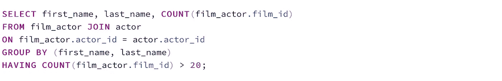
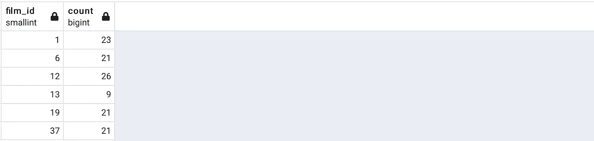

# 通过 30 个 SQL 查询学习数据分析

> 原文：<https://medium.com/analytics-vidhya/learn-data-analysis-with-30-sql-queries-2f791f5d4012?source=collection_archive---------0----------------------->

让我们用 SQL 做一些数据分析。查看我之前的[帖子](/analytics-vidhya/lets-do-some-data-analysis-with-sql-postgresql-71a861e23619)，在那里我用强大的 SQL 查询回答了 **30** 个有趣的问题。在这篇文章中，我准备了另外一组 **30 个**问题，我将带你解决它们。我将使用 DVD 租赁数据库中的下列表格。

*演员* ( **演员 id** ，名字，姓氏)

*影片* ( **film_id** ，片名，描述，上映年份，语言 _id，出租 _ 时长，出租 _ 费率，重置 _ 成本，评级)

f*ILM _ actor*(**film _ id，actor_id** )

客户(**客户标识**，名字，姓氏，地址标识)

付款(**付款标识**，客户标识，金额，日期)

地址( **address_id** ，街道，城市 _id，电话)

租赁(**租赁标识**，租赁日期，客户标识，库存标识)

库存(**库存标识**，胶片标识，商店标识)

使用 30 个查询，我将演示，自连接，自然连接，左和右外连接，子查询，联合，相交，差异，存在，不存在，成员运算符(in，not in)，分组，排序，聚合函数，汇总，正则表达式等。让我们开始娱乐吧。

1.  在 actor 表中是否有共享全名的 actor，如果有，显示这些共享名。

为了回答这个问题，首先我们需要知道 actor 表中是否有共享全名的 actor。因此，我将从计算分享全名的演员数量开始。

结果显示，在 200 个演员中，我们有 199 个不同的演员全名，这意味着 2 个演员共享相同的全名。

现在，我要找出那个演员的名字。

如果我们在上面的查询中没有使用 **DISTINCT** ，我们会看到 Susan Davis 两次，因为它为两个不同的演员出现了两次。

2.**显示地址相同的客户名称(如丈夫和妻子)。**

为了回答这个问题，我们需要寻找多个具有相同 address_id 但不同 customer _ ids 的客户。这意味着我们将把客户表连接到它的自身( **self join** )。

**3。在付款表中显示所有客户支付的总金额。**

在这里，我将对付款表中的 amount 列使用聚合函数 **SUM()** 。

**4。在付款表中显示每个客户支付的总金额。**

以下是结果的示例:

**5。最高的总付款是多少？**

在这里，我对每个 customer_id 支付的金额进行了分组，然后计算了 **Sum()** ，对 total _ payments**进行了降序排序**，并仅选择了最高值(**限制** 1)。

**6。支付总额最高的客户的名字是什么？**

为了回答这个问题，我编写了一个子查询来选择最大 total_payments，然后编写了另一个子查询来选择获得最大 total_payment 的 customer_id，然后编写了另一个查询来选择获得最大 total_payment 的客户的名字和姓氏。

请注意，当我们想要对 GROUP BY 的结果设置条件时，具有的**与 GROUP BY 一起使用。**

**7。租得最多的电影是什么？**

我将从选择每部电影和租借次数开始。对于租赁电影，在租赁表中保存一行。为了知道租了哪个 film_id，可以在 inventory_id 上连接租赁和库存表。

我将按**计数(film_id) DESC** 排序，然后选择最上面的第一行，这将是最大计数。

一部电影被租借的最高次数是 34 次，现在的问题是哪部电影或哪套电影被租借了 34 次。

**8。到目前为止租了哪些电影。**

我们需要理解，电影表中的所有电影没有必要都已经租出去了。我编写了一个子查询来选择到目前为止租用的所有不同的 film _ ids。为此，我需要在公共列 inventory_id 上连接租赁和库存表。然后，如果电影的 id 在子查询选择的 film _ ids 集合中，我从电影表中选择电影的标题。

当统计电影名称时，我们会发现 1000 部电影中有 958 部电影出现在结果中。

**9。哪些电影至今未租。**

在统计电影片名的时候，我们会发现至今有 42 部电影是不租的。

10.**哪些客户至今没有租借过任何电影。**

客户可能已经注册为 dvd 租赁店的客户，但是还没有开始租赁 DVD。

解决方案 1: 不在。

选择客户 id。

选择客户名称。

**解决方案 2:** 不存在。

选择客户 id。

选择客户名称。

11。显示每部电影及其出租次数。

12。显示每个演员出演的电影数量。

上面的查询返回演员 id 和他/她出演的电影数量。在下面的查询中，我将选择演员的名和姓。

输出示例:

13。显示 20 多部电影中的演员姓名。

我使用了前一个问题中的相同查询，并添加了一个电影数量大于 20 部电影的条件。

输出示例:

**14。有多少演员的名字只有 8 个字母？**

输出示例:

**15** 。**对于所有分级为“PG”的电影，给我看看这部电影以及它被租借的次数。**

我编写了一个子查询来选择到目前为止已经租出去的所有 film _ ids。为此，我需要在公共列 inventory_id 上连接租赁和库存表。我还需要得到每部电影的评分。为此，我需要在公共列 film_id 上连接 inventory 和 film 表。我只过滤了等级 I 等于“PG”的那些行。然后，我选择了每个 film_id 及其计数。

输出示例:

16。显示 store_id 1 中提供出租而 store_id 2 中不提供的电影。

**17。在两个商店 1 和 2 中的任何一个中显示提供出租的电影。**

我将选择 store_id 1 中提供出租的 film_id，并使用 **UNION** 将它们添加到 store_id 2 中提供出租的 film_id。

18。同时显示两个商店中提供的电影的电影名称。

**解决方案 1:**

**解决方案 2:** 使用**相交**

**解决方案 3** :使用**存在**。

19。对于每个商店，显示属于该商店成员的客户数量。

20。显示 store_id 为 1 的商店中租赁次数最多的电影的电影标题。

首先，我会检查每部电影在 store_id 1 中的租借次数。

我看到一部电影被租借的次数最多是 20 次。我将选择租借 20 次的电影的所有电影名称。

21。商店里还有多少电影没有出租。只有 1 和 2 两家店。

首先，我们必须计算商店 1 和商店 2 中的电影数量。然后我们统计电影表中的电影数量。我们将两个计数相减。

所有电影的数量是 1000 部电影，两家商店的电影数量是 958 部。1000–958 = 42 部电影。

**22。为多次租借电影 DVD 的客户显示 customer_id。**

要回答这个问题，我们首先需要知道每个客户租用的 film _ ids。我们需要连接两个表来获取信息。库存表中有 Film_id，租赁表中有租赁 id、租赁日期、客户 id，我们可以在库存 id 上连接它们。

下一步，我们需要将上一个表的结果连接到自身(self join ),并找到客户是同一个人、租借的影片是同一部影片但租借日期不同的那些行，以表明客户不止一次租借了同一部影片。我使用带有语句的**创建了一个带有上述查询的表，我将它连接到自身，按 customer_id 分组，并选择每个 customer_id 和客户不止一次租用的电影的数量。**

**23。在每个评价下显示租借的电影数量。**

要回答这个问题，我们首先需要知道租赁的电影 id(连接租赁和库存表)和每部电影的评级(连接电影表)。这里使用了 RIGHT JOIN，这样我可以确保如果没有电影被租借给某个特定的分级类别，那么在结果中显示该分级时，计数为 0。

**24。显示商店 1 和商店 2 的利润。**

要回答这个问题，我们需要知道通过 join 租赁的每部电影的付款金额和 inventory_id(租赁和付款表)以及该租赁交易的 store _ id(join inventory 表)。我按每个 store_id 分组，并对支付的金额使用聚合函数 SUM()。

25。 **显示商店 1 和商店 2 的利润，然后显示两家商店的总利润。**

我将使用上面相同的查询，并向其中添加 **ROLLUP** 。

商店 1 的利润为 30628.91 美元，商店 2 的利润为 30683.13 美元，总利润为 61312.04 美元。

**26。数一数名字不是以 A 开头的演员的数量。**

**27。查找以“P”开头，后跟任何其他字母(e 或 a)的演员的名字。**

我将使用 SIMILAR TO 来匹配以 P 开头的字符串，P 是字母 e 或 a，用(e|a)表示，%表示任何其他字符。

**28。查找以“P”开头，后跟任意 5 个字母的客户名字。**

**解决方案 1:**

我将使用 SIMILAR TO 来匹配一个以 P 开头，后面跟五个(_)的字符串，每个 _ 代表一个字符。

**解决方案 2:**

我将使用 SIMILAR TO 来匹配一个以 P 开头的字符串，后面是从 a 到 z 的五个字母，这是用方括号[a-z]将 a-z 括起来表示的，而{5}表示 5 个字母。

输出示例:

29。查找以 PaRkEr 作为名字的演员，忽略字母大小写。然后选择名为 PaRkEr 的演员并匹配字母大小写。

选择名为 parker 的演员而忽略字母大小写

**Solution1** :我会用 **~*** 忽略字母大小写。

**解决方案 2:** 我将使用 **ilike** 来忽略字母大小写。

用于在匹配字母大小写时选择名为 PaRkEr 的演员。

**解决方案 1:** 我将使用~来匹配字母大小写

**解决方案 2:** 我会像使用一样使用**来忽略字母大小写。**

**解决方案 3** :使用比较运算符( **=** )。

**三十。查找以“P”开头，后跟 a 到 e 中任何一个字母，然后是任何其他字母的演员姓名。**

我将使用 SIMILAR TO 来匹配以 P 开头的字符串，从 a 到 e 的字母将由[a-e]表示，%表示任何其他字符。

我希望你对这篇文章感兴趣，并且我能够以一种好的和清晰的方式展示这个主题。