# 通过在 Excel 上应用数据挖掘来学习数据挖掘

> 原文：<https://medium.com/analytics-vidhya/learn-data-mining-by-applying-it-on-excel-6f046c8d1ff7?source=collection_archive---------3----------------------->

在这个系列中，我将通过将不同的机器学习方法应用于 Excel 来展示它们，以使它们更容易理解…

当然，当我们说数据挖掘时，这意味着通过使用由 Python 或 R 语言开发的读取存储在几个数据库中的大量数据的计算机程序将这些方法应用于大数据，我们可能会在未来的帖子中通过将这些想法编码到程序中来应用这些概念。

本系列面向具有中等 excel 技能的数据挖掘初学者。

我们首先要讨论的方法是**线性回归**:

**线性回归**用于预测，通过训练我们已经有的真实数据，得到公式，用它来预测结果。

线性回归意味着目标(因变量)和属性(自变量)之间的关系是线性的。

可以有一个或多个独立变量；如果我们有 1 个独立变量，则得到因变量 y=mx +b 的公式，然而当我们有多个独立变量时，公式将是 y=m1x1 + m2x2 + … + mnxn + b(不要担心，当我们开始我们的例子时，一切都会很清楚)

1-具有一个独立变量的示例:

假设一个杂货店经理决定根据天气预报预测冷水瓶的销量，他已经收集了一些将每周平均每日高温与冷水瓶销量相关联的数据:

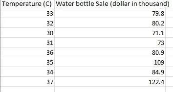

以上数据必须输入 excel 表格，请从[这里](https://github.com/AlbertAssaad/DataMiningApplyingitonExcel/blob/master/LinearRegression%201.xlsx)下载并打开。

当我们有一个像本例中这样的独立变量时，有一个简单的方法来获得公式:创建一个图表，右键单击其值，选择添加趋势线，然后选择线性，并勾选在图表上显示方程复选框。

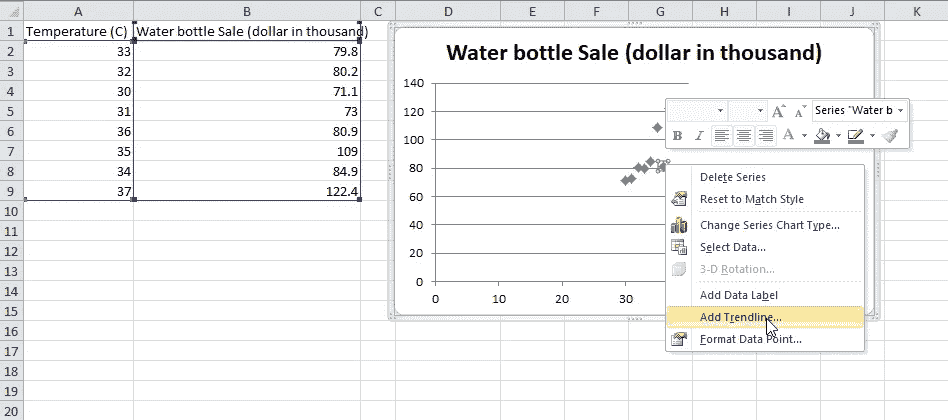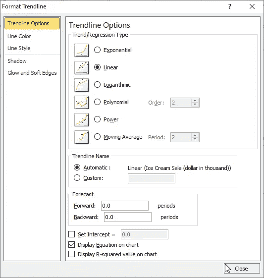

现在，您会看到图表中绘制了一条包含等式的线:

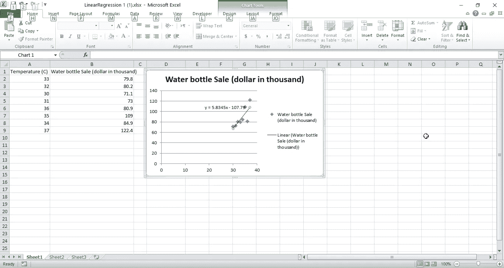

这是最简单的，还有一个更简单的函数叫 Linest，我们将在后面的文档中提到它，但现在我们将进入最难的部分(这是本系列的目的，以理解过程),通过使用 excel 函数和单元格手动计算公式。

将图表向右移动，并将以下说明和公式添加到相应的单元格中:

*   单元格 C1 添加文本:sum(x)
*   单元格 D1 添加文本:sum(y)
*   单元格 C4 添加文本:总和(xy)
*   单元格 D4 添加文本:sum(x ^ 2)
*   单元格 C7 添加文本:n=
*   单元格 C8 添加文本:m=
*   单元格 C9 添加文本:b=
*   单元格 C2 添加公式:=Sum(A:A)
*   单元格 D2 添加公式:=Sum(B:B)
*   单元格 C5 添加公式:=SumProduct(A:A，B:B)
*   单元格 D5 加上公式:=SumProduct(A:A，A:A)
*   单元格 D7 添加公式:=Count(A:A)
*   单元格 D8 添加公式:=(D7*C5-C2*D2)/(D7*D5-C2 ^2)
*   单元格 D9 添加公式:= (D5*D2-C2*C5)/(D7*D5-C2 ^2)

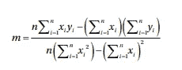

m 的公式

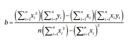

b 的公式

你意识到单元格 D8 和 D9 中的结果与图表中的结果相同…

现在，我们需要预测单元格 C12、C13、C14 中每个温度旁边的收入，在 C12 输入以下公式并自动填充到 C14: =D$8*C12 + D$9(应用我们的公式 y= m*x + b)，下面是基于我们的数据的预测值。

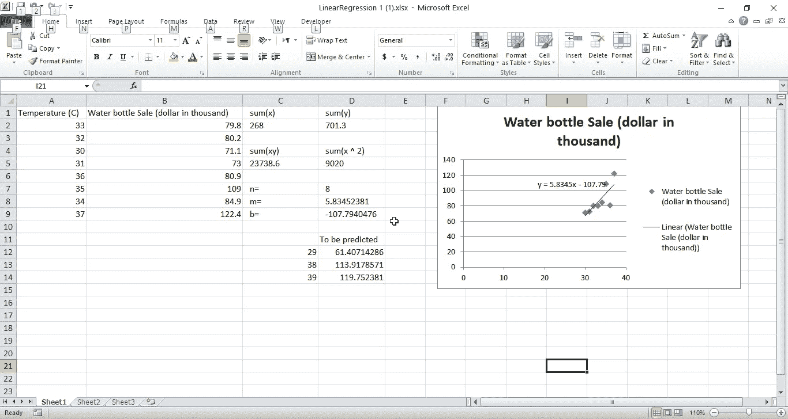

点击此[链接](https://github.com/AlbertAssaad/DataMiningApplyingitonExcel/blob/master/LinearRegression%201%20Final.xlsx)可以找到本次练习的最终结果。

使用数组函数 Linest 解决相同的问题:

我们将删除在之前的练习中得到的所有结果，并保留 A 列和 b 列中的值。

现在按照以下步骤使用 LINEST 函数获得 m 和 b:

1-在 C1 单元格中写 m，在 D1 单元格中写 b

2-选择 C2 和 D2

3-在公式栏中写:=LINEST(B2:B9，A2:A9，真，真)然后按 ctrl+shift+ enter

4- C2 和 D2 将由它们的值填充，就像我们之前获得的一样。现在，公式的变量完成，获得温度的计数(在我们的例子中为 8 ),并继续预测公式 y=mx +b

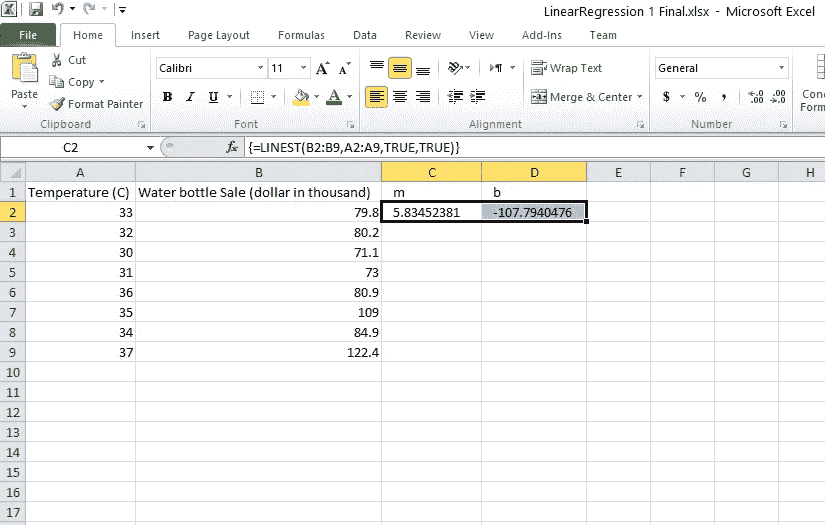

我们可以看到公式已经被{}自动包围了。Linest 函数只对同一行有效。

2-具有两个或更多独立值的示例:

假设这位杂货店经理需要更加精确，除了他的数据之外，他还收集了平均顾客数和假日数，因此现在他有 3 个独立的值:温度、顾客数和假日数，因此等式为 y= m1x1+m2x2+m3x3+b。

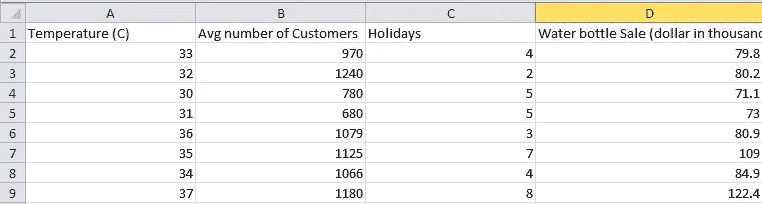

我们将通过使用 LINEST 函数来解决这个问题，使用以下指令您可以通过下载 excel 来跟踪我，单击此[链接](https://github.com/AlbertAssaad/DataMiningApplyingitonExcel/blob/master/LinearRegression%202%20start.xlsx):

1-在 E1 插入文本预测

2-在 F1 中插入文本错误

3-在 A11 中插入文本假日，在 B11 中插入 1

4-在 A12 中插入文本“平均客户数量”,在 B12 中插入 2

5-在 A13 中插入文本温度，在 B13 中插入 3

6-在 A14 中插入文本 Y 截距，在 B14 中插入 4

7-在 E11 中插入文本“误差总和”

8-在 C11 中插入以下等式=INDEX(LINEST(D$2:D$9，A$2:C$9，TRUE，TRUE)，1，B11)并将其拖至 C14

索引将从所选的 4 列中获得 Linest 的计算结果，索引 1 将给出节假日的值，索引 2 将给出平均客户数的值，索引 3 将给出温度的值，索引 4 将返回 Y 截距的值，即 b。

必须出现以下结果:

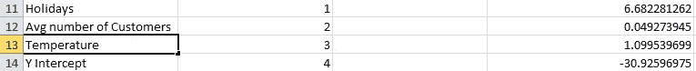

9-现在，基于上述值，我们将计算我们的预测值，在 E2 中输入以下等式:=A2*D$13+B2*D$12+C2*D$11+D$14，并将其拖放到 E9

10-在 F2 中输入下面的等式，并将其拖动到 F9:=幂(D2-E2，2)

11-在 F11 中输入下面的等式:=SUM(F2:F9)这将计算误差的总和，你可以总是尝试从 D11 到 D14 的值，以便有更少的误差，所以我们将有一个更好的预测:

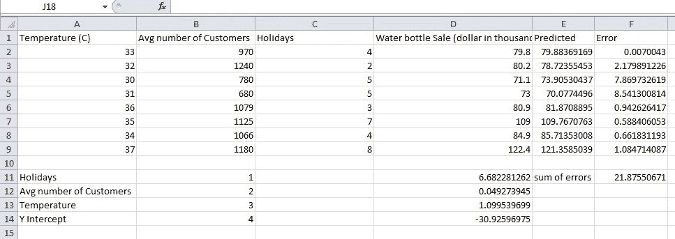

你可以随时通过下载这个[链接](https://github.com/AlbertAssaad/DataMiningApplyingitonExcel/blob/master/LinearRegression%202%20final.xlsx)来检查最终结果，这就是本次会议的全部内容，我将很快发布下一部分。

感谢您的阅读！！

[学习数据挖掘在 Excel 上的应用(下)=>= ](/analytics-vidhya/learn-data-mining-by-applying-it-on-excel-part-2-6c3e380fde06)