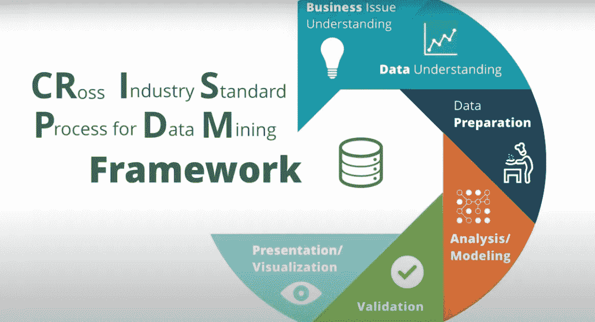

# 使用 CRISP-DM 框架学习数据科学

> 原文：<https://medium.com/analytics-vidhya/learn-data-science-using-crisp-dm-framework-473960b2da90?source=collection_archive---------0----------------------->

## 如果您对令人兴奋的数据科学世界感兴趣，但不知道从哪里开始，CRISP-DM Framework 可以帮助您。

让我们一个一个来看看这些步骤是如何在 flow 中对学习数据科学起到至关重要的作用的~