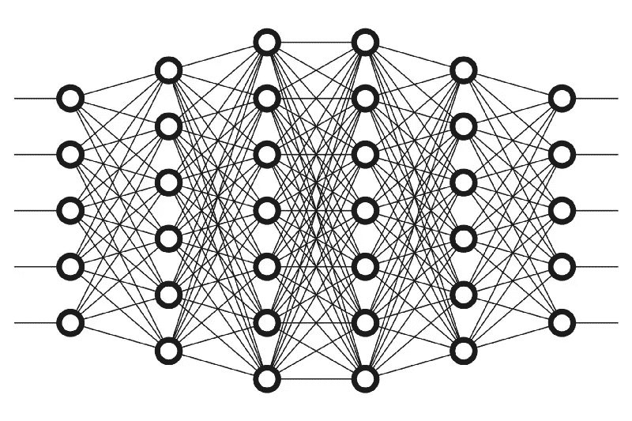
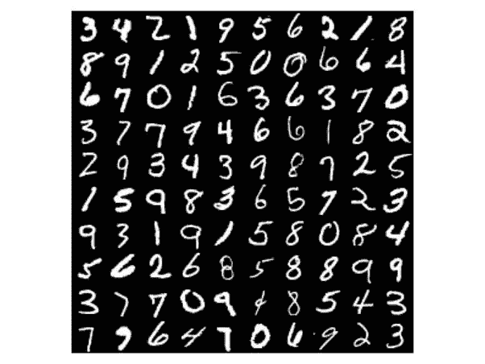

# 构建简单神经网络的分步指南

> 原文：<https://medium.com/analytics-vidhya/learn-deep-learning-by-building-one-d178f933623d?source=collection_archive---------15----------------------->

弄清楚神经网络如何工作的最快方法是建立一个神经网络。



你在这里是因为，和我一样，你对深度学习的兴起感到兴奋。此外，你想知道深度学习是如何工作的——它们背后的本质进步。

然而，学习深度学习并不简单——然而它需要一些投资来掌握这门学科。我走过密密麻麻的视频，寻找可穿透的教学活动，琢磨如何完成两三个模型。

对我来说，学习是方便的信息。亲身参与主题可以改变你的洞察力。如果你也这样做，在这篇文章结束时，你将会有一个有效的深度学习模型，并能很好地理解它们是如何工作的。

# 背景

理解深度学习如何运作的根本举措是理解重要术语之间的复杂性。

***【AI】***人工智能是机器，尤其是计算机系统对人类智能形式的再造。这些程序包括学习、思考和自我纠正。

***机器学习*** 是人工智能的一种应用，是在没有明确编程的情况下让计算机行动的研究。

***深度学习*** 是一类机器学习算法，它使用许多层来不断地从原始输入中提取更重要的层次高光。

***神经网络*** 是一系列算法，试图通过反映人类思维工作方式的程序来感知大量信息中的隐藏联系。

# 神经网络是如何工作的？

神经网络的工作方式类似于人脑。*神经网络中的神经元*是一段按照指定架构协同工作的数学信息。神经网络具有一系列层，这些层具有互连的节点。节点，也称为神经元或感知器，是一个计算单元，至少有一个加权输入信息，一个以某种方式组合输入的传递函数，以及一个输出连接。


神经网络中包含的层类型如下:

1.  **输入层:**输入信息，也称为可见层。
2.  **隐藏层:**输入层和输出层之间的节点层。深度学习中的*深*暗指有不止一个隐藏层。
3.  **输出层:**产生输出信息的层。

# 开始之前…

*先决条件，*你应该能熟练读写一个基本的 python 程序，稳定的互联网连接(编程是在基于云的平台上完成的，即 [Google colab](https://colab.research.google.com/) )和一些 python 库(即 Keras，TensorFlow，matplotlib)。

我们通过一句“你好，世界！”来学习基本的编程语言举例。同样，我们应该从深度学习的 Hello World 开始学习，使用手写数字的 MNIST 数据集。

MNIST 数据库包含 60，000 幅训练图像和 10，000 幅包含手写数字(0-9)的测试图像。此外，来自 NIST 的黑白图像被归一化以适合 28x28 像素的边界框，并进行抗锯齿处理，这引入了灰度级。



# 构建神经网络

在你喜欢的浏览器上，我个人更喜欢 Chrome。打开*[*Google Colab*](https://colab.research.google.com/)*，*新建一个 Python 3+文件，名为*handled _ digit . py .*万一迷路了，可以参考[源代码](https://colab.research.google.com/drive/12rCxNaCBHqO2wEnYZ2dSjm0KZAdInpnL)。*

***导入库***

```
*import tensorflow as tf
import matplotlib.pyplot as plt*
```

***下载数据集***

*事实上，Keras 允许我们直接从 API 下载数据集，具体做法如下:*

```
*mnist = tf.keras.datasets.mnist
(x_train, y_train), (x_test, y_test) = mnist.load_data()**Output**:
Using TensorFlow backend.
Downloading data from [https://s3.amazonaws.com/img-datasets/mnist.npz](https://s3.amazonaws.com/img-datasets/mnist.npz)
11493376/11490434 [==============================] — 4s 0us/step*
```

*如果您运行以下命令:*

```
*x_train.shape
x_test.shape**Output**:
(60000, 28, 28)
(10000, 28, 28)*
```

*正如我们之前讨论的，训练和测试分别有 60000 和 10000 幅图像。*

***绘制数据集***

*让我们想象一下数据库中的一幅图像:*

```
*plt.subplot(221)
plt.imshow(x_train[0], cmap=plt.get_cmap('gray'))
# show the plot
plt.show()*
```

*输出:*

**

***图像的标准化***

*因为所有的图像都是灰度的，所以每个像素值可以是 0-255 之间的任何值。如果你想在 0-1 之间减少，那么这将有助于神经网络运行得更快。这被称为正常化。*

```
*# normalize inputs from 0-255 to 0-1
x_train, x_test = x_train / 255.0, x_test / 255.0*
```

***定义模型***

*我们首先用下面的语法定义一个顺序模型。现在，只需使用。add()函数如下所示:*

```
*model = tf.keras.models.Sequential([
tf.keras.layers.Flatten(input_shape=(28, 28)),
tf.keras.layers.Dense(512, activation=tf.nn.relu),
tf.keras.layers.Dense(256, activation=tf.nn.relu),
tf.keras.layers.Dense(128, activation=tf.nn.relu),
tf.keras.layers.Dense(10, activation=tf.nn.softmax)
])
model.summary()**Output**:Model: "sequential_1" _________________________________________________________________ Layer (type)                 Output Shape              Param #    ================================================================= flatten_1 (Flatten)          (None, 784)               0          _________________________________________________________________ dense_2 (Dense)              (None, 512)               401920     _________________________________________________________________ dense_3 (Dense)              (None, 256)               131328     _________________________________________________________________ dense_4 (Dense)              (None, 128)               32896      _________________________________________________________________ dense_5 (Dense)              (None, 10)                1290       ================================================================= Total params: 567,434 Trainable params: 567,434 Non-trainable params: 0*
```

***模型训练***

*我们现在可以拟合和评估模型。该模型在 10 个时期内进行了更新。测试数据用作验证数据集，允许您在模型训练时查看模型的技能。本文不讨论优化器和损失函数。*

```
*model.compile(optimizer='adam',
              loss='sparse_categorical_crossentropy',
              metrics=['accuracy'])model.fit(x_train, y_train, epochs=10, validation_data=[x_test, y_test])scores = model.evaluate(x_test, y_test, verbose=0)
print("Baseline Error: %.2f%%" % (100-scores[1]*100))Output:
Train on 60000 samples, validate on 10000 samples
Epoch 1/10
60000/60000 [==============================] - 7s 114us/sample - loss: 0.0200 - acc: 0.9932 - val_loss: 0.0713 - val_acc: 0.9827
Epoch 2/10
60000/60000 [==============================] - 7s 111us/sample - loss: 0.0132 - acc: 0.9954 - val_loss: 0.0907 - val_acc: 0.9776
Epoch 3/10
60000/60000 [==============================] - 7s 110us/sample - loss: 0.0126 - acc: 0.9956 - val_loss: 0.0816 - val_acc: 0.9815
Epoch 4/10
60000/60000 [==============================] - 6s 107us/sample - loss: 0.0093 - acc: 0.9966 - val_loss: 0.0859 - val_acc: 0.9807
Epoch 5/10
60000/60000 [==============================] - 7s 114us/sample - loss: 0.0099 - acc: 0.9969 - val_loss: 0.1007 - val_acc: 0.9796
Epoch 6/10
60000/60000 [==============================] - 7s 115us/sample - loss: 0.0090 - acc: 0.9969 - val_loss: 0.0977 - val_acc: 0.9784
Epoch 7/10
60000/60000 [==============================] - 7s 113us/sample - loss: 0.0091 - acc: 0.9970 - val_loss: 0.0898 - val_acc: 0.9820
Epoch 8/10
60000/60000 [==============================] - 7s 113us/sample - loss: 0.0057 - acc: 0.9982 - val_loss: 0.0944 - val_acc: 0.9801
Epoch 9/10
60000/60000 [==============================] - 7s 112us/sample - loss: 0.0085 - acc: 0.9973 - val_loss: 0.0952 - val_acc: 0.9818
Epoch 10/10
60000/60000 [==============================] - 7s 110us/sample - loss: 0.0062 - acc: 0.9980 - val_loss: 0.0991 - val_acc: 0.9828
Baseline Error: 1.73%<tensorflow.python.keras.callbacks.History at 0x7f05ee07aeb8>*
```

*在 CPU 上运行该示例可能需要几分钟时间。*

***保存模型***

*以所需的名称将模型保存在所需的路径中，并可用于对真实示例的测试。*

```
*model.save('handwritten_digit.h5')*
```

*更重要的是，那是一个总结…去找几个同伴一起帮助测试你的深度学习知识。*

*我相信这促使你去做一些新的东西。我对神经网络很着迷，因为我认为深度学习将很快改变我们考虑计算机视觉、语音识别、自然语言处理、音频识别、社交网络过滤等更多问题的方式。*

*如果你喜欢这篇文章，如果对你来说都一样，给我几个掌声，让更多的人看到它。非常感谢！*