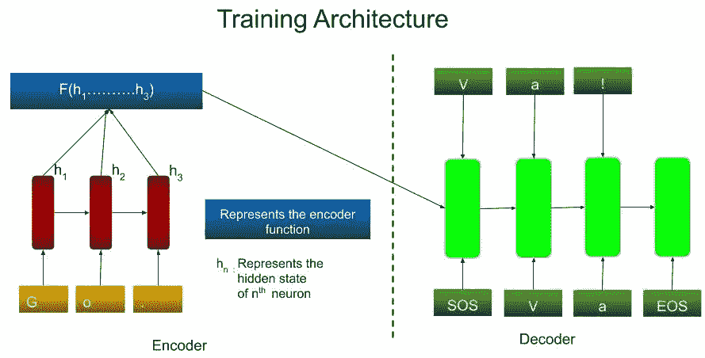
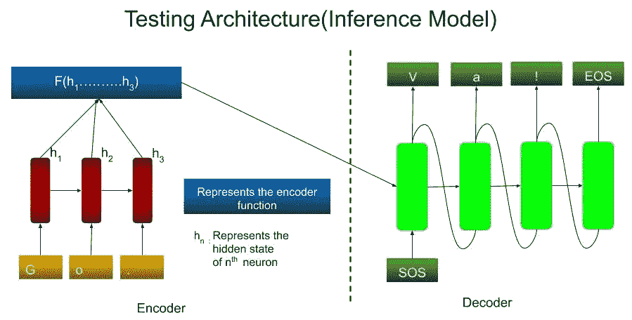
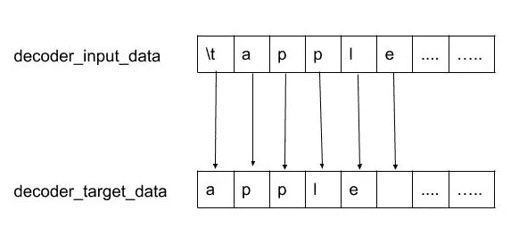
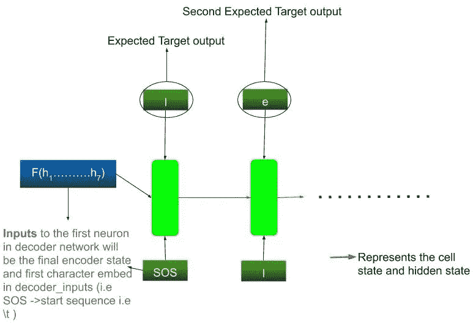
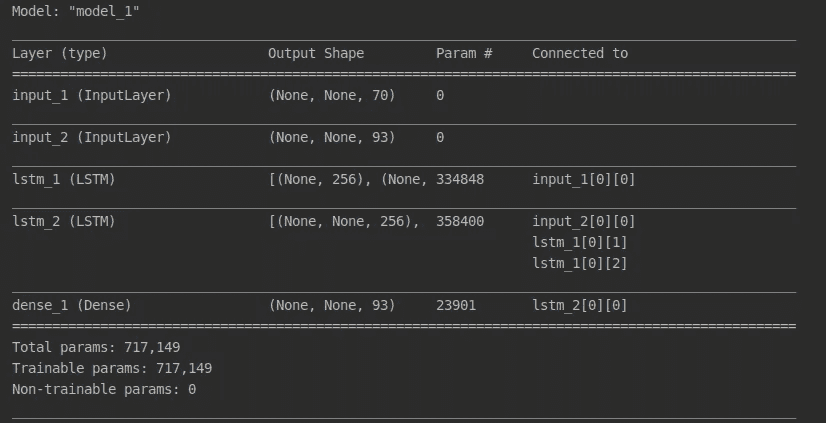
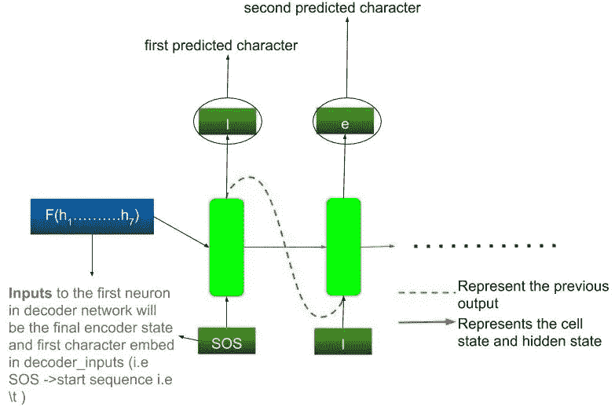
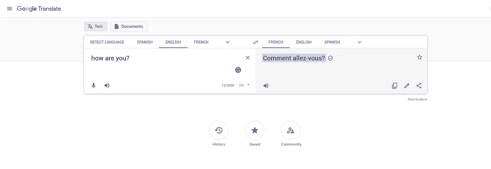

# 了解如何构建语言翻译器

> 原文：<https://medium.com/analytics-vidhya/learn-how-to-build-a-language-translator-648d30845681?source=collection_archive---------4----------------------->

我们都遇到过在线翻译服务。它将输入从一种语言翻译成另一种语言。但是你有没有想过这是怎么做到的？！通过这篇文章，让我们试着理解它是如何完成的，也让我们试着用 python 构建一个简单的翻译器。

这篇文章的灵感来自于 Keras 中的[介绍序列到序列学习的博客。](https://blog.keras.io/a-ten-minute-introduction-to-sequence-to-sequence-learning-in-keras.html)


图片来源:pixabay

在构建翻译器之前，我们需要知道深度学习中的一些概念，所以让我们开始探索这些概念。

**什么是序列对序列学习？**

序列对序列(seq2seq)就是创建模型，将序列从一个域转换到另一个域。例如，将**中的文本从一种语言转换成另一种语言**，或者将一个人的**声音转换成另一个人的**声音，等等。所以，问题是为什么我们不使用简单的 LSTM 或 GRU 层模型来达到这个目的呢？或者为什么我们为此目的使用特定的序列对序列模型技术？答案很简单，如果输入和输出长度相同，那么我们可以很容易地使用简单的 LSTM 和 GRU 层，但这里的**输入和输出长度不同**(以语言翻译为例，英语句子中的单词数将不等于法语中表示相同意思的句子的单词数)，因此我们被迫为此采用不同的方法。

由于输入和输出序列的长度不同，为了开始预测目标输出，要考虑整个输入序列。现在，让我们看看它是如何工作的。

在顺序对顺序的方法中，我们遇到了两种不同的架构

1.  培训架构
2.  测试架构(推理模型)

训练和测试架构都有编码器和解码器。在这两种情况下，编码器架构保持相同，但解码器架构略有不同。

**培训架构**

如图 1 所示，在训练架构中，我们有两个部分，编码器部分和解码器部分。**编码器(RNN 层)**将每个字符(英文字符)作为输入，并将它们转换成某种隐藏的表示。所有这些隐藏的表示然后通过函数 F 传递，使得它产生**一个编码向量**。

在**解码器(RNN 层)**中，从编码向量和起始序列字符(SOS，在我们的例子中我们使用' \t ')作为输入开始，然后神经网络通过某种方式更新其特征(称为教师强制)而被强制产生其相应的目标。从下一个时间步长开始，输入将是每个字符(在我们的例子中是法语字符)和先前的解码器状态。**有效，解码器学习生成** `**targets[t+1...]**` **给定** `**targets[...t]**` **，*以输入序列*为条件。**



图 1: **用于训练的序列对序列模型架构**

**测试架构(推理模型)**

如图 2 所示，测试架构(**用于预测输出**)也有两个部分，编码器部分和解码器部分。编码器(RNN 层)作为训练架构中的编码器层工作(即，它逐个字符地接受输入并产生单个编码向量)。

现在**解码器层(先前训练的网络)**将编码向量和起始序列作为输入，并试图产生第一个目标字符(猜测输出)，从下一个时间步开始，编码器将先前预测的字符和解码器状态作为输入，并试图产生目标输出。重复该过程，直到预测到停止序列(EOS)(参见图 2)。



图 2: **用于测试的序列到序列模型架构**

## 我们来编码吧！

构建翻译器的第一步是建立一个安装了必要库的环境。

```
pip install keras
pip install tensorflow
pip install numpy
```

> 让我们创建一个文件名为 train.py 的文件

现在，让我们导入库并定义参数

```
from keras.models import Model
from keras.layers import Input, LSTM, Dense
import numpy as npbatch_size = 64      # Batch size for training.
epochs = 100         # Number of epochs to train for.
latent_dim = 256     # Latent dimensionality of the encoding space.
num_samples = 10000  # Number of samples to train on.
```

下一步是准备数据集。我们将使用成对英语句子及其法语翻译的数据集，你可以从 manythings.org/anki 下载。一旦我们下载了数据集，我们只需设置访问数据集的路径，如下所示。

```
# Path to the data txt file on disk.
path = 'fra-eng/fra.txt'
```

现在下一步是对数据进行矢量化。因此，为了对数据进行矢量化，我们从读取文本文件中的每一行开始，并将其附加到一个列表中。

```
input_texts = []
target_texts = []
input_characters = set()
target_characters = set()with open(path, 'r', encoding='utf-8') as f:
    lines = f.read().split('\n')
print(lines[1:5])**Output**['Hi.\tSalut !\tCC-BY 2.0 (France) Attribution: tatoeba.org #538123 (CM) & #509819 (Aiji)', 'Hi.\tSalut.\tCC-BY 2.0 (France) Attribution: tatoeba.org #538123 (CM) & #4320462 (gillux)', 'Run!\tCours\u202f!\tCC-BY 2.0 (France) Attribution: tatoeba.org #906328 (papabear) & #906331 (sacredceltic)', 'Run!\tCourez\u202f!\tCC-BY 2.0 (France) Attribution: tatoeba.org #906328 (papabear) & #906332 (sacredceltic)']
```

在这里，对于本教程，我们只考虑数据集的前 10000 行。我们希望将英语文本作为输入文本，法语文本作为目标文本。

```
for line in lines[:10000]:
    input_text, target_text, _ = line.split('\t')print(input_text,target_text)
**Output** .......
Someone called. Quelqu'un a téléphoné.
Stay out of it. Ne t'en mêle pas !
Stay out of it. Ne vous en mêlez pas !
Stop grumbling. Arrête de râler.
Stop grumbling. Arrête de ronchonner.
Stop poking me. Arrête de m'asticoter !
.......
```

我们需要为目标文本定义开始序列字符和结束序列字符。我们使用'*制表符*作为字符的开头，使用' *\n'* 作为字符的结尾。

*注意:下面使用相同的 for 循环(如上所示)。这样做是为了解释概念。新添加的行用* ***粗体*** *字母书写。*

```
for line in lines[: 10000]:    
    input_text, target_text, _ = line.split('\t')
    # We use "tab" as the "start sequence" character
    # for the targets, and "\n" as "end sequence" character.
    **target_text = '\t' + target_text + '\n'
    input_texts.append(input_text)
    target_texts.append(target_text)**
```

到目前为止，我们分别将英语文本填充到输入文本，将法语文本填充到目标文本列表。

现在，我们想为英语文本和法语文本创建一个独特的字符列表。为此，我们将文本中所有唯一的字符添加到相应的列表中，如下所示。

```
for line in lines[: 10000]:
    input_text, target_text, _ = line.split('\t')
    # We use "tab" as the "start sequence" character
    # for the targets, and "\n" as "end sequence" character.
    target_text = '\t' + target_text + '\n'
    input_texts.append(input_text)
    target_texts.append(target_text)
    **for char in input_text:
        if char not in input_characters:
            input_characters.add(char)
    for char in target_text:
        if char not in target_characters:
            target_characters.add(char)
print(input_characters)
print(target_characters)****output:**{'?', 's', 'Q', 'o', 'v', '8', '0', 'R', 'L', 'n', 'T', 'I', 'H', ',', '9', 'B', 'W', 'l', 'm', 'A', ' ', 'f', 'U', 'k', 'y', '1', 'c', '5', 'V', 'O', 'h', ':', 'j', 'e', 'z', '$', '&', 'C', 'q', 'M', '%', 'w', 'r', 'i', 'g', 'b', '-', '2', '7', 'P', 'Y', 'd', 'N', 'S', 'D', "'", '!', '6', '.', 'x', '3', 'F', 't', 'J', 'K', 'E', 'a', 'u', 'G', 'p'}{'ô', '?', 'Q', 'o', 'ê', '0', 'à', 'm', 'f', '5', 'V', '«', 'O', 'j', 'e', '&', '\xa0', 'M', 'i', '2', 'd', 'D', "'", 'ï', 'K', 'J', 'E', '1', 'è', 'À', 't', 'é', '\u202f', 'v', ')', 'B', 'œ', '’', 'l', '(', 'c', ':', '$', '\t', 'C', 'q', 'N', 'S', 'x', '3', 'p', '8', 'R', 'L', 'T', 'I', '9', 'É', 'A', 'k', 'y', 'û', 'z', 'r', '»', '-', 'P', 'Y', '!', '.', 'a', 'u', 'Ç', 's', 'ç', 'n', 'H', ',', 'U', ' ', 'Ê', 'ë', '\n', 'h', 'ù', '%', 'g', 'b', '\u2009', 'F', 'â', 'G', 'î'}
```

接下来，我们要定义一些将用于特征工程零件的参数。

**输入字符:**输入字符的排序列表

**目标字符:**目标字符的排序列表

**num_encoder_tokens:** 输入字符列表长度

**num_decoder_tokens:** 目标字符列表长度

**max _ encoder _ seq _ length:**输入集合中最大长度文本的长度

**max _ decoder _ seq _ length:**目标集合中最大长度文本的长度

```
input_characters = sorted(list(input_characters))
target_characters = sorted(list(target_characters))
num_encoder_tokens = len(input_characters)
num_decoder_tokens = len(target_characters)
max_encoder_seq_length = max([len(txt) for txt in input_texts])
max_decoder_seq_length = max([len(txt) for txt in target_texts])
```

我们还需要一个字符来索引输入和目标字符列表的映射。

```
input_token_index = dict([(char, i) for i, char in enumerate(input_characters)])
target_token_index = dict([(char, i) for i, char in enumerate(target_characters)])print(input_token_index)
print(target_token_index)**Output** {' ': 0, '!': 1, '$': 2, '%': 3, '&': 4, "'": 5, ',': 6, '-': 7, '.': 8, '0': 9, '1': 10, '2': 11, '3': 12, '5': 13, '6': 14, '7': 15, '8': 16, '9': 17, ':': 18, '?': 19, 'A': 20, 'B': 21, 'C': 22, 'D': 23, 'E': 24, 'F': 25, 'G': 26, 'H': 27, 'I': 28, 'J': 29, 'K': 30, 'L': 31, 'M': 32, 'N': 33, 'O': 34, 'P': 35, 'Q': 36, 'R': 37, 'S': 38, 'T': 39, 'U': 40, 'V': 41, 'W': 42, 'Y': 43, 'a': 44, 'b': 45, 'c': 46, 'd': 47, 'e': 48, 'f': 49, 'g': 50, 'h': 51, 'i': 52, 'j': 53, 'k': 54, 'l': 55, 'm': 56, 'n': 57, 'o': 58, 'p': 59, 'q': 60, 'r': 61, 's': 62, 't': 63, 'u': 64, 'v': 65, 'w': 66, 'x': 67, 'y': 68, 'z': 69}
{'\t': 0, '\n': 1, ' ': 2, '!': 3, '$': 4, '%': 5, '&': 6, "'": 7, '(': 8, ')': 9, ',': 10, '-': 11, '.': 12, '0': 13, '1': 14, '2': 15, '3': 16, '5': 17, '8': 18, '9': 19, ':': 20, '?': 21, 'A': 22, 'B': 23, 'C': 24, 'D': 25, 'E': 26, 'F': 27, 'G': 28, 'H': 29, 'I': 30, 'J': 31, 'K': 32, 'L': 33, 'M': 34, 'N': 35, 'O': 36, 'P': 37, 'Q': 38, 'R': 39, 'S': 40, 'T': 41, 'U': 42, 'V': 43, 'Y': 44, 'a': 45, 'b': 46, 'c': 47, 'd': 48, 'e': 49, 'f': 50, 'g': 51, 'h': 52, 'i': 53, 'j': 54, 'k': 55, 'l': 56, 'm': 57, 'n': 58, 'o': 59, 'p': 60, 'q': 61, 'r': 62, 's': 63, 't': 64, 'u': 65, 'v': 66, 'x': 67, 'y': 68, 'z': 69, '\xa0': 70, '«': 71, '»': 72, 'À': 73, 'Ç': 74, 'É': 75, 'Ê': 76, 'à': 77, 'â': 78, 'ç': 79, 'è': 80, 'é': 81, 'ê': 82, 'ë': 83, 'î': 84, 'ï': 85, 'ô': 86, 'ù': 87, 'û': 88, 'œ': 89, '\u2009': 90, '’': 91, '\u202f': 92}
```

**特色工程**

根据维基百科的说法，**特征工程**是利用数据的[领域知识](https://en.wikipedia.org/wiki/Domain_knowledge)创建[特征](https://en.wikipedia.org/wiki/Feature_(machine_learning))的过程，使[机器学习](https://en.wikipedia.org/wiki/Machine_learning)算法工作。特征工程是机器学习应用的基础，既困难又昂贵。

现在，是生成特性的时候了。为了生成特征向量，我们使用了**一键编码。**要了解更多关于一键编码的信息，请观看此视频。

解释:一键编码

为了生成特性，我们首先需要定义变量来存储独热编码数据。我们使用 3D numpy 数组来存储独热编码数据。第一个维度对应于我们考虑的样本文本的数量(这里是 10000)。第二维表示最大编码器/解码器序列长度(这意味着样本中最长文本的长度),第三维表示 input _ char ecter/target _ char ecter 中存在的唯一字符的数量。

我们使用三个变量来存储数据。

1.  encoder_input_data:编码器输入数据存储一次性编码的输入文本(英文文本)数据。
2.  解码器输入数据存储一个热编码的输入文本(相应的法语文本)数据。
3.  decoder_target_data:解码器目标数据存储独热编码的目标数据(即对应于 decoder_input_data 要生成的数据)。



图 3。解码器输入数据 vs 解码器目标数据(内部表示)

```
encoder_input_data = np.zeros((len(input_texts), max_encoder_seq_length, num_encoder_tokens),dtype='float32')decoder_input_data = np.zeros((len(input_texts), max_decoder_seq_length, num_decoder_tokens),dtype='float32')decoder_target_data = np.zeros((len(input_texts), max_decoder_seq_length, num_decoder_tokens),dtype='float32')for i, (input_text, target_text) in enumerate(zip(input_texts, target_texts)):
    for t, char in enumerate(input_text):
        encoder_input_data[i, t, input_token_index[char]] = 1.
    encoder_input_data[i, t + 1:, input_token_index[' ']] = 1.
    for t, char in enumerate(target_text):
        # decoder_target_data is ahead of decoder_input_data by one timestep
        decoder_input_data[i, t, target_token_index[char]] = 1.
        if t > 0:
            # decoder_target_data will be ahead by one timestep
            # and will not include the start character.
            decoder_target_data[i, t - 1, target_token_index[char]] = 1.
    decoder_input_data[i, t + 1:, target_token_index[' ']] = 1.
    decoder_target_data[i, t:, target_token_index[' ']] = 1.
```

到目前为止，我们已经准备好了特征向量，接下来我们需要将这些特征向量输入到相应的编码器和解码器模型中。

## 构建模型

**编码器:**首先我们为编码器定义输入序列。输入以逐个字符的方式被馈送到编码器。**对于编码器 _LSTM，我们设置了 *return_state = True。这意味着我们在输入序列的末尾获得了最终的编码隐藏表示。***该最终编码表示然后用于初始化解码器的状态。

```
# Define an input sequence and process it.
encoder_inputs = Input(shape=(None, num_encoder_tokens))
encoder = LSTM(latent_dim, return_state=True)
encoder_outputs, state_h, state_c = encoder(encoder_inputs)
# We discard `encoder_outputs` and only keep the states.
encoder_states = [state_h, state_c]
```

**解码器:**我们首先为解码器定义输入序列。第一个目标字符到解码器的输入将是**最终编码状态**和来自**一位热码编码*解码器 _ 输入 _ 数据*** *的第一个字符。*从下一步开始，解码器的输入将是**单元状态、隐藏状态(隐藏表示)**和来自**独热编码解码器数据的下一个字符。**



**图 4。解码器架构(培训)**

这里，在解码器 LSTM 中，我们给出***return _ sequences = True***以及***return _ state = True***这意味着我们在每个时间步长考虑解码器输出和两个解码器状态。

```
# Set up the decoder, using `encoder_states` as initial state.
decoder_inputs = Input(shape=(None, num_decoder_tokens))
# We set up our decoder to return full output sequences,
# and to return internal states as well. We don't use the
# return states in the training model, but we will use them in inference.
decoder_lstm = LSTM(latent_dim, return_sequences=True, return_state=True)decoder_outputs, _, _ = decoder_lstm(decoder_inputs,
                                     initial_state=encoder_states)decoder_dense = Dense(num_decoder_tokens, activation='softmax')decoder_outputs = decoder_dense(decoder_outputs)
```

**培训**

我们要训练的模型非常简单。该模型将用 RMSprop 优化器训练 100 个时期。

```
model = Model([encoder_inputs, decoder_inputs], decoder_outputs)# Run training
model.compile(optimizer='rmsprop', loss='categorical_crossentropy',
              metrics=['accuracy'])
model.fit([encoder_input_data, decoder_input_data],       decoder_target_data,
          batch_size=batch_size,
          epochs=epochs,
          validation_split=0.2)
```

训练我们的模型花了很多时间。让我们保存我们的进度:

```
# Save model
model.save('s2s.h5')
print(model.summary())
```



**型号总结**

让我们将代码保存在 **train.py** 中

## 测试(推理模式)

为了进行测试，我们首先将保存的文件(s2s.h5)加载到一个新的 python 文件中。让我们将新文件命名为 predict.py

> 文件名: **predict.py** (与 train.py 位置相同)

首先，我们必须初始化(如*输入 _ 字符，输入令牌 _ 索引，*等。)所有变量，如在 train.py 中所做的那样。这样做是为了重建用于预测的编码器-解码器模型。

```
from __future__ import print_functionfrom keras.models import Model, load_model
from keras.layers import Input, LSTM, Dense
import numpy as npbatch_size = 64  # Batch size for training.
epochs = 100  # Number of epochs to train for.
latent_dim = 256  # Latent dimensionality of the encoding space.
num_samples = 10000  # Number of samples to train on.
# Vectorize the data.
input_texts = []
target_texts = []
input_characters = set()
target_characters = set()path = 'fra-eng/fra.txt'
with open(path, 'r', encoding='utf-8') as f:
    lines = f.read().split('\n')
for line in lines[: min(num_samples, len(lines) - 1)]:
    input_text, target_text, _ = line.split('\t')
    # We use "tab" as the "start sequence" character
    # for the targets, and "\n" as "end sequence" character.
    target_text = '\t' + target_text + '\n'
    input_texts.append(input_text)
    target_texts.append(target_text)
    for char in input_text:
        if char not in input_characters:
            input_characters.add(char)
    for char in target_text:
        if char not in target_characters:
            target_characters.add(char)input_characters = sorted(list(input_characters))
target_characters = sorted(list(target_characters))
num_encoder_tokens = len(input_characters)
num_decoder_tokens = len(target_characters)
max_encoder_seq_length = max([len(txt) for txt in input_texts])
max_decoder_seq_length = max([len(txt) for txt in target_texts])print('Number of samples:', len(input_texts))
print('Number of unique input tokens:', num_encoder_tokens)
print('Number of unique output tokens:', num_decoder_tokens)
print('Max sequence length for inputs:', max_encoder_seq_length)
print('Max sequence length for outputs:', max_decoder_seq_length)input_token_index = dict(
    [(char, i) for i, char in enumerate(input_characters)])
target_token_index = dict(
    [(char, i) for i, char in enumerate(target_characters)])encoder_input_data = np.zeros(
    (len(input_texts), max_encoder_seq_length, num_encoder_tokens),
    dtype='float32')for i, input_text in enumerate(input_texts):
    for t, char in enumerate(input_text):
        encoder_input_data[i, t, input_token_index[char]] = 1.
```

现在，让我们加载模型。

```
# Restore the model and construct the encoder and decoder.
model = load_model('s2s.h5')
```

加载保存的模型后，让我们开始重建编码器。

*encoder_input:这里，我们实际上指定了编码器接受的输入类型。*(即*张量(" input_1:0 "，shape=(None，None，70)，dtype=float32))。类似地，我们定义编码器 _ 输出、状态 _h_enc(隐藏状态)和状态 _c_enc(单元状态)(隐藏状态和单元状态是* ***隐藏表示*** *)。*

最后，通过使用输入张量(编码器 _ 输入)和输出张量(隐藏表示，即状态 _h_enc，状态 _c_enc ),我们创建了一个模型。这是通过使用 keras 中的 Model()函数来完成的。

```
encoder_inputs = model.input[0]   # input_1
encoder_outputs, state_h_enc, state_c_enc = model.layers[2].output   # lstm_1
encoder_states = [state_h_enc, state_c_enc]
encoder_model = Model(encoder_inputs, encoder_states)
```

在创建了编码器的模型之后，现在让我们来构建解码器。

```
decoder_inputs = model.input[1]   # input_2
decoder_state_input_h = Input(shape=(latent_dim,), name='input_3')
decoder_state_input_c = Input(shape=(latent_dim,), name='input_4')
decoder_states_inputs = [decoder_state_input_h, decoder_state_input_c]
decoder_lstm = model.layers[3]
decoder_outputs, state_h_dec, state_c_dec = decoder_lstm(
    decoder_inputs, initial_state=decoder_states_inputs)
decoder_states = [state_h_dec, state_c_dec]
decoder_dense = model.layers[4]
decoder_outputs = decoder_dense(decoder_outputs)
decoder_model = Model(
    [decoder_inputs] + decoder_states_inputs,
    [decoder_outputs] + decoder_states)
```

接下来，我们创建两个反向查找字典来解码反向序列。

```
# Reverse-lookup token index to decode sequences back to
# something readable.
reverse_input_char_index = dict(
    (i, char) for char, i in input_token_index.items())
reverse_target_char_index = dict(
    (i, char) for char, i in target_token_index.items())
```

最后，让我们写一个预测函数。(解码功能)



图 5。解码器工作|测试架构

```
# Decodes an input sequence.  Future work should support beam search.
def decode_sequence(input_seq):
    # Encode the input as state vectors.
    states_value = encoder_model.predict(input_seq)# Generate empty target sequence of length 1.
    target_seq = np.zeros((1, 1, num_decoder_tokens))
    # Populate the first character of target sequence with the start character.
    target_seq[0, 0, target_token_index['\t']] = 1.# Sampling loop for a batch of sequences
    # (to simplify, here we assume a batch of size 1).
    stop_condition = False
    decoded_sentence = ''
    while not stop_condition:
        output_tokens, h, c = decoder_model.predict(
            [target_seq] + states_value)# Sample a token
        sampled_token_index = np.argmax(output_tokens[0, -1, :])
        sampled_char = reverse_target_char_index[sampled_token_index]
        decoded_sentence += sampled_char# Exit condition: either hit max length
        # or find stop character.
        if (sampled_char == '\n' or
           len(decoded_sentence) > max_decoder_seq_length):
            stop_condition = True# Update the target sequence (of length 1).
        target_seq = np.zeros((1, 1, num_decoder_tokens))
        target_seq[0, 0, sampled_token_index] = 1.# Update states
        states_value = [h, c]return decoded_sentence
```

！！！！！！！！让我们翻译！！！！！！

```
input_sentence = "How are you?"
test_sentence_tokenized = np.zeros(
    (1, max_encoder_seq_length, num_encoder_tokens), dtype='float32')
for t, char in enumerate(input_sentence):
    test_sentence_tokenized[0, t, input_token_index[char]] = 1.
print("Input: ", input_sentence)
print("Translated: ",decode_sequence(test_sentence_tokenized))**Output** Input:  How are you?
Translated:  Comment allez-vous ?
```



谷歌翻译截图

**参考文献**

1.  [Ananth Sankar 博士利用编码器-解码器神经网络模型进行序列对序列学习](https://youtu.be/bBBYPuVUnug)
2.  [使用序列对序列学习的机器翻译。](https://nextjournal.com/gkoehler/machine-translation-seq2seq-cpu)
3.  [十分钟介绍 Keras 中的序列对序列学习](https://blog.keras.io/a-ten-minute-introduction-to-sequence-to-sequence-learning-in-keras.html)
4.  [如何在 Keras 中从加载的模型构造编码器？](https://github.com/simra/keras/blob/simra/s2srestore/examples/lstm_seq2seq_restore.py)
5.  [神经机器翻译—使用 seq2seq 和 Keras](https://towardsdatascience.com/neural-machine-translation-using-seq2seq-with-keras-c23540453c74)
6.  [深度学习中的序列对序列(Seq2Seq)模型-人工智能期刊](https://youtu.be/oF0Rboc4IJw)