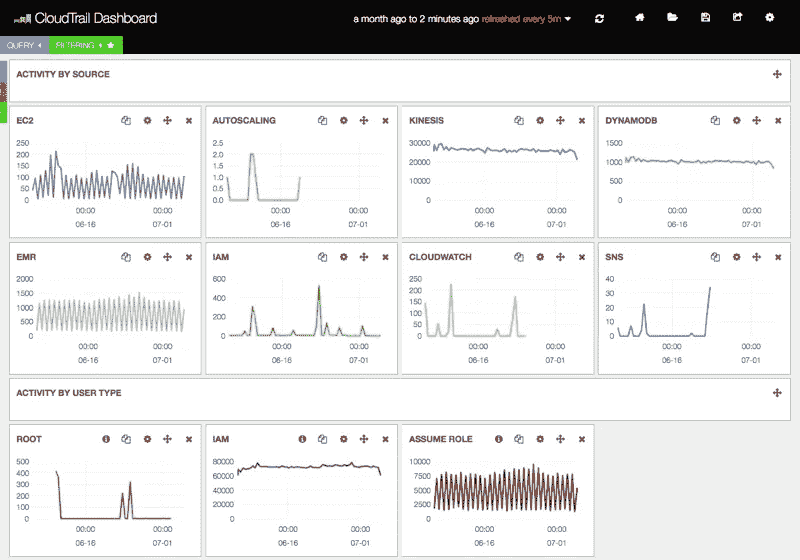
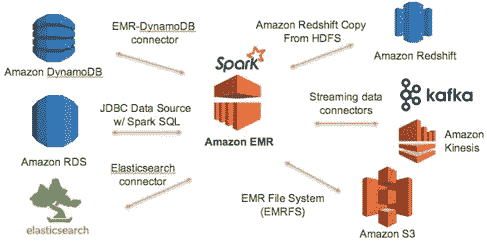

# 了解如何在 Spark 结构化流上编码和部署机器学习模型

> 原文：<https://medium.com/analytics-vidhya/learn-how-to-code-and-deploy-machine-learning-models-on-structured-streaming-868b4081d242?source=collection_archive---------0----------------------->


图片由 unsplash 上的 Carlos Muza @kmuza 提供

这篇文章是对令人惊叹的数据科学开源社区的感谢，我从这个社区中学到了很多东西。

在过去的几个月里，我一直在做我的一个副业项目，开发关于流数据的机器学习应用程序。这是一次很棒的学习经历，有很多挑战和学习，其中一些我已经在这里分享了。

这篇文章关注如何在流数据上部署机器学习模型，并涵盖了一个成功的生产应用程序的所有 3 个必要领域:**基础设施、技术和监控。**

**用 SPARK-ML 和结构化流开发机器学习模型**

任何成功的应用程序的第一步都是根据业务需求，确定编写应用程序的技术堆栈。**一般来说，当数据量巨大时，使用 Spark。**

使用 Spark 的主要好处是它在大数据处理方面的成熟能力，以及内置分布式机器学习库的可用性。使用 spark 的最初挑战是 RDD 的使用，它不直观，与数据科学家习惯使用的数据框架非常不同。然而，随着 Spark2.0 中数据集 API 的**引入，现在编写机器学习算法变得比以前更容易。**

> **在我的经历中，我发现通过适当利用“管道”框架，使用机器学习模型变得极其容易。管道所做的是提供一个结构，包括处理&清理数据、训练模型、然后将其作为对象写出所需的所有步骤。**
> 
> 然后，可以直接导入该对象来处理新数据并获得结果，从而使开发人员不必为新数据重新编写和维护处理步骤的精确副本，然后使用训练数据构建模型。

在下面的代码片段中，我试图介绍如何使用这个 API 来构建、保存和使用预测模型。为了构建和保存模型，可以遵循下面的代码结构。

```
// Create a sqlContext
 var sqlContext = new SQLContext(sparkContext)// Read the training data from a source. In this case i am reading it from a s3 location
var data = sqlContext.read.format(“csv”).option(“header”, “true”).option(“inferSchema”, “true”).load(“pathToFile”)// Select the needed messages 
 data = data.select(“field1”,”field2",”field3")// Perform pre-processing on the data 
 val process1 = … some process … 
 val process2 = … some process …// Define an evaluator
val evaluator = … evaluator of your choice …// split the data into training and test 
 val Array(trainingData, testData) = data.randomSplit(Array(ratio1, ratio2))// Define the algorithm to train. For example decision tree 
 val dt = new DecisionTree()
 .setFeaturesCol(featureColumn).setLabelCol(labelColumn)// Define the linear pipeline. Methods specified in the pipeline are executed in a linear order. Sequence of steps is binding
 val pipelineDT = new Pipeline().setStages(Array(process1, process2, dt))// Define the cross validator for executing the pipeline and performing cross validation. 
 val cvLR = new CrossValidator()
 .setEstimator(pipelineDT)
 .setEvaluator(evaluator)
 .setNumFolds(3) // Use 3+ in practice// Fit the model on training data 
 val cvModelLR = cvLR.fit(trainingData)// extract the best trained pipeline model from the cross validator. 
 val bestPipelineModel = cvModelLR.bestModel.asInstanceOf[PipelineModel]// Save the model in a s3 bucket 
 cvModelLR.write.overwrite().save(mlModelPath)
```

模型保存后，可通过以下步骤轻松用于预测流数据。

**1。从卡夫卡主题中读取数据**

```
// Create a spark session object 
 val ss = SparkSession.builder.getOrCreate()// Define schema of the topic to be consumed 
 val schema= StructType( Seq(
 StructField(“Field1”,StringType,true),
 StructField(“Field2”,IntType,true)
 )
 )// Start reading from a Kafka topic
 val records = ss.readStream
 .format(“kafka”)
 .option(“kafka.bootstrap.servers”, kafkaServer)
 .option(“subscribe”,kafkaTopic)
 .load()
 .selectExpr(“cast (value as string) as json”)
 .select(from_json($”json”,schema).as(“data”))
 .select(“data.*”)
```

**2。加载保存的 ML 模型，并将其用于预测**

```
// Load the classification model from saved location
 val classificationModel = CrossValidatorModel.read.load(mlModelPath)// Use the model to perform predictions. By default best model is used
 val results = classificationModel.transform(records)
```

**3。将结果保存到 s3 或其他位置**

以 **csv** 格式

```
// Saving results to a location as csv 
 results.writeStream.format(“csv”).outputMode(“append”)
 .option(“path”, destination_path) .option(“checkpointLocation”, checkpointPath)
 .start()
```

在**拼花地板**格式

```
// Saving results to a location as parquet 
 results.writeStream.format(“parquet”).outputMode(“append”)
 .option(“path”, destination_path) .option(“checkpointLocation”, checkpointPath)
 .start()
```

或者如果我们想将结果发送到某个数据库或任何其他扩展

```
val writer = new JDBCSink(url, user, password)
 results.writeStream
 .foreach(writer)
 .outputMode(“append”)
 .option(“checkpointLocation”, checkpointPath)
 .start()
```

*为此，需要通过扩展 spark structured streamin* g 提供的 ForeachWriter 接口来实现一个单独的编写器。下面显示了 jdbc 的示例代码，摘自[https://docs . data bricks . com/_ static/notebooks/structured-streaming-ETL-Kafka . html](https://docs.databricks.com/_static/notebooks/structured-streaming-etl-kafka.html)

```
**import** java.sql.**_****class** JDBCSink(url:String, user:String, pwd:String) **extends** ForeachWriter[(String, String)] {
 **val** driver = “com.mysql.jdbc.Driver”
 **var** connection:Connection = **_**
 **var** statement:Statement = **_**

 **def** open(partitionId: Long,version: Long): Boolean = {
 Class.forName(driver)
 connection = DriverManager.getConnection(url, user, pwd)
 statement = connection.createStatement
 true
 }**def** process(value: (String, String)): Unit = {
 statement.executeUpdate(“INSERT INTO zip_test “ + 
 “VALUES (“ + value._1 + “,” + value._2 + “)”)
 }**def** close(errorOrNull: Throwable): Unit = {
 connection.close
 }
 }

 }
 }
```

**监控、记录和警报**

下一步是在应用程序中集成监控、警报和日志记录服务，以便获得即时警报并记录应用程序的工作情况。AWS 堆栈中有许多工具可以利用。其中经常使用的是用于监控的 CloudWatch 和用于日志记录的 Elastic Search。

一个示例监控仪表板将类似于这样



图片提供:[https://github . com/Amazon-archives/cloud watch-logs-subscription-consumer](https://github.com/amazon-archives/cloudwatch-logs-subscription-consumer)

**基础设施**

一旦代码准备好进行部署，就该选择合适的基础设施来部署它了。我发现最好的基础设施是 Kafka(主要是因为它的多发行商/消费者架构和为不同主题设置保留期的能力)，以及 AWS EMR 作为运行应用程序的核心基础设施

由于预装 spark 和内部资源管理的集群的可用性，AWS EMR 成为了显而易见的选择。在短时间内全面部署新集群的能力也是一大优势。

一个简化的架构图将会是这样的。



图片提供—[https://dmhnzl 5 MP 9 mj 6 . cloudfront . net/big data _ AWS blog/images/Spark _ SQL _ Ben _ Image _ 1。巴布亚新几内亚](https://dmhnzl5mp9mj6.cloudfront.net/bigdata_awsblog/images/Spark_SQL_Ben_Image_1.PNG)

**调谐火花作业**

最后，与任何其他 spark 作业一样，在流作业的情况下，为了获得最大效率，有必要对其进行调优。调优 spark 作业的第一步是为作业选择合适的实例。在对 **M4(通用)与**C4(计算量大)实例类型进行的几个实验中，我发现 M4 的性能更好，主要是因为它还能够提供虚拟内核。

**spark 中的 DynamicAllocation** 属性在以稳定的方式最大化利用率方面也非常有用。我发现还有许多其他参数对调整性能很有用:

a)**—conf spark . yarn . executor . memory overhead**= 1024:为作业定义的内存开销

b)**—conf spark . yarn . maxappattempts**= 4:该属性定义提交应用程序的最大尝试次数。这对于将多个 spark 作业提交给一个集群，有时由于缺少可用资源而导致提交作业失败的情况非常有用。

c)**—conf spark . task . max failures = 8**:该属性设置在 spark 作业自身失败之前任务可以失败的最大次数。默认值为 2。保持这个数字较高总是一个好主意

d)**—conf spark . speculation = false**:当该属性设置为 true 时，yarn 会根据任务消耗的时间自动终止并重新分配任务(如果 yarn 认为任务被阻塞)。在我们的例子中，我们没有发现这在性能上有很大贡献，但是在处理倾斜的数据集时，这是一个很好的属性

e)**—conf spark . yarn . max . executor . failures**= 15:应用程序失败前的最大执行器失败次数。请始终将其设置为较高的数值。

f)**—conf spark . yarn . executor . failures validity interval**= 1h:定义执行器故障有效的时间间隔。结合以上性质基本上在一个小时内最多有 15 个执行者会在任务结束前失败。

g) **—驱动内存** 10g:提供足够高的驱动内存，以便在要处理突发消息的情况下不会失败。

我希望这份材料对那些刚开始学习结构化流的人有用。能够为开源社区做出贡献将是一件愉快的事情，通过这个社区我学到了很多东西。

有关更详细的技术概述，请访问[https://spark . Apache . org/docs/2 . 0 . 0/structured-streaming-programming-guide . html](https://spark.apache.org/docs/2.0.0/structured-streaming-programming-guide.html)