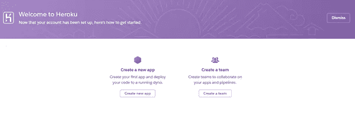
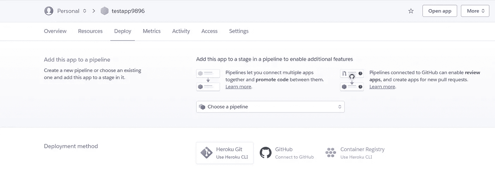
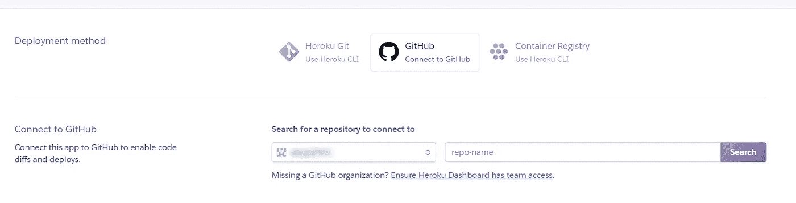
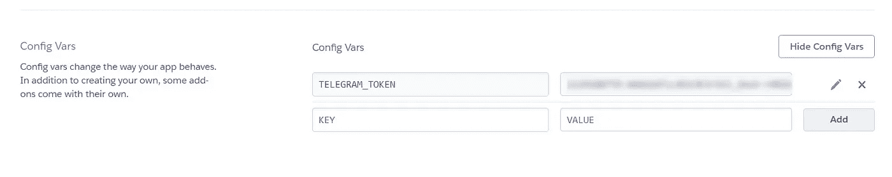
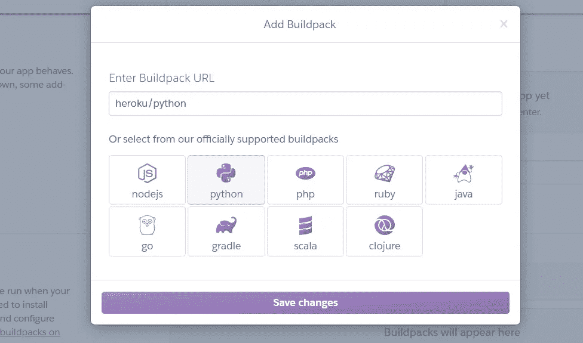
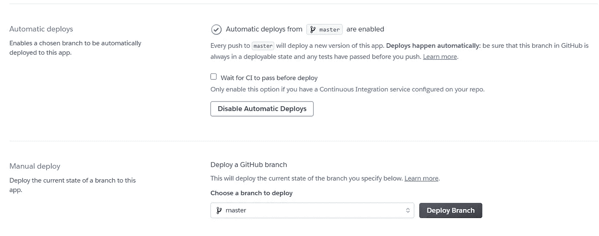
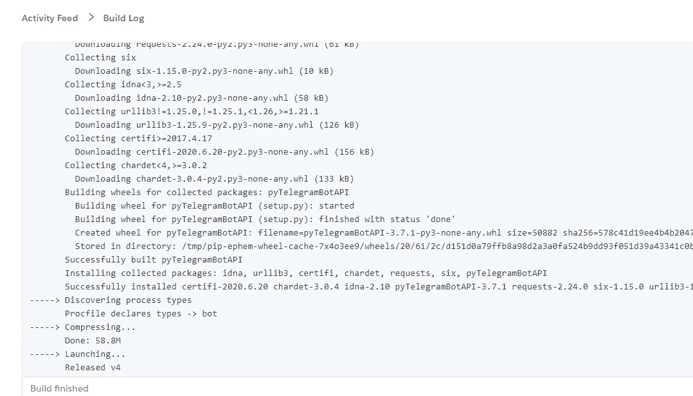
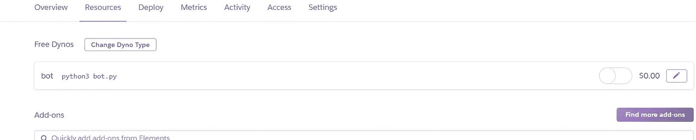

# 在 Heroku 中构建并部署一个简单的 YouTube 下载器 bot

> 原文：<https://medium.com/analytics-vidhya/learn-how-to-deploy-into-heroku-3158a41b46fb?source=collection_archive---------5----------------------->


Heroku 标志

## 什么是 Heroku？

> ***Heroku*** *是一个支持多种编程语言的云平台即服务(PaaS)。作为首批云平台之一，Heroku 从 2007 年 6 月开始开发，当时它只支持 Ruby 编程语言，但现在支持 Java、Node.js、Scala、Clojure、Python、PHP 和 Go。*

本文是“使用 Python 构建和部署您的第一个电报机器人”的扩展。如果您尚未查看，请访问:

[](/@krsh37/build-and-deploy-your-first-telegram-bot-using-python-part-1-dcfd83bd6718) [## 使用 Python 构建和部署您的第一个电报机器人

### 如果您正在学习 python，并且想通过从事实时项目来弄脏自己的手，请过来找个座位，让…

medium.com](/@krsh37/build-and-deploy-your-first-telegram-bot-using-python-part-1-dcfd83bd6718) 

在上一篇文章中，我们已经看到了如何使用 Telegram Bot 连接和处理消息。现在，在部署之前，让我们扩展先前 bot 的功能。让我们制作一个 YouTube 下载器，如果你需要在部署之前在你的本地机器上运行/检查安装这个新的包并添加下面的功能:

```
$ pip install youtube-dl
```

将视频链接解析为可下载链接

*   ***Line 1–2****从 youtube-dl 初始化 YouTube 解析器，提供关于链接的元数据。*
*   ***第 9–20 行*** *获取可下载链接(在 args 变量中)并搜索视频的元数据。*
*   ***第 22–29 行*** *用解析后的可下载链接质量处理发送回复给用户。*

访问:[https://github.com/krsh-37/TelegramBot/tree/Heroku](https://github.com/krsh-37/TelegramBot/tree/Heroku)获取源代码/目录设置。

# 目录设置

考虑到一切正常，现在让我们开始在 Heroku 中部署所需的目录设置:

```
.
├── Procfile
├── bot.py
├── requirements.txt
└── runtime.txt
```

*   *Heroku app 包括一个*[***proc file***](https://devcenter.heroku.com/articles/procfile)**指定了 app 启动时执行的命令。您的应用程序中的每个*[*dyno*](https://devcenter.heroku.com/articles/dynos)*都属于一个声明的进程类型，它执行与该进程类型相关的启动命令。**
*   **Runtime 指定了需要在 Heroku 上运行的 python 版本。**
*   **需求包含运行我们的脚本(bot.py)所需的必要外部库/包。**

*第一个参数初始化 Dyno 的类型，接下来是应用程序名，然后是我们想要执行的文件。确保以相同的命名格式保存“Profile ”,并删除文件扩展名(如果有的话)。*

*指定 Python 版本*

*Runtime.txt 指定程序的版本(此处。python 3.6.1)。*

*要求*

*显示需求文件的示例，不包括任何内置包，如“os”或“time”包，以避免构建错误。访问[该库](https://github.com/krsh-37/TelegramBot/tree/Heroku)进行参考。*

> *更多关于 heroku 的信息请访问:[*【https://devcenter.heroku.com/categories/reference】*](https://devcenter.heroku.com/categories/reference)*

# **部署到 Heroku**

**将您的完整目录设置转换成 GitHub 存储库。和[注册一个 Heroku 账户](https://signup.heroku.com/)。因为这是我们第一次通过浏览器进行部署。但是使用 Heroku CLI/Toolbelt 对于将来的使用非常有用。**

****步骤 1** :点击“创建新应用”。**

****

**Heroku 主页**

****步骤 2** :在下一个提供的屏幕中输入你想要的应用程序名称(这应该是唯一的，稍后你可以用*appname.herokuapp.com*访问它)并创建一个应用程序。**

****第三步**:在仪表盘中，会有三个选项提示你选择部署方式，我们用的是‘GitHub’方式。点击并授权您的 github 帐户与 Heroku 连接。**

****

**仪表盘**

****第四步**:与 GitHub 成功集成后，在“repo name”框中输入存储库名称进行搜索和连接。**

****

**连接存储库**

****步骤 5** :进入设置选项卡，在“配置变量”中点击“显示配置变量”。并键入 Variable_Name 作为密钥，键入 API_KEYS 作为值。**

****

**配置 API 密钥**

****步骤 6** :在“Buildpacks”中，选择编写脚本的语言(这里是“Python”)。选择并保存更改。**

****

**添加构建包**

****第 7 步**:现在回到仪表板中的‘Deploy’选项卡，如果您想要从 Github 存储库持续集成，则从‘master’分支启用自动部署。**

****

**连续累计**

****步骤 8** :由于是第一次，点击手动部署选项卡上的‘部署分支’。并转到构建进度的 activity 选项卡，如果一切正常，您将看到一个成功的构建。**

****

**构建日志示例**

> **总是检查构建日志中的错误并相应地解决。当 GitHub 存储库中有任何进一步的更改时，Heroku 会自动构建和部署。**

****第 9 步**:转到“资源”标签，现在你可以看到“机器人”动态，点击编辑选项，打开你的免费动态。如果您没有在 Resources 选项卡下看到 Dynos，请点击 hard refresh (ctrl+F5)或检查构建日志中的任何错误。**

****

**现在你的机器人已经成功部署到 Heroku。为 ***免费 Dyno*** 计划提供每月 555 小时的服务。要升级，请参见定价计划。**总是检查构建日志**。为了获得更好的管理经验，建议使用 Heroku CLI/toolbelt。**

# **参考资料:**

**[1] [关于 Heroku](https://en.wikipedia.org/wiki/Heroku)
【2】[PyTelegramBotApi](https://github.com/eternnoir/pyTelegramBotAPI)
【3】[Youtube-dl](https://github.com/ytdl-org/youtube-dl/)**

> **如果你对 DS/ML 充满热情，让我们一起合作/学习吧！
> 在 [LinkedIn](https://www.linkedin.com/in/harikrishnaa-k-68473719b/) 上联系我。**

***学习，分享&投稿。快乐学习！！***