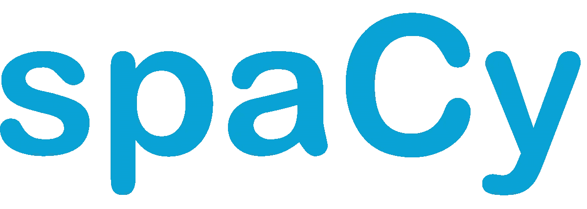

# 了解如何使用 spaCy 进行自然语言处理

> 原文：<https://medium.com/analytics-vidhya/learn-how-to-use-spacy-for-natural-language-processing-661805d3abae?source=collection_archive---------5----------------------->



## 为什么我们需要 NLP:

自然语言处理(NLP)是机器学习的一个领域，它具有计算机理解、分析、操纵和潜在生成人类语言的能力。在引擎盖下，机器学习算法只不过是一堆数学计算，显然，如果我们将单词/句子传递给机器学习模型，它们不知道如何处理。因此，我们需要做的是将它们转换成 ml 模型可以理解并对其执行操作的向量。这也是所有 NLP 库如 spaCy，nltk 出现的原因。

## 斯帕西。

spaCy 为任何 NLP 项目中常用的任务提供一站式服务，包括:

*   标记化
*   词汇化
*   词性标注
*   依存句法分析
*   单词到向量的转换
*   许多清理和规范化文本的传统方法

在本文中，我们将只关注单词到矢量的转换。

## 让我们开始吧:

但首先要做的是。我们必须知道如何安装 spaCy，pip 会为我们完成这项任务，只需执行两个命令，我们就万事大吉了。

```
pip install spacypython -m spacy download en_vectors_web_lg
```

第一个命令为我们安装 spaCy，第二个命令下载包含内置单词向量的 spaCy 模型。

当我们安装完 spaCy 后，让我们使用下面的链接下载一个包含来自 twitter 的 tweets 的数据集。

[](https://www.kaggle.com/arkhoshghalb/twitter-sentiment-analysis-hatred-speech/) [## 推特情感分析

### 下载数千个项目的开放数据集+在一个平台上共享项目。探索热门话题，如政府…

www.kaggle.com](https://www.kaggle.com/arkhoshghalb/twitter-sentiment-analysis-hatred-speech/) 

现在您已经下载了数据集，让我们使用 pandas 加载数据

```
>>data = pd.read_csv("train.csv")>>tweets = data.tweet[:100]
```

tweets 变量只保存 tweets 列。让我们来看看排名前五的推文。出于学习目的，我们选取了前 100 条推文。

```
>>tweets.head().tolist()[' @user when a father is dysfunctional and is so selfish he drags his kids into his dysfunction.   #run',"@user @user thanks for #lyft credit i can't use cause they don't offer wheelchair vans in pdx.    #disapointed #getthanked",'  bihday your majesty','#model   i love u take with u all the time in urð\x9f\x93±!!! ð\x9f\x98\x99ð\x9f\x98\x8eð\x9f\x91\x84ð\x9f\x91\x85ð\x9f\x92¦ð\x9f\x92¦ð\x9f\x92¦  ',' factsguide: society now    #motivation']
```

在我们使用 spaCy 之前，我们需要清理数据，以便我们可以从中获得有意义的单词。我们不要浪费时间讨论如何清理数据，因为我们的主要重点是使用 spaCy 进行单词到矢量的转换，因此我将粘贴我的代码，它清理数据并跳过解释部分，因为您知道如何清理数据。

```
""" Cleaning Tweets """
tweets = tweets.str.lower()# removing special characters and numbers
tweets = tweets.apply(lambda x : re.sub("[^a-z\s]","",x) )# removing stopwords
from nltk.corpus import stopwords
stopwords = set(stopwords.words("english"))
tweets = tweets.apply(lambda x : " ".join(word for word in x.split() if word not in stopwords ))>>tweets.head.tolist()['user father dysfunctional selfish drags kids dysfunction run',  'user user thanks lyft credit cant use cause dont offer wheelchair vans pdx disapointed getthanked', 
'bihday majesty',  
'model love u take u time ur',  
'factsguide society motivation']
```

我们已经清理了推文，让我们直接进入空间。

## 使用空间创建令牌:

使用 spaCy 创建令牌是小菜一碟。

```
import spacy
import en_vectors_web_lg >>nlp = en_vectors_web_lg.load()
>>document = nlp(tweets[0])
>>print("Document : ",document)
>>print("Tokens : ")
>>for token in document:
       print(token.text)Document : user father dysfunctional selfish drags kids dysfunctionTokens :
run
user 
father 
dysfunctional
selfish
drags
kids 
dysfunction 
run
```

en_vectors_web_lg.load()加载 spaCy 模型并将其存储到 nlp 变量中。这个模型是用一百万个单词训练出来的。

在 nlp(string)中，我们传递文档，然后文档被转换为“spacy.tokens.doc.Doc”并存储在一个变量文档中。我们可以看到，当我们打印一个文档时，它看起来像一个字符串，但不要误导自己，它实际上是可以迭代的空间对象。当空间对象被迭代时，我们得到的是令牌。

## 令牌到向量:

从 token 到 vector 的道路也很容易。让我借助代码向你展示

```
>>document = nlp(tweets[0])
>>print(document)
>>for token in document:
       print(token.text, token.vector.shape)user (300,)
father (300,) 
dysfunctional (300,) 
selfish (300,) 
drags (300,) 
kids (300,) 
dysfunction (300,) 
run (300,)
```

“token.vector”创建一个大小为(300，1)的向量。上面的代码是从单个句子/文档的每个单词中获取 vector。但是，如果我们的语料库中有 100 个这样的句子/文档，我们是否要迭代每个句子，为每个单词创建一个向量，然后将它们相加。不，那是错误的方法。我们能做的就是使用 nlp.pipe()。

## 使用管道的句子到向量:

nlp.pipe()将文本**作为流**进行处理，并分批缓冲它们，而不是一个接一个，并将每个文档转换为 spacy 对象。这通常更有效。然后我们可以做的不是遍历文档的每个标记，而是遍历每个文档，得到文档的向量，而不是单词。是不是令人印象深刻，我觉得是。

```
>>document = nlp.pipe(tweets)
>>tweets_vector = np.array([tweet.vector for tweet in document])
>>print(tweets_vector.shape)(100, 300)
```

因此我们得到了 300 维的 100 条推文的向量。现在我们可以做的是，使用这些创建的向量来设计一个简单的模型，如逻辑回归，或 SVM 来检测言论是否是种族主义者。而且只有简单的模型我们也可以用这些向量来训练神经网络。

## 逻辑回归模型:

由于我们已经清理了我们的推文，并将推文创建为向量，我们可以使用这些向量来预测推文是否是种族主义者。数据集中的“标签”列的值为 0 和 1。0 表示推文不是种族主义，1 表示推文是种族主义。注意，为了建模，我取了整个数据集，而不仅仅是前 100 个点。因此，让我们通过创建一个简单的模型来进行预测。

```
from sklearn.linear_model import LogisticRegression
from sklearn.model_selection import train_test_split
from sklearn.metrics import accuracy_scoreX = tweets_vector
y = data["label"]X_train,X_test, y_train, y_test = train_test_split(X,y, stratify=y, test_size=0.3, random_state=0)model = LogisticRegression(C=0.1)
model.fit(X_train, y_train)y_pred = model.predict(X_test)
print("Accuracy on test data is : %0.2f" %(accuracy_score(y_test, y_pred)*100))y_train_pred = model.predict(X_train)
print("Accuracy on train data is : %0.2f" %(accuracy_score(y_train, y_train_pred)*100))-> Accuracy on test data is : 94.49 
-> Accuracy on train data is : 94.50
```

既然您已经熟悉了 spaCy，那么您可以使用它，并从 spaCy 的文档中探索更多关于它的内容，因为我们只是触及了它的皮毛。像上面讨论的词性标注、实体识别之类的事情也可以使用 spaCy 来完成。

谢谢你。