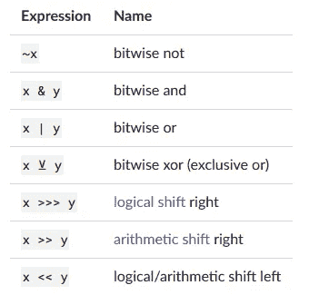

# 学习 Julia:变量、数据类型和运算

> 原文：<https://medium.com/analytics-vidhya/learn-julia-variables-data-types-and-operations-63c561b26db0?source=collection_archive---------15----------------------->


图片来自 *:* [*走向数据科学*](https://miro.medium.com/max/600/1*fep4idD8f924P1D6rlL1uw.jpeg)

## 跟我学朱莉娅

## 模块 1:了解 Julia 中可用的变量、不同的数据类型和数学运算。

你好！！！我很高兴你能和我一起踏上学习下一代语言的旅程，Julia。我从各种渠道了解朱莉娅，并在这里用一种简化过程的方式解释它。在今天的模块中，我们来看看 Julia 中可用的变量、不同的数据类型和数学运算。

在本模块的最后，我还提供了一些可能对您有用的 Jupyter 笔记本的链接。下载它们并在您的本地机器上试用。Julia 的安装过程在这里有很好的解释[。](https://www.math.uci.edu/~lzepeda/documents/ijulia_installation.pdf)

# 变量:

在 Julia 中，变量是与值关联(或绑定)的名称。当您想要存储一个值(例如，您在一些数学运算后获得的值)以备后用时，这很有用。变量名**区分大小写**，允许使用 Unicode 名称(在 **UTF-8 编码**)。

```
julia> x = 1.0 
1.0 julia> y = -3 
-3julia> δ = 0.00001 
1.0e-5julia> 안녕하세요 = "Hello" 
"Hello"
```

虽然在选择变量名时没有太多的限制，但确实有一些推荐的风格约定。

*   变量的名字是小写的。
*   单词分隔可以用下划线(`'_'`)来表示，但是不鼓励使用下划线，除非名字很难读懂。
*   `Type` s 和`Module` s 的名字以大写字母开头，单词分隔用大写字母代替下划线。
*   `function`和`macro`的名字是小写的，没有下划线。
*   写入参数的函数名称以`!`结尾。这些函数有时被称为“突变”或“就地”函数，因为它们的目的是在函数被调用后改变参数，而不仅仅是返回值。

# 数据类型:

Julia 的类型系统是动态的，但是通过可以指示某些值是特定的类型，获得了静态类型系统的一些优点。一些常见的数据类型有 Int64、Float64 和 String。

```
julia> **for** T **in**  [Int8,Int16,Int32,Int64,Int128,UInt8,UInt16,UInt32,UInt64,UInt128]            println("$(lpad(T,7)): [$(typemin(T)),$(typemax(T))]")        
**end**   

Int8: [-128,127]   
Int16: [-32768,32767]   
Int32: [-2147483648,2147483647]   
Int64: [-9223372036854775808,9223372036854775807]  
Int128: [-170141183460469231731687303715884105728,170141183460469231731687303715884105727]   
UInt8: [0,255]  
UInt16: [0,65535]  
UInt32: [0,4294967295]  
UInt64: [0,18446744073709551615] 
UInt128: [0,340282366920938463463374607431768211455]
```

这是一个简单的例子，展示了 Julia 中可用的整数数据类型及其范围。类似地，对于 **Float** ，有 3 种数据类型可用(16、32、64)。除此之外，Char，String，Bool 也是可用的。

这里值得注意的一点是，上面提到的所有数据类型都是某种类型的**抽象数据类型**，其中类型 **ANY** 是 all 的根。所有数字类型都可以自然地互操作，无需显式转换。

就像 python 一样，这里我们可以使用一个没有声明或者类型规范的变量**，但是它可能会导致计算时间**上的小**开销，这也是可以忽略的。**

我们可以用函数`typeof(x)`求出变量 x 的数据类型。

```
julia> typeof(0x1)
UInt8julia> typeof(0x1234567)
UInt32julia> typeof(5.)
Float64
```

在这些**之上，还实现了实数**和复数**数据类型。**

# **数学运算:**

Julia 提供了一个完整的基本算术和位运算符集合，涵盖了所有的数字基本类型，并提供了一个可移植的、高效的标准数学函数集合的实现。

## 算术运算:

所有原始数字类型都支持以下[算术运算符](https://en.wikipedia.org/wiki/Arithmetic#Arithmetic_operations):


图片提供:截图来自[茱莉亚](https://docs.julialang.org/en/v1/manual/mathematical-operations/)的文档页面

以下是使用这些运算符的一些示例:

```
julia> 1 + 2 + 3 
6 julia> 1 - 2 
-1 julia> 3*2/12 
0.5
```

## 位运算:

所有原始整数类型都支持以下[位运算符](https://en.wikipedia.org/wiki/Bitwise_operation#Bitwise_operators):



图片提供:截图来自茱莉亚的[文档页面。](https://docs.julialang.org/en/v1/manual/mathematical-operations/)

以下是一些按位运算符的示例:

```
julia> ~123 
-124 julia> 123 & 234 
106 julia> 123 | 234 
251 julia> 123 ⊻ 234 
145 julia> xor(123, 234) 
145 julia> ~UInt32(123) 
0xffffff84 julia> ~UInt8(123) 
0x84
```

# 其他操作:

## **更新操作:**

每个二进制算术和位运算符都有一个更新版本，将运算结果赋回其左操作数。二元操作符的更新版本是通过在操作符后立即放置一个`=`来形成的。比如写`x += 3`就相当于写`x = x + 3` 。

所有二进制算术和按位运算符的更新版本是:

```
+=  -=  *=  /=  \=  ÷=  %=  ^=  &=  |=  ⊻=  >>>=  >>=  <<=
```

## 数字比较:

为所有原始数字类型定义了标准的比较操作:


图片提供:截图来自茱莉亚的[文档页面。](https://docs.julialang.org/en/v1/manual/mathematical-operations/)

# 运算符优先级和结合性:

Julia 从最高优先级到最低优先级应用以下操作顺序和结合性:


图片提供:截图来自茱莉亚的[文档页面。](https://docs.julialang.org/en/v1/manual/mathematical-operations/)

**朱庇特笔记本:**

*   [变量](https://github.com/nagasanjay/JuliaCourseNotebooks/blob/master/Week1_7-Variables.ipynb)
*   [类型系统](https://github.com/nagasanjay/JuliaCourseNotebooks/blob/master/Week1_6-TypeSystem.ipynb)
*   [算术表达式](https://github.com/nagasanjay/JuliaCourseNotebooks/blob/master/Week1_4-ArithmeticalExp.ipynb)
*   [逻辑表达式](https://github.com/nagasanjay/JuliaCourseNotebooks/blob/master/Week1_5-LogicalExp.ipynb)

下载它们并在您的本地机器上试用。Julia 的安装过程在这里有很好的解释[。](https://www.math.uci.edu/~lzepeda/documents/ijulia_installation.pdf)

在本模块中，我们已经了解了 Julia 中可用的变量、不同的数据类型和数学运算。在下一个模块中，我们来看看关于 [**收藏和广播**](/@nagasanjayvijayan/learn-julia-collections-and-broadcasting-976f68a17f80) **。**