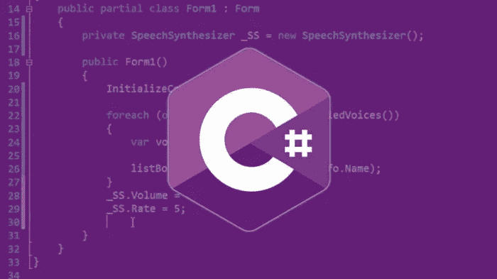

# 方法重载

> 原文：<https://medium.com/analytics-vidhya/learn-method-overloading-in-3-minutes-89d0bbf048e9?source=collection_archive---------13----------------------->



C#中的方法重载(多态性)

在这篇博客中，我将解释什么是方法重载，也称为 [**多态**](https://docs.microsoft.com/en-us/dotnet/csharp/programming-guide/classes-and-structs/polymorphism) 。

假设我们想要两个同名的不同方法。如果我们像这样定义方法，会给我们带来编译器错误:

> CS0111:类型“Class_Name”已经定义了具有相同参数类型的名为“MyMethod”的成员

# 但是我们如何处理这个错误呢？

因此，这就是方法重载有用的地方。基本上，**方法重载**的意思是**“用不同的形式定义同名的方法。”**它们可以通过三种不同的方式过载:

*   具有不同数量的参数
*   具有不同类型的参数
*   具有不同的参数顺序

这些可能会让你困惑，但你不需要担心。随着你的进步，你会明白的。

因此，现在我们有了一些基本的信息，我们可以开始理解它们。

# 具有不同数量的参数

假设我们有两个不同的方法，叫做 MyMethod。唯一的区别是它们的参数数量不同。让我们看看这个例子:

```
public int MyMethod(int number)
{
 return number;
}
public int MyMethod(int firstNumber, int secondNumber)
{
 return firstNumber + secondNumber;
}
```

如您所见，这两种方法名称相同，但参数不同。第一个函数接受一个名为`number`的整型参数。第二个函数带有两个整型参数，名为`*firstNumber*` 和`secondNumber`，结果，没有编译器错误，它们都运行良好。

所以，我们理解了多态性的第一部分。如果这部分没有任何问题，其他形式的方法重载会更简单。

现在，让我们看看方法重载的第二种方式

# 具有不同类型的参数

在这种多态性的方式中，每个方法将接受一个参数，但是它们的数据类型将是不同的。

> 注意:我使用的是 int 和 string 数据类型，但是不要忘记你可以使用任何两种不同的类型

在上面的例子中，和往常一样，我们有相同的方法名。第一种方法采用名为`number ,`的整数值，而另一种方法采用名为`*name.*`的字符串值

你可以看到这两种多态方式看起来是多么的相似。同样，第三种方法将和前两种方法一样简单。

要了解它们有多相似，请继续阅读方法重载的第三种变体。

# 具有不同的参数顺序

在第一个变体中，我们有不同数量的参数。在第二个变体中，我们有不同类型的参数。现在，我们将有相同数量的参数，但它们的顺序不同。

要了解这一点，请参阅以下内容:

```
int myNumber;public void MyMethod(int number, string name)
string myName; 
{
 myNumber = number;
 myName = name;
}
public void MyMethod(string name, int number)
{
 myName = name;
 myNumber = number;
}
```

如您所见，它们以不同的顺序接受相同的参数。他们先拿`number`再拿`name`。第二个是以相反的顺序做这个过程。也就是说，首先，它需要`name`，其次，它需要`number.`

# 结论

总而言之，方法重载是编程中最重要的话题之一。想象一下，如果你不使用它，你将会为完成相似任务的方法想出不同的名字。结果，我们理解了什么是方法重载以及如何使用它。我希望这有助于你，你喜欢它。