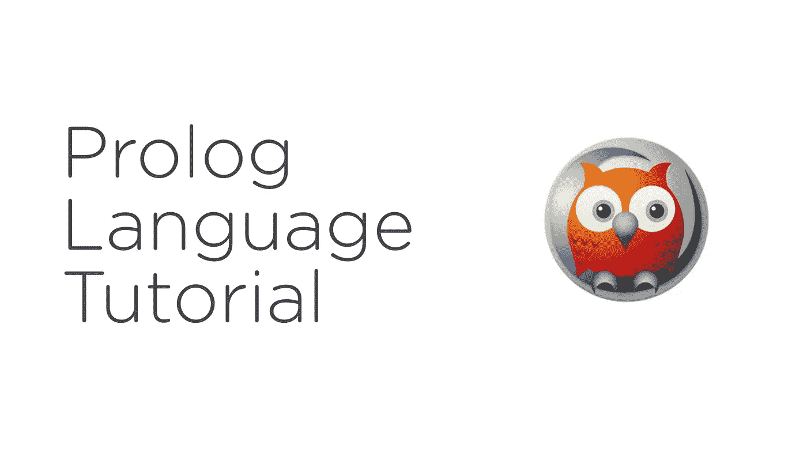

# 教程:通过创建专家系统学习 Prolog 语言

> 原文：<https://medium.com/analytics-vidhya/learn-prolog-language-by-creating-an-expert-system-d46a811c58e8?source=collection_archive---------0----------------------->

## Prolog 是一种与人工智能和计算语言学相关的逻辑编程语言。

在这个主题中，我们将从基础开始学习 PROLOG，然后构建一个小型的[专家系统](/@ibjects/introduction-to-expert-systems-in-artificial-intelligence-23d506586b21?source=---------2------------------)，它将**根据一个人的个性和情绪**向他推荐歌曲。学习英语的最好方法是…