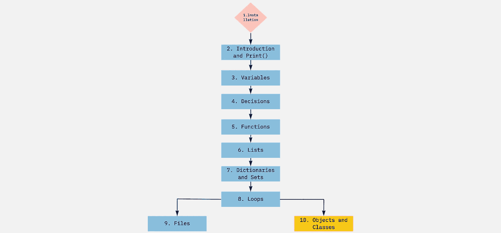

# 学习 Python:初学者的 10 个步骤

> 原文：<https://medium.com/analytics-vidhya/learn-python-10-steps-for-beginners-19bf048e0352?source=collection_archive---------23----------------------->

Python 是一种广泛用于各种商业应用的编程语言。Youtube、Instagram 和 Google 等现实世界中的知名公司将 Python(和其他语言)用于其应用程序的后端(服务器端)。这种语言很容易学习，因为大部分代码都是用可理解的英语单词编写的。本 python 指南包括练习和教程，以及大型项目的任务。

我建议您在学习 Python 时遵循这个目录。



目录

我最重要的建议——这个建议太好了，不应该列在这个清单上——就是把你在**学到的一切都应用到你自己的项目中。我已经包括了一系列你可以跟随的任务，但是你也应该在每个主题上做你自己的项目。**

[](https://github.com/erikmannsverk/Python_Tasks) [## erikmannsverk/Python_Tasks

### 这是 Python 中的任务集合。我建议你花时间学习每一门课程，就像你一样…

github.com](https://github.com/erikmannsverk/Python_Tasks) 

## 1.开始安装

首先，我建议使用 Atom 作为文本编辑器，使用终端作为输出设备。虽然您需要下载 Atom(使用下面的链接)，但终端是所有操作系统(Mac OS、Windows、Linux 等)上的内置设备。).

[](https://atom.io/) [## 21 世纪的可破解文本编辑器

### 当开发人员一起工作时，伟大的事情就会发生——从教学和分享知识到构建更好的软件…

atom.io](https://atom.io/) 

这些例子中的**终端**背后的要点是导航文件系统并在其中运行程序。在本例中，我的 python 文件(test.py)位于/documents/Python 文件夹中。终端有很多命令，但最重要的两个是 **cd** (更改目录)和 **ls** (列表文件)命令。

```
Eriks-MacBook-Pro:~ erikmannsverk$ cd documents
Eriks-MacBook-Pro:documents erikmannsverk$ cd Python
Eriks-MacBook-Pro:Python erikmannsverk$ ls
test.py
Eriks-MacBook-Pro:Python erikmannsverk$ python3 test.py
Hello, World!
```

## 2.打印

Python 的第一课是将字符串和整数打印到终端。这只是为了熟悉文本编辑器和终端的机制。

```
print('Hello, World!')TERMINAL:
# Hello, World!
```


对 Atom 和终端协同工作的简单理解

[](https://github.com/erikmannsverk/Python_Tasks/tree/main/02_print) [## erikmannsverk/Python_Tasks

### 这是 Python 中的任务集合。我建议你花时间学习每一门课程，就像你一样…

github.com](https://github.com/erikmannsverk/Python_Tasks/tree/main/02_print) 

尝试其中的一些任务！

## 3.用数字和字符串编程

要在 Python 中存储值，可以使用**变量**。变量类似于停车库中的停车位，每个停车位都有一个标识符，可以容纳一辆车。

```
P02 = 'Mercedes'
```

另一种方法是，你可以使用变量来存储汽水罐和每罐的体积，你可以将它们相乘来计算汽水的总体积。

```
cansPerPack = 6
cansVolum = 0.33
sodaInCans = cansPerRack * cansVolum
print(sodaInCans)TERMINAL:
#1.98
```

**3.1 用户输入**

要在终端中获得某种类型的**用户界面**，最简单的方法是使用**输入功能**。这是一个内置函数，在 Python 中有很多[(点击这里查看)](https://www.w3schools.com/python/python_ref_functions.asp)。要在以后重用输入，请将其存储在变量中。

```
yourName = input('What is your name? ')
print(yourName)TERMINAL:
#What is your name? Erik
#Erik
```


## 4.决定

Python 中最重要的特性之一是 if/else 语句。该语句用于验证条件是*真*还是*假*，并且仅在条件为真时运行。

```
total = 10if total > 5:
   print('Yay!')
else:
   print('Bu ..)TERMINAL:
#Yay!
```


简要了解 if 语句的工作原理

[](https://github.com/erikmannsverk/Python_Tasks/tree/main/04_decisions) [## erikmannsverk/Python_Tasks

### 这是 Python 中的任务集合。我建议你花时间学习每一门课程，就像你一样…

github.com](https://github.com/erikmannsverk/Python_Tasks/tree/main/04_decisions) 

## 5.功能

一个函数是一系列容易重用的代码。要执行函数中的代码，你必须调用它。在大多数情况下，函数接受来自用户的参数和数据，并根据传入的数据返回数据。

当函数**不带任何参数时，它被称为**过程**，如下图所示。**

```
def print_hello_world():
   print('Hello, World!')print_hello_world()
print_hello_world()
print_hello_world()TERMINAL:
#Hello, World!
#Hello, World!
#Hello, World!
```

大多数情况下，函数接受一个参数并返回某种数据。为了保存从函数返回的数据，通常将它存储在一个变量中。

```
def calculate_squared(my_number):
   total = my_number * my_number
   return totalsqrt1 = calculate_squared(3)
sqrt2 = calculate_squared(5)print(sqrt1)
print(sqrt2)TERMINAL:
#9
#25
```

## 6.列表

列表是存储在变量中的数据类型的集合。列表结构让你有可能以特定的顺序收集大量的值和其他东西。这样，您可以从列表中的特定位置收集所需的数据。

```
fruits = ['Banana', 'Apple', 'Pear']
print(fruits[1])TERMINAL:
# Apple
```

使用列表时，有几种方法[很有用。其中最重要的一个是 append-method，它将一个元素添加到列表的末尾。](https://www.w3schools.com/python/python_ref_list.asp)

```
fruits = ['Banana', 'Apple', 'Pear']
frutis.append('Orange')
print(fruits)TERMINAL:
#['Banana', 'Apple', 'Pear', 'Orange']
```

[](https://github.com/erikmannsverk/Python_Tasks/tree/main/06_lists) [## erikmannsverk/Python_Tasks

### 这是 Python 中的任务集合。我建议你花时间学习每一门课程，就像你一样…

github.com](https://github.com/erikmannsverk/Python_Tasks/tree/main/06_lists) 

列表允许您有重复的值，这有时可能是一个缺点。假设您正在向您的购物清单中添加一个产品，但是您不希望清单中有两个相同的值。那么你必须做这样的事情:

```
shoppingList = ['Banana', 'Apple', 'Pear']newItem = input("Add new item to shoppinglist: ")
if newItem not in shoppingList:
   shoppingList.append(newItem)
```

为了避免这个缺点，你可以使用**集合**或**字典**。

## 7.集合和字典

与列表类似，集合和字典保存一组数据。主要区别在于集合和字典中的元素没有特定的顺序，并且它不能保存重复的值。因为不能通过索引访问数据，所以字典使用一个键来访问值(数据)。

```
# Set
names = {'John', 'Lisa', 'Greg', 'ThisIsAKey'}# Dictionary
phonebook = {
   'John' : '21230922',
   'Lisa' : '25000695', 
   'ThisIsAKey':'ThisIsAValue
}
```

要访问字典中的值，只需使用键。

```
print("John's phonenumber is", phonebook['John'])TERMINAL:
#John's phonenumber is 21230922
```

## 8.环

在循环中，程序的一部分被一遍又一遍地重复。这使你的代码能够迭代一个序列(一个列表(第 6 点。)，一本字典(点 7。)，一套(点 7。)，或者一个字符串(点 3。)).

## 8.1 For 循环

For 循环通常遍历一个列表或一个范围。在这个例子中，循环在一个范围内迭代，从 0 开始，除非有其他东西作为参数传入。

```
for i in range(4):
   print(i)TERMINAL:
#0
#1
#2
#3
```

For 循环适用于列表，列表是存储在单个变量中的数据集合。

```
fruits = ['Banana', 'Apple', 'Pear']for fruit in fruits:
   print(fruit)TERMINAL:
#Banana
#Apple
#Pear
```

您也可以将这些与 if 语句结合使用。

```
fruits = ['Banana', 'Apple', 'Pear']for fruit in fruits:
   if fruit == 'Apple':
      print(fruit)TERMINAL:
#Apple
```

[](https://github.com/erikmannsverk/Python_Tasks/tree/main/08_loops) [## erikmannsverk/Python_Tasks

### 这是 Python 中的任务集合。我建议你花时间学习每一门课程，就像你一样…

github.com](https://github.com/erikmannsverk/Python_Tasks/tree/main/08_loops) 

尝试这些任务！

## 8.2 While 循环

While 循环的工作方式类似于 for 循环，但看起来更复杂。在很多情况下，for 循环是最好的选择，但是在某些情况下，while 循环是最好的选择。

这是我用 for 循环编写的计数代码的一个例子，这是一个很好的例子，说明何时应该使用 for 循环而不是 while 循环。

```
i = 0
while i < 4:
   print(i)
   i += 1TERMINAL:
#0
#1
#2
#3
```

当要求用户输入时，应该使用 while 循环而不是 for 循环。lower()函数使字符串中的所有字符都变成小写，这使得在 if 语句中检查用户输入更加容易。

```
inputAccepted = Truewhile inputAccepted:
   userInput = input('Do you want to exit the while loop? ').lower()
   if userInput == 'yes':
       print('You are now exiting the loop!')
       inputAccepted = FalseTERMINAL:
#Do you want to exit the while loop? no
#Do you want to exit the while loop? no
#Do you want to exit the while loop? yes
#You are now exiting the loop!
```

## 9.文件

假设我们的计算机上有一个 **cheesy_poem.txt** 文件，如下所示:

```
Pizza is all that I believe in
Pizza is me
I am Pizza
And if I take you words
Then I take you power
And I get your money
And with that money I buy pizza
```

要将这些行读出到终端，可以使用 for 循环来访问文本文件的每一行。“r”是 file 对象的一个属性，告诉您文件是以哪种模式打开的，意思是读取。

```
file = open('cheesy_poem.txt', 'r')
for line in file:
    bites = line.strip()
    print(bites)file.close() TERMINAL:
# Pizza is all that I believe in
# Pizza is me
# I am Pizza
# And if I take you words
# Then I take you power
# And I get your money
# And with that money I buy pizza
```

## 9.1 结合列表和循环的文件

在这个例子中，设想一个 **person.txt** 包含关于三个人的个人信息。信息用空格隔开。

```
John 07911123456 England
Lisa 12300123 Australia
Sam (133)943-2132 UnitedStates
```

就像第一个例子一样，您必须打开文件并用 for 循环遍历所有行。不同之处在于，我们使用 split 命令将每一行分割成一个名为 lines 的列表。这是一个咬人清单的例子['约翰'，' 07911123456 '，'英格兰']。然后我们制作一个 f 字符串，输出到终端。“/n”只是表示行移位。

```
file = open('person.txt', 'r')
for line in file:
    bites = line.strip().split()
    fString = f"Name: {bites[0]}\nPhonenumber: {bites[1]}\nCountry:        
    {bites[2]}\n"
    print(fString)file.close() TERMINAL:
# Name: John
# Phonenumber: 07911123456
# Country: England
#
# Name: Lisa
# Phonenumber: 12300123
# Country: Australia
#
# Name: Sam
# Phonenumber: (133)943-2132
# Country: UnitedStates
```

## 10.对象和类——面向对象编程

当您对变量、决策、函数、数据结构(列表、集合和字典)、循环和文件有了很好的理解后，就该转向编程中更高级的主题了。术语面向对象编程意味着编码模型是基于“对象”的概念。在这个列表中，这个概念只是这个主题的一个简短介绍。概括地说，类是表示具有相似行为的事物的东西。

```
class Human: #Constructor
    def __init__(self, name, age):
        self._name = name
        self._age = age #Method
    def getInfo(self):
        return f"Name: {self._name}\nAge: {self._age}\n"
```

然后，您可以通过将对象存储在变量中来创建该类的对象。因为类只有一个方法，所以只有一个方法可以调用。您可以将从一个类返回的数据存储在另一个变量中，并打印出来。

```
erik = Human('Erik', 20)
john = Human('John', 49)
erik_info = erik.getInfo()
john_info = john.getInfo()
print(erik_info)
print(john_info)TERMINAL:
# Name: Erik
# Age: 19
# 
# Name: John
# Age: 49
#
```

## 10.1 现实例子

一个更现实的例子，让我很好地理解了类和对象，是一个基于咖啡机的例子。当你创建一个类的对象时，它从 0 毫升水开始。然后你可以加满一定量的咖啡，或者做一杯浓咖啡。

```
class CoffeeMachine: #Constructor
    def __init__(self):
        self._water = 0 def makeEspresso(self):
        if self._water > 40:
            self._water -= 40
            print("Here you go, an espresso for you!")
        else:
            print("There is not enough water in the coffeemachine.") def makeLungo(self):
        if self._water > 110:
            self._water -= 110
            print("Here you go, a lungo for you!")
        else:
            print("There is not enough water in the coffeemachine.") def fillWater(self, ml):
        if self._water + ml < 1000:
            self._water += ml
        else:
            print("There is only room for 1000 ml of water.") def getWater(self):
        return f"Amount of water: {self._water}"
```

这是一个咖啡机对象的例子。

```
cMachine_1 = CoffeeMachine()print(cMachine_1.getWater())
# Amount of water: 0cMachine_1.fillWater(70)print(cMachine_1.getWater())
# Amount of water: 70cMachine_1.makeEspresso()
# Here you go, an espresso for you!cMachine_1.makeEspresso()
# There is not enough water in the coffeemachine.
```


末端+原子示例

你自己试试！

现在你已经学完了这 10 个步骤，你知道了这门语言的基础，并准备好做自己的大项目。我推荐你去看看这个[链接](https://www.upgrad.com/blog/python-projects-ideas-topics-beginners/)，它包含了 42 个关于 python 项目的想法。感谢您的关注！