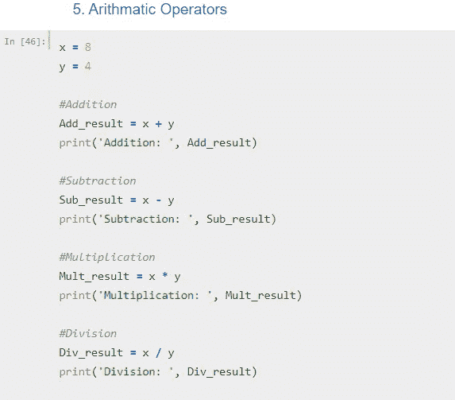

# 学习 Python -20 的基本概念

> 原文：<https://medium.com/analytics-vidhya/learn-python-20-basics-concepts-6955da4f9d6b?source=collection_archive---------6----------------------->

## Python 的基础知识——快速入门

来源:[https://www . istock photo . com/photo/abstract-motion-curvy-urban-road-GM 1181339364-331291666](https://www.istockphoto.com/photo/abstract-motion-curvy-urban-road-gm1181339364-331291666)

> 如果你想通过学习端到端的基础知识来快速开始学习 python，那你就来对地方了。为了这个练习，我使用了 Jupyter 笔记本。我们可以从[链接](https://www.anaconda.com/products/individual)下载安装 anaconda，得到 Jupyter 笔记本，anaconda 是 Python 的开源发行版。如果你是 Jupyter 笔记本的新手，请浏览这个漂亮的[博客](https://www.dataquest.io/blog/jupyter-notebook-tutorial/)，它解释了如何启动和使用它。话虽如此，我们还是开始工作吧。

下面是我们快速浏览的 20 个话题。

> ***1。核心数据类型:*** *数据类型显示变量持有什么类型的值。在 Python 中，我们有如下 4 种基本数据类型。*
> 
> **a. *Int*** —任何不带小数点的整数。
> 
> ***b. Float*** —任何带小数点的数字。
> 
> ***c .字符串*** —用单引号或双引号括起来。
> 
> ***d. Bool*** —布尔值，真或假

2。 ***打印:*****()函数将所需的信息发送到屏幕，或输出到输出设备。该消息可以是一个字符串，也可以是任何其他对象，它将在打印前被转换成一个字符串。通过使用逗号作为分隔符，可以打印多个值。**

****

**3。 ***变量* :** 变量基本上是将数据值存储在内存中。我们可以动态地创建变量并赋值。要创建一个变量，我们只需要给它赋值。变量名不能以数字开头，并且不允许使用除下划线以外的特殊字符。**

****

**4。 ***用户输入:*****输入** () **功能**允许用户输入。它将控制台上输入的行转换成字符串&返回它。**

****

**5。 ***算术运算符:*** 在 Python 中我们也有基本的算术运算符，如加、减、乘、除和指数。默认情况下，优先级顺序是 BEDMAS(括号、指数、除法、乘法、加法、减法)。需要使用括号来覆盖优先级。**

********

**6。 ***字符串方法:*** 方法都是点号(。)操作符用来在我们应用的字符串上执行一些操作。下面是一些示例字符串方法。**

****

**7。 ***条件运算符:*** 这些运算符比较两个值或变量并表示其真假。我们有不同的运算符，如等于(==)，不等于(！=)、小于/大于或等于(≤、≥)和小于/大于(<、>)。还有一些其他的，但是这些是核心的条件操作符。**

********

**8。***If/Else/Elif:***这些语句在 Python 中用于决策。它对表达式求值，如果为真，则执行语句。**

****

**9。 ***集合:*** 集合是一组无序或有序的元素。在 Python 中，我们有两种类型的集合，列表和元组。**

****List** : List 是元素有序的集合，类似于数组。列表中第一个元素的索引位置从零开始。列表是可变的，我们可以在列表中添加或删除元素。**

****

****Tuple** : Tuple 类似于 List，只是它们是不可变的。如果我们需要改变它，我们需要重新定义它。Tuple 使用圆括号，而 List 使用方括号。**

****

**10。 ***For & While 循环:*** *T* 下面是 Python 中的两种循环。 **For** 循环用于遍历列表、元组、字典、集合或字符串。我们可以指定循环期间的开始、停止和步进间隔。**

********

****While**:Python 中的 **while 循环用于迭代一段代码，只要测试表达式(条件)为真。我们一般在事先不知道迭代次数的情况下使用这个循环。****

****

**11。 ***切片运算符:*** 它允许我们对字符串、列表或元组进行切片。Slice 运算符包含一组方括号，其中有一系列冒号和数字。**

**sliced = [start:strop:step]**

****

**12。 ***集合:*** 集合**集合**是一种无序集合数据类型，它是可迭代的、可变的并且没有**重复元素**。通常用于查找。与列表相比，集合操作往往要快得多。**

****

**13。**Dictionary:**Dictionary 在 Python 中是数据值的无序集合，像 map 一样用来存储数据值。这些基本上是键值对。**

**a = {key:value}**

****

**14。 ***综合式:*** 综合式是其他编程语言中没有的。它为我们提供了一种简洁的方法来构造新的序列(如列表、集合、字典等)。).**

****

**15。 ***函数:*** 函数是一种将我们的代码划分成有用的块的便捷方式，允许我们对我们的代码进行排序，使其更具可读性并重用它。函数代码只有在被引用时才会执行。**

********

**16。 ***解包操作符(*args & **kwargs):*** 解包操作符将列表或元组中的元素集合分割成单个元素。*args 表示位置参数，**kwargs 表示键方向参数。通常用于解包并作为参数传递给函数。单星号(*)表示列表/元组，双星号(**)表示词典。**

********

**17。 ***引发和处理异常:*** 在 Python 中我们可以选择在条件发生时抛出异常。我们使用关键字 **raise** 来做到这一点，我们可以在括号内传递所需的描述。**

****

****处理异常**:在 Python 中，使用‘try’语句来处理异常。可能引发异常的操作放在“try”子句内。处理异常的代码放在“except”子句中。**

**我们有一个叫做‘finally’的东西，这个子句下提到的代码块将被执行，不管 try 块是否产生错误。这对于关闭对象和清理资源非常有用。**

****

**18。 ***Lambda:*** 虽然在 Python 中使用 **def** 关键字定义普通函数，但是匿名函数是使用 Lambda 关键字定义的。Lambda 函数可以接受任意数量的参数，但只能有一个表达式。**

****

**19。 ***映射和过滤:*****映射**()函数将一个给定的函数应用于一个 iterable(列表、元组等)的每一项。)并返回结果列表。**

****Filter:****Filter**()方法在一个函数的帮助下过滤给定的序列，该函数测试序列中的每个元素是否为真。**

****

**二十。 **F-Strings:** 一种很酷的格式化字符串的方式。string 提供了一种在字符串中嵌入表达式的方法，使用了最少的语法。应该注意，f 字符串实际上是一个在运行时计算的表达式。**

****

**使用的笔记本出现在[这里](https://github.com/Msanjayds/Python_Concepts_and_Utilities/blob/master/1.%20Python%20Concepts/7.%20Python%20Basics%20-%20A%20to%20Z.ipynb)。**

**感谢你的时间，希望这能给你一些关于 python 的基本概念。**

****参考资源:**大部分定义摘自以下来源，谢谢。**

**a.[https://www.programiz.com/python-programming/](https://www.programiz.com/python-programming/)**

**b.[https://www.w3schools.com/python](https://www.w3schools.com/python)**

**c.[https://www.learnpython.org/](https://www.learnpython.org/)**