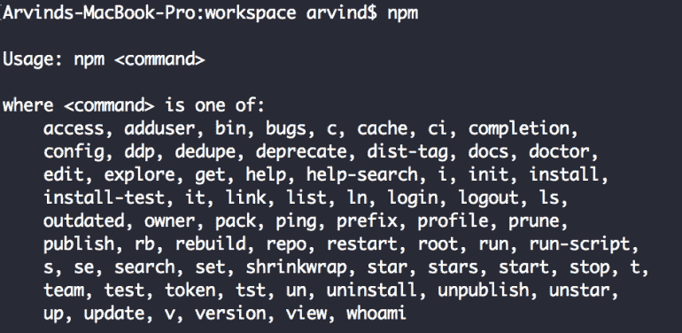
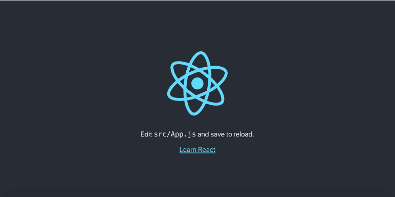
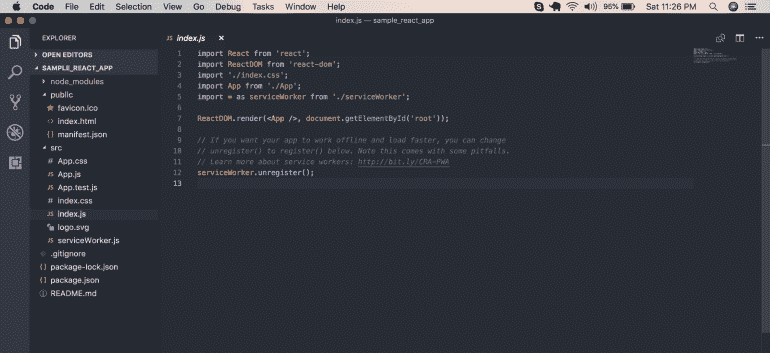
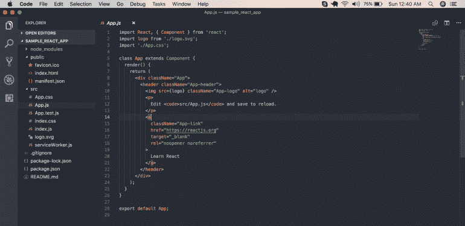
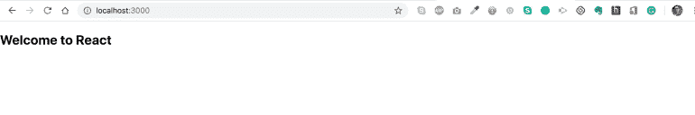
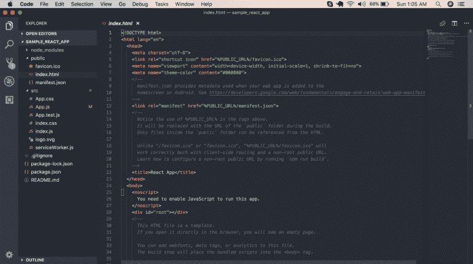

# React.js —简介

> 原文：<https://medium.com/analytics-vidhya/learn-react-js-in-10-minutes-60550934bbfb?source=collection_archive---------1----------------------->


图片来源:[https://www.pexels.com](https://www.pexels.com)

React.js 是构建 UI 的 Javascript 库。React 处理 MVC 的 V 部分。下面是开始使用 React 的先决条件。

1.  超文本标记语言
2.  半铸钢ˌ钢性铸铁(Cast Semi-Steel)
3.  java 描述语言
4.  Node.js(基础)
5.  节点程序包管理器(npm)

如果你想温习这些概念，请从其他来源学习。对于 Javascript，我可以推荐从 Mozilla 网站上阅读。他们有最好的 Javascript 参考资料之一。

[Mozilla Javascript 教程 ](https://developer.mozilla.org/bm/docs/Web/JavaScript)

事实上，他们也有 node.js 的资料。对于 React，你不需要深入了解 Node.js，但是知道如何导入一个模块是很重要的。一旦你掌握了上述概念的基础知识。你需要在你的机器上安装 Node.js 来拥有 npm。

无论如何，我将介绍 Node 的一些基础知识。

**node . js 是什么？**

js 是 Javascript 的运行时环境。在 Node 的帮助下，Javascript 可以执行服务器端的任务，比如读写文件、调用操作系统等。2009 年之前，Javascript 仅限于浏览器端。然后，一个名叫 Ryan Dahl 的疯子不喜欢当前服务器的 I/O 方式。他在 2009 年 JS 会议上提出了新的范式。从那以后，Javascript 就不一样了。如果你有兴趣观看会议，这里是[链接](https://www.youtube.com/watch?v=ztspvPYybIY)。我强烈建议至少看几分钟，这样你就能体会到他的谦逊。他的演讲将会改变整个 I/O 的生态系统，许多像我们一样的人将会以此为生。

**什么是 npm？**

npm 代表节点程序包管理器。在我撰写本文时，有超过 600，000 个软件包可供下载。当您安装节点时，npm 将随它一起安装。下面是下载和安装节点的链接。

[nodejs.org](https://nodejs.org/en/)

我们已经完成了 React 的先决条件。让我们做一些有趣的事情。在终端上运行 npm 命令，检查 npm 是否安装正确。您应该会看到如下所示的输出。



我们将从脸书提供的样板代码开始。顺便说一下，我有没有告诉你，React 是在脸书发明的，从那时起它就由脸书的工程师维护。多亏了他们。

在终端中运行以下命令

如果命令执行成功，则软件包安装完毕。现在我们必须创建一个 React 应用程序。要创建名为 **sample_react_app** 的应用程序，请运行以下命令。导航到创建的文件夹。运行命令 npm start

```
create-react-app sample_react_app cd sample_react_app npm start
```

如果你将浏览器指向 [http://localhost:3000](http://localhost:3000/) ，你应该会看到下面的页面。在这种情况下，您的安装和设置工作正常。恭喜你。



接下来，如果您打开文件夹并查看文件夹结构，它将如下所示。



需要记录的事情很少。这里有三个主要文件夹。首先是 **node_modules** ，它包含我们的应用程序将使用的所有依赖项。第二个是 **public** 文件夹，它包含面向公众的代码和资产。最后是最重要的一个 **src** 文件夹。大多数情况下，您将在该文件夹中工作。在 src 文件夹下，文件 index.js 是我们的应用程序的入口点。如果你是一个初学者，不要马上关注所有的事情。这将在后续教程中解释。我还是想在这里说一句话。

```
ReactDOM.render(<App />, document.getElementById('root'));
```

这里，ReactDOM 是对模块 **react-dom** 的引用，该模块有一个名为 render 的方法。这个方法有两个参数，第一个参数是你想渲染什么，第二个参数是你想在哪里渲染。

**让我们了解一下 React 中的几个核心概念。**

我的计划不是在这里介绍所有的 React 概念。但是有一个概念，没有它，我觉得我们不能在这里继续下去。它被称为**组件**。

**React 中的组件是什么？**

一切！是的，你在浏览器元素中看到的一切都可以被称为一个组件。以您打开的任何 web 应用程序为例。它可能有一个标题，侧栏，按钮，表格等。它们可以被称为组件。组件可以进一步划分为组件。这将通过下面的例子变得清楚。我把谷歌的主页截图了一下。观察图像。


图片来源:谷歌

我用椭圆形标记了一些 HTML 元素。它们都可以是组件。你的下一个问题应该是，这样做有什么好处吗？我很高兴你问了。是的，它有好处。主要的两个是，代码重用和模块化。React 组件本质上可以表示为一个 Javascript 函数或 Javascript 类。今天的课，我们只关注 Javascript 函数组件。

```
function Button(name){ 
  return(
    <div> 
      <button type='button'>{name}</button> 
    </div> );
}
```

你注意到谷歌主页有两个按钮“谷歌搜索”和“我感觉很幸运”吗？如果您将 button 视为一个组件，那么您只需为 button 编写一个方法，并且可以通过传递所需的参数来多次呈现它。我在这里只参数化了名称，但是我们知道按钮在被点击时必须执行特定的任务，我们也可以在参数中传递该信息。

现在回到我们的示例应用程序。

```
ReactDOM.render(<App />, document.getElementById('root'));
```

因此，App 是一个 React 组件，它呈现在 id 为 **root** 的 HTML 元素中。 **App** 在哪里， **root** 在哪里定义？App 在第 4 行导入。

其位置在文件名 App 下的同一文件夹下。我们来看看它包含了什么。



您可以在这里看到，他们已经将 App 定义为一个类组件。我们将把它作为一个功能组件进行修改。删除 App.js 的所有内容，替换成下面的代码。

```
import React from "react"; function App() { 
  return ( 
    <div> <h2>Welcome to React</h2> </div> ); 
} 
export default App;
```

保存代码后，页面将被重新加载，您应该会在浏览器中看到下面的内容。



现在最后要澄清的是**根在哪里？我们应用程序的默认登陆页面是 index.html。我们来看看 public/index.html 是什么样子的。**



注意第 28 行

这是所有应用程序代码呈现的地方。

那都是男生。我希望你明白它的基本原理。

*原载于 2018 年 10 月 6 日*[*arvindpandey . in*](https://arvindpandey.in/2018/10/07/learn-react-js-in-10-minutes/)*。*