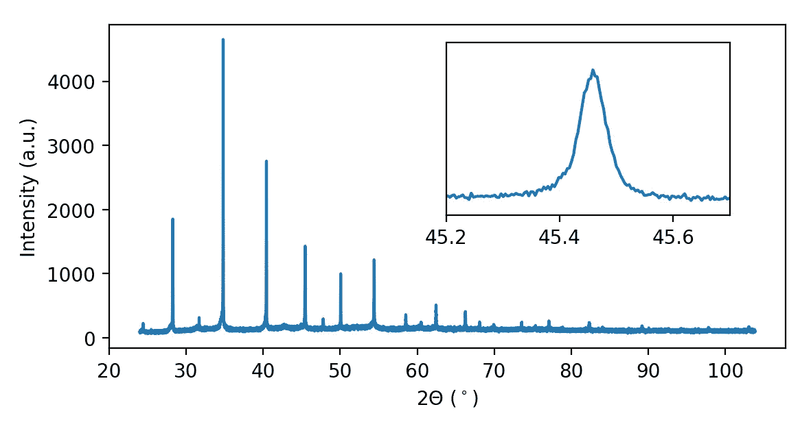
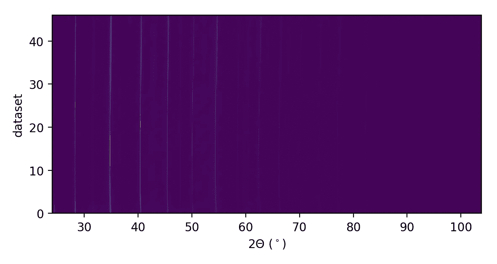
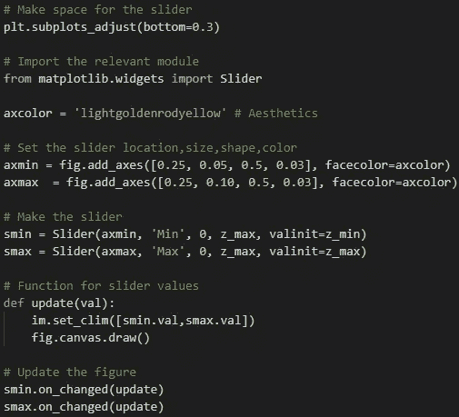
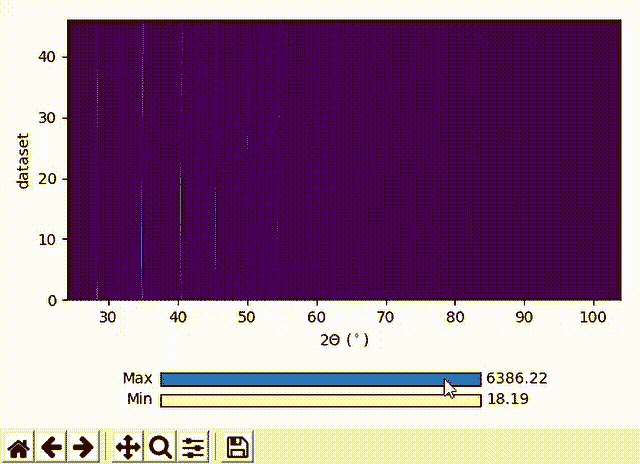
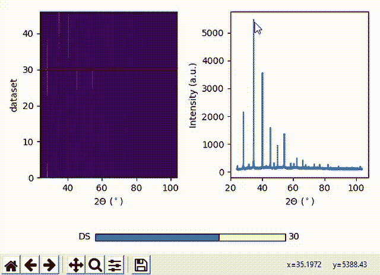
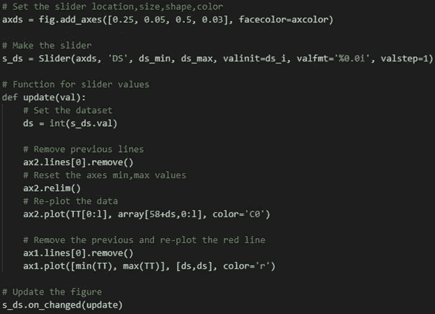

# 学习滑块，轻松灵活地实现数据可视化

> 原文：<https://medium.com/analytics-vidhya/learn-sliders-for-easy-and-flexible-data-visualization-6d3f0162c967?source=collection_archive---------11----------------------->

[滑块](https://matplotlib.org/3.1.1/gallery/widgets/slider_demo.html)(使用 Python matplotlib)是可视化大型数据集的优秀工具。对于那些在“大数据”领域工作的人来说，我认为这种交互式工具应该添加到您的技能清单中。我意识到用 Python 生成交互式图形对于那些经验很少的人来说是令人畏惧的。这篇文章是一个“简短而有趣”的演示，展示了可视化数据的滑块的有效、有趣和简单的实现。

为了提供一个使用滑块的例子，我将使用我博士论文中的一些[数据。我在一个令人惊叹的(非主观的)科学领域工作，这个领域被称为](https://aip.scitation.org/doi/abs/10.1063/1.5008271)[衍射](https://en.wikipedia.org/wiki/Bragg%27s_law)，它涉及分析光(这里是 X 射线)与原子相互作用的方式，以便确定和理解功能材料的原子结构。在这个科学领域，大数据是常态。我在博士期间面临的挑战之一是有效的数据管理和可视化。然而，我是一个喜欢浪费时间绘制漂亮的数据图的人(我称之为 prographstination)，所以我很享受用我的数据制作许多漂亮图形的机会，并在这个过程中学到了一些技巧。

下图显示了所谓的衍射图样，它由一系列对应于原子平面反射的峰组成。暂且不说数据背后的科学，这里的关键问题是视觉解读。

单一衍射图案

当您通过绘制“原样”来观察数据时，您可以看到它具有高强度(y 轴上的高值)和低强度信息。这就是 Excel 等软件的弱点，因为我们需要轻松快速地放大感兴趣的数据区域，而无需手动更改 x 轴和 y 轴上的最小值和最大值。这可以通过弹出窗口中的缩放工具从代码行轻松实现: [plt.show()](https://matplotlib.org/3.1.1/api/_as_gen/matplotlib.pyplot.show.html) ，其中 plt 是 [matplotlib.pyplot](https://matplotlib.org/3.1.1/api/_as_gen/matplotlib.pyplot.html) 。

到目前为止，我们可用的工具对于检查和可视化数据是很好的。然而，在这个例子中，我们实际上有 46 个这样的数据集(这在衍射世界中是很小的)。一次可视化所有数据的一个很好的方法是生成我称之为 2D 线图的东西(即使它在技术上是 3D 信息)，如下图所示。

一系列衍射图样

该图是使用 [plt.imshow](https://matplotlib.org/3.1.1/api/_as_gen/matplotlib.pyplot.imshow.html) 生成的，其中数组包含一系列衍射图案。该图的 x 轴与上图的 x 轴相同，y 轴是数据集，z 轴(强度，上图中的 y 轴)对应于亮度([绿色配色](https://matplotlib.org/3.2.1/tutorials/colors/colormaps.html))。此图的问题在于色阶是由最小和最大 z 值自动确定的。这意味着我们不容易看到一些更小的细节。我们可以更改代码中的 vmin 和 vmax 值，但这需要我们关闭图形，编辑代码并重新生成图形。[滑块通过允许我们交互地改变色阶，极大地帮助了我们](https://stackoverflow.com/questions/5611805/using-matplotlib-slider-widget-to-change-clim-in-image)。下面显示了用 python 实现这一点的代码片段。

在这段代码中，我们制作了滑块，并用它来更新图片的色阶限制。下面的视频演示了这样做的结果。

这使我们可以很容易地将数据沿 x 轴和 y 轴的不同区域的趋势可视化，而无需重新制作图形。如果我们更喜欢查看单个数据集，我们甚至可以采用滑块的替代方法。这显示在以下视频中，其中滑块用于在不同数据集之间切换。

在这种情况下，滑块用于移除数据集并绘制新的数据集。穿过 2D 线图的红线表示我们正在查看的数据集。这方面的代码片段如下所示

注意:这段代码有一些特定于我的数据的特性，比如数字 58 或 TT (x 轴值)。

您可以进一步整合更多滑块(或[按钮](https://matplotlib.org/3.1.1/gallery/widgets/buttons.html))来增强您的数据可视化体验，或根据您的数据检查不同的模型。学习使用这些工具可以节省大量时间，并使向同事或主管展示数据变得容易。我希望上面的例子展示了大型数据集的交互式可视化滑块的简单实现。

快乐策划:)