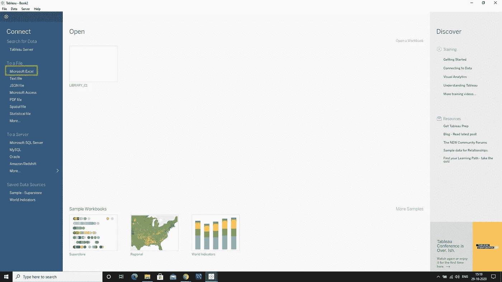

# 学习 Tableau —与 Excel 的数据连接—第 1 部分

> 原文：<https://medium.com/analytics-vidhya/learn-tableau-data-connection-with-excel-part-1-d05904a19ba3?source=collection_archive---------21----------------------->

将 excel 数据表与 tableau 连接并可视化

将 Excel 与 Tableau 连接

让我们将超市数据集连接到 tableau 中。这个 excel 文件有三个名为 Orders、People、Returns 的表。

首先打开 tableau 工具。

起始页

看看左边的栏，我们有很多选项可以连接。现在将连接 excel 文件，看看“Microsoft Excel”下的“To a file”选项，让我们选择“Microsoft Excel”选项。

选择“Microsoft Excel”

它会弹出窗口选择 excel 文件。

选择 excel 表格

一旦它被连接，它将看起来像下面的图像。

数据集已连接

查看“Sheets”标题下的左侧栏。它将显示所选 excel 文件中的所有工作表。

现在让我们从数据集中取出“订单”表。

要使用特定的工作表，您可以拖放或双击表格来使用它。

一旦拖动，它将显示工作表中的所有数据。参考:看下图

订单数据

它将从数据集中获取数据，并自己为该数据分配数据类型。

在每个列名的顶部，将显示工作表名称和数据类型图标，以标识数据所属的列。

让我们用图标来看看数据类型。

数据类型