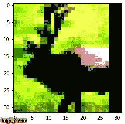

# 在 TensorFlow2 中学习编码

> 原文：<https://medium.com/analytics-vidhya/learn-to-code-in-tensorflow2-fe735ad46826?source=collection_archive---------18----------------------->


这篇文章对于在 TensorFlow2 中遇到困难的初学者很有用。假设你知道编写和训练一个基本的深度模型。[***Google Colab***](https://colab.research.google.com/notebooks/welcome.ipynb)推荐这些学习实验。

我们已经在 keras 和 TensorFlow2 中为 CIFAR10 数据集训练了 ResNet18 模型，以在尽可能少的时期内实现 90%的准确性。

[**源代码**](https://github.com/divyanshuraj6815/eva/tree/master/Experiment%2013)

我们有一个 keras 代码(参见源代码链接),我们将尝试把它转换成 TensorFlow2 代码，一步一步来。请注意，这个练习只是为了更好地使用 TensorFlow2，而不是为了获得更高的精度。

# **内容:**

**这是 3 部分系列的第 1 部分。**

> **第一部分**:

1.  安装 tensorflow2
2.  什么是急切执行？
3.  数据加载(CIFAR10)
4.  定制数据扩充技术和可视化

> [**第二部**](/p/b1c448abbf1e/):[https://medium.com/p/b1c448abbf1e](/@divyanshuraj.6815/learn-to-code-in-tensorflow2-part2-b1c448abbf1e)

1.  定义自定义模型(ResNet18)
2.  使用张量板查看已定义模型的图形

> [**第三部**](/p/7664926b9e69):[https://medium.com/p/7664926b9e69](/@divyanshuraj.6815/learn-to-code-in-tensorflow2-part3-7664926b9e69)

1.  对梯度胶带的简单了解
2.  使用自定义循环训练

# **安装张量流 2**

我们将卸载现有的 TensorFlow，安装 TensorFlow 2.0 (GPU 版)。CPU 版本也有。

```
!pip uninstall tensorflow
!pip install tensorflow-gpu==2.0.0-alpha0
```

检查版本。应该是 ***2.0.0-alpha0***

```
import tensorflow as tf
print (tf.__version__)
```

# 什么是急切执行？

**急切执行**:简而言之，由于急切执行，我们在这里看到的简单代码是可能的。传统的 TensorFlow 创建了一个图表，我们需要运行会话来做一些事情。在 keras 中，我们也编译模型，然后开始训练。但是如果有渴望，我们就不需要做这样的事情。

它为不灵活的图形系统提供了一种替代方案，我们可以简单地用 tf.enable_eager_execution()开始我们的文件，然后在创建张量时实际打印出它们的值，而不必创建会话。

**一些博客详细解释了**:

*   [https://medium . com/coin monks/8-things-to-do-differently-in-tensor flow-eager-execution-mode-47cf 429 aa3 ad](/coinmonks/8-things-to-do-differently-in-tensorflows-eager-execution-mode-47cf429aa3ad)
*   [https://medium . com/@ lsgrep/tensor flow-1-0-vs-2-0-part-2-eager-execution-and-signature-47473 ed8b 817](/@lsgrep/tensorflow-1-0-vs-2-0-part-2-eager-execution-and-autograph-47473ed8b817)

**默认为 tensorflow2 启用。**

```
tf.executing_eagerly()
>>> True
```

# 数据加载(CIFAR10)

数据加载非常简单。这和我们在 keras 中装载的方式是一样的。您可以提及数据集名称并加载它:

```
(x_train, y_train), (x_test, y_test) = tf.keras.datasets.cifar10.load_data ()
len_train, len_test = len (x_train), len (x_test)
y_train = y_train.astype ('int64').reshape (len_train)
y_test = y_test.astype ('int64').reshape (len_test)
```

# 定制数据扩充技术和可视化

由于数据集有限，我们使用数据扩充技术给出同一图像的不同变体，以便模型可以更好地概括。使用的技术:

1.  使图像正常化。
2.  以 50%的概率随机水平翻转图像。
3.  将图像每边填充 4 个像素，使其为 40x40，然后随机裁剪 32x32，使物体的位置不确定。
4.  从图像中随机截取一部分(即在图像上用图像的平均值放一个正方形小块)。

因此，这种增强的组合确保了有足够的图像变化，并且模型可以更好地概括。下面的例子说明了同样的情况:


用于执行相同操作的代码:

在这种增强技术中，原始图像被创建的概率也是存在的(即，即使在应用增强之后，原始的归一化图像也会出现)。怎么会？也许你可以考虑一下！这里还有几个例子。



**我们已经准备好了数据，我们将在下一个** [**部分**](/p/b1c448abbf1e/) **中继续构建 ResNet18 模型。**