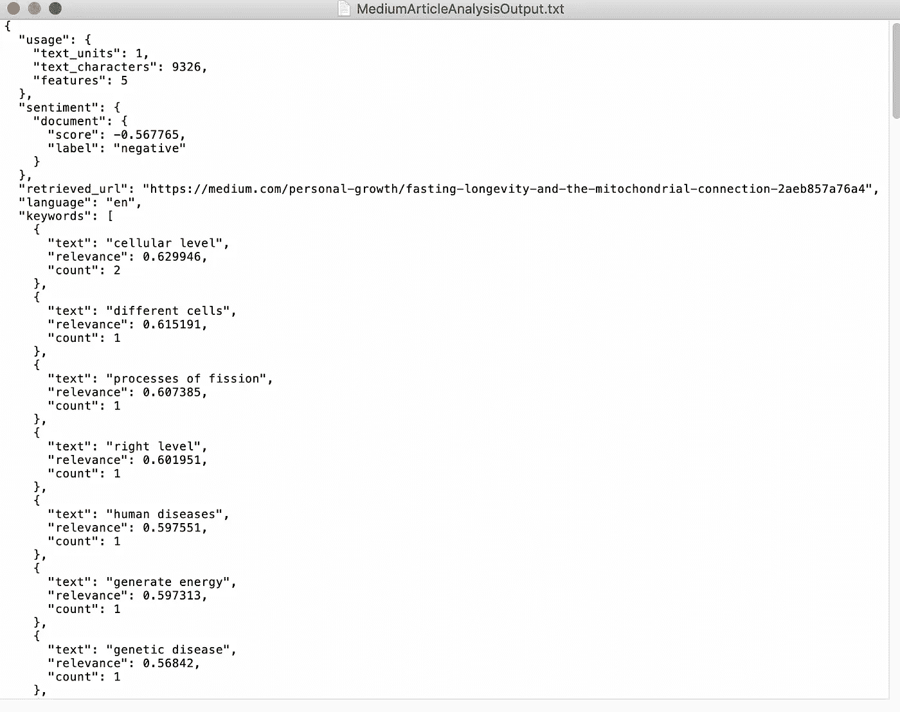

# 在 30 分钟内学会使用人工智能模型(第二部分:macOS)

> 原文：<https://medium.com/analytics-vidhya/learn-to-use-an-artificial-intelligence-model-in-30-minutes-or-less-part-2-macos-328684718099?source=collection_archive---------24----------------------->

这是第 1 部分的延续，第 1 部分描述了使用 IBM Watson 的自然语言理解服务初始化人工智能模型的必要步骤。在这一部分，我们将看看如何在 macOS 上利用我们的 AI 模型。如果你是 Windows 用户，点击[这里](/@bharutj/learn-to-use-an-artificial-intelligence-model-in-30-minutes-or-less-part-2-windows-7ecf41eb9bb9)查看相关指南。

我们开始吧！

## M-21

打开“文本编辑”,方法是在 Launchpad 中搜索它，或者在应用程序列表中找到它。


## M-22

转到文件>保存…，并导航到您在步骤 17 中创建的文件夹。将文件另存为 MediumArticleAnalysis。


## M-23

现在，如果您注意到了，这个文件被保存为一个富文本文件。不幸的是，一个富文本文件不能用来执行我们想要的命令，所以要改变格式，我们要执行以下步骤:

1.  前往“文本编辑”的顶部栏，然后点按“格式”>“制作纯文本”。
2.  完全关闭“文本编辑”。
3.  前往 Finder，并导航到文件所在的文件夹。
4.  右键单击该文件，然后单击重命名。
5.  添加。命令”添加到文件名的末尾，不更改任何其他内容，然后按 return 键。您应该会看到一个提示，询问您“您确定要将扩展名从”更改为。txt“到”。命令“？”


7.点击使用”。命令"

8.右键单击文件，选择打开方式，然后选择文本编辑。

现在您应该准备好开始为 Watson 组合一些命令了！

*   *。command*文件是 macOS 的终端脚本文件。脚本文件保存可以输入 macOS 终端的命令。
*   这样做:


*   与双击*完全相同。如下所示的命令*文件:


## M-24

现在我们已经保存了空的批处理文件，是时候添加一些命令了！继续复制以下代码，并将其粘贴到您的文件中:

```
PROMPT_COMMAND='echo -ne "\033]0;Learn to use an Artificial Intelligence Model: Article Analysis\007"'
curl -X POST -u "apikey:[YOUR-API-KEY]" \
--header "Content-Type: application/json" \
--data '{
  "url": "[[](http://newsroom.ibm.com/Guerbet-and-IBM-Watson-Health-Announce-Strategic-Partnership-for-Artificial-Intelligence-in-Medical-Imaging-Liver)CHOSEN-ARTICLE-URL]",
  "features": {
    "sentiment": {},
    "categories": {},
    "concepts": {},
    "entities": {},
    "keywords": {}
  }
}' \
"[YOUR-IBM-WATSON-NATURAL-LANGUAGE-UNDERSTANDING-URL]/v1/analyze?version=2019-07-12" \
> MediumArticleAnalysisOutput.txt
read -rsp $'Finished! Press any key to continue...\n' -n 1 key
```

## M-25

如果您不太熟悉编程，这可能看起来有点令人难忘，但是不要担心！我们将一行一行地解释它的含义。

第一行是最简单的，它包含运行程序的窗口的标题。这不是必须的，但是当你不只是有多个窗口标题时，保持你的工作空间有组织会更容易。

下一行(看起来像文章中的第三行)包含一个名为“curl”的命令，通常是风格化的“cURL”。这是“客户端 URL”的缩写，可以想象，该命令用于在客户端计算机和位于某个 URL 的服务器计算机之间传输数据。因此，您可以将下面的代码视为一封“信”,它最终将被发送到我们之前设置的 IBM Watson 服务，以便获得请求。

当我们继续往下走时，我们看到了“-X 柱。”“-X”是所谓的“标志”，本质上是一种改变特定命令选项的方式。一个命令可以以多种方式运行，通过使用标志，我们可以选择一个特定的选项。通常,“curl”命令只接收来自服务器的数据。在这种情况下，我们希望在收到响应之前发送数据，所以我们使用'-X '标志来更改我们与服务器交互的方法，然后使用该标志的' POST '选项，以便向计算机发出我们正在发送数据的信号。

我们在这条线上看到的下一面旗是“-u”旗。这个标志告诉服务器端计算机，我们正在发送某种凭证，以便识别我们自己。通常，这将是一个用户名和密码，但是在我们的例子中，它将是我们之前记下的 API 密钥。继续使用您在步骤 15 中记录的 API 密钥替换“[YOUR-API-KEY]”块。一定要删除方括号！我们不需要这些。

下一行引出了'— header '标志。标题是任何种类的补充数据，它告诉计算机如何处理你的主要数据。在这种情况下，头部告诉服务器端计算机我们正在向它发送 JSON 信息。JSON 代表 JavaScript 对象表示法，它是一种源自流行的 JavaScript 编程语言的数据格式。

下一行是我们进入代码“核心”的地方。在这个块中，以'— data '开始，以' }' \ '结束，我们有发送到 IBM 服务器进行处理的数据。粘贴您在步骤 19 中选择的 web 文章的 url，在那里您会看到“[choosed-ARTICLE-URL]”，同样，请确保删除方括号！

粘贴完 URL 后，看看这个块的其余部分。您应该会看到“功能”这个词这告诉 IBM 我们想要利用人工智能模型的什么特性，这里我们选择了“情感”、“类别”、“概念”、“实体”和“关键词”这里有一个完整的列表，列出了我们可以在 IBM 的文档中使用的内容，但是现在应该足够了！

下一行没有标志。当“curl”命令遇到一个没有标志的值时，它会认为这是它应该访问的 url。因此，我们希望确保输入了 IBM Watson 自然语言理解服务的 URL。将“[YOUR-IBM-WATSON-NATURAL-LANGUAGE-UNDERSTANDING-URL]”块替换为您在前面的步骤 15 中保存的 URL。再一次，确保你没有留下方括号！

倒数第二行相当简单，'>'告诉计算机将命令的输出发送到一个文件中，而不只是在窗口中显示，而' mediumarticleanalysisputput . txt '提供了输出将存储在其中的文件的名称。

最后一行通过打印出单词“finished”来确保命令行窗口让您知道命令已经完成，并确保窗口保持打开，而不是在文件完全执行后自动关闭。

现在你应该准备好运行你的第一个人工智能分析了！

只是为了再次检查，确保您完成了以下步骤:

*   用您在步骤 15 中记录的 API 密钥替换“[YOUR-API-KEY]”。一定要删除方括号！我们不需要这些。
*   粘贴您在步骤 19 中选择的 web 文章的 url，在那里您会看到“[choosed-ARTICLE-URL]”，同样，请确保删除方括号！需要注意的一点是 URL 后面的反斜杠(' \ ')。一定不要删了这个！
*   将“[YOUR-IBM-WATSON-NATURAL-LANGUAGE-UNDERSTANDING-URL]”替换为您在前面的步骤 15 中保存的 URL。再一次，确保你没有留下方括号！

保存文件，你应该准备好了！您的文件应该如下所示:


如果你有问题，我已经把我用的文件[上传到这里](https://drive.google.com/file/d/1rQ8DzjAk-Lz4i27mVABAlyBkADCmpBV2/view?usp=sharing)。只需在“文本编辑”中打开它，并替换 API 键和 URL

## M-26

退出“文本编辑”,返回到显示您之前创建的文件夹的文件资源管理器窗口。


## M-27

双击该文件，您应该会看到弹出以下屏幕:


如果有，恭喜你！你刚刚完成了你的第一个人工智能分析。现在，让我们来看看结果。

*   如果您使用的是没有完全权限的电脑，这一步可能会有些困难。别急，还有别的办法！

1.  首先进入 Launchpad，打开“终端”
2.  我们必须导航到存储文件的文件夹。为此，请键入以下命令:

```
cd Documents/'Your Folder Name'
```

“您的文件夹名称”应替换为您在步骤 17 中创建的用于存储文件的文件夹的名称。对我来说，命令是:

```
cd Documents/'Learning AI'
```

3.现在，键入以下命令:

```
sh MediumArticleAnalysis.command
```

这就对了。现在你应该可以继续了。

## M-28

当您返回到包含批处理文件的文件夹时，您应该会看到第二个名为“mediumarticleanalysisoutput . txt”的文件，其中包含您的分析结果。打开文件查看结果。


## M-29

让我们回顾一下我们所看到的。



第一段文字的标题是“用法”，这告诉我们沃森为我们分析了什么。“文本单元”实际上告诉我们沃森分析了多少篇文章，而“文本字符”告诉我们那些文章中有多少字符。“功能”告诉我们使用了多少沃森的功能。

下一段文字包含了沃森给我们的第一个分析:情感分析。情感分析告诉我们一段语言的整体基调；在从-1 到 1 的范围内它是积极的还是消极的。越接近-1，语言越消极。越接近 1，语言越积极。这篇文章好像还算负面，情绪分在-0.57 左右。当公司和政治家分析最近的新闻故事和社交媒体活动时，情绪分析对他们非常有用。它让他们知道公众是如何看待他们的，而不必手动整理成千上万的文章和帖子。

下面是标题为“关键词”的部分在这里，沃森分析文章，以确定描述文本的最相关的关键字。然后，它给这些关键字分配一个从 0 到 1 的分数，以描述它们的相关程度。

在关键字部分下面，是一个标题为“实体”的部分实体告诉我们一篇文章中描述的主题。它们往往比关键字更具体。例如，在一篇关于戴尔笔记本电脑的文章中，关键词可能是“个人电脑制造商”，而实体可能是“戴尔公司”。Watson 告诉我们实体的类型、实体的名称、它与文章的相关程度(从 0 到 1)、它对其评估的信心程度(从 0 到 1)以及该实体在文章中被提及的次数。

接下来是名为“概念”的部分概念告诉我们文章是关于什么的，而不仅仅依靠文本中的单词。关键词给我们关于文章部分的一般描述，实体给我们文章中提到的具体主题，但是概念告诉我们一篇文章可能包含的信息的一般类别。例如，一篇关于微软 Azure 的文章会返回“云计算”的概念，即使文章中没有明确提到云计算。

最后一部分的标题是“类别”类别按照 IBM 的五级分类法对分析的语言进行分类。IBM 的分类法首先将文章分为 21 个“一级”类别。然后，它根据文章的内容将其进一步分类为更具体的类别，直到它不再能够自信地分析文章的整体主题。沃森还为该类别指定了一个分数，从 0 到 1 告诉我们它认为该文章属于该类别的程度。

## M-30

既然分析了一篇文章，那就来分析一下自己的语言吧！
再次执行步骤 W-21 至 W-23，以便在文件夹中创建一个新的批处理文件，只是这次将文件命名为‘mediumsentenceanalysis . command’


## M-31

现在，将以下代码拷贝到“文本编辑”中:

```
PROMPT_COMMAND='echo -ne "\033]0;Learn to use an Artificial Intelligence Model: Sentence Analysis\007"'
curl -X POST -u "apikey:[YOUR-API-KEY]" \
--header "Content-Type: application/json" \
--data '{
  "text": "[YOUR-SENTENCE]",
  "features": {
    "sentiment": {
      "targets": [
        "[TARGET-1]",
        "[TARGET-2]",
        "[TARGET-3]"
      ]
    },
    "keywords": {
      "emotion": true
    }
  }
}' \
"[YOUR-IBM-WATSON-NATURAL-LANGUAGE-UNDERSTANDING-URL]/v1/analyze?version=2019-07-12" \
> MediumSentenceAnalysisOutput.txt
read -rsp $'Finished! Press any key to continue...\n' -n 1 key
```

## M-32

在上面的步骤 M-25 中，我们分别用我们在步骤 15 中记下的 API 键和 URL 替换了“[YOUR-API-KEY]”和“[YOUR-IBM-WATSON-NATURAL-LANGUAGE-UNDERSTANDING-URL]”块，确保去掉了方括号。我在步骤 M-25 中解释了它的作用，所以请务必向上滚动，通读一遍，以防您不记得。在这里做同样的事情。

*   您会注意到，除了以'— data '开头并以' }' \ '结尾的代码块之外，代码看起来与我们在前面的文章分析中看到的代码完全相同
*   如果您还记得前面的内容，那么'— data '标志包含了我们发送给 Watson 进行分析的信息，因此这是唯一需要更改的内容。该块中的第一行包含一个部分，上面写着“[YOUR-SENTENCE]，”我们将用一个或几个句子来代替它进行分析。
*   继续想你想让华生读的东西！不过，有几件事要记住。你要确保句子中有某种情绪或意图。例如，使用句子“天空是蓝色的”。草是绿色的。沃森分析起来会非常无聊，因为它们只是对事实的陈述。
*   还有！非常小心不要在你的句子中使用分号或省略号！您的计算机可能会认为您正在结束命令或句子！开发人员使用“转义字符”来绕过这个限制，但是我们可以把它留到以后再用。
*   我用了“狗很棒；他们总是在那里接我们！蜘蛛很恐怖；我受不了他们跑来跑去的样子！因为它们是观点的陈述，而不是事实，也因为它们没有明确地告诉沃森我的意思。例如，我可以用‘我喜欢狗！“我讨厌蜘蛛！”作为我的句子，但这将没有工作留给人工智能模型去做。请随意使用和我一样的句子，或者选择你自己的句子。
*   如果你向右滚动，你会看到单词“情绪”如果你还记得前面的内容，情感分析决定了被分析语言的积极或消极程度。再往右，我们看到三个区块，分别为“[目标 1]”、“[目标 2]”、“目标 3”。”这一次，当我们进行情感分析时，我们将选择沃森关注的特定主题。这不是仅仅告诉我们整个语言的情感，而是给我们关于某些主题的语言的情感。
*   句子“狗太棒了！他们总是在那里接我们！蜘蛛太可怕了！“我受不了他们乱窜的样子，”当放在一起看的时候，可能是相当中性的，但是它们对于狗来说显然是正面的，对于蜘蛛来说是负面的。选择目标可以让我们确保不会因为过度概括而错过任何东西。我选择的三个目标是“狗”、“蜘蛛”和“猫”其中两个在我的句子中明确提到，而一个没有。我想看看沃森在这种情况下会做什么。
*   如果你想用我的句子和目标，从这里复制数据块:

```
--data '{
  "text": "Dogs are awesome! They are always there to pick us up! Spiders are terrifying! I can not stand the way they scurry around!",
  "features": {
    "sentiment": {
      "targets": [
        "dogs",
        "spiders",
        "cats"
      ]
    },
    "keywords": {
      "emotion": true
    }
  }
}' \
```

如果你继续往下看，你可以看到我们再次使用沃森的关键字功能。然而，这一次，我们给关键词增加了一个选项，叫做“情感”这意味着，对于沃森识别的每个关键词，它也会评估该语言对该关键词的感觉。沃森分析的情绪是悲伤、快乐、恐惧、厌恶和愤怒。

概括一下:

*   用您在步骤 15 中记录的 API 密钥替换“[YOUR-API-KEY]”。一定要删除方括号！我们不需要这些。
*   将“[YOUR-IBM-WATSON-NATURAL-LANGUAGE-UNDERSTANDING-URL]”替换为您在前面的步骤 15 中保存的 URL。再一次，确保你没有留下方括号！
*   用一个或几个你选择的句子替换“[你的句子]”。没有方括号！确保不要删除结尾的反斜杠(' \ ')。
*   将“[目标 1]”、“[目标 2]”、“和“[目标 3]”替换为情绪分析的三个目标。没有方括号！确保不要删除结尾的反斜杠(' \ ')。
*   如果你有问题，我已经把我用的文件[上传到这里](https://drive.google.com/file/d/1BW-0s3xyAnF6VZ-vGhQfccuAy8k0Cj4D/view?usp=sharing)。只需在“文本编辑”中打开它，并替换 API 键和 URL

继续保存文件。我的代码看起来是这样的:


## M-33

关闭“文本编辑”,回到保存文件的文件夹。运行批处理文件，您应该再次得到如下所示的窗口:


如果是这样，你的分析应该是完整的！

*   如果您使用的是没有完全权限的电脑，这一步可能会有些困难。别急，还有别的办法！

1.  首先进入 Launchpad，打开“终端”
2.  我们必须导航到存储文件的文件夹。为此，请键入以下命令:

```
cd Documents/'Your Folder Name'
```

“您的文件夹名称”应替换为您在步骤 17 中创建的用于存储文件的文件夹的名称。对我来说，命令是:

```
cd Documents/'Learning AI'
```

3.现在，键入以下命令:

```
sh MediumSentenceAnalysis.command
```

这就对了。现在你应该可以继续了。

## W-33

打开你的文件夹，你会看到一个名为“mediumsentenceanalysisputput . txt”的新文件，它包含了来自人工智能模型的分析。打开看看沃森对我们的判决有什么看法。我的文件看起来是这样的:


如你所见，我的情感分析显示了对狗的高度积极的情感，对蜘蛛的高度消极的情感。你可以看到为情感分析选择目标是多么有用；这些句子的总体得分是积极的，如“文档”下的得分所示，尽管我对蜘蛛的看法显然是消极的。沃森完全忽略了我设定的“猫”的目标，因为“猫”这个词在我的文本中没有出现过。

向下滚动，我们来到“关键词”部分。对我来说，“蜘蛛”和“狗”是最相关的关键词。沃森发现我对蜘蛛最重要的情感是恐惧，对狗最重要的情感是快乐。

你有它！这是对沃森利用人工智能模型的快速介绍。如果你有兴趣了解更多关于你可以用沃森的自然语言理解服务做什么，他们的文档可以在[这里](https://cloud.ibm.com/apidocs/natural-language-understanding/natural-language-understanding)找到。更多关于沃森的信息，请看[这里](https://cloud.ibm.com/developer/watson/documentation)。

我选择沃森的部分原因是因为今天的日期，但我也发现它是当今最容易访问和易于使用的人工智能平台。谷歌、亚马逊和微软也有令人难以置信的强大的人工智能产品。这里有关于谷歌云平台和 TensorFlow [的精彩介绍](https://developers.google.com/machine-learning/crash-course/?_ga=2.179281124.1155914685.1581472306-2292569.1581116428&_gac=1.47608149.1581364898.Cj0KCQiAm4TyBRDgARIsAOU75spoj2iu9J56lFyh86La-v3KbIoh-7mmP3KoyzNMN_mCv9gWVe6Pdx0aAnRvEALw_wcB)，微软的 Azure AI [这里](https://docs.microsoft.com/en-us/learn/paths/publish-experiment-with-ml-studio/)，亚马逊的 AWS AI 服务[这里](https://towardsdatascience.com/how-to-get-started-with-aws-ai-services-877883eecbe1)如果你感兴趣的话。微软的教程可能是三个教程中最简单、最容易理解的，但如果你对人工智能和机器学习的全面、易懂的介绍感兴趣，我会推荐谷歌的课程。不幸的是，我没有发现 AWS 像它的竞争对手一样对学习者友好，但 Timo bhm 仍然设法在 Medium 上整理了一个精彩的介绍。

我希望这是一个有益的和令人愉快的经历，谢谢你的阅读！